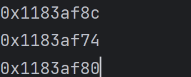

# 指针

## 一. 简介

我们已经知道，[变量](https://geekr.dev/posts/golang-variables-and-constants#toc-1)的本质对一块内存空间的命名，我们可以通过引用变量名来使用这块内存空间存储的值，而指针则是用来指向这些变量值所在**内存地址的值**。

> 注：变量值所在内存地址的值不等于该内存地址存储的变量值。

和 PHP、Python、Java 不同，Go 语言支持指针，如果一个变量是指针类型的，那么就可以用这个变量来存储指针类型的值。

### 1.1 简单示例

我们来看一个简单的示例：

```go
a := 100
var ptr *int  // 声明指针类型
ptr = &a      // 初始化指针类型值为变量 a 
fmt.Println(ptr)
fmt.Println(*ptr)
```

上面代码中的 `ptr` 就是一个指针类型，表示指向存储 `int` 类型值的指针。`ptr` 本身是一个内存地址值，所以需要通过内存地址进行赋值（通过 `&a` 可以获取变量 `a` 所在的内存地址），赋值之后，可以通过 `*ptr` 获取指针指向内存地址存储的变量值（我们通常将这种引用称作「间接引用」），所以上述代码打印结果是：

```txt
0xc0000a2000
100
```

每次打印的 `ptr` 值可能不一样，因为存储变量 `a` 的内存地址在变动，不同操作系统打印的结果也不相同。

PHP/Java 中也有类似通过 `&` 进行引用传值的用法，其实这种用法的本质也是指针，只不过 PHP/Java 在语言级别屏蔽了指针的概念而已。

Go 语言之所以引入指针类型，主要基于两点考虑，一个是为程序员提供操作变量对应内存数据结构的能力；另一个是为了提高程序的性能（指针可以直接指向某个变量值的内存地址，可以极大节省内存空间，操作效率也更高），这在系统编程、操作系统或者网络应用中是不容忽视的因素。

### 1.2 使用场景

指针在 Go 语言中有两个典型的使用场景：

- 类型指针
- 切片

作为类型指针时，允许对这个指针类型数据指向的内存地址存储值进行修改，传递数据时如果使用指针则无须拷贝数据从而节省内存空间，此外和 C 语言中的指针不同，Go 语言中的类型指针不能进行偏移和运算，因此更为安全。

[切片](https://geekr.dev/posts/go-slice-usage)类型我们前面已经介绍过，由指向数组起始元素的指针、元素数量和容量组成，所以切片与数组不同，是引用类型，而非值类型。

## 二. 基本使用

下面我们以一个简单的示例代码来演示 Go 语言中指针的基本使用。

### 2.1 指针类型的声明和初始化

指针变量在传值时之所以可以节省内存空间，是因为指针指向的内存地址的大小是固定的，在 32 位机器上占 4 个字节，在 64 位机器上占 8 个字节，这与指针指向内存地址存储的值类型无关。

关于指针类型的声明我们在开头已经演示过，这里我们再回头看下这段代码：

```go
var ptr *int
fmt.Println(ptr)

a := 100
ptr = &a
fmt.Println(ptr)
fmt.Println(*ptr)
```

当指针被声明后，没有指向任何变量内存地址时，它的零值是 nil，然后我们可以通过在给定变量前加上取地址符 `&` 获取该变量对应的内存地址，再将其赋值给声明的指针类型，这样，就完成对指针类型的初始化了，接下来我们可以通过在指针类型前加上间接引用符 `*` 获取指针指向内存空间存储的变量值。

当然，和所有其他 Go 数据类型一样，我们也可以通过 `:=` 对指针类型进行初始化：

```go
a := 100
ptr := &a
fmt.Printf("%p\n", ptr)
fmt.Printf("%d\n", *ptr)
```

### 2.2 通过指针传值

我们再来看一个通过指针传值的示例，通过指针传值就类似于 PHP/Java 中通过引用传值，这样做的好处是节省内存空间，此外还可以在调用函数中实现对变量值的修改，因为直接修改的是指针指向内存地址上存储的变量值，而不是值拷贝。

为了体现出区别，我们先看不使用指针的值拷贝示例：

```go
func swap(a, b int)  {
    a, b = b, a
    fmt.Println(a, b)
}

func main() {
    a := 1
    b := 2
    swap(a, b)
    fmt.Println(a, b)
}
```

上述代码的打印结果是：

```go
2 1
1 2
```

下面我们通过指针传值来重构上述代码：

```go
func swap(a, b *int)  {
    *a, *b = *b, *a
    fmt.Println(*a, *b)
}

func main() {
    a := 1
    b := 2
    swap(&a, &b)
    fmt.Println(a, b)
}
```

上述代码的打印结果是：

```go
2 1
2 1
```

因为这次，我们是通过指针传值的（`&a`、`&b` 都是指针，只不过我们没有显示声明而已），直接会对内存地址存储变量值进行交换操作，而主函数中的 `a`、`b` 变量仅仅是对应内存存储空间的别名而已，所以调用完 `swap` 函数后，它们所对应的内存空间存储值已经交换过来了。

## 三. unsafe.Pointer

我们前面介绍的指针都是被声明为指定类型的，而 `unsafe.Pointer` 是特别定义的一种指针类型，它可以包含任意类型变量的地址（类似 C 语言中的 `void` 类型指针）。Go 官方文档对这个类型有如下四个描述：

1. 任何类型的指针都可以被转化为 `unsafe.Pointer`；
2. `unsafe.Pointer` 可以被转化为任何类型的指针；
3. `uintptr` 可以被转化为 `unsafe.Pointer`；
4. `unsafe.Pointer` 可以被转化为 `uintptr`。

### 3.1 指针类型转化

因此，`unsafe.Pointer` 可以在不同的指针类型之间做转化，从而可以表示任意可寻址的指针类型：

```go
i := 10
var p *int = &i

var fp *float32 = (*float32)(unsafe.Pointer(p))
*fp = *fp * 10
fmt.Println(i)  // 100
```

这里，我们将指向 `int` 类型的指针转化为了 `unsafe.Pointer` 类型，再转化为 `*float32` 类型（参考前面的 `unsafe.Pointer` 转化规则 1、2）并进行运算，最后发现 `i` 的值发生了改变。

这个示例说明了 `unsafe.Pointer` 是一个万能指针，可以在任何指针类型之间做转化，这就绕过了 Go 的类型安全机制，所以是不安全的操作。

### 3.2 指针运算实现

此外，根据上面的转化规则 3、4，`unsafe.Pointer` 还可以与 `uintptr` 类型之间相互转化，为什么要单独列出这个类型呢？

`uintptr` 是 Go 内置的可用于存储指针的整型，而整型是可以进行数学运算的！因此，将 `unsafe.Pointer` 转化为 `uintptr` 类型后，就可以让本不具备运算能力的指针具备了指针运算能力：

```go
arr := [3]int{1, 2, 3}
ap := &arr

sp := (*int)(unsafe.Pointer(uintptr(unsafe.Pointer(ap)) + unsafe.Sizeof(arr[0])))
*sp += 3
fmt.Println(arr)
```

这里，我们将数组 `arr` 的内存地址赋值给指针 `ap`，然后通过 `unsafe.Pointer` 这个桥梁转化为 `uintptr` 类型，再加上数组元素偏移量（通过 `unsafe.Sizeof` 函数获取），就可以得到该数组第二个元素的内存地址，最后通过 `unsafe.Pointer` 将其转化为 `int` 类型指针赋值给 `sp` 指针，并进行修改，最终打印的结果是：

```go
[1 5 3]
```

这样一来，就可以绕过 Go 指针的安全限制，实现对指针的动态偏移和计算了，这会导致即使发生数组越界了，也不会报错，而是返回下一个内存地址存储的值，这就破坏了内存安全限制，所以这也是不安全的操作，我们在实际编码时要尽量避免使用，必须使用的话也要非常谨慎。

## 四. 自动解引用

Go语言的自动解引用（automatic dereferencing）是指在使用指针时，不需要显式地使用*操作符来获取指针指向的值，Go语言会自动地为我们解引用指针。

举个例子，假设有如下的代码：

```go
type People struct {
	name string
	age  int
}

var ptr *People = &People{name: "张三", age: 18}
fmt.Println(*ptr)
```

这里定义了一个整型指针ptr，然后将其指向我们创建 pepole 对象，如果是其它语言指针，可能需要使用`*`获取指针对应的具体值，才能获取到原先 pepole 对象的name属性：

```go
fmt.Println((*ptr).name)
```

但是，在Go语言中，我们也可以直接使用指针变量ptr来访问它指向的值，而不需要使用*操作符：

```go
fmt.Println(ptr.name)
```

这里，Go语言会自动地将指针ptr解引用，获取其指向的值（可以理解为编译器自动在使用 ptr 指针的前面加了一个`*`）。

Go语言的自动解引用非常方便，可以简化代码并提高代码的可读性。但需要注意的是，在某些情况下，自动解引用可能会导致一些错误，因此我们需要格外小心。例如，在将指针作为参数传递给函数时，我们需要明确地指定参数的类型是指针类型还是值类型，以免发生错误。

## 五. 值传递 OR 引用传递

在Go语言中，所有的函数参数都是值传递的。这意味着，在将变量作为函数参数传递时，函数会获得该变量的一个副本，而不是原变量本身。因此，如果函数修改了参数的值，那么原变量的值不会发生变化。

```go
type People struct {
	name string
	age  int
}

func transfer(people People) People {
	println(&people) //进入方法后的地址值：
	return people
}

func main() {
	p := People{name: "李四", age: 15}
	println(&p) //传递之前的地址值

	p2 := transfer(p)
	println(&p2)
}
```

输出:



可以看到如果我们不使用指针传递引用，Go默认都是值传递，在调用transfer方法时会拷贝一次people值给方法形参，返回时同样也会拷贝值。