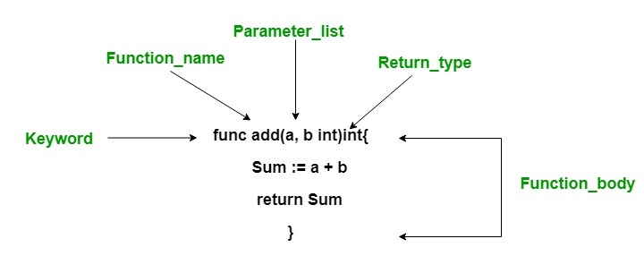

# 函数的基本使用

几乎所有编程语言都支持函数，编写函数的目的在于将复杂的问题分解为一系列简单的任务来处理，此外同一个函数还可以被多次复用，从而提高代码复用性，因此这一语法结构在函数式编程中至关重要。

在 Go 语言中，函数主要有三种类型：

- 普通函数
- 匿名函数（闭包）
- 类方法

我们将从普通函数的基本定义和调用开始，揭开 Go 函数的面纱。

## 一. 函数定义

Go 普通函数的基本组成包括：关键字 `func`、函数名、参数列表、返回值、函数体和返回语句。作为强类型语言，无论是参数还是返回值，在定义函数时，都要声明其类型：



这里我们用一个最简单的加法函数来进行详细说明：

```go
func add(a, b int) int  {
    return a + b
}
```

如果我们调用 `add(1, 2)`，返回结果是 `3`：

```go
func main()  {
    fmt.Println(add(1, 2))  // 3
}
```

下面我们以 `add` 函数为例介绍函数的定义，如果函数的参数列表中包含若干个类型相同的参数，比如上面例子中的 `a` 和 `b`，则可以在参数列表中省略前面变量的类型声明，只保留最后一个，如下所示：

```go
func add(a, b int) int { 
    // ...
}
```

紧随参数列表之后的是该函数返回值的类型，返回值类型放在函数声明最后，这一点和普通 Go 数据类型变量一样，而与其他静态强类型语言，如 Java、C 的函数声明方式不同，因为**函数本身也是 Go 的一种数据类型，是一等公民**。

## 二. 函数调用

### 2.1 调用同一个包定义的函数

Go 函数的调用非常方便，如果是在同一个包中（即定义在同一个目录下的 Go 文件中），只需直接调用即可：

```go
func main()  {
    fmt.Println(add(1, 2))  // 3
}
```

### 2.2 调用其他包定义的函数

如果是在不同的包中，需要先导入了该函数所在的包，然后才能调用该函数，比如，我们将 `add` 函数放到单独的 `mymath` 包中（函数名首字母需要改为大写）：

```go
package mymath

func Add(a, b int) int  {
    return a + b
}
```

然后我们可以这样在 `main` 包中调用 `Add` 函数：

```go
package main

import (
    "fmt"
    "mymath"
)

func main()  {
    fmt.Println(mymath.Add(1, 2))   // 3
}
```

**在调用其他包定义的函数时，只有函数名首字母大写的函数才可以被访问**，这个涉及到包的可见性，后面在介绍面向对象编程时会详细讨论这个，这里你只需要了解首字母大写的 Go 函数即相当于其它语言的 `public` 公开函数。

Go 语言中没有 `public`、`protected`、`private` 之类的关键字，它是通过首字母的大小写来区分可见性的：首字母小写的函数只能在同一个包中访问，首字母大写的函数才可以在其他包中调用，Go 文件中定义的全局变量也是如此。

## 三. 系统内置函数

上面的 `add` 函数是用户自定义的函数，Go 语言还为日常开发中的常用功能提供了很多不需要导入任何包就可以直接调用的内置函数。我们把其中一些常见的内置函数做一个简单的分类，如下表所示：

| 名称                      | 说明                                                         |
| ------------------------- | ------------------------------------------------------------ |
| `close`                   | 用于在管道通信中关闭一个管道                                 |
| `len`、`cap`              | `len` 用于返回某个类型的长度（字符串、数组、切片、字典和管道），`cap` 则是容量的意思，用于返回某个类型的最大容量（只能用于数组、切片和管道） |
| `new`、`make`             | `new` 和 `make` 均用于分配内存，`new` 用于值类型和用户自定义的类型（类），`make` 用于内置引用类型（切片、字典和管道）。它们在使用时将类型作为参数：`new(type)`、`make(type)`。`new(T)` 分配类型 T 的零值并返回其地址，也就是指向类型 T 的指针，可以用于基本类型：`v := new(int)`。`make(T)` 返回类型 T 的初始化之后的值，所以 `make` 不仅分配内存地址还会初始化对应类型。 |
| `copy`、`append`          | 分别用于切片的复制和动态添加元素                             |
| `panic`、`recover`        | 两者均用于错误处理机制                                       |
| `print`、`println`        | 打印函数，在实际开发中建议使用 [fmt](https://golang.org/pkg/fmt/) 包 |
| `complex`、`real`、`imag` | 用于复数类型的创建和操作                                     |

下面我们对上述内置函数的使用进行简单的示例，`close`、`panic`、`recover` 后面我们在介绍并发编程的管道以及错误处理时会具体介绍，我们先来看看其他函数的使用示例。

### 3.1 len 与 cap

`len` 函数用于返回传入参数的长度，`cap` 函数用于返回传入参数的容量：

```go
str := "golang"
println(len(str))  // 6

arr := [3]int{1, 2, 3}
print(len(arr), "\n")  // 3
print(cap(arr), "\n")  // 3

slice := arr[1:]
println(len(slice)) // 2
println(cap(slice)) // 2

dict := map[string]int{"0":1, "1":2, "2":3}
println(len(dict))  // 3
```

### 3.2 new 与 make

前面我们提到 `new` 函数作用于值类型，仅分配内存空间，返回的是指针，`make` 函数作用于引用类型，除了分配内存空间，还会对对应类型进行初始化，返回的是初始值。在 Go 语言中，引用类型包括切片（slice）、字典（map）和管道（channel），其它都是值类型。

下面我们来看这两个函数的基本使用：

```go
p1 := new(int)     // 返回 int 类型指针，相当于 var p1 *int
p2 := new(string)  // 返回 string 类型指针
p3 := new([3]int)  // 返回数组类型指针，数组长度是 3

type Student struct {
    id int
    name string
    grade string
}
p4 := new(Student)  // 返回对象类型指针

println("p1: ", p1)
println("p2: ", p2)
println("p3: ", p3)
println("p4: ", p4)

s1 := make([]int, 3)  // 返回初始化后的切片类型值，即 []int{0, 0, 0}
m1 := make(map[string]int, 2)  // 返回初始化的字典类型值，即散列化的 map 结构

println(len(s1))  // 3
for i, v := range s1 {
    println(i, v)
}

println(len(m1))   // 0
m1["test"] = 100
for k, v := range m1 {
    println(k, v)
}
```

如果将上述 `make` 函数调整修改为 `new` 函数，则代码会报错，因为 `new` 函数返回的是没有初始化的指针，对应默认值为 nil，不能在上面进行任何操作。

