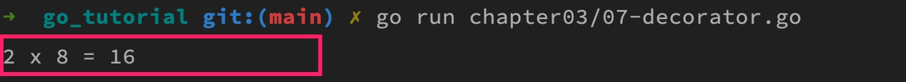
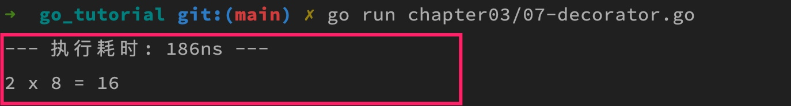
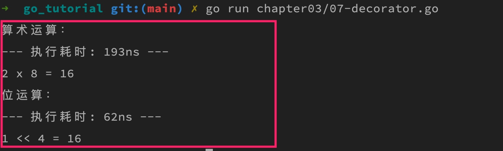

# 通过高阶函数实现装饰器模式

## 一. 高阶函数

所谓高阶函数，就是接收其他函数作为参数传入，或者把其他函数作为结果返回的函数。所以，学院君上篇教程[将匿名函数作为函数参数](https://geekr.dev/posts/go-anonymous-function-and-closure#toc-3)和[将匿名函数作为函数返回值](https://geekr.dev/posts/go-anonymous-function-and-closure#toc-6)的示例实现都是高阶函数。

高阶函数是函数式编程的重要特性，我们可以通过它实现很多高级功能，今天我们就来介绍如何通过高阶函数实现 Go 装饰器模式。

## 二. 装饰器模式

装饰器模式（Decorator）是一种软件设计模式，其应用场景是为某个已经存在的功能模块（类或者函数）添加一些「装饰」功能，而又不会侵入和修改原有的功能模块。就好比我们给房间做节日装饰一样，它不会调整这个房间原有的任何固有框架，而又让房间充满节日气氛。

有过 Python、Java 编程经验的同学应该对这个模式很熟悉，在 Python、Java 中，我们可以通过注解非常优雅地实现装饰器模式，比如给某个功能模块添加日志功能、或者为路由处理器添加中间件功能，这些都可以通过装饰器实现。

不过 Go 语言的设计哲学就是简单，没有提供「注解」之类的语法糖，在函数式编程中，要实现装饰器模式，可以借助高阶函数来实现。

## 三. 通过高阶函数实现装饰器模式

接下来，我们以一个乘法运算函数为例，来演示如何在 Go 语言中通过高阶函数来实现装饰器模式。

### 3.1 编写基本功能模块

先编写这个乘法运算函数和调用代码：

```go
package main

import "fmt"

func multiply(a, b int) int {
    return a * b
}

func main() {
    a := 2
    b := 8
    c := multiply(a, b)
    fmt.Printf("%d x %d = %d\n", a, b, c)
}
```

运行上述代码，打印结果如下：



现在，我们想要在不修改现有 `multiply` 函数代码的前提下计算乘法运算的执行时间，显然，这可以引入装饰器模式来实现。

### 3.2 装饰器模式实现

我们已经说过，Go 不支持注解，需要借助高阶函数来实现这个计算耗时的装饰器，对应实现代码如下：

```go
package main

import (
    "fmt"
    "time"
)

// 为函数类型设置别名提高代码可读性
type MultiPlyFunc func(int, int) int

// 乘法运算函数
func multiply(a, b int) int {
    return a * b
}

// 通过高阶函数在不侵入原有函数实现的前提下计算乘法函数执行时间
func execTime(f MultiPlyFunc) MultiPlyFunc {
    return func(a, b int) int {
        start := time.Now() // 起始时间
        c := f(a, b)  // 执行乘法运算函数
        end := time.Since(start) // 函数执行完毕耗时
        fmt.Printf("--- 执行耗时: %v ---\n", end)
        return c  // 返回计算结果
    }
}

func main() {
    a := 2
    b := 8
    // 通过修饰器调用乘法函数，返回的是一个匿名函数
    decorator := execTime(multiply)
    // 执行修饰器返回函数
    c := decorator(a, b)
    fmt.Printf("%d x %d = %d\n", a, b, c)
}
```

我们来分析下这段代码，首先，我们通过 `type` 语句为匿名函数类型设置了别名 `MultiPlyFunc`，这样一来，后续就可以用这个类型别名来声明对应的函数类型参数和返回值，提高代码可读性。

然后是装饰器模式实现代码 `execTime` 函数，这是一个以 `MultiPlyFunc` 类型为参数和返回值的函数，所以是个高阶函数，我们看下具体实现代码：

- 在返回的 `MultiPlyFunc` 类型匿名函数体中，真正执行乘法运算函数 `f` 前，先通过 `time.Now()` 获取当前系统时间，并将其赋值给 `start` 变量；
- 然后执行 `f` 函数，将返回值赋值给变量 `c`；
- 接下来，通过 `time.Since(start)` 计算从 `start` 到现在经过的时间，也就是 `f` 函数执行耗时，将结果赋值给 `end` 变量并打印出来；
- 最后返回 `f` 函数运行结果 `c` 作为最终返回值。

核心思路就是在被修饰的功能模块（这里是外部传入的乘法函数 `f`）执行前后加上一些额外的业务逻辑，而又不影响原有功能模块的执行。显然，装饰器模式是遵循 SOLID 设计原则中的开放封闭原则的 —— 对代码扩展开放，对代码修改关闭。

在 `main` 函数中调用乘法函数 `multiply` 时，如果要应用装饰器，需要通过装饰器 `execTime` 包裹，装饰器返回的是个匿名函数，所以需要再度调用才能真正执行，执行后的打印结果如下：



可以看到，这次因为应用了装饰器，所以打印出了执行耗时。

### 3.3 对比位运算与算术运算的性能

为了更好地体现装饰器模式的优势，我们还可以在此基础上实现一个比较位运算和算术运算性能的程序：

```go
package main

import (
    "fmt"
    "time"
)

// 为函数类型设置别名提高代码可读性
type MultiPlyFunc func(int, int) int

// 乘法运算函数1（算术运算）
func multiply1(a, b int) int {
    return a * b
}

// 乘法运算函数2（位运算）
func multiply2(a, b int) int {
    return a << b
}

// 通过高阶函数在不侵入原有函数实现的前提下计算乘法函数执行时间
func execTime(f MultiPlyFunc) MultiPlyFunc {
    return func(a, b int) int {
        start := time.Now() // 起始时间
        c := f(a, b)  // 执行乘法运算函数
        end := time.Since(start) // 函数执行完毕耗时
        fmt.Printf("--- 执行耗时: %v ---\n", end)
        return c  // 返回计算结果
    }
}

func main() {
    a := 2
    b := 8
    fmt.Println("算术运算：")
    decorator1 := execTime(multiply1)
    c := decorator1(a, b)
    fmt.Printf("%d x %d = %d\n", a, b, c)

    fmt.Println("位运算：")
    decorator2 := execTime(multiply2)
    a = 1
    b = 4
    c = decorator2(a, b)
    fmt.Printf("%d << %d = %d\n", a, b, c)
}
```

原有的代码逻辑不需要做任何变动，只需要新增一个位运算版乘法实现函数 `multiply2`，然后套上装饰器函数 `execTime` 计算耗时，最后与算术运算版乘法实现函数 `multiply1` 耗时做下对比即可：



可以看到，同等情况下，位运算执行时间比算术运算缩短了 3 倍，性能更好。

通过装饰器模式，只需要为基础修饰功能编写一次代码，后面新的业务逻辑只需要维护新增部分即可，不需要侵入原有功能模块，让代码的可维护性和可读性更好。