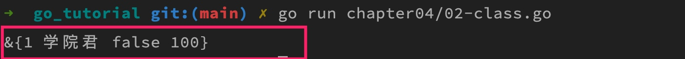
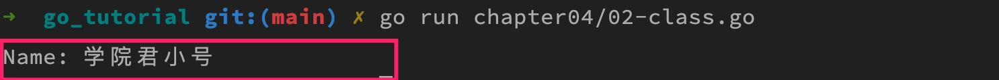
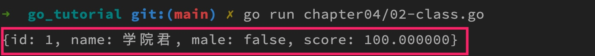

# 类的定义、初始化和成员方法

[上篇教程](./_19类型系统概述.md)学院君简单给大家介绍了 Go 语言的类型系统，关于基础类型、复合类型以及值语义和引用语义我们前面在[数据类型篇](https://geekr.dev/golang-tutorial#toc-2)里面已经基本都介绍过了，接下来，我们就 Go 语言面向对象编程相关的特性展开介绍。

## 一. 类的定义和初始化

Go 语言的面向对象编程与我们之前所熟悉的 PHP、Java 那一套完全不同，没有 `class`、`extends`、`implements` 之类的关键字和相应的概念，而是借助**结构体**来实现类的声明，比如要定义一个学生类，可以这么做：

```go
type Student struct {
    id uint
    name string
    male bool
    score float64
}
```

类名为 `Student`，并且包含了 `id`、`name`、`male`、`score` 四个属性，Go 语言中也不支持构造函数、析构函数，取而代之地，可以通过定义形如 `NewXXX` 这样的全局函数（首字母大写）作为类的初始化函数：

```go
func NewStudent(id uint, name string, male bool, score float64) *Student {
    return &Student{id, name, male, score}
}
```

在这个函数中，我们通过传入的属性字段对 `Student` 类进行初始化并返回一个指向该类的指针，除此之外，还可以初始化指定字段：

```go
func NewStudent(id uint, name string, score float64) *Student {
    return &Student{id: id, name:name, score:score}
}
```

> 在 Go 语言中，未进行显式初始化的变量都会被初始化为该类型的零值，例如 `bool` 类型的零值为 `false`，`int` 类型的零值为 0，`string` 类型的零值为空字符串，`float` 类型的零值为 `0.0`。

然后我们可以在 `main()` 函数中调用这个 `NewStudent` 函数对 `Student` 类进行初始化：

```go
student := NewStudent(1, "学院君", 100)
fmt.Println(student)
```

上述代码的打印结果如下：



## 二. 定义成员方法

### 2.1 值方法

由于 Go 语言不支持 `class` 这样的代码块，要为 Go 类定义成员方法，需要在 `func` 和方法名之间声明方法所属的类型（有的地方将其称之为接收者声明），以 `Student` 类为例，要为其定义获取 `name` 值的方法，可以这么做：

```go
func (s Student) GetName() string  {
    return s.name
}
```

这样一来，我们就可以在初始化 `Student` 类后，通过 `GetName()` 方法获取 `name` 值：

```go
student := NewStudent(1, "学院君", 100)
fmt.Println("Name:", student.GetName())
```

可以看到，我们通过在函数签名中增加接收者声明的方式定义了函数所归属的类型，这个时候，函数就不再是普通的函数，而是类的成员方法了。

### 2.2 指针方法

在类的成员方法中，可以通过声明的类型变量来访问类的属性和其他方法。`GetName` 是一个只读方法，如果我们要在外部通过 `Student` 类暴露的方法设置 `name` 值，可以这么做：

```go
func (s *Student) SetName(name string) {
    s.name = name
}
```

你可能已经注意到，这里的方法声明和前面 `GetXXX` 方法声明不太一样，`Student` 类型设置成了指针类型：

```go
s *Student
```

这是因为 Go 语言面向对象编程不像 PHP、Java 那样支持隐式的 `this` 指针，所有的东西都是显式声明的，在 `GetXXX` 方法中，由于不需要对类的成员变量进行修改，所以不需要传入指针，而 `SetXXX` 方法需要在函数内部修改成员变量的值，并且该修改要作用到该函数作用域以外，所以需要传入指针类型（结构体是值类型，不是引用类型，所以需要显式传入指针）。

我们可以把接收者类型为指针的成员方法叫做**指针方法**，把接收者类型为非指针的成员方法叫做**值方法**，二者的区别在于值方法传入的结构体变量是值类型（类型本身为指针类型除外），因此传入函数内部的是外部传入结构体实例的值拷贝，修改不会作用到外部传入的结构体实例。

接下来，我们可以在 `main` 函数中初始化 `Student` 类之后，通过 `SetName` 方法修改 `name` 值，然后再通过 `GetName` 将其打印出来：

```go
student := NewStudent(1, "学院君", 100)
student.SetName("学院君小号")
fmt.Println("Name:", student.GetName())
```

打印结果是：



### 2.3 值方法和指针方法的区别

另外，需要声明的是，在 Go 语言中，当我们将成员方法 `SetName` 所属的类型声明为指针类型时，严格来说，该方法并不属于 `Student` 类，而是属于指向 `Student` 的指针类型，所以，归属于 `Student` 的成员方法只是 `Student` 类型下所有可用成员方法的子集，归属于 `*Student` 的成员方法才是 `Student` 类完整可用方法的集合。

在调用值方法和指针方法时，需要记住以下两条准则：

1. 值方法可以通过指针和值类型实例调用，指针类型实例调用值方法时会自动解引用；
2. 指针方法只能通过指针类型实例调用，但有一个例外，如果某个值是可寻址的（或者说左值），那么编译器会在值类型实例调用指针方法时自动插入取地址符，使得在此情形下看起来像指针方法也可以通过值来调用。

举例说明：

```go
type Student struct {
    id    uint
    name  string
    score float64
}

func NewStudent(id uint, name string, score float64) *Student {
    return &Student{id: id, name: name, score: score}
}

func NewStudentV2(id uint, name string, score float64) Student {
    return Student{id: id, name: name, score: score}
}

func (s Student) GetName() string {
    return s.name
}

func (s *Student) SetName(name string) {
    s.name = name
}

func main() {
    s := NewStudent(1, "学院君", 100)
    s.SetName("学院君1号")   // ok 正常调用指针方法
    fmt.Println(s.GetName()) // ok 指针调用值方法自动解引用: (*s).GetName()

    s2 := NewStudentV2(2, "学院君", 90)
    s2.SetName("学院君2号")   // ok s2 是可寻址的左值，所以实际调用: (&s2).SetName("学院君2号")
    fmt.Println(s2.GetName()) // ok 正常调用值方法

    NewStudent(3, "学院君", 80).SetName("学院君3号")   // ok 正常调用指针方法
    NewStudentV2(4, "学院君", 99).SetName("学院君4号") // err 值类型调用指针方法
}
```

之所以可以直接在 `s2` 值实例上调用 `SetName` 指针方法，是因为 `s2` 是可寻址的，Go 语言底层会自动将 `s2` 转化为对应的指针类型 `&s2`，所以真正调用的代码是 `(&s2).SetName("学院君2号")`，而通过 `NewStudentV2(...)`返回实例调用 `SetName` 时，则会报错，因为 `NewStudentV2(...)` 是一个不可以寻址的右值。

> 所谓左值就是可以出现在赋值等号左边的值，而右值只能出现在赋值等号右边，比如函数返回值、字面量、常量值等。左值可寻址，右值不可寻址。

总结下来，就是一个自定义数据类型的方法集合中仅会包含它的所有「值方法」，而该类型对应的指针类型包含的方法集合才囊括了该类型的所有方法，包括所有「值方法」和「指针方法」，指针方法可以修改所属类型的属性值，而值方法则不能。

### 2.4 定义值方法还是指针方法

当我们有如下情形的考量时，需要将类方法定义为指针方法：

1. 数据一致性：方法需要修改传入的类型实例本身；
2. 方法执行效率：如果是值方法，在方法调用时一定会产生值拷贝，而大对象拷贝代价很大。

通常我们都会选择定义指针方法。

### 2.5 Go 版 toString 方法实现

PHP、Java 支持默认调用类的 `toString` 方法以字符串格式打印类的实例，Go 语言也有类似的机制，只不过这个方法名是 `String`，以上面这个 `Student` 类型为例，我们为其编写 `String` 方法如下：

```go
func (s Student) String() string {
    return fmt.Sprintf("{id: %d, name: %s, male: %t, score: %f}",
        s.id, s.name, s.male, s.score)
}
```

然后我们可以在 `main` 方法中这样调用来打印 `Student` 类实例：

```go
student := NewStudent(1, "学院君", 100)

fmt.Println(student)
```

无需显式调用 `String` 方法，Go 语言会自动调用该方法来打印，结果如下：



## 三. 小结

我们来简单总结下，在 Go 语言中，有意弱化了传统面向对象编程中的类概念，这也符合 Go 语言的简单设计哲学，基于结构体定义的「类」就是和内置的数据类型一样的普通数据类型而已，内置的数据类型也可以通过 `type` 关键字转化为可以包含自定义成员方法的「类」。

一个数据类型关联的所有方法，共同组成了该类型的方法集合，和其他支持面向对象编程的语言一样，同一个方法集合中的方法也不能出现重名，并且，如果它们所属的是一个结构体类型，那么它们的名称与该类型中任何字段的名称也不能重复。