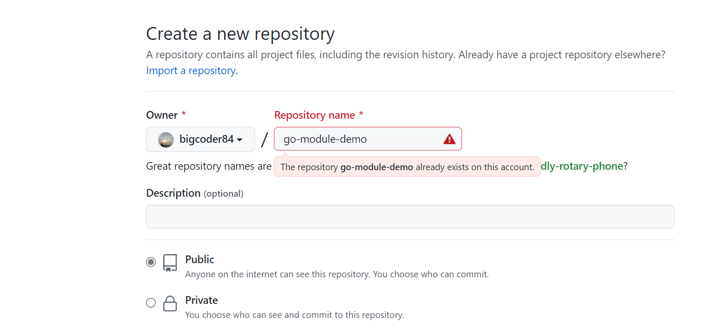
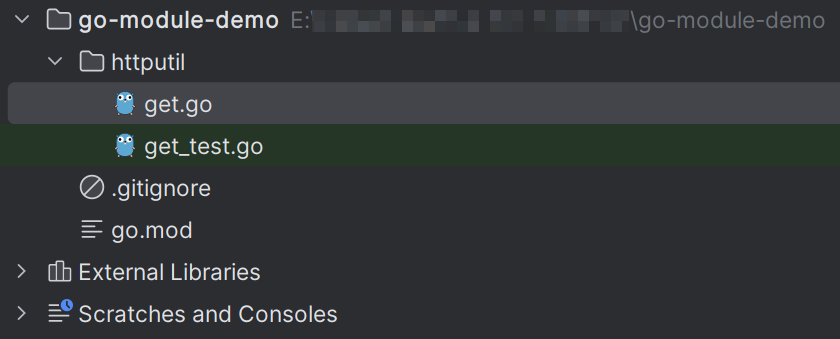

# 发布一个 Go Module

我们在开发 Go 项目时，经常会使用到一些外部依赖包。它们一般都是通过形如`go get example.com/xxx`的命令形式获取到本地使用。

本着开源精神，如果我们想将自己开发的包共享出去，让其他人也能使用`go get`命令获取到它们，应该如何做呢？

本文将以开源至 Github 平台为例，展示其流程。

## 一. 建立仓库

首先，在 Github 建立仓库，设置想要开源的 Go 库名。这里将项目名取为 `go-module-demo`，状态为 `Public`。

## 二. 开发模块代码

将创建好的仓库，通过 git clone 命令拉取至本地开发。为项目初始化 mod 文件：

命令格式：`go mod init [模块地址]`

```shell
$ go mod init github.com/bigcoder84/go-module-demo
```

这里的模块地址必须是你托管的 `GitHub` 仓库地址。

假设，我们想开源的 Go 工具类的库，此时准备先提供一个Http Get方法。因此在`go-module-demo/`目录下，我们新增`httputil/`子目录，在子目录中增加 get.go 文件，其内容如下：

```go
package httputil

import (
	"io"
	"net/http"
)

func Get(url string) (int, string) {
	resp, err := http.Get(url)
	if err != nil {
		return resp.StatusCode, ""
	}
	defer resp.Body.Close()
	body, err := io.ReadAll(resp.Body)
	return resp.StatusCode, string(body)
}
```

回到项目根目录，此时，代码结构如下：



测试代码也都通过：

```go
$  go test ./...  #...代表运行当前目录及子目录下所有go测试文件    
ok      github.com/bigcoder84/go-module-demo/httputil   0.626s
```

## 三. 发布代码

开发完成，我们就可以将代码提交至GitHub仓库，这样其他用户就能自由的通过 `go get github.com\bigcoder84\go-module-demo\httputil` 引入我们的模块，并使用工具方法了。

为了避免模块中还记录了不再需要的依赖项，执行 `go mod tidy` 移除它们。

使用 git tag 命令标记版本信息：

```shell
$ git commit -m "add Reverse: for v1.0.1"
$ git tag v1.0.1
```

将其 push 至远程仓库

```shell
$ git push origin v1.0.1
```

## 四. 引入模块

发布之后，其他项目就可以通过以下命令获取我们开源的 Go 包了。

```shell
$ go get github.com/bigcoder84/go-module-demo@v1.0.1
```

注意 `@` 前面是模块地址，后面是模块的版本，对应的就是Git仓库的Tag。

如果我们设置了代理，可能会报错：

```shell
go: github.com/bigcoder84/go-module-demo@v1.0.0: reading https://goproxy.cn/github.com/bigcoder84/go-module-demo/@v/v1.0.0.info: 404 Not Found
        server response: not found: github.com/bigcoder84/go-module-demo@v1.0.0: invalid version: unknown revision v1.0.0
```

是因为代理会有一定的同步时间，我们设置如下命令跳过代理直接下载：

```go
go env -w GOPRIVATE=github.com/bigcoder84
```

此时项目 go.mod 文件中，将会增加以下一行记录

```go
require github.com/bigcoder84/go-module-demo v1.0.1 // indirect
```

和其他三方库一样的方式使用即可：

```go
package main

import (
	"fmt"
	"github.com/bigcoder84/go-module-demo/httputil"
)

func main() {
	code, body := httputil.Get("http://blog.bigcoder.cn")
	fmt.Println(code, body)
}
```


