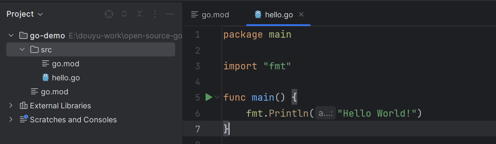
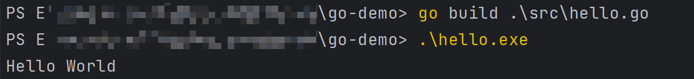
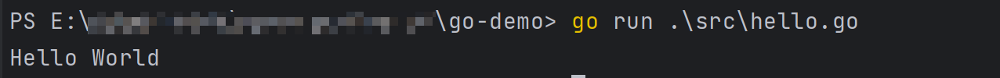
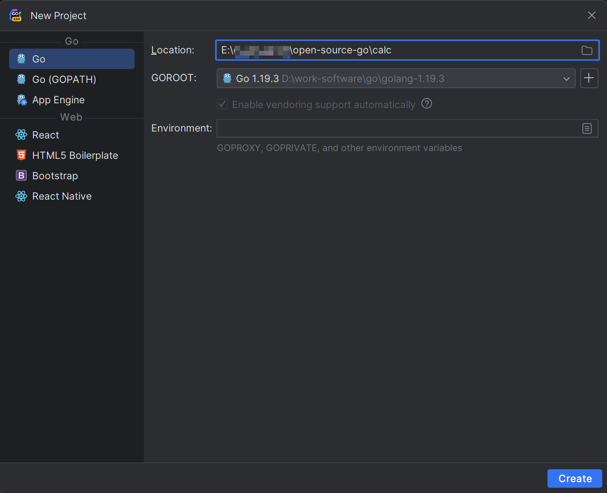
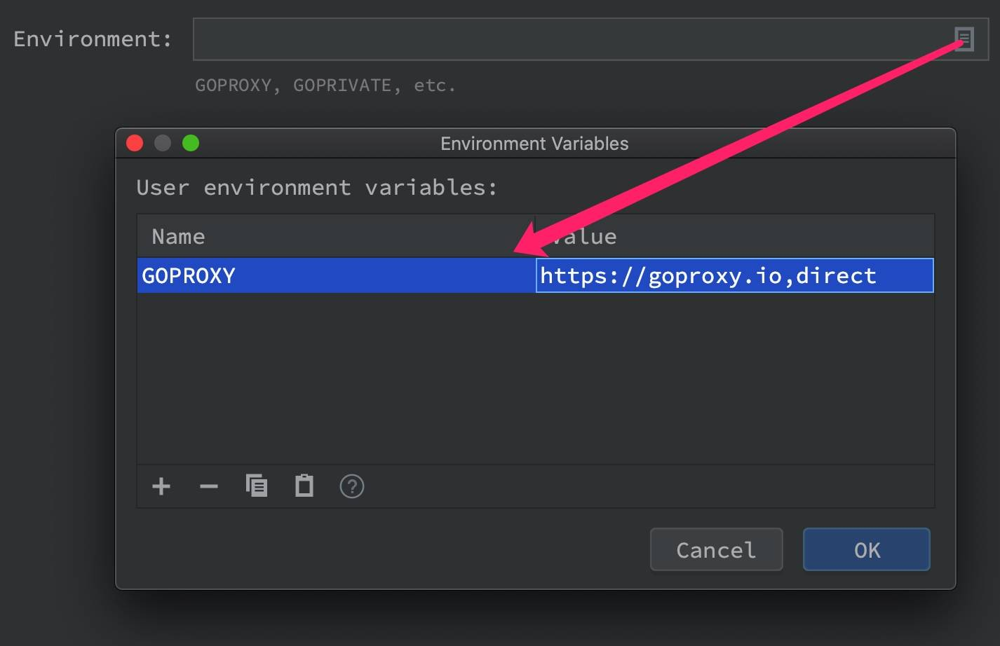
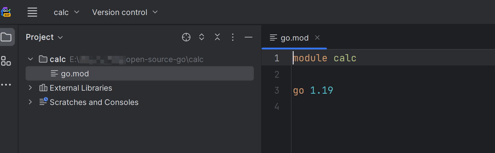
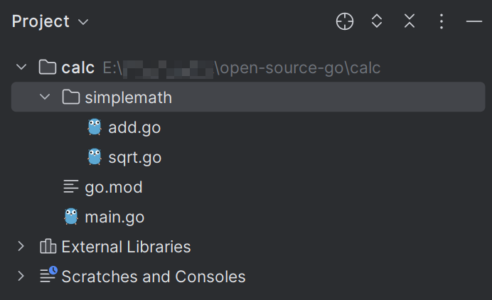
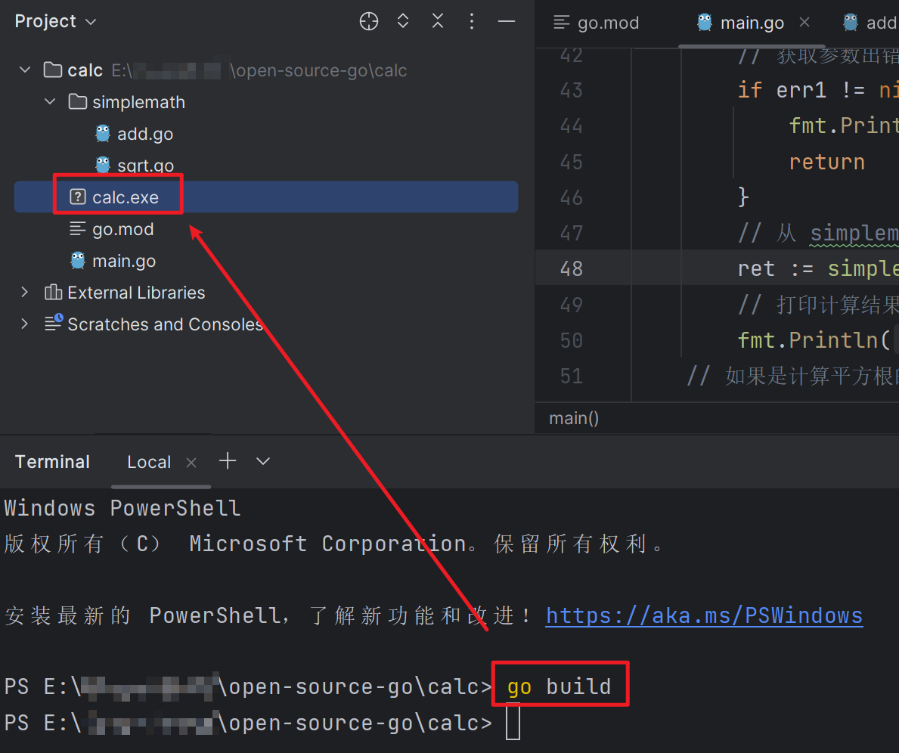
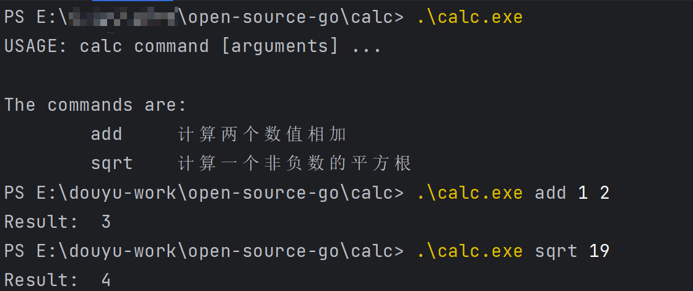

# Go项目工程管理

> 本系列文章转载至：[Go 入门教程 | Laravel 学院 (laravelacademy.org)](https://laravelacademy.org/books/golang-tutorials)

## 一. 第一个Go程序

选择好了开发工具，接下来，就可以直接开始编写第一个 Go 语言程序了，还是遵循编程语言的一贯传统，我们从 Hello World 开始 Go 语言学习之旅。

首先，我们打开 GoLand IDE，选择新建一个 `go-demo` 项目，并输入以下代码：



和 Java 类似，Go 使用包作为基本单位来管理代码（可以类比为 PHP 中的命名空间），每个 Go 源代码文件的开头都是一个 `package` 声明，表示该文件中 Go 代码所属的包。包是 Go 语言里最基本的分发单位，也是工程管理中依赖关系的体现。

要生成 Go 可执行程序，必须声明一个名为 `main` 的包，并且在该包中包含一个名为 `main()` 的主函数，该函数是 Go 可执行程序的执行起点，这一点和 C 语言和 Java 语言很像，后续编译 Go 项目程序的时候也要从包含 `main` 包的文件开始。Go 语言的 `main()` 函数不能带参数，也不能定义返回值。

在包声明之后，是一系列的 `import` 语句，用于导入该程序所依赖的包（可类比为 PHP 中通过 `use` 引入其它命名空间的类来理解）。由于本示例程序用到了 `Println()` 函数，所以需要导入该函数所属的 `fmt` 包。

有一点需要注意，与 Java 和 PHP 不同，在 Go 语言中，不得包含在源代码文件中没有用到的包，否则 Go 编译器会报编译错误。这与下面的强制函数左花括号 `{` 的放置位置以及之后会提到的函数名的大小写规则，均体现了 Go 语言在语言层面解决软件工程问题的设计哲学。

所有 Go 函数（包括在面向对象编程中会提到的类型成员函数）都以关键字 `func` 开头（这一点与 PHP、Java、JavaScript 等语言通过 `function` 定义函数不同）。另外在 Go 函数中，左花括号 `{` 必须在函数定义行的末尾，不能另起一行，否则 Go 编译器会报编译错误。

### 编译 & 运行程序

对以上代码含义有了了解后，我们最后来编译并运行这个 Go 程序，和 PHP、Python 不同，Go 语言是编译型的静态语言（和 Java、C 一样），在运行 Go 程序之前，先要将其编译成二进制可执行文件，我们可以通过 Go 语言提供的 `go build` 命令对 Go 程序进行编译，然后直接运行编译后的可执行文件执行 Go 程序代码：



可以看到，代码执行成功，打印出了「Hello World!」。

此外，我们还可以通过 `go run` 命令来达到同样的效果，该命令将编译和执行指令合二为一，会在编译之后立即执行相应的可执行文件显示执行结果：



## 二. Go 项目工程管理

在实际开发过程中，直接调用编译器进行编译和链接（调用 `go build` 或 `go run` 命令）的场景很少，因为在项目工程中不会简单到只有一个源文件，往往有很多源文件并且源文件之间会有相互依赖的关系，如果这样一个文件一个文件逐步编译，那简直无法想象。

早期 Go 语言使用 `makefile` 作为临时方案，到了 Go 1 发布时引入了强大无比的 [Go 命令行工具](https://golang.org/cmd/go/)，Go 命令行工具彻底消除了工程文件的概念，完全用目录结构和包名来推导工程结构和构建顺序。

想想 C 语言编译、链接和安装可执行程序的繁琐步骤，首先要通过 `configure` 脚本对特定平台进行检测，比如是否包含 GCC 等编译工具，然后生成 Makefile 文件，该文件定义了编译、链接规则，为下一步编译工作做准备，接下来就是执行 `make` 命令进行编译工作，最后再执行 `make install` 命令完成应用程序的安装，经历过这些步骤才可以实现将 C 程序源代码编译为可执行程序。

与之相比，Go 语言则要简单的多，针对只有一个源文件的情况（如上篇教程所示），引入工程管理看起来比较多余，因为直接用 `go run` 和 `go build` 搞定，下面我们通过 Go 语言构建一个简单的计算器项目来演示 Go 语言的基本工程管理方法。

### 2.1 通过 Go Modules 创建新项目

从 Go 1.11 版本开始，官方提供了 [Go Modules](https://blog.golang.org/using-go-modules) 管理项目和依赖，从 1.13 版本开始，更是默认开启了对 Go Modules 的支持，使用 Go Modules 的好处是显而易见的 —— 不需要再依赖 `GOPATH`，你可以在任何位置创建 Go 项目，并且在国内，还可以通过 GOPROXY 配置镜像源加速依赖包的下载，彻底解决之前依赖包下载慢的问题。

通过 Go Modules 管理项目非常简单，我们可以在任意位置创建项目，比如学院君将本地所有 Go 项目存储在了 `E:\open-source-go` 这个目录下。以最新版本的 Go 为例（目前是 1.19.3），在 GoLand IDE 中可以直接基于 Go Modules 创建计算器项目 `calc`：



新建项目时左侧选择 Go modules，在 Location 中输入项目目录，如果需要配置依赖包镜像，可以在 Environment 输入框中点击右侧图标，在弹出窗口新增 `GOPROXY` 环境变量进行设置:



在 Value 下拉列表中选择 [goproxy.io](https://goproxy.io/zh/) 这个镜像即可，这是 Go 官方提供的全球代理。除此之外，你也可以通过终端命令行设置这个代理：

```shell
go env -w GOPROXY=https://goproxy.io,direct
```

点击 OK 保存环境变量配置，在 GoLand 新建项目窗口点击右下角 Create 创建这个新项目。

与上篇教程创建项目不同的是，`calc` 项目根目录下默认包含了一个 `go.mod` 文件，我们可以通过该项目来管理项目依赖，就像 PHP 的 `composer.json` 或者 JavaScript 的 `package.json` 那样。

目前这个文件只包含了项目模块名称：



### 2.2 编写计算器工程源码

我们假设这个工程被划分为两个部分：

- 计算器程序的入口文件 `main.go`，该文件最终会被编译为计算器程序的可执行文件；
- 算法库，名为 `simplemath`，每个计算操作对应于一个同名的 Go 文件，比如 `add.go` 用于计算加法运算。

然后我们来编写每个 Go 文件的源代码。

首先在项目根目录下新建入口文件 `main.go`，并编写代码如下：

```go
package main

// 引入其它包
import (
    "calc/simplemath"
    "fmt"
    "os"
    "strconv"
)

// 定义一个用于打印程序使用指南的函数
var Usage = func() {
    fmt.Println("USAGE: calc command [arguments] ...")
    fmt.Println("\nThe commands are:\n\tadd\t计算两个数值相加\n\tsqrt\t计算一个非负数的平方根")
}

// 程序入口函数
func main ()  {
    /*
     * 用于获取命令行参数，注意程序名本身是第一个参数，
     * 比如 calc add 1 2 这条指令，第一个参数是 calc
     */
    args := os.Args
    // 除程序名本身外，至少需要传入两个其它参数，否则退出
    if args == nil || len(args) < 3 {
        Usage()
        return
    }

    // 第二个参数表示计算方法
    switch args[1] {
        // 如果是加法的话
        case "add":
            // 至少需要包含四个参数
            if len(args) != 4 {
                fmt.Println("USAGE: calc add <integer1><integer2>")
                return
            }
            // 获取待相加的数值，并将类型转化为整型
            v1, err1 := strconv.Atoi(args[2])
            v2, err2 := strconv.Atoi(args[3])
            // 获取参数出错，则退出
            if err1 != nil || err2 != nil {
                fmt.Println("USAGE: calc add <integer1><integer2>")
                return
            }
            // 从 simplemath 包引入 Add 方法进行加法计算
            ret := simplemath.Add(v1, v2)
            // 打印计算结果
            fmt.Println("Result: ", ret)
        // 如果是计算平方根的话
        case "sqrt":
            // 至少需要包含三个参数
            if len(args) != 3 {
                fmt.Println("USAGE: calc sqrt <integer>")
                return
            }
            // 获取待计算平方根的数值，并将类型转化为整型
            v, err := strconv.Atoi(args[2])
            // 获取参数出错，则退出
            if err != nil {
                fmt.Println("USAGE: calc sqrt <integer>")
                return
            }
            // 从 simplemath 包引入 Sqrt 方法进行平方根计算
            ret := simplemath.Sqrt(v)
            // 打印计算结果
            fmt.Println("Result: ", ret)
        // 如果计算方法不支持，打印程序使用指南
        default:
            Usage()
    }
}
```

这段代码相信对于有其他语言编程基础的人来说，都不困难。

需要注意的是，在 Go 语言中，通过 `var` 来声明变量，并且可以将匿名函数赋值给变量以便后续使用，此外，还可以通过 `:=` 运算符来声明并初始化变量，这个时候，不需要通过 `var` 声明该变量，比如 `args := os.Args` 就是如此，需要明确的是，虽然这看起来有点和动态语言声明变量类似，但与 PHP/Python/JavaScript 不同，Go 是强类型语言，底层会自动根据赋值判断对应变量的类型，如果你试图声明一个没有初始化值的变量，就会报错，关于 Go 语言变量声明和初始化我们后面还会详细介绍，这里简单了解下即可。

接下来，我们在 `calc` 根目录下新建一个 `simplemath` 子目录作为算法库，并在该目录下新建 `add.go` 用于编写计算加法的实现代码如下：

```go
package simplemath

func Add(a int, b int) int {
    return a + b
}
```

以及 `sqrt.go` 用于编写计算平方根的实现代码如下：

```go
package simplemath

import "math"

func Sqrt(i int) int {
    v := math.Sqrt(float64(i))
    return int(v)
}
```

### 2.3 构建 Go 工程

截至目前，计算器项目的代码结构是这样的：



我们可以在 `calc` 目录下运行构建指令 `go build` 构建该项目，默认会在项目根目录下生成与项目目录同名的可执行文件：



然后就可以运行 `calc` 通过命令行与基于 Go 实现的计算器应用进行交互了：



非常简单，是吧。你也可以以此为参考自行编写乘法、减法、除法的实现代码。

从上面的构建过程中可以看到，真正的构建命令就一句：

```shell
go build
```

这就是为什么说 Go 命令行工具是非常强大的，我们不需要像 C 语言那样编写 `makefile`，因为这个工具会替我们分析，知道目标代码的编译结果应该是一个包还是一个可执行文件，并分析 `import` 语句以了解包的依赖关系，从而在编译 `main.go` 之前先把依赖的 `simplemath` 编译打包好。Go 命令行程序制定的目录结构规则让代码管理变得非常简单。

当然，这里只是一个最简单、最基本工程管理的构建示例，后面我们还会就更复杂的工程项目管理进行介绍，比如工程组织、文档与代码风格、跨平台开发、单元测试、打包分发等。