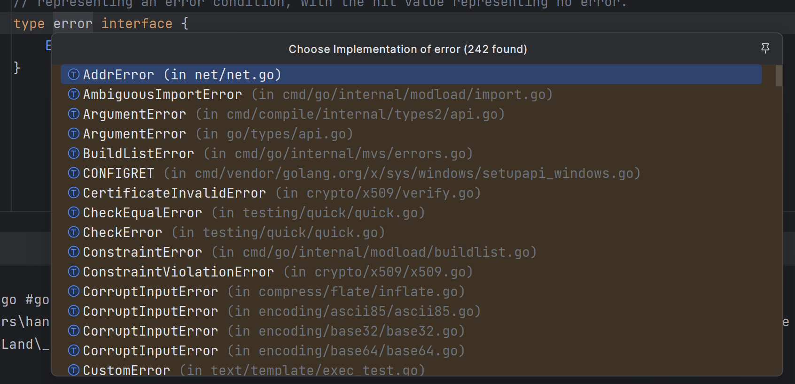
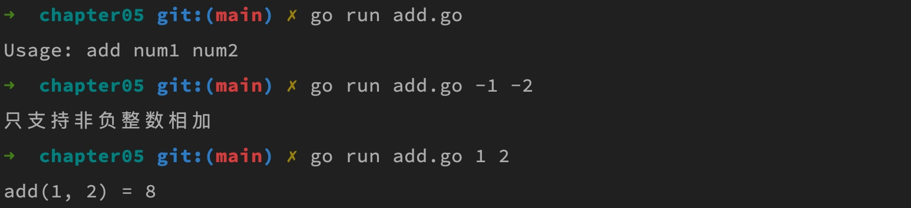

# error类型及其使用

## 一. Go 语言错误处理机制

Go 语言错误处理机制非常简单明了，不需要学习了解复杂的概念、函数和类型，Go 语言为错误处理定义了一个标准模式，即 `error` 接口，该接口的定义非常简单：

```go
type error interface { 
    Error() string 
}
```

error 接口有很多内建的实现类：



其中只声明了一个 `Error()` 方法，用于返回字符串类型的错误消息。对于大多数函数或类方法，如果要返回错误，基本都可以定义成如下模式 —— 将错误类型作为第二个参数返回：

```go
func Foo(param int) (n int, err error) { 
    // ...
}
```

然后在调用返回错误信息的函数/方法时，按照如下「卫述语句」模板编写处理代码即可：

```go
n, err := Foo(0)

if err != nil { 
    // 错误处理 
} else {
    // 使用返回值 n 
}
```

## 二. 返回错误实例并打印

关于自定义并返回 `error` 类型错误信息的使用示例，前面介绍[函数多返回值](https://geekr.dev/posts/go-func-params-and-return-values#toc-7)时已经演示过，我们可以通过 Go 标准错误包 `errors` 提供的 `New()` 方法快速创建一个 `error` 类型的错误实例：

```go
func add(a, b int) (c int, err error) {
    if (a < 0 || b < 0) {
        err = errors.New("只支持非负整数相加")
        return
    }
    a *= 2
    b *= 3
    c = a + b
    return
}
```

我们参照上面介绍的 Go 错误处理标准模式，调用这个函数并编写错误处理的代码如下：

```go
func main() {
    if len(os.Args) != 3 {
        fmt.Printf("Usage: %s num1 num2\n", filepath.Base(os.Args[0]))
        return
    }
    x, _ := strconv.Atoi(os.Args[1])
    y, _ := strconv.Atoi(os.Args[2])
    // 通过多返回值捕获函数调用过程中可能的错误信息
    z, err := add(x, y)
    // 通过「卫述语句」处理后续业务逻辑
    if err != nil {
        fmt.Println(err)
    } else {
        fmt.Printf("add(%d, %d) = %d\n", x, y, z)
    }
}
```

为了方便测试，我们将通过命令行参数传递 `add` 函数的参数，这里我们引入了 `os` 包读取命令行参数，并通过 `strconv` 包提供的 `Atoi` 方法将其转化为整型（命令行读取参数值默认是字符串类型，转化时忽略错误以便简化处理流程），然后分别赋值为 `x`、`y` 变量，再调用 `add` 函数进行运算。

注意到我们在打印错误信息时，直接传入了 `err` 对象实例，因为 Go 底层会自动调用 `err` 实例上的 `Error()` 方法返回错误信息并将其打印出来，就像普通类的 `String()` 方法一样。

我们简单测试下不传递参数、传递错误类型参数和传递正常参数这几种场景，打印结果如下：



以上这种错误处理已经能够满足我们日常编写 Go 代码时大部分错误处理的需求了，事实上，Go 底层很多包进行错误处理时就是这样做的。此外，我们还可以通过 `fmt.Errorf()` 格式化方法返回 `error` 类型错误，其底层调用的其实也是 `errors.New` 方法：

```go
func Errorf(format string, a ...interface{}) error {
    return errors.New(Sprintf(format, a...))
}
```

## 三. 更复杂的错误类型

### 3.1 系统内置错误类型

除了上面这种最基本的、使用 `errors.New()` 方法返回包含错误信息的错误实例之外，Go 语言内置的很多包还封装了更复杂的错误类型。

以 [os](https://golang.org/pkg/os) 包为例，这个包主要负责与操作系统打交道，所以提供了 `LinkError`、`PathError`、`SyscallError` 这些实现了 `error` 接口的错误类型，以 `PathError` 为例，顾名思义，它主要用于表示路径相关的错误信息，比如文件不存在，其底层类型结构信息如下：

```go
type PathError struct {
    Op   string
    Path string
    Err  error
}
```

该错误类型除了组合 `error` 接口实现 `Error()` 方法外，还提供了额外的操作类型字段 `Op` 和文件路径字段 `Path` 以丰富错误信息，方便定位问题，该类型的 `Error()` 方法实现如下：

```go
func (e *PathError) Error() string { 
    return e.Op + " " + e.Path + ": " + e.Err.Error() 
}
```

我们可以在调用 `os` 包方法出错时通过 `switch` 分支语句判定具体的错误类型，然后进行相应的处理：

```go
// 获取指定路径文件信息，对应类型是 FileInfo
// 如果文件不存在，则返回 PathError 类型错误
fi, err := os.Stat("test.txt") 
if err != nil {
    switch err.(type) {
    case *os.PathError:
        // do something
    case *os.LinkError:
        // dome something
    case *os.SyscallError:
        // dome something
    case *exec.Error:
        // dome something
    }
} else {
    // ...
}
```

### 3.2 自定义错误类型

当然，我们也可以仿照 `PathError` 的实现自定义一些复杂的错误类型，只需要组合 `error` 接口并实现 `Error()` 方法即可，然后按照自己的需要为自定义类型添加一些属性字段，这很简单，就不展开介绍了。

## 四. 小结

可以看到，Go 语言的错误和其他语言的错误和异常不同，它们就是从函数或者方法中返回的、和其他返回值并没有什么区别的普通 Go 对象而已，如果程序出错，要如何处理程序下一步的动作，是退出程序还是警告后继续执行，决定权完全在开发者手上。