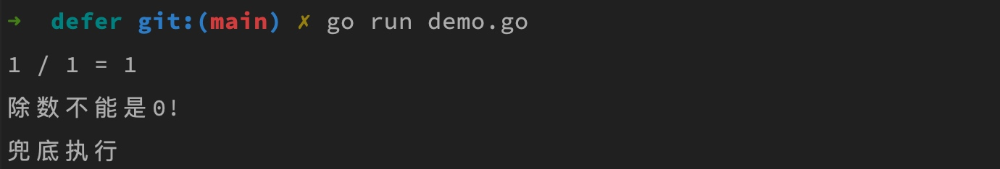
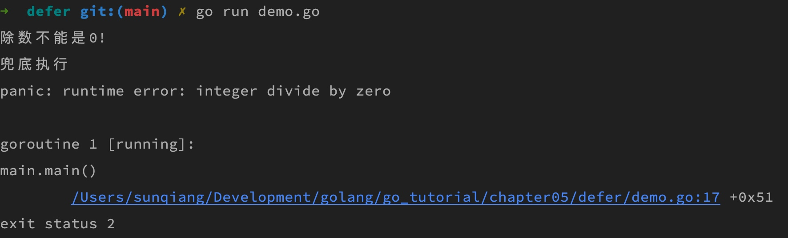

# defer 语句及其使用

Go 语言中的类没有构造函数和析构函数的概念，处理错误和异常时也没有提供 `try...catch...finally` 之类的语法，那当我们想要在某个资源使用完毕后将其释放（网络连接、文件句柄等），或者在代码运行过程中抛出错误时执行一段兜底逻辑，要怎么做呢？

通过 `defer` 关键字声明兜底执行或者释放资源的语句可以轻松解决这个问题。`defer` 语句相当于 Java 中的 finally 的作用，会保证函数不管是正确执行还是遇到错误都会执行 `defer` 声明的代码。

比如我们看 Go 内置的 [io/ioutil](https://golang.google.cn/pkg/io/ioutil/) 包提供的读取文件方法 `ReadFile` 实现源码，其中就有 `defer` 语句的使用：

```go
func ReadFile(filename string) ([]byte, error) {
    f, err := os.Open(filename)
    if err != nil {
        return nil, err
    }
    defer f.Close()

    var n int64 = bytes.MinRead

    if fi, err := f.Stat(); err == nil {
        if size := fi.Size() + bytes.MinRead; size > n {
            n = size
        }
    }
    return readAll(f, n)
}
```

`defer` 修饰的 `f.Close()` 方法会在函数执行完成后或读取文件过程中抛出错误时执行，以确保已经打开的文件资源被关闭，从而避免内存泄露。如果一条语句干不完清理的工作，也可以在 `defer` 后加一个匿名函数来执行对应的兜底逻辑：

```go
defer func() { 
    //  执行复杂的清理工作... 
} ()
```

另外，一个函数/方法中可以存在多个 `defer` 语句，`defer` 语句的调用顺序遵循先进后出的原则，即最后一个 `defer` 语句将最先被执行，相当于「栈」这个数据结构，如果在循环语句中包含了 `defer` 语句，则对应的 `defer` 语句执行顺序依然符合先进后出的规则。

由于 `defer` 语句的执行时机和调用顺序，所以我们要尽量在函数/方法的前面定义它们，以免在后面编写代码时漏掉，尤其是运行时抛出错误会中断后面代码的执行，也就感知不到后面的 `defer` 语句。

下面我们看一段简单的 `defer` 示例代码：

```go
package main

import "fmt"

func printError()  {
    fmt.Println("兜底执行")
}

func main()  {
    defer printError()
    defer func() {
        fmt.Println("除数不能是0!")
    }()

    var i = 1
    var j = 1
    var k = i / j

    fmt.Printf("%d / %d = %d\n", i, j, k)
}
```

在这段代码中，我们定义了两个 `defer` 语句，并且是在函数最顶部，以确保异常情况下也能执行。

在函数正常执行的情况下，这两个 `defer` 语句会在最后一条打印语句执行完成后先执行第二条 `defer` 语句，再执行第一条 `defer` 语句：



而如果我们把 `j` 的值设置为 `0`，则函数会抛出 panic：



表示除数不能为零。这个时候，由于 `defer` 语句定义在抛出 panic 代码的前面，所以依然会被执行，底层的逻辑是在执行 `var k = i / j` 这条语句时，遇到除数为 0，则抛出 panic，然后立即中断当前函数 `main` 的执行（后续其他语句都不再执行），并按照先进后出顺序依次执行已经在当前函数中声明过的 `defer` 语句，最后打印出 panic 日志及错误信息。

