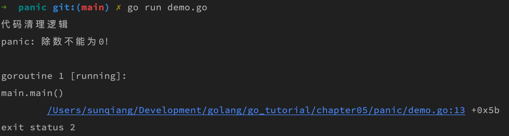
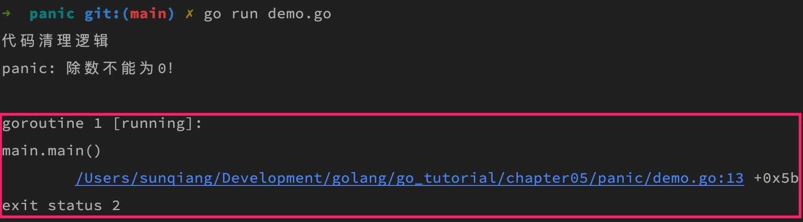

# panic 和 recover

前面学院君介绍了 Go 语言通过 [error 类型](./_30error类型及其使用.md)统一进行错误处理，但这些错误都是我们在编写代码时就已经预见并返回的，对于某些运行时错误，比如数组越界、除数为0、空指针引用，这些 Go 语言是怎么处理的呢？

## 一. panic

当程序发生不可恢复的错误时，可以通过调用panic函数来使程序崩溃。panic函数接受一个任意类型的参数，通常是一个描述错误的字符串。当panic函数被调用时，程序会立即停止执行，并打印出错误信息，然后退出程序。通常情况下，panic的使用应该非常有限，只用于处理程序无法继续运行的致命错误，例如：空指针引用，数组越界等等。

我们可以在代码中显式抛出 panic，以便对错误和异常信息进行自定义，仍然以上篇教程除数为 0 的示例代码为例，我们可以这样显式返回 panic 中断代码执行：

```go
package main

import "fmt"

func main() {
    defer func() {
        fmt.Println("代码清理逻辑")
    }()

    var i = 1
    var j = 0
    if j == 0 {
        // 手动抛出 运行时恐慌
        panic("除数不能为0！")
    }
    k := i / j
    fmt.Printf("%d / %d = %d\n", i, j, k)
}
```

这样一来，当我们执行这段代码时，就会抛出 panic：



`panic` 函数支持的参数类型是 `interface{}`：

```go
func panic(v interface{})
```

所以可以传入任意类型的参数：

```go
panic(500)   // 传入数字
panic(errors.New("除数不能为0"))  // 传入 error 类型
```

无论是 Go 语言底层抛出 panic，还是我们在代码中显式抛出 panic，处理机制都是一样的：当遇到 panic 时，Go 语言会中断当前协程（即 `main` 函数）后续代码的执行，然后执行在中断代码之前定义的 `defer` 语句（按照先入后出的顺序），最后程序退出并输出 panic 错误信息，以及出现错误的堆栈跟踪信息，也就是下面红框中的内容：



第一行表示出问题的协程，第二行是问题代码所在的包和函数，第三行是问题代码的具体位置，最后一行则是程序的退出状态，通过这些信息，可以帮助你快速定位问题并予以解决。

## 二. recover

Go语言提供了recover函数来捕获panic，从而使程序不会直接崩溃（类似于Java中的catch）。recover函数必须在defer语句中使用。当程序中的panic函数被调用时，Go会从当前函数开始逐层向外寻找recover语句，并执行recover语句。如果找到了recover语句，程序会继续执行，否则程序仍然会崩溃。

下面是一个简单的示例，展示了如何使用panic和recover函数：

```go
func f() {
    defer func() {
        if r := recover(); r != nil {
            fmt.Println("Recovered:", r)
        }
    }()
    fmt.Println("Calling g.")
    g(0)
    fmt.Println("Returned normally from g.")
}

func g(i int) {
    if i > 3 {
        fmt.Println("Panicking!")
        panic(fmt.Sprintf("%v", i))
    }
    defer fmt.Println("Defer in g", i)
    fmt.Println("Printing in g", i)
    g(i + 1)
}

func main(){
    f()
}
```

输出：

```txt
Calling g.
Printing in g 0
Printing in g 1
Printing in g 2
Printing in g 3
Panicking!
Defer in g 3
Defer in g 2
Defer in g 1
Defer in g 0
Recovered: 4
```

