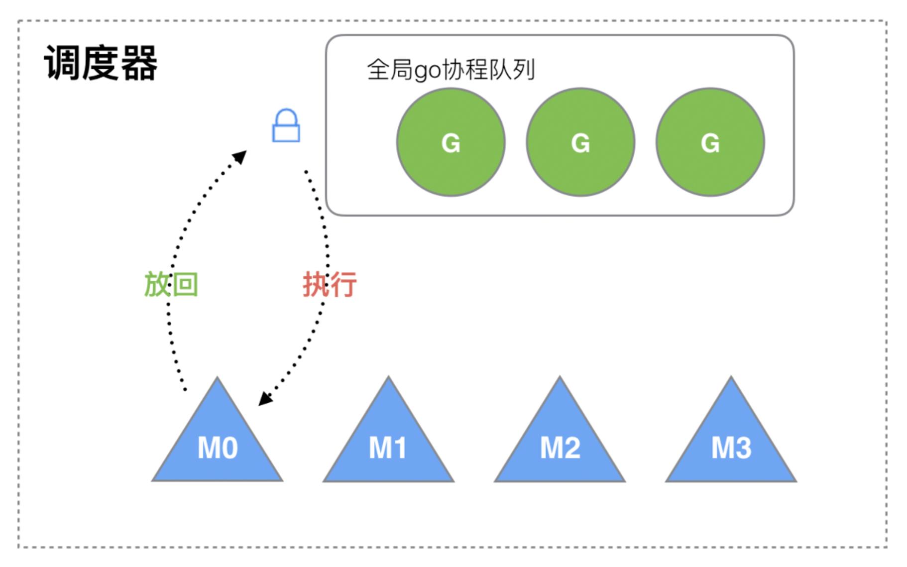
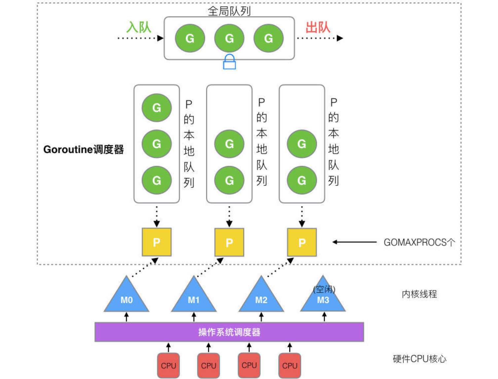
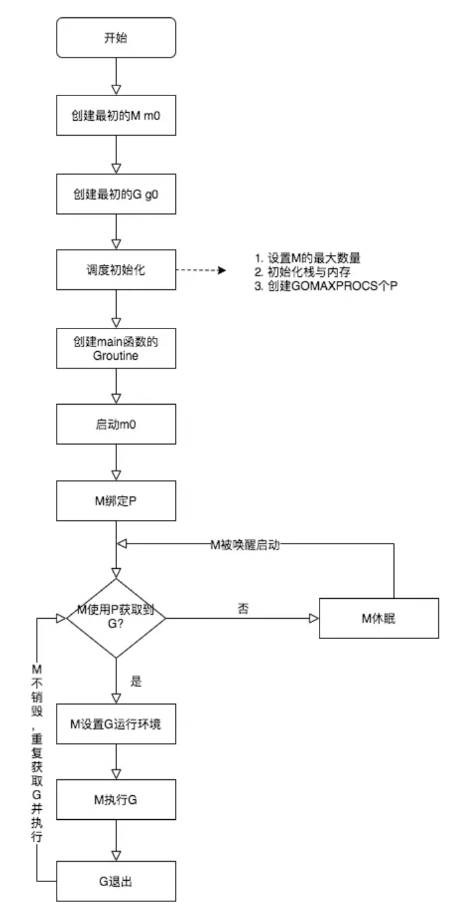
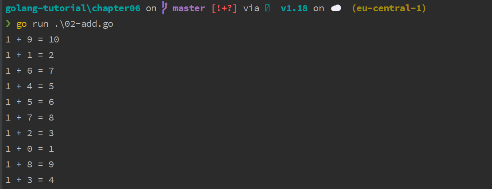

# 协程实现原理及使用入门

## 一. Go 协程实现原理

Go 语言的协程实现被称之为 Goroutine，由 Go 运行时管理，在 Go 语言中通过协程实现并发编程非常简单：我们可以在一个处理进程中通过关键字 `go` 启用多个协程，然后在不同的协程中完成不同的子任务。

这些在用户代码中创建和维护的协程本质上是用户级线程，Go 语言运行时会在底层通过调度器将用户级线程交给操作系统的系统级线程去处理，如果在运行过程中遇到某个 IO 操作而暂停运行，调度器会将用户级线程和系统级线程分离，以便让系统级线程去处理其他用户级线程，而当 IO 操作完成，需要恢复运行，调度器又会调度空闲的系统级线程来处理这个用户级线程，从而达到并发处理多个协程的目的。

下面我们来详细看看 Go 协程的底层调度机制。

Go 语言的调度器通过使用与 CPU 数量相等的线程来减少线程频繁切换导致的内存开销，同时在每一个线程上执行更加轻量级的协程来降低操作系统和硬件的负载。每个协程非常轻量级，只占几KB的内存，这就让在有限的内存空间内支持大量协程成为可能，从而实现更高的并发。

> 虽然一个协程的栈只占几KB，但实际是可伸缩的，如果需要更多内存，Go 运行时会自动为协程分配。

### 1.1 G-M模型

早期的 Go 协程是 G-M 模型，G 指 Goroutine，对应协程，M 指 Machine，一个 M 关联一个内核 OS 线程，由操作系统管理：



内核线程 M 想要执行、放回 G 都必须访问全局 G 队列，并且 M 有多个，这就出现多线程访问同一资源的场景，要保证线程安全就需要加锁保证互斥/同步，所以全局 G 队列是有互斥锁进行保护的，这也成为系统的主要性能瓶颈。

### 1.2 G-M-P 模型

为了解决 G-M 模型的问题，后面又引入了 P（Processor），成为了现在完善的 G-M-P 模型。Processor 包含了运行 Goroutine 的资源，如果内核线程想运行 Goroutine，必须先获取 P，P 里面包含了可运行的 G 队列：



- 全局队列：存放待运行 G
- P 的本地队列：和全局队列类似，存放的也是待运行的 G，存放数量上限 256 个。新建 G 时，G 优先加入到 P 的本地队列，如果队列满了，则会把本地队列中的一半 G 移动到全局队列
- P 列表：所有的 P 都在程序启动时创建，保存在数组中，最多有 GOMAXPROCS 个，可通过 `runtime.GOMAXPROCS(N)` 修改，N 表示设置的个数
- M：每个 M 代表一个内核线程，操作系统调度器负责把内核线程分配到 CPU 的核心上执行。

G-M-P 的调度流程大致如下：

- 线程 M 想运行任务就需得获取 P，即与 P 关联；
- 然后从 P 的本地队列（LRQ）获取 G；
- 若 P 本地队列中没有可运行的 G，M 会尝试从全局队列（GRQ）拿一批 G 放到 P 的本地队列；
- 若全局队列也未找到可运行的 G 时，M 会随机从其他 P 的本地队列偷一半放到自己 P 的本地队列；
- 拿到可运行的 G 之后，M 运行 G，G 执行之后，M 会从 P 获取下一个 G，不断重复下去。

对应的调度生命周期如下：



- M0 是启动程序后的编号为 0 的主线程，这个 M 对应的实例会在全局变量 `runtime.m0` 中，不需要在 heap 上分配，M0 负责执行初始化操作和启动第一个 G， 在之后 M0 就和其他的 M 一样了。
- G0 是每次启动一个 M 都会第一个创建的 Goroutine，G0 仅用于负责调度 G，G0 不指向任何可执行的函数，每个 M 都会有一个自己的 G0。和普通 G 的栈在堆上分配不同，G0 的栈是 M 对应线程的栈，所有调度相关的代码，会先切换到 G0 栈中再执行，也就是说内核线程的栈也是用 G 实现，而不是使用 OS 的。

以上，就是 Go 语言并发编程的独特实现模型。

## 二. 为什么协程比线程切换效率更高

线程切换需要操作系统从用户态切换到内核态，进行上下文切换，这个过程需要保存和恢复当前线程的执行状态，非常耗费系统资源和时间。

相比之下，协程是一种用户级线程，可以在一个线程中实现多个协程，协程之间的切换不需要进入内核态，因此切换的代价较小。

进入内核态的代价相对较高，主要是因为操作系统需要完成一些复杂的操作，如保存和恢复进程上下文、更新内核数据结构等，这些操作都需要耗费大量的系统资源和时间。在进行线程切换时，需要将当前线程的执行状态保存下来，并将控制权转移到内核中进行调度。而在切换回来时，操作系统需要恢复线程的执行状态，这个过程涉及到大量的数据拷贝和状态恢复操作，非常耗费时间。

相比之下，协程的上下文切换发生在用户空间，不需要进入内核态，因此能够避免进入内核态带来的性能损失。在协程切换时，只需要保存和恢复少量的上下文信息，如寄存器的值、栈指针等，比线程切换所需要的上下文信息要少得多。

此外，协程的调度是由程序自己控制的，可以避免不必要的上下文切换，因此也能够提高程序的性能。

总的来说，协程能够避免进入内核态带来的性能损失，同时也能够减少上下文切换所需要的时间和资源，因此相比于线程切换更加高效。

## 三. 协程使用入门

### 3.1 简单使用示例

下面我们通过一个简单的示例来演示如何在 Go 语言中通过协程实现并发编程，得益于 Go 语言底层的出色设计，这非常简单。

我们在 `02-add.go` 中编写一个加法函数 `add` 并通过协程的方式来调用它：

```go
package main

import "fmt"

func add(a, b int) {
    var c = a + b
    fmt.Printf("%d + %d = %d", a, b, c)
}

func main() {
    go add(1, 2)
}
```

在这段代码中包含了两个协程，一个是显式的，通过 `go` 关键字声明的这条语句，表示启用一个新的协程来处理加法运算，另一个是隐式的，即 `main` 函数本身也是运行在一个主协程中，该协程和调用 `add` 函数的子协程是并发运行的两个协程，就好比从 `go` 关键字开始，从主协程中分叉出一条新路。

和之前不使用协程的方式相比，由此也引入了不确定性：我们不知道子协程什么时候执行完毕，运行到了什么状态。在主协程中启动子协程后，程序就退出运行了，这就意味着包含这两个协程的处理进程退出了，所以，我们运行这段代码，不会看到子协程里运行的打印结果，因为还没来得及执行它们，主进程就已经退出了。

另外，我们也不要试图从 `add` 函数返回处理结果，因为在主协程中，根本获取不到子协程的返回值，从子协程开始执行起就已经和主协程没有任何关系了，返回值会被丢弃。

如果要显示出子协程的打印结果，一种方式是在主协程中等待足够长的时间再退出，以便保证子协程中的所有代码执行完毕：

```go
package main

import (
    "fmt"
    "time"
)

func add(a, b int) {
    var c = a + b
    fmt.Printf("%d + %d = %d\n", a, b, c)
}

func main() {
    go add(1, 2)
    time.Sleep(1 * time.Second)
}
```

这里，我们通过 `time.Sleep(1e9)` 让主协程等待 1s 后退出，这样，运行 `go run 02-add.go` 就可以看到打印结果了：


不过，这种方式过于简单粗暴，对于加法运算，1s 肯定够了（而且根本不需要这么长时间），但是如果是数据库连接、发送邮件之类的难以预估时间的操作呢？这种方式就不合适了，我们需要一种更精准的方式在子协程执行完毕后，立即退出主协程，这就涉及到协程间的通信，我们将在下一篇教程中重点讨论这一块，并且通过协程间通信来重写这段代码。

### 3.2 协程的并发执行

到目前为止，我们仅仅演示了 Go 语言协程的启动和简单使用，但是通过上述代码还不足以验证协程是并发执行的，接下来，我们通过下面这段代码来验证协程的并发执行：

```go
package main

import (
    "fmt"
    "time"
)

func add(a, b int) {
    var c = a + b
    fmt.Printf("%d + %d = %d\n", a, b, c)
}

func main() {
    for i := 0; i < 10; i++ {
        go add(1, i)
    }
    time.Sleep(1 * time.Second)
}
```

很简单，我们给协程代码外层套上一个循环就可以了，这样一来，就同时启动了 10 个子协程，由于它们是并发执行的，执行的先后顺序无法保证，所以我们就看到了这样乱序的打印结果：



如果你想要编排这段并发执行代码的执行顺序，让多个协程按照指定顺序依次执行，同样需要依赖协程间的通信，学院君将在后续教程中给大家一一道来。