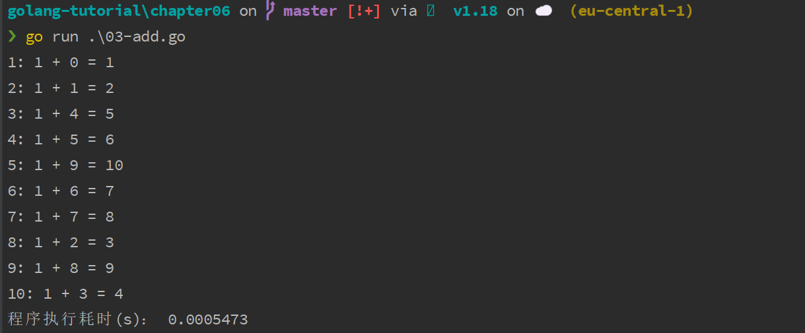
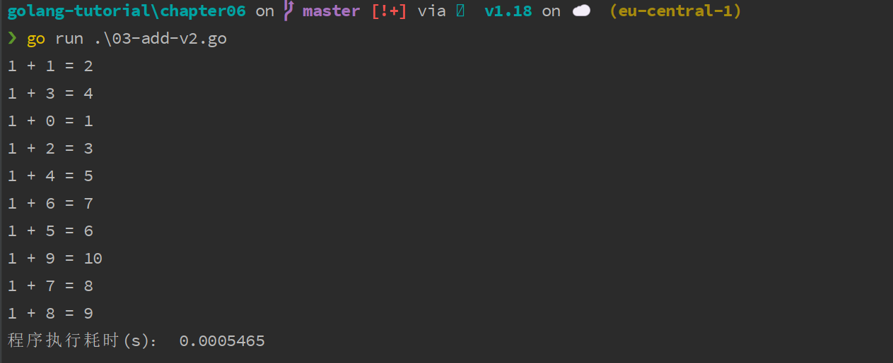

# 基于共享内存实现协程通信

在[上篇教程](./_33Go协程实现原理和使用示例.md)中，我们已经演示了如何通过协程在 Go 语言中实现并发编程，从语法结构来说，Go 语言的协程是非常简单的，只需要通过 `go` 关键字声明即可，难点在于并发引起的不确定性，以及为了协调这种不确定性在不同协程间所要进行的通信，在[并发开篇教程](https://geekr.dev/posts/from-process-thread-to-goroutine)中，我们也介绍过在工程上，常见的并发通信模型有两种：共享内存和消息传递。

接下来，学院君将详细展开介绍这两种通信模型，以及如何基于这些通信模型对 Go 并发编程进行编排。

首先，我们来看看如何通过共享内存来实现 Go 协程通信，并通过协程通信来重构上篇教程的并发代码，实现应用程序的优雅退出。

## 一. 通过共享计数器控制协程退出

新建一个 `03-add.go`，并编写代码如下：

```go
package main

import (
    "fmt"
    "runtime"
    "sync"
    "time"
)

var counter int = 0

func addV2(a, b int, lock *sync.Mutex) {
    lock.Lock()
    c := a + b
    counter++
    fmt.Printf("%d: %d + %d = %d\n", counter, a, b, c)
    lock.Unlock()
}

func main() {
    start := time.Now()
    lock := &sync.Mutex{}
    for i := 0; i < 10; i++ {
        go addV2(1, i, lock)
    }

    for {
        lock.Lock()
        c := counter
        lock.Unlock()
        runtime.Gosched() // 让出 CPU 时间片
        if c >= 10 {
            break
        }
    }
    end := time.Now()
    consume := end.Sub(start).Seconds()
    fmt.Println("程序执行耗时(s)：", consume)
}
```

为了精确判断主协程退出时机问题，我们需要在所有子协程执行完毕后通知主协程，主协程在收到该信号后退出程序，通过共享内存的方式我们引入了一个全局的 `counter` 计数器，该计数器被所有协程共享，每执行一次子协程，该计数器的值加 1，当所有子协程执行完毕后，计数器的值应该是 10，我们在主协程中通过一个死循环来判断 `counter` 的值，只有当它大于等于 10 时，才退出循环，进而退出整个程序。

此外，由于 `counter` 变量会被所有协程共享，为了避免 `counter` 值被污染（两个协程同时操作计数器），我们还引入了锁机制，即 `sync.Mutex`，这是 Go 语言标准库提供的互斥锁，当一个协程调用其 `Lock()` 方法加锁后，其他协程必须等到这个协程调用同一个 `sync.Mutex` 的 `Unlock()` 方法解锁才能继续访问这个 `sync.Mutex`（通过指针传递到子协程，所以整个应用持有的是同一个互斥锁），我们可以通过这种方式保证所有 `lock.Lock()` 与 `lock.Unlock()` 之间的代码是以同步阻塞方式串行执行的，从而保证对 `counter` 进行读取和更新操作时，同时只有一个协程在操作它（既保证了操作的原子性）。

最后，我们还统计了整个程序执行时间。

当我们执行这段代码时，打印结果如下：



可以看到，实际执行时间远远小于1秒，这样一来，程序的整体执行效率相比于上篇教程的实现快了将近2000倍。

不过，代码也因此变得更复杂，更难以维护，这还只是个简单的加法运算实现，就要写这么多代码，要引入共享变量，还要引入互斥锁来保证操作的原子性，对于更加复杂的业务代码，如果到处都要加锁、解锁，显然对开发者和维护者来说都是噩梦，Go 语言既然以并发编程作为语言的核心优势，当然不至于将这样的问题用这么繁琐的方式来解决。

## 二. 通过 sync.WaitGroup 控制协程退出

实际上，我们可以借助 Go 官方标准库 `sync` 包提供的 `sync.WaitGroup` 更加优雅地实现协程退出。

`sync.WaitGroup` 类型是开箱即用的，也是并发安全的。该类型提供了以下三个方法：

- `Add`：`WaitGroup` 类型有一个计数器，默认值是 0，我们可以通过 `Add` 方法来增加这个计数器的值，通常我们可以通过个方法来标记需要等待的子协程数量；
- `Done`：当某个子协程执行完毕后，可以通过 `Done` 方法标记已完成，该方法会将所属 `WaitGroup` 类型实例计数器值减 1，通常可以通过 `defer` 语句来调用它；
- `Wait`：`Wait` 方法的作用是阻塞当前协程，直到对应 `WaitGroup` 类型实例的计数器值归零，如果在该方法被调用的时候，对应计数器的值已经是 0，那么它将不会做任何事情。

至此，你可能已经看出来了，我们完全可以组合使用 `sync.WaitGroup` 类型提供的方法来替代之前自行实现计数器的实现方法，对应代码如下：

```go
package main

import (
    "fmt"
    "sync"
    "time"
)

func addV3(a, b int, doneFunc func()) {
    defer func() {
        doneFunc() // 子协程执行完毕后将计数器-1
    }()
    c := a + b
    fmt.Printf("%d + %d = %d\n", a, b, c)
}

func main() {
    start := time.Now()
    wg := sync.WaitGroup{}
    wg.Add(10) // 初始化计数器数目为10
    for i := 0; i < 10; i++ {
        go addV3(1, i, wg.Done)
    }

    wg.Wait() // 等待子协程全部执行完毕退出
    end := time.Now()
    consume := end.Sub(start).Seconds()
    fmt.Println("程序执行耗时(s)：", consume)
}
```

看起来代码简洁多了，我们首先在主协程中声明了一个 `sync.WaitGroup` 类型的 `wg` 变量，然后调用 `Add` 方法设置等待子协程数为 10，然后循环启动子协程，并将 `wg.Done` 作为 `defer` 函数传递过去，最后，我们通过 `wg.Wait()` 等到 `sync.WaitGroup` 计数器值为 0 时退出程序。

上述代码打印结果和之前通过通道实现的结果是一致的：



对于某些动态程序，可能在运行时才能知道计数器的数目，这种情况下，`sync.WaitGroup` 会更加方便，我们可以这样在循环体内部动态增加计数器，而不是一开始就指定总数：

```go
// wg.Add(10) // 初始化计数器数目为10
for i := 0; i < 10; i++ {
    wg.Add(1) // 循环体内动态增加计数器，每次+1
    go addV3(1, i, wg.Done)
}
```

这种情况下，需要确保 `Add` 方法增加的数量和 `Done` 方法减少的数量是一致的即可，通常我们调用一次 `Add` 方法，就在协程执行完毕后调用一次 `Done` 方法就可以保证，如果两者不是一一对应的，`Add` 调用次数大于 `Done` 调用次数，所有协程执行完毕计数器是正数，会导致协程阻塞：

```go
fatal error: all goroutines are asleep - deadlock!
```

反过来，如果 `Add` 调用次数小于 `Done` 调用次数，会导致计数器出现负数，也会报错：

```go
panic: sync: negative WaitGroup counter
```

## 三. 小结

`sync.WaitGroup` 其实是 Go 底层封装的一个更加优雅的计数器实现，和自行实现的计数器一样，本质上都是通过计数信号量基于共享内存实现协程之间的同步和通信，在基于共享内存实现协程通信时，一个重要的、不可忽视的要素就是如何确保不同协程同时访问同一资源的数据竞争和并发安全问题，这在传统多线程并发编程中也是一大议题，下篇教程学院君将详细给大家介绍 Go 语言中基于共享内存实现协程通信的并发安全问题和解决方案。