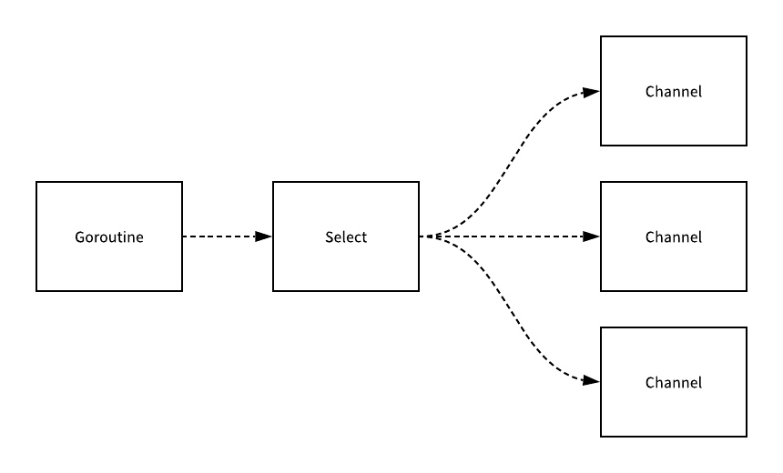

# 通道详解

## 一. 通道声明和初始化

通过上篇教程，想必你已经了解了通道类型的基本使用，我们可以通过 `chan` 类型关键字来声明通道类型变量：

```go
var ch chan int
```

上面这个表达式表示声明一个通道类型变量 `ch`，并且通道中只能传递 `int` 类型数据。

与其他数据类型不同，通道类型变量除了声明通道类型本身外，还要声明通道中传递数据的类型，比如这里我们指定这个数据类型为 `int`。前介绍过，通道是类型相关的，我们必须在声明通道的时候同时指定通道中传递数据的类型，并且一个通道只能传递一种类型的数据，这一点和数组/切片类似。

此外，我们还可以通过如下方式声明通道数组、切片、字典，以下声明方式表示 `chs` 中的元素都是 `chan int` 类型的通道：

```go
var chs [10]chan int
var chs []chan int
var chs map[string]chan int
```

不过，实际编码时，我们更多使用的是下面这种快捷方式同时声明和初始化通道类型：

```go
ch := make(chan int)
```

由于在 Go 语言中，通道也是引用类型（和切片、字典一样），所以可以通过 `make` 函数进行初始化，在通过 `make` 函数初始化通道时，还可以传递第二个参数，表示通道的容量：

```go
ch := make(chan int, 10)
```

**第二个参数是可选的，用于指定通道最多可以缓存多少个元素，默认值是 0，此时通道可以被称作非缓冲通道，表示往通道中发送一个元素后，只有该元素被接收后才能存入下一个元素，与之相对的，当缓存值大于 0 时，通道可以称作缓冲通道，即使通道元素没有被接收，也可以继续往里面发送元素，直到超过缓冲值，显然设置这个缓冲值可以提高通道的操作效率**。

需要注意的是，我们在上一篇教程中通过下面这种方式初始化的是切片，而不是通道：

```go
chs := make([]chan int, 10)
```

只是切片中的元素类型是通道，这个时候第二个参数是切片的初始容量，而不是通道的。

## 二. 通道操作符

通道类型变量只支持发送和接收操作，即往通道中写入数据和从通道中读取数据，对应的操作符都是 `<-`，我们判断是发送还是接收操作的依据是通道类型变量位于 `<-` 左侧还是右侧，位于左侧是发送操作，位于右侧是接收操作：

```go
ch <- 1   // 往通道中写入数据 1
x := <- ch     // 从通道中读取数据并赋值给变量
```

当我们将数据发送到通道时，发送的是数据的副本，同理，从通道中接收数据时，接收的也是数据的副本。

上篇教程我们已经介绍过，发送和接收操作都是原子操作，同时只能进行发送或接收操作，不存在数据发送一半被接收，或者接收一半发送新数据的情况，并且两者都是阻塞的，如果通道中没有数据，进行读取操作的话会导致读取操作所在的协程阻塞，直到通道中写入了数据；反过来，如果通道中已经有了数据，再往里面写入数据的话，也会导致写入操作所在的协程阻塞，直到其中的数据被其他协程接收。

## 三. 缓冲通道

当然，上面这种情况发生在非缓冲通道中，对于缓冲通道，情况略有不同，假设 `ch` 是通过 `make(chan int, 10)` 进行初始化的通道，则其缓冲区大小是 10，这意味着，在没有被任何其他协程接收的情况下，我们可以一直往 `ch` 通道中写入 10 个数据，超过 10 个数据才会阻塞当前协程，直到通道被其他协程读取，显然，合理设置缓冲区可以提高通道的操作效率，尤其是在需要持续传输大量数据的场景。

我们可以通过如下示例代码简单测试下通道的缓冲机制：

```go
package main

import (
    "fmt"
    "time"
)

func test(ch chan int)  {
    for i := 0; i < 100; i++ {
        ch <- i
    }
    close(ch)
}

func main()  {
    start := time.Now()
    ch := make(chan int, 20)
    go test(ch)
    for i := range ch {
        fmt.Println("接收到的数据:", i)
    }
    end := time.Now()
    consume := end.Sub(start).Seconds()
    fmt.Println("程序执行耗时(s)：", consume)
}
```

我们在主协程中初始化了一个带缓冲的通道，缓冲大小是 20，然后将其传递到子协程，并且在子协程中发送数据到通道，子协程执行完毕后，调用 `close(ch)` 显式关闭通道，这一行不能漏掉，否则主协程不知道子协程什么时候执行完毕，从一个空的通道接收数据会报如下运行时错误（死锁）：

```go
fatal error: all goroutines are asleep - deadlock!
```

关闭通道的操作只能执行一次，试图关闭已关闭的通道会引发 panic。此外，关闭通道的操作只能在发送数据的一方关闭，如果在接收一方关闭，会导致 panic，因为接收方不知道发送方什么时候执行完毕，向一个已经关闭的通道发送数据会导致 panic。

## 四. 单向通道

通常，管道都是支持双向操作的：既可以往管道发送数据，也可以从管道接收数据。但在某些场景下，可能我们需要限制只能往管道发送数据，或者只能从管道接收数据，这个时候，就需要用到单向通道。

不过，这里我们需要澄清一下，通道本身还是要支持读写的，如果某个通道只支持写入操作，那么即便数据写进去了，不能被读取也毫无意义，同理，如果某个通道只支持读取操作，不能写入数据，那么通道永远是空的，从一个空的通道读取数据会导致协程的阻塞，无法执行后续代码。

因此，Go 语言支持的单向管道，实际上是在使用层面对通道进行限制，而不是语法层面：即我们在某个协程中只能对通道进行写入操作，而在另一个协程中只能对该通道进行读取操作。从这个层面来说，单向通道的作用是约束在生产协程中只能发送数据到通道，而在消费协程中只能从通道接收数据，从而让代码遵循「最小权限原则」，避免误操作和通道使用的混乱，让代码更加稳健。

下面我们就来看看如何在 Go 协程之间实现单向通道的约束。

当我们将一个通道类型变量传递到一个函数时（通常是在另外一个协程中执行），如果这个函数只能发送数据到通道，可以通过如下将其指定为单向只写通道（发送通道）：

```go
func test(ch chan<- int)
```

上述代码限定在 `test` 函数中只能写入 `int` 类型数据到通道 `ch`。

反过来，如果我们将一个通道类型变量传递到一个只允许从该通道读取数据的函数，可以通过如下方式将通道指定为单向只读通道（接收通道）：

```go
func test(ch <-chan int)
```

上述代码限定在 `test` 函数中只能从 `ch` 通道读取 `int` 类型数据。

虽然我们也可以像声明正常通道类型那样声明单向通道，但我们一般不这么做，因为这样一来，就是从语法上限定通道的操作类型了，对于只读通道只能接收数据，对于只写通道只能发送数据：

```go
var ch1 chan int
var ch2 chan<- int 
var ch3 <-chan int
```

此外，我们还可以通过如下方式实现双向通道和单向通道的转化：

```go
ch1 := make(chan int) 
ch2 := <-chan int(ch1)
ch3 := chan<- int(ch1)
```

基于双向通道 `ch1`，我们通过类型转化初始化了两个单向通道：单向只读的 `ch2` 和单向只写的 `ch3`。注意这个转化是不可逆的，双向通道可以转化为任意类型的单向通道，但单向通道不能转化为双向通道，读写通道之间也不能相互转化。

实际上，我们在将双向通道传递到限定通道参数操作类型的函数时，就应用到了类型转化。

我们可以通过单向通道来约束上面示例代码中子协程对通道的单向写入操作：

```go
package main

import (
    "fmt"
    "time"
)

func test(ch chan<- int) {
    for i := 0; i < 100; i++ {
        ch <- i
    }
    close(ch)
}

func main() {
    start := time.Now()
    ch := make(chan int, 20)
    go test(ch)
    for i := range ch {
        fmt.Println("接收到的数据:", i)
    }
    end := time.Now()
    consume := end.Sub(start).Seconds()
    fmt.Println("程序执行耗时(s)：", consume)
}
```

如果我们将 `test` 函数中的通道参数类型约束调整为 `test(ch <-chan int)`，编译代码就会报错：

```go
# command-line-arguments
./channel3.go:10:12: invalid operation: ch <- i (send to receive-only type <-chan int)
./channel3.go:12:10: invalid operation: close(ch) (cannot close receive-only channel)
```

提示传入的通道是只读通道（receive-only channel），不能进行写入操作，此外，关闭通道函数 `close` 也不能作用到只读通道。

如果将 `main` 函数中的通道初始化语句修改为 `ch := make(chan<- int)`，编译时也会报错：

```go
# command-line-arguments
./channel3.go:19:14: invalid operation: range ch (receive from send-only type chan<- int)
```

提示不能通过 `range` 语句从只写通道（send-only）中接收数据。

我们也可以定义一个返回值类型为单向只读通道的函数，以便得到该返回值的代码只能从通道中接收数据：

```go
func test() <-chan int {
    ch := make(chan int, 20)
    for i := 0; i < 100; i++ {
        ch <- i
    }
    close(ch)
    return ch
}
```

显然，合理使用单向通道，可以有效约束不同业务对通道的操作，避免越权使用和滥用，此外，也提高了代码的可读性，一看函数参数就可以判断出业务对通道的操作类型。

## 五. select

Go 语言还支持通过 `select` 分支语句选择指定分支代码执行，`select` 语句和之前介绍的 [switch 语句](https://laravelacademy.org/post/19793.html)语法结构类似，不同之处在于 `select` 的每个 `case` 语句必须是一个通道操作，要么是发送数据到通道，要么是从通道接收数据，此外 `select` 语句也支持 `default` 分支：

```go
select { 
    case <-chan1:
        // 如果从 chan1 通道成功接收数据，则执行该分支代码
    case chan2 <- 1:
        // 如果成功向 chan2 通道成功发送数据，则执行该分支代码 
    default:
        // 如果上面都没有成功，则进入 default 分支处理流程 
}
```

> 注：Go 语言的 `select` 语句借鉴自 Unix 的 `select()` 函数，在 Unix 中，可以通过调用 `select()` 函数来监控一系列的文件句柄，一旦其中一个文件句柄发生了 IO 动作，该 `select()` 调用就会被返回（C 语言中就是这么做的），后来该机制也被用于实现高并发的 Socket 服务器程序。Go 语言直接在语言级别支持 `select` 关键字，用于处理并发编程中通道之间异步 IO 通信问题。

可以看出，`select` 不像 `switch`，`case` 后面并不带判断条件，而是直接去查看 `case` 语句，每个 `case` 语句都必须是一个面向通道的操作，比如上面的示例代码中，第一个 `case` 试图从 `chan1` 接收数据并直接忽略读到的数据，第二个 `case` 试图向 `chan2` 通道发送一个整型数据 `1`，需要注意的是这两个 `case` 的执行不是 `if...else...` 那种先后关系，而是会并发执行，然后 `select` 会选择先操作成功返回的那个 `case` 分支去执行，如果两者同时返回，则随机选择一个执行，如果这两者都没有返回，则进入 `default` 分支，这里也不会出现阻塞，如果 `chan1` 通道为空，或者 `chan2` 通道已满，就会立即进入 `default` 分支，但是如果没有 `default` 语句，则会阻塞直到某个通道操作成功。

因此，借助 `select` 语句我们可以在一个协程中同时等待多个通道达到就绪状态：



这些通道操作是并发的，任何一个操作成功，就会进入该分支执行代码，否则程序就会处于挂起状态，如果要实现非阻塞操作，可以引入 `default` 语句。

下面我们基于 `select` 语句来实现一个简单的示例代码：

```go
package main

import (
    "fmt"
    "math/rand"
)

func main()  {
    chs := [3]chan int{
        make(chan int, 1),
        make(chan int, 1),
        make(chan int, 1),
    }

    index := rand.Intn(3)  // 随机生成0-2之间的数字
    fmt.Printf("随机索引/数值: %d\n", index)
    chs[index] <- index   // 向通道发送随机数字

    // 哪一个通道中有值，哪个对应的分支就会被执行
    select {
        case <- chs[0]:
            fmt.Println("第一个条件分支被选中")
        case <- chs[1]:
            fmt.Println("第二个条件分支被选中")
        case num := <- chs[2]:
            fmt.Println("第三个条件分支被选中:", num)
        default:
            fmt.Println("没有分支被选中")
    }
}
```

另外，需要注意的是，`select` 语句只能对其中的每一个 `case` 表达式各求值一次，如果我们想连续操作其中的通道的话，需要通过在 `for` 语句中嵌入 `select` 语句的方式来实现：

```go
func main()  {
    chs := [3]chan int{
        make(chan int, 3),
        make(chan int, 3),
        make(chan int, 3),
    }

    index1 := rand.Intn(3)  // 随机生成0-2之间的数字
    fmt.Printf("随机索引/数值: %d\n", index1)
    chs[index1] <- rand.Int()   // 向通道发送随机数字

    index2 := rand.Intn(3)
    fmt.Printf("随机索引/数值: %d\n", index2)
    chs[index2] <- rand.Int()

    index3 := rand.Intn(3)
    fmt.Printf("随机索引/数值: %d\n", index3)
    chs[index3] <- rand.Int()

    // 哪一个通道中有值，哪个对应的分支就会被执行
    for i := 0; i < 3; i++ {
        select {
        case num, ok := <- chs[0]:
            if !ok {
                break
            }
            fmt.Println("第一个条件分支被选中: chs[0]=>", num)
        case num, ok := <- chs[1]:
            if !ok {
                break
            }
            fmt.Println("第二个条件分支被选中: chs[1]=>", num)
        case num, ok := <- chs[2]:
            if !ok {
                break
            }
            fmt.Println("第三个条件分支被选中: chs[2]=>", num)
        default:
            fmt.Println("没有分支被选中")
        }
    }
}
```

但这时要注意，简单地在 `select` 语句的分支中使用 `break` 语句，只能结束当前的 `select` 语句的执行，而并不会对外层的 `for` 语句产生作用，如果 `for` 循环本身没有退出机制的话会无休止地运行下去。

## 六. 错误和异常处理

在并发编程的通信过程中，最需要处理的就是超时问题：比如向通道发送数据时发现通道已满，或者从通道接收数据时发现通道为空。如果不正确处理这些情况，很可能会导致整个协程阻塞并产生死锁。此外，如果我们试图向一个已经关闭的通道发送数据或关闭已经关闭的通道，也会引发 panic。以上都是我们在使用通道进行并发通信时需要尤其注意的。

### 6.1 超时处理机制实现

Go 语言没有提供直接的超时处理机制，但我们可以借助 `select` 语句来实现类似机制解决超时问题，因为 `select` 语句的特点是只要其中一个 `case` 对应的通道操作已经完成，程序就会继续往下执行，而不会考虑其他 `case` 的情况。基于此特性，我们来为通道操作实现超时处理机制，创建一个新的 Go 文件 `channel5.go`，并编写代码如下：

```go
package main

import (
    "fmt"
    "time"
)

func main()  {
    // 初始化 ch 通道
    ch := make(chan int, 1)

    // 初始化 timeout 通道
    timeout := make(chan bool, 1)

    // 实现一个匿名超时等待函数
    go func() {
        time.Sleep(1e9)  // 睡眠1秒钟
        timeout <- true
    }()

    // 借助 timeout 通道结合 select 语句实现 ch 通道读取超时效果
    select {
        case <- ch:
            fmt.Println("接收到 ch 通道数据")
        case <- timeout:
            fmt.Println("超时1秒，程序退出")
    }
}
```

使用 `select` 语句可以避免永久等待的问题，因为程序会在从 `timeout` 通道中接收到数据后继续执行，无论对 `ch` 的读取是否还处于等待状态，从而实现 1 秒超时的效果。这种写法看起来是一个编程小技巧，但却是在 Go 语言并发编程中避免通道通信超时的最有效方法。

执行上述代码，打印结果如下：

```
超时1秒，程序退出
```

而如果没有 `timeout` 通道和上述 `select` 机制，从 `ch` 通道接收数据会得到如下 panic（死锁）：

```
fatal error: all goroutines are asleep - deadlock!
```

### 6.2 避免对已关闭通道进行操作

为了避免对已关闭通道再度执行关闭操作引发 panic，**一般我们约定只能在发送方关闭通道**，而在接收方，我们则通过通道接收操作返回的第二个参数是否为 `false` 判定通道是否已经关闭，如果已经关闭，则不再执行发送操作，示例代码 `channel6.go` 如下：

```go
package main

import "fmt"

func main()  {
    ch := make(chan int, 2)
    // 发送方
    go func() {
        for i := 0; i < 5; i++ {
            fmt.Printf("发送方: 发送数据 %v...\n", i)
            ch <- i
        }
        fmt.Println("发送方: 关闭通道...")
        close(ch)
    }()
    // 接收方
    for {
        num, ok := <-ch //通道关闭将接收零值
        if !ok {
            fmt.Println("接收方: 通道已关闭")
            break
        }
        fmt.Printf("接收方: 接收数据: %v\n", num)
    }
    fmt.Println("程序退出")
}
```

上述代码执行结果如下：


如果我们试图在通道 `ch` 关闭后发送数据到该通道，则会得到如下 panic：

```go
panic: send on closed channel
```

而如果我们试图在通道 `ch` 关闭后再次关闭它，则会得到如下 panic：

```go
panic: close of closed channel
```

