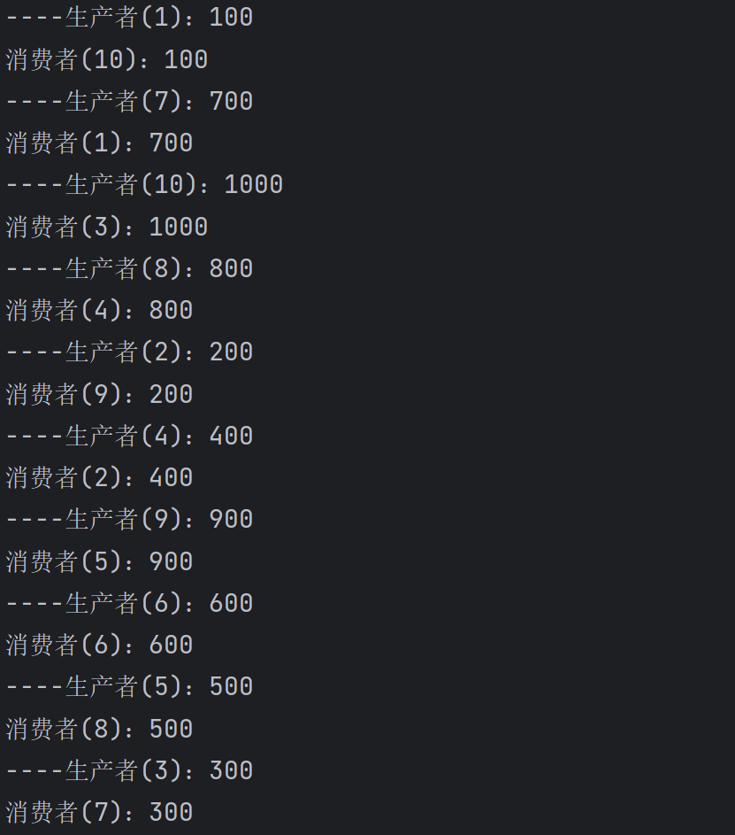

# 锁机制

我们前面反复强调，在 Go 语言并发编程中，倡导「使用通信共享内存，不要使用共享内存通信」，而这个通信的媒介就是我们前面花大量篇幅介绍的通道（Channel），通道是线程安全的，不需要考虑数据冲突问题，面对并发问题，我们始终应该优先考虑使用通道，它是 first class 级别的，但是纵使有主角光环加持，通道也不是万能的，它也需要配角，这也是共享内存存在的价值，其他语言中主流的并发编程都是通过共享内存实现的，共享内存必然涉及并发过程中的共享数据冲突问题，而为了解决数据冲突问题，Go 语言沿袭了传统的并发编程解决方案 —— 锁机制，这些锁都位于 [sync](https://golang.org/pkg/sync/) 包中。

我们在[通过共享内存实现并发通信](https://laravelacademy.org/post/19888.html)这篇教程中已经用到了 sync 包提供的 Mutex 锁，锁的作用都是为了解决并发情况下共享数据的原子操作和最终一致性问题，在系统介绍 sync 包提供的各种锁之前，我们先来聊聊什么情况下需要用到锁。

## 一. 竞态条件

一旦数据被多个线程共享，那么就很可能会产生争用和冲突的情况，这种情况也被称为**竞态条件**（race condition），这往往会破坏共享数据的一致性。举个例子，同时有多个线程连续向同一个缓冲区写入数据块，如果没有一个机制去协调这些线程的写入操作的话，那么被写入的数据块就很可能会出现错乱。比如，学院君的支付宝账户余额还有 500 元，代表银行自动转账的线程 A 正在向账户转入 3000 元本月工资，同时代表花呗自动扣费的线程 B 正在从账户余额扣除 2000 元还上个月的花呗账单。假设用 money 标识账户余额，那么初始值 money = 500，线程 A 的操作就等价于 money = money + 3000，线程 B 的操作就等价于 money = money - 2000，我们本来期望的结果是 money = 1500，但是现在线程 A 和线程 B 同时对 money 进行读取和写入，所以他们拿到的 money 都是 500，如果线程 A 后执行完毕，那么 money = 3500，如果线程 B 后执行完毕，那么 money = 0（扣除所有余额，花呗欠款1500），这就出现了和预期结果不一致的现象，我们说，这个操作破坏了数据的一致性。

在这种情况下，我们就需要采取一些措施来协调它们对共享数据的修改，这通常就会涉及到同步操作。一般来说，同步的用途有两个，一个是避免多个线程在同一时刻操作同一个数据块，另一个是协调多个线程避免它们在同一时刻执行同一个代码块。但是目的是一致的，那就是保证共享数据原子操作和一致性。

由于这样的数据块和代码块的背后都隐含着一种或多种资源（比如存储资源、计算资源、I/O 资源、网络资源等等），所以我们可以把它们看做是共享资源。我们所说的同步其实就是在控制多个线程对共享资源的访问：一个线程在想要访问某一个共享资源的时候，需要先申请对该资源的访问权限，并且只有在申请成功之后，访问才能真正开始；而当线程对共享资源的访问结束时，它还必须归还对该资源的访问权限，若要再次访问仍需申请。

你可以把这里所说的访问权限想象成一块令牌，线程一旦拿到了令牌，就可以进入指定的区域，从而访问到资源，而一旦线程要离开这个区域了，就需要把令牌还回去，绝不能把令牌带走。或者我们把共享资源看作是有锁的资源，当某个线程获取到共享资源的访问权限后，给资源上锁，这样，其他线程就不能访问它，直到该线程执行完毕，释放锁，这样其他线程才能通过竞争获取对资源的访问权限，依次类推。

这样一来，我们就可以保证多个并发运行的线程对这个共享资源的访问是完全串行的，只要一个代码片段需要实现对共享资源的串行化访问，就可以被视为一个**临界区**（critical section），也就是我刚刚说的，由于要访问到资源而必须进入的那个区域。

比如，在前面举的那个例子中，实现了账户余额写入操作的代码就组成了一个临界区。临界区总是需要通过同步机制进行保护的，否则就会产生竞态条件，导致数据不一致。

## 二. sync.Mutex

在 Go 语言中，可供我们选择的同步工具并不少。其中，最重要且最常用的同步工具当属**互斥量**（mutual exclusion，简称 mutex），sync 包中的 `Mutex` 就是与其对应的类型，该类型的值可以被称为**互斥锁**。一个互斥锁可以被用来保护一个临界区，我们可以通过它来保证在同一时刻只有一个 goroutine 处于该临界区之内，回到我们[通过共享内存实现并发通信](https://laravelacademy.org/post/19888.html)这篇教程中的示例：

```go
package main

import (
    "fmt"
    "runtime"
    "sync"
)

var counter int = 0

func add(a, b int, lock *sync.Mutex)  {
    c := a + b
    lock.Lock()
    counter++
    fmt.Printf("%d: %d + %d = %d\n", counter, a, b, c)
    lock.Unlock()
}

func main() {
    start := time.Now()
    lock := &sync.Mutex{}
    for i := 0; i < 10; i++ {
        go add(1, i, lock)
    }

    for {
        lock.Lock()
        c := counter
        lock.Unlock()
        runtime.Gosched()
        if c >= 10 {
            break
        }
    }
    end := time.Now()
    consume := end.Sub(start).Seconds()
    fmt.Println("程序执行耗时(s)：", consume)
}
```

每当有 goroutine 想进入临界区时，都需要先对它进行锁定，并且，每个 goroutine 离开临界区时，都要及时地对它进行解锁，锁定和解锁操作分别通过互斥锁 `sync.Mutex` 的 `Lock` 和 `Unlock` 方法实现。使用互斥锁的时候有以下注意事项：

- 不要重复锁定互斥锁；
- 不要忘记解锁互斥锁，必要时使用 `defer` 语句；
- 不要对尚未锁定或者已解锁的互斥锁解锁；
- 不要在多个函数之间直接传递互斥锁。

## 三. sync.RWMutex

Mutex 是最简单的一种锁类型，同时也比较暴力，当一个 goroutine 获得了 Mutex 后，其他 goroutine 就只能乖乖等到这个 goroutine 释放该 Mutex，不管是读操作还是写操作都会阻塞，但其实我们知道为了提升性能，读操作往往是不需要阻塞的，因此 sync 包提供了 RWMutex 类型，即读/写互斥锁，简称读写锁，类似于Java中的`ReentrantReadWriteLock`，这是一个是单写多读模型。

`sync.RWMutex` 分读锁和写锁，会对读操作和写操作区分对待，在读锁占用的情况下，会阻止写，但不阻止读，也就是多个 goroutine 可同时获取读锁，读锁调用 `RLock()` 方法开启，通过 `RUnlock` 方法释放；而写锁会阻止任何其他 goroutine（无论读和写）进来，整个锁相当于由该 goroutine 独占，和 Mutex 一样，写锁通过 `Lock` 方法启用，通过 `Unlock` 方法释放，从 RWMutex 的底层实现看实际上是组合了 Mutex：

```go
type RWMutex struct { 
    w Mutex 
    writerSem uint32 
    readerSem uint32 
    readerCount int32 
    readerWait int32 
}
```

同样，使用 RWMutex 时，任何一个 `Lock()` 或 `RLock()` 均需要保证有对应的 `Unlock()` 或 `RUnlock()` 调用与之对应，否则可能导致等待该锁的所有 goroutine 处于阻塞状态，甚至可能导致死锁，比如我们可以通过 RWMutex 重构上面示例代码的锁，效果完全一样：

```go
package main

import (
    "fmt"
    "runtime"
    "sync"
    "time"
)

var counter int = 0

func add(a, b int, lock *sync.RWMutex) {
    c := a + b
    lock.Lock()
    counter++
    fmt.Printf("%d: %d + %d = %d\n", counter, a, b, c)
    lock.Unlock()
}

func main() {
    start := time.Now()
    lock := &sync.RWMutex{}
    for i := 0; i < 10; i++ {
        go add(1, i, lock)
    }

    for {
        lock.RLock()
        c := counter
        lock.RUnlock()
        runtime.Gosched()
        if c >= 10 {
            break
        }
    }
    end := time.Now()
    consume := end.Sub(start).Seconds()
    fmt.Println("程序执行耗时(s)：", consume)
}
```

## 四. sync.Cond

[sync](https://golang.org/pkg/sync/) 包还提供了一个条件变量类型 `sync.Cond`，它可以和互斥锁或读写锁（以下统称互斥锁）组合使用，用来协调想要访问共享资源的线程。

不过，与互斥锁不同，条件变量 `sync.Cond` 的主要作用并不是保证在同一时刻仅有一个线程访问某一个共享资源，而是在对应的共享资源状态发生变化时，通知其它因此而阻塞的线程。条件变量总是和互斥锁组合使用，互斥锁为共享资源的访问提供互斥支持，而条件变量可以就共享资源的状态变化向相关线程发出通知，重在「协调」。

下面，我们来看看如何使用条件变量 `sync.Cond`。

`sync.Cond` 是一个结构体：

```go
type Cond struct {
  noCopy noCopy

  // L is held while observing or changing the condition
  L Locker

  notify  notifyList
  checker copyChecker
}
```

提供了三个方法：

```go
// 等待通知
func (c *Cond) Wait() {
  c.checker.check()
  t := runtime_notifyListAdd(&c.notify)
  c.L.Unlock()
  runtime_notifyListWait(&c.notify, t)
  c.L.Lock()  
}

// 单发通知
func (c *Cond) Signal() {
  c.checker.check()
  runtime_notifyListNotifyOne(&c.notify)  
}

// 广播通知
func (c *Cond) Broadcast() {
  c.checker.check()
  runtime_notifyListNotifyAll(&c.notify)  
}
```

我们可以通过 `sync.NewCond` 返回对应的条件变量实例，初始化的时候需要传入互斥锁，该互斥锁实例会赋值给 `sync.Cond` 的 `L` 属性：

```go
locker := &sync.Mutex{}
cond := sync.NewCond(locker)
```

`sync.Cond` 主要实现一个条件变量，假设 goroutine A 执行前需要等待另外一个 goroutine B 的通知，那么处于等待状态的 goroutine A 会保存在一个通知列表，也就是说需要某种变量状态的 goroutine A 将会等待（Wait）在那里，当某个时刻变量状态改变时，负责通知的 goroutine B 会通过对条件变量通知的方式（Broadcast/Signal）来通知处于等待条件变量的 goroutine A，这样就可以在共享内存中实现类似「消息通知」的同步机制。

下面来看一个具体的示例。假设我们有N个消费者线程和N个生产者线程，消费者线程必须依赖生成者线程对共享变量写入后，才可以从缓冲区中读取数据，这种场景正好可以通过条件变量来实现：

```go
func main(){
    lock := &sync.Mutex{}
	producerCond := sync.NewCond(lock)
	consumerCond := sync.NewCond(lock)

	// 静态条件
	tmp := -1

	// 生产者
	for i := 1; i <= 10; i++ {
		go func(i int) {
			lock.Lock()
			for tmp >= 0 {
				producerCond.Wait()
			}
			tmp = i * 100
			time.Sleep(1 * time.Second)
			fmt.Printf("生产者(%d)：%d\n", i, tmp)
			lock.Unlock()
			consumerCond.Broadcast()
		}(i)
	}

	// 消费者
	for i := 1; i <= 10; i++ {
		go func(i int) {
			lock.Lock()
			for tmp < 0 {
				consumerCond.Wait()
			}
			time.Sleep(1 * time.Second)
			fmt.Printf("消费者(%d)：%d\n", i, tmp)
			tmp = -1
			lock.Unlock()
			// 唤醒生产者协程
			producerCond.Broadcast()
		}(i)
	}

	time.Sleep(50 * time.Second)
}
```

这里我们使用了互斥锁，在消费者线程中，当缓冲区为负数的时候，我们认为负数是缓冲区为空，需要生产者生产后才能继续消费，此时通过 `consumerCond.Wait()` 阻塞消费者线程；在生成者线程中，如果缓冲区为负数，则代表需要生产，则会在生产完成后，调用 `consumerCond.Broadcast()` 唤醒所有的消费者线程，去消费缓冲区中的值。

执行上述示例代码，结果如下：



可以看到，通过互斥锁+条件变量，我们可以非常方便的实现多个 Go 协程之间的通信，但是这个还是比不上 channel，因为 channel 还可以实现数据传递，条件变量只是发送信号，唤醒被阻塞的协程继续执行，另外 channel 还有超时机制，不会出现协程等不到信号一直阻塞造成内存堆积问题，换句话说，channel 可以让程序更可控。

