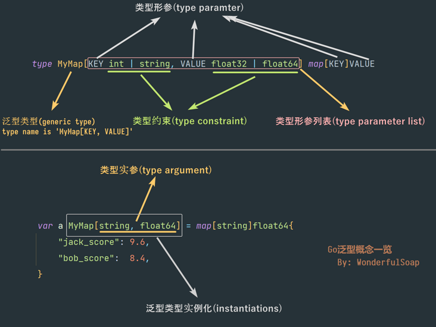

# 泛型

> 2022年3月15日，Go语言争议非常大但同时也备受期待的泛型伴随着Go1.18发布了。

## 一. 类型形参、类型实参、类型约束和泛型类型

观察下面这个简单的例子：

```go
type IntSlice []int

var a IntSlice = []int{1, 2, 3} // 正确
var b IntSlice = []float32{1.0, 2.0, 3.0} // ✗ 错误，因为IntSlice的底层类型是[]int，浮点类型的切片无法赋值
```

这里定义了一个新的类型 `IntSlice` ，它的底层类型是 `[]int` ，理所当然只有int类型的切片能赋值给 `IntSlice` 类型的变量。

接下来如果我们想要定义一个可以容纳 `float32` 或 `string` 等其他类型的切片的话该怎么办？很简单，给每种类型都定义个新类型：

```go
type StringSlice []string
type Float32Slie []float32
type Float64Slice []float64
```

但是这样做的问题显而易见，它们结构都是一样的只是成员类型不同就需要重新定义这么多新类型。那么有没有一个办法能只定义一个类型就能代表上面这所有的类型呢？答案是可以的，这时候就需要用到泛型了：

```go
type Slice[T int|float32|float64 ] []T
```

不同于一般的类型定义，这里类型名称 `Slice` 后带了中括号，对各个部分做一个解说就是：

- `T` 就是上面介绍过的**类型形参(Type parameter)**，在定义Slice类型的时候 T 代表的具体类型并不确定，类似一个占位符
- `int|float32|float64` 这部分被称为**类型约束(Type constraint)**，中间的 `|` 的意思是告诉编译器，类型形参 T 只可以接收 int 或 float32 或 float64 这三种类型的实参
- 中括号里的 `T int|float32|float64` 这一整串因为定义了所有的类型形参(在这个例子里只有一个类型形参T），所以我们称其为 **类型形参列表(type parameter list)**
- 这里新定义的类型名称叫 `Slice[T]`

这种类型定义的方式中带了类型形参，很明显和普通的类型定义非常不一样，所以我们将这种类型定义中带 **类型形参** **的类型，称之为** 泛型类型(Generic type)。

泛型类型不能直接拿来使用，必须传入**类型实参(Type argument)** 将其确定为具体的类型之后才可使用。而传入类型实参确定具体类型的操作被称为 **实例化(Instantiations)** ：

```go
// 这里传入了类型实参int，泛型类型Slice[T]被实例化为具体的类型 Slice[int]
var a Slice[int] = []int{1, 2, 3}  
fmt.Printf("Type Name: %T",a)  //输出：Type Name: Slice[int]

// 传入类型实参float32, 将泛型类型Slice[T]实例化为具体的类型 Slice[string]
var b Slice[float32] = []float32{1.0, 2.0, 3.0} 
fmt.Printf("Type Name: %T",b)  //输出：Type Name: Slice[float32]

// ✗ 错误。因为变量a的类型为Slice[int]，b的类型为Slice[float32]，两者类型不同
a = b  

// ✗ 错误。string不在类型约束 int|float32|float64 中，不能用来实例化泛型类型
var c Slice[string] = []string{"Hello", "World"} 

// ✗ 错误。Slice[T]是泛型类型，不可直接使用必须实例化为具体的类型
var x Slice[T] = []int{1, 2, 3} 
```

对于上面的例子，我们先给泛型类型 `Slice[T]` 传入了类型实参 `int` ，这样泛型类型就被实例化为了具体类型 `Slice[int]` ，被实例化之后的类型定义可近似视为如下：

```go
type Slice[int] []int     // 定义了一个普通的类型 Slice[int] ，它的底层类型是 []int
```

我们用实例化后的类型 `Slice[int]` 定义了一个新的变量 `a` ，这个变量可以存储int类型的切片。之后我们还用同样的方法实例化出了另一个类型 `Slice[float32]` ，并创建了变量 `b` 。

因为变量 a 和 b 就是具体的不同类型了(一个 Slice[int] ，一个 Slice[float32]），所以 `a = b` 这样不同类型之间的变量赋值是不允许的。

同时，因为 Slice[T] 的类型约束限定了只能使用 int 或 float32 或 float64 来实例化自己，所以 `Slice[string]` 这样使用 string 类型来实例化是错误的。

上面只是个最简单的例子，实际上类型形参的数量可以远远不止一个，如下：

```go
// MyMap类型定义了两个类型形参 KEY 和 VALUE。分别为两个形参指定了不同的类型约束
// 这个泛型类型的名字叫： MyMap[KEY, VALUE]
type MyMap[KEY int | string, VALUE float32 | float64] map[KEY]VALUE  

// 用类型实参 string 和 flaot64 替换了类型形参 KEY 、 VALUE，泛型类型被实例化为具体的类型：MyMap[string, float64]
var a MyMap[string, float64] = map[string]float64{
    "jack_score": 9.6,
    "bob_score":  8.4,
}
```

用上面的例子重新复习下各种概念的话：

- KEY和VALUE是**类型形参**
- `int|string` 是KEY的**类型约束**， `float32|float64` 是VALUE的**类型约束**
- `KEY int|string, VALUE float32|float64` 整个一串文本因为定义了所有形参所以被称为**类型形参列表**
- Map[KEY, VALUE] 是**泛型类型**，类型的名字就叫 Map[KEY, VALUE]
- `var a MyMap[string, float64] = xx` 中的string和float64是**类型实参**，用于分别替换KEY和VALUE，**实例化**出了具体的类型 `MyMap[string, float64]`

还有点头晕？没事，的确一下子有太多概念了，这里用一张图就能简单说清楚：



### 1.1 其它的泛型类型

所有类型定义都可使用类型形参，所以下面这种结构体以及接口的定义也可以使用类型形参：

```go
// 一个泛型类型的结构体。可用 int 或 sring 类型实例化
type MyStruct[T int | string] struct {  
    Name string
    Data T
}

// 一个泛型接口(关于泛型接口在后半部分会详细讲解）
type IPrintData[T int | float32 | string] interface {
    Print(data T)
}

// 一个泛型通道，可用类型实参 int 或 string 实例化
type MyChan[T int | string] chan T
```

### 1.2 类型形参的互相套用

类型形参是可以互相套用的，如下:

```go
type WowStruct[T int | float32, S []T] struct {
    Data     S
    MaxValue T
    MinValue T
}
```

这个例子看起来有点复杂且难以理解，但实际上只要记住一点：任何泛型类型都必须传入类型实参实例化才可以使用。所以我们这就尝试传入类型实参看看：

```go
var ws WowStruct[int, []int]
// 泛型类型 WowStuct[T, S] 被实例化后的类型名称就叫 WowStruct[int, []int]
```

上面的代码中，我们为T传入了实参 `int`，然后因为 S 的定义是 `[]T` ，所以 S 的实参自然是 `[]int` 。经过实例化之后 WowStruct[T,S] 的定义类似如下：

```go
// 一个存储int类型切片，以及切片中最大、最小值的结构体
type WowStruct[int, []int] struct {
    Data     []int
    MaxValue int
    MinValue int
}
```

因为 S 的定义是 []T ，所以 T 一定决定了的话 S 的实参就不能随便乱传了，下面这样的代码是错误的：

```go
// 错误。S的定义是[]T，这里T传入了实参int, 所以S的实参应当为 []int 而不能是 []float32
ws := WowStruct[int, []float32]{
        Data:     []float32{1.0, 2.0, 3.0},
        MaxValue: 3,
        MinValue: 1,
    }

```

### 1.3 几种语法错误

1. 定义泛型类型的时候，**基础类型不能只有类型形参**，如下：

   ```go
   // 错误，类型形参不能单独使用
   type CommonType[T int|string|float32] T
   ```

2. 当类型约束的一些写法会被编译器误认为是表达式时会报错。如下：

   ```go
   //✗ 错误。T *int会被编译器误认为是表达式 T乘以int，而不是int指针
   type NewType[T *int] []T
   // 上面代码再编译器眼中：它认为你要定义一个存放切片的数组，数组长度由 T 乘以 int 计算得到
   type NewType [T * int][]T 
   
   //✗ 错误。和上面一样，这里不光*被会认为是乘号，| 还会被认为是按位或操作
   type NewType2[T *int|*float64] []T 
   
   //✗ 错误
   type NewType2 [T (int)] []T 
   ```

   为了避免这种误解，解决办法就是给类型约束包上 `interface{}` 或加上逗号消除歧义（关于接口具体的用法会在后半篇提及）

   ```go
   type NewType[T interface{*int}] []T
   type NewType2[T interface{*int|*float64}] []T 
   
   // 如果类型约束中只有一个类型，可以添加个逗号消除歧义
   type NewType3[T *int,] []T
   
   //✗ 错误。如果类型约束不止一个类型，加逗号是不行的
   type NewType4[T *int|*float32,] []T 
   ```

### 1.4 特殊的泛型类型

这里讨论种比较特殊的泛型类型，如下：

```go
type Wow[T int | string] int

var a Wow[int] = 123     // 编译正确
var b Wow[string] = 123  // 编译正确
var c Wow[string] = "hello" // 编译错误，因为"hello"不能赋值给底层类型int
```

这里虽然使用了类型形参，但因为类型定义是 `type Wow[T int|string] int` ，所以无论传入什么类型实参，实例化后的新类型的底层类型都是 int 。所以int类型的数字123可以赋值给变量a和b，但string类型的字符串 “hello” 不能赋值给c

这个例子没有什么具体意义，但是可以让我们理解泛型类型的实例化的机制

### 1.5 泛型类型的套娃

泛型和普通的类型一样，可以互相嵌套定义出更加复杂的新类型，如下：

````go
// 先定义个泛型类型 Slice[T]
type Slice[T int|string|float32|float64] []T

// ✗ 错误。泛型类型Slice[T]的类型约束中不包含uint, uint8
type UintSlice[T uint|uint8] Slice[T]  

// ✓ 正确。基于泛型类型Slice[T]定义了新的泛型类型 FloatSlice[T] 。FloatSlice[T]只接受float32和float64两种类型
type FloatSlice[T float32|float64] Slice[T] 

// ✓ 正确。基于泛型类型Slice[T]定义的新泛型类型 IntAndStringSlice[T]
type IntAndStringSlice[T int|string] Slice[T]  
// ✓ 正确 基于IntAndStringSlice[T]套娃定义出的新泛型类型
type IntSlice[T int] IntAndStringSlice[T] 

// 在map中套一个泛型类型Slice[T]
type WowMap[T int|string] map[string]Slice[T]
// 在map中套Slice[T]的另一种写法
type WowMap2[T Slice[int] | Slice[string]] map[string]T
````

### 1.6 类型约束的两种选择

观察下面两种类型约束的写法

```go
type WowStruct[T int|string] struct {
    Name string
    Data []T
}

type WowStruct2[T []int|[]string] struct {
    Name string
    Data T
}
```

仅限于这个例子，这两种写法和实现的功能其实是差不多的，实例化之后结构体相同。但是像下面这种情况的时候，我们使用前一种写法会更好：

```go
type WowStruct3[T int | string] struct {
    Data     []T
    MaxValue T
    MinValue T
}
```

### 1.7 匿名结构体不支持泛型

我们有时候会经常用到匿名的结构体，并在定义好匿名结构体之后直接初始化：

```go
testCase := struct {
        caseName string
        got      int
        want     int
    }{
        caseName: "test OK",
        got:      100,
        want:     100,
    }
```

那么匿名结构体能不能使用泛型呢？答案是不能，下面的用法是错误的：

```go
testCase := struct[T int|string] {
        caseName string
        got      T
        want     T
    }[int]{
        caseName: "test OK",
        got:      100,
        want:     100,
    }
```

所以在使用泛型的时候我们只能放弃使用匿名结构体，对于很多场景来说这会造成麻烦（最主要麻烦集中在单元测试的时候，为泛型做单元测试会非常麻烦，这点我之后的文章将会详细阐述）

## 二. 泛型receiver

看了上的例子，你一定会说，介绍了这么多复杂的概念，但好像泛型类型根本没什么用处啊？

是的，单纯的泛型类型实际上对开发来说用处并不大。但是如果将泛型类型和接下来要介绍的泛型receiver相结合的话，泛型就有了非常大的实用性了

我们知道，定义了新的普通类型之后可以给类型添加方法。那么可以给泛型类型添加方法吗？答案自然是可以的，如下：

```go
type MySlice[T int | float32] []T

func (s MySlice[T]) Sum() T {
    var sum T
    for _, value := range s {
        sum += value
    }
    return sum
}
```

这个例子为泛型类型 `MySlice[T]` 添加了一个计算成员总和的方法 `Sum()` 。注意观察这个方法的定义：

- 首先看receiver `(s MySlice[T])` ，所以我们直接把类型名称 `MySlice[T]` 写入了receiver中
- 然后方法的返回参数我们使用了类型形参 T (实际上如果有需要的话，方法的接收参数也可以实用类型形参)
- 在方法的定义中，我们也可以使用类型形参 T （在这个例子里，我们通过 `var sum T` 定义了一个新的变量 `sum` )

对于这个泛型类型 `MySlice[T]` 我们该如何使用？还记不记得之前强调过很多次的，泛型类型无论如何都需要先用类型实参实例化，所以用法如下：

```go
var s MySlice[int] = []int{1, 2, 3, 4}
fmt.Println(s.Sum()) // 输出：10

var s2 MySlice[float32] = []float32{1.0, 2.0, 3.0, 4.0}
fmt.Println(s2.Sum()) // 输出：10.0
```

该如何理解上面的实例化？首先我们用类型实参 int 实例化了泛型类型 `MySlice[T]`，所以泛型类型定义中的所有 T 都被替换为 int，最终我们可以把代码看作下面这样：

```go
type MySlice[int] []int // 实例化后的类型名叫 MyIntSlice[int]

// 方法中所有类型形参 T 都被替换为类型实参 int
func (s MySlice[int]) Sum() int {
    var sum int 
    for _, value := range s {
        sum += value
    }
    return sum
}
```

用 float32 实例化和用 int 实例化同理，此处不再赘述。

通过泛型receiver，泛型的实用性一下子得到了巨大的扩展。在没有泛型之前如果想实现通用的数据结构，诸如：堆、栈、队列、链表之类的话，我们的选择只有两个：

- 为每种类型写一个实现
- 使用 接口+反射

而有了泛型之后，我们就能非常简单地创建通用数据结构了。接下来用一个更加实用的例子 —— 队列 来讲解

### 2.1 基于泛型的队列

队列是一种先入先出的数据结构，它和现实中排队一样，数据只能从队尾放入、从队首取出，先放入的数据优先被取出来

```go
// 这里类型约束使用了空接口，代表的意思是所有类型都可以用来实例化泛型类型 Queue[T] (关于接口在后半部分会详细介绍）
type Queue[T interface{}] struct {
    elements []T
}

// 将数据放入队列尾部
func (q *Queue[T]) Put(value T) {
    q.elements = append(q.elements, value)
}

// 从队列头部取出并从头部删除对应数据
func (q *Queue[T]) Pop() (T, bool) {
    var value T
    if len(q.elements) == 0 {
        return value, true
    }

    value = q.elements[0]
    q.elements = q.elements[1:]
    return value, len(q.elements) == 0
}

// 队列大小
func (q Queue[T]) Size() int {
    return len(q.elements)
}
```

>  为了方便说明，上面是队列非常简单的一种实现方法，没有考虑线程安全等很多问题

`Queue[T]` 因为是泛型类型，所以要使用的话必须实例化，实例化与使用方法如下所示：

```go
var q1 Queue[int]  // 可存放int类型数据的队列
q1.Put(1)
q1.Put(2)
q1.Put(3)
q1.Pop() // 1
q1.Pop() // 2
q1.Pop() // 3

var q2 Queue[string]  // 可存放string类型数据的队列
q2.Put("A")
q2.Put("B")
q2.Put("C")
q2.Pop() // "A"
q2.Pop() // "B"
q2.Pop() // "C"

var q3 Queue[struct{Name string}] 
var q4 Queue[[]int] // 可存放[]int切片的队列
var q5 Queue[chan int] // 可存放int通道的队列
var q6 Queue[io.Reader] // 可存放接口的队列
// ......
```

### 2.2 动态判断变量的类型

使用接口的时候经常会用到类型断言或 type switch 来确定接口具体的类型，然后对不同类型做出不同的处理，如：

```go
var i interface{} = 123
i.(int) // 类型断言

// type switch
switch i.(type) {
    case int:
        // do something
    case string:
        // do something
    default:
        // do something
    }
}
```

那么你一定会想到，对于 `valut T` 这样通过类型形参定义的变量，我们能不能判断具体类型然后对不同类型做出不同处理呢？答案是不允许的，如下：

```go
func (q *Queue[T]) Put(value T) {
    value.(int) // 错误。泛型类型定义的变量不能使用类型断言

    // 错误。不允许使用type switch 来判断 value 的具体类型
    switch value.(type) {
    case int:
        // do something
    case string:
        // do something
    default:
        // do something
    }
    
    // ...
}
```

虽然type switch和类型断言不能用，但我们可通过反射机制达到目的：

```go
func (receiver Queue[T]) Put(value T) {
    // Printf() 可输出变量value的类型(底层就是通过反射实现的)
    fmt.Printf("%T", value) 

    // 通过反射可以动态获得变量value的类型从而分情况处理
    v := reflect.ValueOf(value)

    switch v.Kind() {
    case reflect.Int:
        // do something
    case reflect.String:
        // do something
    }

    // ...
}
```

这看起来达到了我们的目的，可是当你写出上面这样的代码时候就出现了一个问题：

> 你为了避免使用反射而选择了泛型，结果到头来又为了一些功能在在泛型中使用反射

当出现这种情况的时候你可能需要重新思考一下，自己的需求是不是真的需要用泛型（毕竟泛型机制本身就很复杂了，再加上反射的复杂度，增加的复杂度并不一定值得）

当然，这一切选择权都在你自己的手里，根据具体情况斟酌

## 三. 泛型函数

在介绍完泛型类型和泛型receiver之后，我们来介绍最后一个可以使用泛型的地方——泛型函数。有了上面的知识，写泛型函数也十分简单。假设我们想要写一个计算两个数之和的函数：

```go
func Add(a int, b int) int {
    return a + b
}
```

这个函数理所当然只能计算int的和，而浮点的计算是不支持的。这时候我们可以像下面这样定义一个泛型函数：

```go
func Add[T int | float32 | float64](a T, b T) T {
    return a + b
}
```

上面就是泛型函数的定义。

> 这种带类型形参的函数被称为**泛型函数**

它和普通函数的点不同在于函数名之后带了类型形参。这里的类型形参的意义、写法和用法因为与泛型类型是一模一样的，就不再赘述了。

和泛型类型一样，泛型函数也是不能直接调用的，要使用泛型函数的话必须传入类型实参之后才能调用。

```go
Add[int](1,2) // 传入类型实参int，计算结果为 3
Add[float32](1.0, 2.0) // 传入类型实参float32, 计算结果为 3.0

Add[string]("hello", "world") // 错误。因为泛型函数Add的类型约束中并不包含string
```

或许你会觉得这样每次都要手动指定类型实参太不方便了。所以Go还支持类型实参的自动推导：

```go
Add(1, 2)  // 1，2是int类型，编译请自动推导出类型实参T是int
Add(1.0, 2.0) // 1.0, 2.0 是浮点，编译请自动推导出类型实参T是float32
```

自动推导的写法就好像免去了传入实参的步骤一样，但请记住这仅仅只是编译器帮我们推导出了类型实参，实际上传入实参步骤还是发生了的。

### 3.1 匿名函数不支持泛型

在Go中我们经常会使用匿名函数，如：

```go
fn := func(a, b int) int {
    return a + b 
}  // 定义了一个匿名函数并赋值给 fn 

fmt.Println(fn(1, 2)) // 输出: 3
```

那么Go支不支持匿名泛型函数呢？答案是不能——**匿名函数不能自己定义类型形参：**

```go
// 错误，匿名函数不能自己定义类型实参
fnGeneric := func[T int | float32](a, b T) T {
        return a + b
} 

fmt.Println(fnGeneric(1, 2))
```

但是匿名函数可以使用别处定义好的类型实参，如：

```go
func MyFunc[T int | float32 | float64](a, b T) {

    // 匿名函数可使用已经定义好的类型形参
    fn2 := func(i T, j T) T {
        return i*2 - j*2
    }

    fn2(a, b)
}
```

### 3.2 既然支持泛型函数，那么泛型方法呢

既然函数都支持泛型了，那你应该自然会想到，方法支不支持泛型？很不幸，目前Go的方法并不支持泛型，如下：

```go
type A struct {
}

// 不支持泛型方法
func (receiver A) Add[T int | float32 | float64](a T, b T) T {
    return a + b
}
```

但是因为receiver支持泛型， 所以如果想在方法中使用泛型的话，目前唯一的办法就是曲线救国，迂回地通过receiver使用类型形参：

```go
type A[T int | float32 | float64] struct {
}

// 方法可以使用类型定义中的形参 T 
func (receiver A[T]) Add(a T, b T) T {
    return a + b
}

// 用法：
var a A[int]
a.Add(1, 2)

var aa A[float32]
aa.Add(1.0, 2.0)
```

## 四. 变得复杂的接口

有时候使用泛型编程时，我们会书写长长的类型约束，如下：

```go
// 一个可以容纳所有int,uint以及浮点类型的泛型切片
type Slice[T int | int8 | int16 | int32 | int64 | uint | uint8 | uint16 | uint32 | uint64 | float32 | float64] []T
```

理所当然，这种写法是我们无法忍受也难以维护的，而Go支持将类型约束单独拿出来定义到接口中，从而让代码更容易维护：

```go
type IntUintFloat interface {
    int | int8 | int16 | int32 | int64 | uint | uint8 | uint16 | uint32 | uint64 | float32 | float64
}

type Slice[T IntUintFloat] []T
```

这段代码把类型约束给单独拿出来，写入了接口类型 `IntUintFloat` 当中。需要指定类型约束的时候直接使用接口 `IntUintFloat` 即可。

不过这样的代码依旧不好维护，而接口和接口、接口和普通类型之间也是可以通过 `|` 进行组合：

```go
type Int interface {
    int | int8 | int16 | int32 | int64
}

type Uint interface {
    uint | uint8 | uint16 | uint32
}

type Float interface {
    float32 | float64
}

type Slice[T Int | Uint | Float] []T  // 使用 '|' 将多个接口类型组合
```

上面的代码中，我们分别定义了 Int, Uint, Float 三个接口类型，并最终在 Slice[T] 的类型约束中通过使用 `|` 将它们组合到一起。

同时，在接口里也能直接组合其他接口，所以还可以像下面这样：

```go
type SliceElement interface {
    Int | Uint | Float | string // 组合了三个接口类型并额外增加了一个 string 类型
}

type Slice[T SliceElement] []T 
```

### 4.1 "`~`"指定底层类型

上面定义的 Slie[T] 虽然可以达到目的，但是有一个缺点：

```go
var s1 Slice[int] // 正确 

type MyInt int
var s2 Slice[MyInt] // ✗ 错误。MyInt类型底层类型是int但并不是int类型，不符合 Slice[T] 的类型约束
```

这里发生错误的原因是，泛型类型 Slice[T] 允许的是 int 作为类型实参，而不是 MyInt （虽然 MyInt 类型底层类型是 int ，但它依旧不是 int 类型）。

为了从根本上解决这个问题，Go新增了一个符号 `~` ，在类型约束中使用类似 `~int` 这种写法的话，就代表着不光是 int ，所有以 int 为底层类型的类型也都可用于实例化。

使用 ~ 对代码进行改写之后如下：

```go
type Int interface {
    ~int | ~int8 | ~int16 | ~int32 | ~int64
}

type Uint interface {
    ~uint | ~uint8 | ~uint16 | ~uint32
}
type Float interface {
    ~float32 | ~float64
}

type Slice[T Int | Uint | Float] []T 

var s Slice[int] // 正确

type MyInt int
var s2 Slice[MyInt]  // MyInt底层类型是int，所以可以用于实例化

type MyMyInt MyInt
var s3 Slice[MyMyInt]  // 正确。MyMyInt 虽然基于 MyInt ，但底层类型也是int，所以也能用于实例化

type MyFloat32 float32  // 正确
var s4 Slice[MyFloat32]
```

**限制**：使用 `~` 时有一定的限制：

1. ~后面的类型不能为接口
2. ~后面的类型必须为基本类型

```go
type MyInt int

type _ interface {
    ~[]byte  // 正确
    ~MyInt   // 错误，~后的类型必须为基本类型
    ~error   // 错误，~后的类型不能为接口
}
```

### 4.2 从方法集(Method set)到类型集(Type set)

上面的例子中，我们学习到了一种接口的全新写法，而这种写法在Go1.18之前是不存在的。如果你比较敏锐的话，一定会隐约认识到这种写法的改变这也一定意味着Go语言中 `接口(interface)` 这个概念发生了非常大的变化。

是的，在Go1.18之前，Go官方对 `接口(interface)` 的定义是：接口是一个方法集(method set)

> An interface type specifies a **method set** called its interface

就如下面这个代码一样， `ReadWriter` 接口定义了一个接口(方法集)，这个集合中包含了 `Read()` 和 `Write()` 这两个方法。所有同时定义了这两种方法的类型被视为实现了这一接口。

```go
type ReadWriter interface {
    Read(p []byte) (n int, err error)
    Write(p []byte) (n int, err error)
}
```

但是，我们如果换一个角度来重新思考上面这个接口的话，会发现接口的定义实际上还能这样理解：

> 我们可以把 `ReaderWriter` 接口看成代表了一个 **类型的集合**，所有实现了 `Read()` `Writer()` 这两个方法的类型都在接口代表的类型集合当中

通过换个角度看待接口，在我们眼中接口的定义就从 **`方法集(method set)`** 变为了 **`类型集(type set)`**。而 Go 1.18 开始就是依据这一点将接口的定义正式更改为了 **类型集(Type set)**

> An interface type defines a ***type set\*** *(一个*接口类型定义了一个类型集)

你或许会觉得，这不就是改了下概念上的定义实际上没什么用吗？是的，如果接口功能没变化的话确实如此。但是还记得下面这种用接口来简化类型约束的写法吗：

```go
type Float interface {
    ~float32 | ~float64
}

type Slice[T Float] []T 
```

这就体现出了为什么要更改接口的定义了。用 **类型集** 的概念重新理解上面的代码的话就是：

> 接口类型 Float 代表了一个 **类型集合**， 所有以 float32 **或** float64 为底层类型的类型，都在这一类型集之中

而 `type Slice[T Float] []T` 中， **类型约束** 的真正意思是：

> **类型约束** 指定了类型形参可接受的类型集合，只有属于这个集合中的类型才能替换形参用于实例化

如：

```go
var s Slice[int]      // int 属于类型集 Float ，所以int可以作为类型实参
var s Slice[chan int] // chan int 类型不在类型集 Float 中，所以错误
```

#### 4.2.1 接口实现(implement)定义的变化

既然接口定义发生了变化，那么从 Go 1.18 开始 `接口实现(implement)` 的定义自然也发生了变化：

当满足以下条件时，我们可以说 **类型 T 实现了接口 I ( type T implements interface I)**：

- T 不是接口时：类型 T 是接口 I 代表的类型集中的一个成员 (T is an element of the type set of I)
- T 是接口时： T 接口代表的类型集是 I 代表的类型集的子集(Type set of T is a subset of the type set of I)

#### 4.2.2 类型的并集

并集我们已经很熟悉了，之前一直使用的 `|` 符号就是求类型的并集( `union` )

```go
type Uint interface {  // 类型集 Uint 是 ~uint 和 ~uint8 等类型的并集
    ~uint | ~uint8 | ~uint16 | ~uint32 | ~uint64
}
```

#### 4.2.3 类型的交集

接口可以不止书写一行，如果一个接口有多行类型定义，那么取它们之间的 **交集**

```go
type AllInt interface {
    ~int | ~int8 | ~int16 | ~int32 | ~int64 | ~uint | ~uint8 | ~uint16 | ~uint32 | ~uint32
}

type Uint interface {
    ~uint | ~uint8 | ~uint16 | ~uint32 | ~uint64
}

type A interface { // 接口A代表的类型集是 AllInt 和 Uint 的交集
    AllInt
    Uint
}

type B interface { // 接口B代表的类型集是 AllInt 和 ~int 的交集
    AllInt
    ~int
}
```

上面这个例子中

- 接口 A 代表的是 AllInt 与 Uint 的 **交集**，即 `~uint | ~uint8 | ~uint16 | ~uint32 | ~uint64`
- 接口 B 代表的则是 AllInt 和 ~int 的**交集**，即 `~int`

除了上面的交集，下面也是一种交集：

```go
type C interface {
    ~int
    int
}
```

很显然，~int 和 int 的交集只有int一种类型，所以接口C代表的类型集中只有int一种类型

#### 4.2.4 空集

当多个类型的交集如下面 `Bad` 这样为空的时候， `Bad` 这个接口代表的类型集为一个**空集**：

```go
type Bad interface {
    int
    float32 
} // 类型 int 和 float32 没有相交的类型，所以接口 Bad 代表的类型集为空
```

**没有任何一种类型属于空集**。虽然 Bad 这样的写法是可以编译的，但实际上并没有什么意义

#### 4.2.5 空接口

上面说了空集，接下来说一个特殊的类型集——`空接口 interface{}` 。因为，Go 1.18 开始接口的定义发生了改变，所以 `interface{}` 的定义也发生了一些变更：

> 空接口代表了所有类型的集合

所以，对于 Go 1.18 之后的空接口应该这样理解：

1. 虽然空接口内没有写入任何的类型，但它代表的是所有类型的集合，而非一个 **空集**
2. 类型约束中指定 **空接口** 的意思是指定了一个包含所有类型的类型集，并不是类型约束限定了只能使用 **空接口** 来做类型形参

```go
// 空接口代表所有类型的集合。写入类型约束意味着所有类型都可拿来做类型实参
type Slice[T interface{}] []T

var s1 Slice[int]    // 正确
var s2 Slice[map[string]string]  // 正确
var s3 Slice[chan int]  // 正确
var s4 Slice[interface{}]  // 正确
```

因为空接口是一个包含了所有类型的类型集，所以我们经常会用到它。于是，Go1.18开始提供了一个和空接口 `interface{}` 等价的新关键词 `any` ，用来使代码更简单：

```go
type Slice[T any] []T // 代码等价于 type Slice[T interface{}] []T
```

实际上 `any` 的定义就位于Go语言的 `builtin.go` 文件中（参考如下）， `any` 实际上就是 `interaface{}` 的别名(alias)，两者完全等价

```go
// any is an alias for interface{} and is equivalent to interface{} in all ways.
type any = interface{} 
```

所以从 Go 1.18 开始，所有可以用到空接口的地方其实都可以直接替换为any，如：

```go
var s []any // 等价于 var s []interface{}
var m map[string]any // 等价于 var m map[string]interface{}

func MyPrint(value any){
    fmt.Println(value)
}
```

如果你高兴的话，项目迁移到 Go1.18 之后可以使用下面这行命令直接把整个项目中的空接口全都替换成 any。当然因为并不强制，所以到底是用 `interface{}` 还是 `any` 全看自己喜好

```go
gofmt -w -r 'interface{} -> any' ./...
```

#### 4.2.6 comparable(可比较) 和 可排序(ordered)

对于一些数据类型，我们需要在类型约束中限制只接受能 `!=` 和 `==` 对比的类型，如map：

```go
// 错误。因为 map 中键的类型必须是可进行 != 和 == 比较的类型
type MyMap[KEY any, VALUE any] map[KEY]VALUE 
```

所以Go直接内置了一个叫 `comparable` 的接口，它代表了所有可用 `!=` 以及 `==` 对比的类型：

```go
type MyMap[KEY comparable, VALUE any] map[KEY]VALUE // 正确
```

`comparable` 比较容易引起误解的一点是很多人容易把他与可排序搞混淆。可比较指的是 可以执行 `!=` `==` 操作的类型，并没确保这个类型可以执行大小比较（ `>,<,<=,>=` ）。如下：

```go
type OhMyStruct struct {
    a int
}

var a, b OhMyStruct

a == b // 正确。结构体可使用 == 进行比较
a != b // 正确

a > b // 错误。结构体不可比大小
```

而可进行大小比较的类型被称为 `Orderd` 。目前Go语言并没有像 `comparable` 这样直接内置对应的关键词，所以想要的话需要自己来定义相关接口，比如我们可以参考Go官方包`golang.org/x/exp/constraints` 如何定义：

```go
// Ordered 代表所有可比大小排序的类型
type Ordered interface {
    Integer | Float | ~string
}

type Integer interface {
    Signed | Unsigned
}

type Signed interface {
    ~int | ~int8 | ~int16 | ~int32 | ~int64
}

type Unsigned interface {
    ~uint | ~uint8 | ~uint16 | ~uint32 | ~uint64 | ~uintptr
}

type Float interface {
    ~float32 | ~float64
}
```

### 4.3 接口两种类型

我们接下来再观察一个例子，这个例子是阐述接口是类型集最好的例子：

```go
type ReadWriter interface {
    ~string | ~[]rune

    Read(p []byte) (n int, err error)
    Write(p []byte) (n int, err error)
}
```

最开始看到这一例子你一定有点懵不太理解它代表的意思，但是没关系，我们用类型集的概念就能比较轻松理解这个接口的意思：

> 接口类型 ReadWriter 代表了一个类型集合，所有以 string 或 []rune 为底层类型，并且实现了 Read() Write() 这两个方法的类型都在 ReadWriter 代表的类型集当中

如下面代码中，StringReadWriter 存在于接口 ReadWriter 代表的类型集中，而 BytesReadWriter 因为底层类型是 []byte（既不是string也是不[]rune） ，所以它不属于 ReadWriter 代表的类型集

```go
// 类型 StringReadWriter 实现了接口 Readwriter
type StringReadWriter string 

func (s StringReadWriter) Read(p []byte) (n int, err error) {
    // ...
}

func (s StringReadWriter) Write(p []byte) (n int, err error) {
 // ...
}

//  类型BytesReadWriter 没有实现接口 Readwriter
type BytesReadWriter []byte 

func (s BytesReadWriter) Read(p []byte) (n int, err error) {
 ...
}

func (s BytesReadWriter) Write(p []byte) (n int, err error) {
 ...
}
```

你一定会说，啊等等，这接口也变得太复杂了把，那我定义一个 `ReadWriter` 类型的接口变量，然后接口变量赋值的时候不光要考虑到方法的实现，还必须考虑到具体底层类型？心智负担也太大了吧。是的，为了解决这个问题也为了保持Go语言的兼容性，Go1.18开始将接口分为了两种类型

- **基本接口(Basic interface)**
- **一般接口(General interface)**

#### 4.3.1 基本接口

接口定义中如果只有方法的话，那么这种接口被称为**基本接口(Basic interface)**。这种接口就是Go1.18之前的接口，用法也基本和Go1.18之前保持一致。基本接口大致可以用于如下几个地方：

- 最常用的，定义接口变量并赋值

```go
type MyError interface { // 接口中只有方法，所以是基本接口
    Error() string
}

// 用法和 Go1.18之前保持一致
var err MyError = fmt.Errorf("hello world")
```

- 基本接口因为也代表了一个类型集，所以也可用在类型约束中

```go
// io.Reader 和 io.Writer 都是基本接口，也可以用在类型约束中
type MySlice[T io.Reader | io.Writer]  []Slice
```

#### 4.3.2 一般接口

如果接口内不光只有方法，还有类型的话，这种接口被称为 **一般接口(General interface)** ，如下例子都是一般接口：

```go
type Uint interface { // 接口 Uint 中有类型，所以是一般接口
    ~uint | ~uint8 | ~uint16 | ~uint32 | ~uint64
}

type ReadWriter interface {  // ReadWriter 接口既有方法也有类型，所以是一般接口
    ~string | ~[]rune

    Read(p []byte) (n int, err error)
    Write(p []byte) (n int, err error)
}
```

**一般接口类型不能用来定义变量，只能用于泛型的类型约束中**。所以以下的用法是错误的：

```go
type Uint interface {
    ~uint | ~uint8 | ~uint16 | ~uint32 | ~uint64
}

var uintInf Uint // 错误。Uint是一般接口，只能用于类型约束，不得用于变量定义
```

这一限制保证了一般接口的使用被限定在了泛型之中，不会影响到Go1.18之前的代码，同时也极大减少了书写代码时的心智负担。

### 4.4 泛型接口

所有类型的定义中都可以使用类型形参，所以接口定义自然也可以使用类型形参，观察下面这两个例子：

```go
type DataProcessor[T any] interface {
    Process(oriData T) (newData T)
    Save(data T) error
}

type DataProcessor2[T any] interface {
    int | ~struct{ Data interface{} }

    Process(data T) (newData T)
    Save(data T) error
}
```

因为引入了类型形参，所以这两个接口是泛型类型。**而泛型类型要使用的话必须传入类型实参实例化才有意义**。所以我们来尝试实例化一下这两个接口。因为 `T` 的类型约束是 any，所以可以随便挑一个类型来当实参(比如string)：

```go
DataProcessor[string]

// 实例化之后的接口定义相当于如下所示：
type DataProcessor[string] interface {
    Process(oriData string) (newData string)
    Save(data string) error
}
```

经过实例化之后就好理解了， `DataProcessor[string]` 因为只有方法，所以它实际上就是个 **基本接口(Basic interface)**，这个接口包含两个能处理string类型的方法。像下面这样实现了这两个能处理string类型的方法就算实现了这个接口：

```go
type CSVProcessor struct {
}

// 注意，方法中 oriData 等的类型是 string
func (c CSVProcessor) Process(oriData string) (newData string) {
    ....
}

func (c CSVProcessor) Save(oriData string) error {
    ...
}

// CSVProcessor实现了接口 DataProcessor[string] ，所以可赋值
var processor DataProcessor[string] = CSVProcessor{}  
processor.Process("name,age\nbob,12\njack,30")
processor.Save("name,age\nbob,13\njack,31")

// 错误。CSVProcessor没有实现接口 DataProcessor[int]
var processor2 DataProcessor[int] = CSVProcessor{}
```

再用同样的方法实例化 `DataProcessor2[T]` ：

```go
DataProcessor2[string]

// 实例化后的接口定义可视为
type DataProcessor2[T string] interface {
    int | ~struct{ Data interface{} }

    Process(data string) (newData string)
    Save(data string) error
}
```

`DataProcessor2[string]` 因为带有类型并集所以它是 **一般接口(General interface)**，所以实例化之后的这个接口代表的意思是：

1. 只有实现了 `Process(string) string` 和 `Save(string) error` 这两个方法，并且以 `int` 或 `struct{ Data interface{} }` 为底层类型的类型才算实现了这个接口
2. **一般接口(General interface)** 不能用于变量定义只能用于类型约束，所以接口 `DataProcessor2[string]` 只是定义了一个用于类型约束的类型集

```go
// XMLProcessor 虽然实现了接口 DataProcessor2[string] 的两个方法，但是因为它的底层类型是 []byte，所以依旧是未实现 DataProcessor2[string]
type XMLProcessor []byte

func (c XMLProcessor) Process(oriData string) (newData string) {

}

func (c XMLProcessor) Save(oriData string) error {

}

// JsonProcessor 实现了接口 DataProcessor2[string] 的两个方法，同时底层类型是 struct{ Data interface{} }。所以实现了接口 DataProcessor2[string]
type JsonProcessor struct {
    Data interface{}
}

func (c JsonProcessor) Process(oriData string) (newData string) {

}

func (c JsonProcessor) Save(oriData string) error {

}

// 错误。DataProcessor2[string]是一般接口不能用于创建变量
var processor DataProcessor2[string]

// 正确，实例化之后的 DataProcessor2[string] 可用于泛型的类型约束
type ProcessorList[T DataProcessor2[string]] []T

// 正确，接口可以并入其他接口
type StringProcessor interface {
    DataProcessor2[string]

    PrintString()
}

// 错误，带方法的一般接口不能作为类型并集的成员(参考4.5 接口定义的种种限制规则
type StringProcessor interface {
    DataProcessor2[string] | DataProcessor2[[]byte]

    PrintString()
}
```

### 4.5 接口定义的种种限制规则

Go1.18从开始，在定义类型集(接口)的时候增加了非常多十分琐碎的限制规则，其中很多规则都在之前的内容中介绍过了，但剩下还有一些规则因为找不到好的地方介绍，所以在这里统一介绍下：

1. 用 `|` 连接多个类型的时候，类型之间不能有相交的部分(即必须是不交集):

   ```go
   type MyInt int
   
   // 错误，MyInt的底层类型是int,和 ~int 有相交的部分
   type _ interface {
       ~int | MyInt
   }
   ```

   但是相交的类型中是接口的话，则不受这一限制：

   ```go
   type MyInt int
   
   type _ interface {
       ~int | interface{ MyInt }  // 正确
   }
   
   type _ interface {
       interface{ ~int } | MyInt // 也正确
   }
   
   type _ interface {
       interface{ ~int } | interface{ MyInt }  // 也正确
   }
   ```

2. 类型的并集中不能有类型形参

   ```go
   type MyInf[T ~int | ~string] interface {
       ~float32 | T  // 错误。T是类型形参
   }
   
   type MyInf2[T ~int | ~string] interface {
       T  // 错误
   }
   ```

3. 接口不能直接或间接地并入自己

   ```go
   type Bad interface {
       Bad // 错误，接口不能直接并入自己
   }
   
   type Bad2 interface {
       Bad1
   }
   type Bad1 interface {
       Bad2 // 错误，接口Bad1通过Bad2间接并入了自己
   }
   
   type Bad3 interface {
       ~int | ~string | Bad3 // 错误，通过类型的并集并入了自己
   }
   ```

4. 接口的并集成员个数大于一的时候不能直接或间接并入 `comparable` 接口

   ```go
   type OK interface {
       comparable // 正确。只有一个类型的时候可以使用 comparable
   }
   
   type Bad1 interface {
       []int | comparable // 错误，类型并集不能直接并入 comparable 接口
   }
   
   type CmpInf interface {
       comparable
   }
   type Bad2 interface {
       chan int | CmpInf  // 错误，类型并集通过 CmpInf 间接并入了comparable
   }
   type Bad3 interface {
       chan int | interface{comparable}  // 理所当然，这样也是不行的
   }
   ```

5. 带方法的接口(无论是基本接口还是一般接口)，都不能写入接口的并集中：

   ```go
   type _ interface {
       ~int | ~string | error // 错误，error是带方法的接口(一般接口) 不能写入并集中
   }
   
   type DataProcessor[T any] interface {
       ~string | ~[]byte
   
       Process(data T) (newData T)
       Save(data T) error
   }
   
   // 错误，实例化之后的 DataProcessor[string] 是带方法的一般接口，不能写入类型并集
   type _ interface {
       ~int | ~string | DataProcessor[string] 
   }
   
   type Bad[T any] interface {
       ~int | ~string | DataProcessor[T]  // 也不行
   }
   ```

> 本文转载至：[后端 - Go 1.18 泛型全面讲解：一篇讲清泛型的全部 - 个人文章 - SegmentFault 思否](https://segmentfault.com/a/1190000041634906)