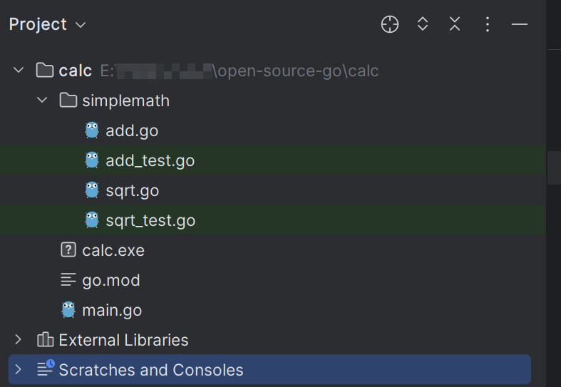
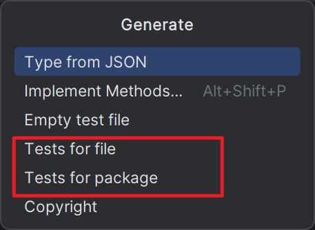
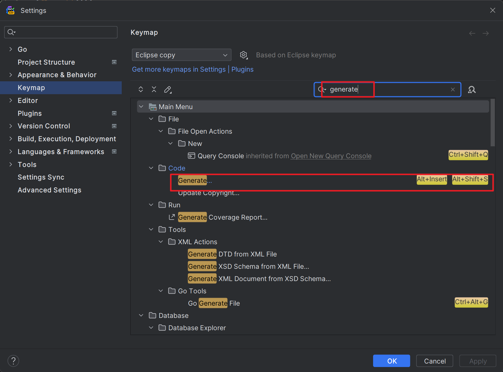
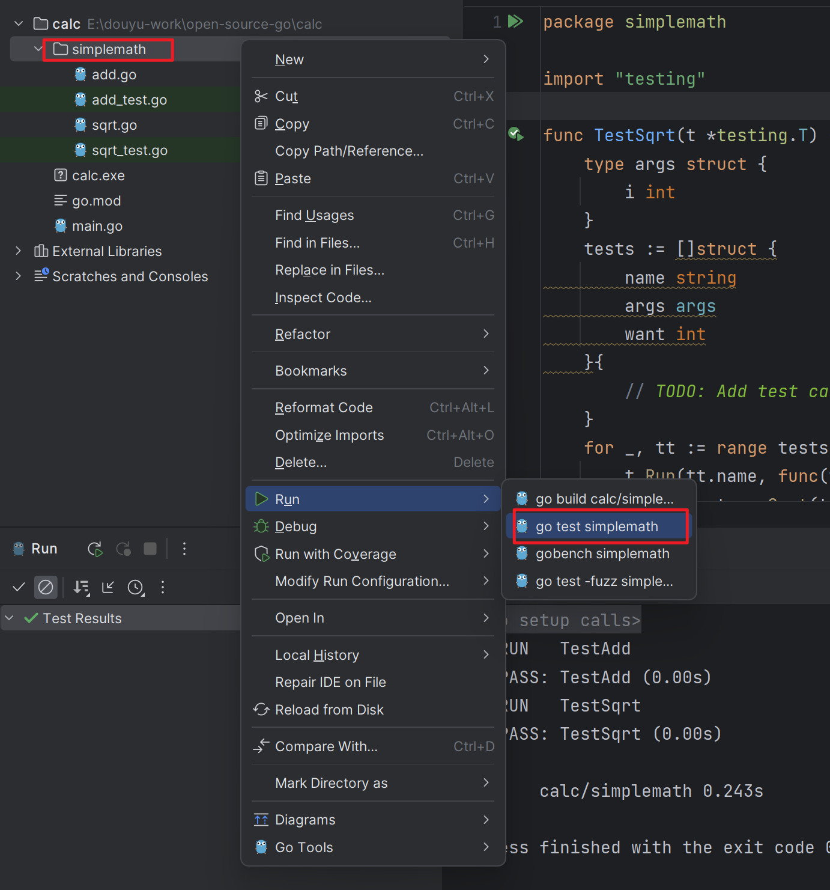

# Go单元测试

在 Go 语言中，支持为功能模块编写单元测试代码，继续以[上篇教程](./_2Go项目工程管理.md)构建的计算器项目为例，在 `simplemath` 包中，我们可以为每一个运算模块编写了对应的单元测试代码。

## 一. 编写单元测试

单元测试文件默认以同一目录下文件名后缀 `_test` 作为标识，比如我们在 `simplemath` 目录下新建 `add_test.go` 和 `sqrt_test.go` 文件，分别为 `add.go` 和 `sqrt.go` 编写单元测试，对应的目录结构如下：



编写 `add_test.go` 代码如下：

```go
package simplemath

import "testing"

func TestAdd(t *testing.T) {
    r := Add(1, 2)
    if r != 3 {
        t.Errorf("Add(1, 2) failed. Got %d, expected 3.", r)
    }
}
```

以及 `sqrt_test.go` 代码如下：

```go
package simplemath

import "testing"

func TestSqrt(t *testing.T) {
    v := Sqrt(9)
    if v != 3 {
        t.Errorf("Sqrt(9) failed. Got %v, expected 3.", v)
    }
}
```

在编写单元测试时，需要引入 [testing](https://golang.org/pkg/testing/) 包，你可以将其类比为 PHP 中的 PHPUnit 或 Java 中的 JUnit，我们可以基于该包提供的方法来实现自动化测试，测试方法的格式如下所示：

```go
func TestXXX(t *testing.T) {
    // 测试逻辑
}
```


> GoLand 使用 `Alt+Insert` 可以快速生成单元测试框架：
>
> 
>
> 如果快捷键被修改过，可以在设置中搜索 `generate` 关键字，然后添加快捷键：
>
> 

## 二. 运行单元测试

接下来，怎么运行这些单元测试呢？这也非常简单。

在 GoLand 中，你可以选择要执行单元测试的包，比如这里的 `simplemath`，然后通过右键快捷菜单依次选择 Run->go test simplemath：

