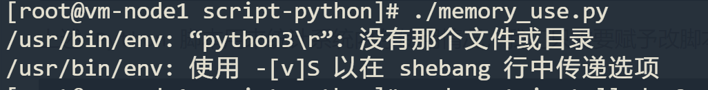

# 运行Python脚本

## 一. 通过 `python` 运行脚本

命令：`python 脚本文件名 [args]`

```shell
$ python ./hello.py
hello,python
```

## 二. 解析运行参数

### 2.1 `sys.argv`

假如我们在运行 `hello.py` 时指定了两个参数：

```shell
$ python ./hello.py test1 test2
```

我们在代码中可以获取它：

```python
import sys

args = sys.argv 
print(args) # 输出 ['arg_test.py', 'test1', 'test2']
```

sys模块是很常用的模块，它封装了与python解释器相关的数据，例如 `sys.modules` 里面有已经加载了的所有模块信息，`sys.path` 里面是PYTHONPATH的内容，而 `sys.argv`则封装了传入的参数数据。

`sys.argv` 是一个数组，第一个元素是执行的文件名，后面的元素则是跟在文件名后面的参数。

### 2.2 `argparse`

`sys.argv` 只能通过索引下标获取参数，如果我们需要指定参数名称，则使用 `argparse` 模块：

```python
import argparse

parser = argparse.ArgumentParser(description='manual to this script')
parser.add_argument('--ip', type=str, default=None)
parser.add_argument('--port', type=int, default=32)

args = parser.parse_args()

print(args.ip)
print(args.port)

```

这样我们在运行下列命令时，就会获取到指定名称的参数：

```shell
$ python ./hello.py --ip 127.0.0.1 --port 80
127.0.0.1
80
```

## 三. 直接运行python脚本

由于Linux 和 Mac都Shell环境，而Shell脚本第一行通常可以指明运行脚本的环境：

```shell
#!/usr/bin/bash
```

代表使用 `/usr/bin/bash` 可执行文件，执行后序的脚本。如果我们不知道可执行文件的具体位置，我们可以使用 `/usr/bin/env`去查找：

```shell
#!/usr/bin/env bash
```

1. 通过/usr/bin/env运行程序，用户不需要去寻找程序在系统中的位置（因为在不同的系统，命令或程序存放的位置可能不同），只要程序在你的$PATH中；
2. 根据环境寻找并运行默认的版本，提供灵活性。

这样我们只需要在 Python 脚本的第一行指明使用 `python3` 可执行文件执行脚本，即可做到像Shell脚本一样，直接执行 Python 脚本。

例如我们编写一个 `memory_use.py` 文件：

```python
#!/usr/bin/env python3

import os

list = []
sum = 0
str1 = os.popen('ps aux', 'r').readlines()

for i in str1:
    str2 = i.split()
    new_rss = str2[5]
    list.append(new_rss)

for i in list[1:-1]:
    num = int(i)
    sum = sum + num

print('%s:%s' % (list[0], sum))
```

上述 Python 脚本用来统计系统内存使用情况，我们只需要赋予改脚本执行权限，即可直接执行：

```shell
$ chmod +x memory_use.py
$ ./mem_use.py
RSS:1013552
```

有些时候会报出如下错误：



这是因为文件是从 Windows 下拷贝过来的，Windows 默认换行使用的是 `\r\n`，而 Linux 使用的是 `\n`，我们可以安装 `dos2unix` 工具：

```shell
$ yum install -y dos2unix # 或者  apt-get install dos2unix
```

然后使用 `dos2unix` 对换行符进行转换：

```shell
$ dos2unix memory_use.py
```

