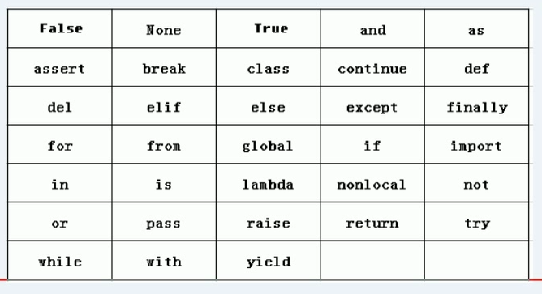
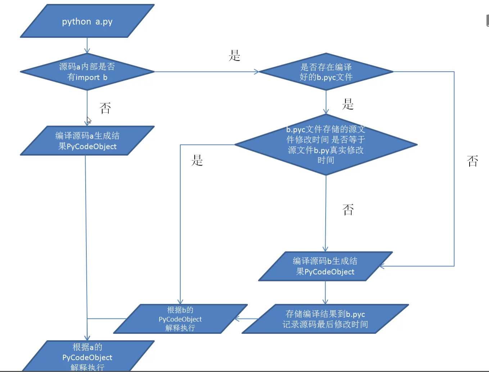

# 基本语法

## 一. 注释

​	**格式**：#xxxxx

​	**位置**：可独立一行，也可以在行的末尾

```pytho
# print absolute value of an integer:
a = 100
if a >= 0:
    print(a)
else:
    print(-a)#这是一行注释

sum=3+2  #这也是一段注释
```

以`#`开头的语句是注释，注释是给人看的，可以是任意内容，解释器会忽略掉注释。其他每一行都是一个语句，当语句以冒号`:`结尾时，缩进的语句视为代码块。

## 二. import语句

​	**格式**：import  模块名

​	**用途**：引入其他已经编写好的模块

```python
import time
print(time.time()) #在屏幕上打印年1月1日0:00大现在的秒数
```

## 三. 代码行

​	在Python中习惯上每一行代表一行语句，每一行的末尾不加分号。

## 四. 代码块

​	在Python中不能通过花括号来表示语句块，只能通过缩进来表示一个代码块。（缩进用四个空格）

```python
if 10-9>0:
    print("10-9大于0")
```

## 标识符规范

​	由字母、数字、下划线组成，第一个不能为数字，标识符大小写敏感，不能使用关键字。

​	

​	**关键字可以在lib/keywords.py文件里面查看**


## Python程序的执行过程



​	**python不是纯解释性语言**，与Java一样会先编译然后再解释执行，但是不同的是Java需要手动编译然后才能解释执行，而在Python中会自动编译，编译好的字节码会放在内存中，如果import其他文件编译好的字节码会生成xxx.pyc文件。字节码文件生成号后会自动运行,如果只执行单个文件，编译的字节码并不会持久化。


## Python的手动编译

**命令**：python -m py_compile  文件名


**.pyc是python编译好的字节码文件，同样可以使用 python命令解释执行**


