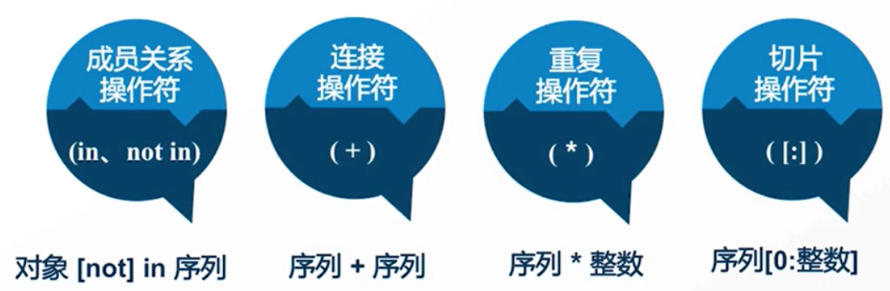

# Python中的序列

**序列的概念：**序列是指它的成员都是有序排列的，并且可以通过下标偏移量访问到它的一个或多个元素。

在Python中**字符串**、**列表**、**元组**三种类型都属于序列。

## 一. 序列的通用操作



- 成员关系符

  ```python
  a = "abcdef"
  print("a" in a) #True
  print("a" not in a) #False
  ```

- 连接操作符

  ```python
  a = "abc"
  b = "def"
  print(a + b) #输出abcdef
  ```

- 重复操作符

  ```python
  a = "a"
  print(a * 5) #输出aaaaa
  ```

- 切片操作符

  ```python
  a = "abcdef"
  print(a[0])  #输出索引为0的元素
  print(a[1:3]) #输出索引1-3的元素（包括1，不包括3）
  print(a[-1])  #从最后一个元素向前输出
  ```

## 二. 常用的序列

### 2.1 字符串（str）

- **字符串的定义：**

```python
str = "ABCDEF"
str = 'abcdef' #Python中双引号和单引号没区别
```

### 2.2 列表（list）

- **列表的定义：**

```python
a = ["abc", 2, True]
print(a)
```

- **元素的添加：**

```python
a=["abc", 2, True]
a.append("def") #末尾添加
```

- **删除元素：**

```python
a=["abc", "abc", 2, True]
a.remove("abc") #只会删除第一个"abc"
```

### 2.3 元组（tuple）

- **元组的定义：**

```python
a = ("abc", "bcd", "def")
b = ("abc", 2, True) #数据类型可以不同
```

与列表相比，元组没有append()，insert()这样的方法。其他获取元素的方法和list是一样的，你可以正常地使用`a[0]`，`a[-1]`，但不能修改元素的值。

## 三. 序列相关的内置函数

| 函数        | 功能                                                         |
| ----------- | ------------------------------------------------------------ |
| len()       | 计算序列的长度，即返回序列中包含多少个元素。                 |
| max()       | 找出序列中的最大元素。注意，对序列使用 sum() 函数时，做加和操作的必须都是数字，不能是字符或字符串，否则该函数将抛出异常，因为解释器无法判定是要做连接操作（+ 运算符可以连接两个序列），还是做加和操作。 |
| min()       | 找出序列中的最小元素。                                       |
| list()      | 将序列转换为列表。                                           |
| str()       | 将序列转换为字符串。                                         |
| sum()       | 计算元素和。                                                 |
| sorted()    | 对元素进行排序。                                             |
| reversed()  | 反向序列中的元素。                                           |
| enumerate() | 将序列组合为一个索引序列，多用在 for 循环中。                |

这里给大家给几个例子：

```python
str="c.biancheng.net"
#找出最大的字符
print(max(str))
#找出最小的字符
print(min(str))
#对字符串中的元素进行排序
print(sorted(str))
```

输出结果为：

```txt
t
.
['.', '.', 'a', 'b', 'c', 'c', 'e', 'e', 'g', 'h', 'i', 'n', 'n', 'n', 't']
```

