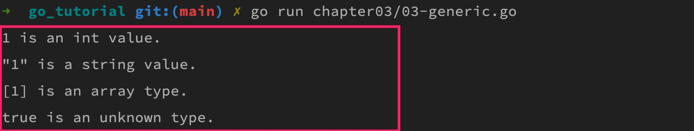

# 参数传递、变长参数与多返回值

## 一. 传递参数

### 1.1 值传参

**Go 语言默认使用按值传参来传递参数**，也就是传递参数值的一个副本：函数接收到传递进来的参数后，会将参数值拷贝给声明该参数的变量（也叫形式参数，简称形参），如果在函数体中有对参数值做修改，实际上修改的是形参值，这不会影响到实际传递进来的参数值（也叫实际参数，简称实参）。

```go
func add(a, b int) int  {
    a *= 2
    b *= 3
    return a + b
}

func main()  {
    x, y := 1, 2
    z := add(x, y)
    fmt.Printf("add(%d, %d) = %d\n", x, y, z)  
}
```

当我们把 `x`、`y` 变量作为参数传递到 `add` 函数时（`x`、`y` 是实参），这两个变量会拷贝出一个副本赋值给 `a`、`b` 变量作为参数（`a`、`b` 是形参），因此，在 `add` 函数中修改 `a`、`b` 变量的值并不会影响原变量 `x`、`y` 的值，所以上述代码的输出是：

```go
add(1, 2) = 8
```

### 1.2 引用传递

如果你想要实现在函数中修改形参值可以同时修改实参值，需要通过引用传参来完成，此时传递给函数的参数是一个指针，而指针代表的是实参的内存地址，修改指针引用的值即修改变量内存地址中存储的值，所以实参的值也会被修改（这种情况下，传递的是变量地址值的拷贝，所以从本质上来说还是按值传参）：

```go
func add(a, b *int) int {
    *a *= 2
    *b *= 3
    return *a + *b
}

func main()  {
    x, y := 1, 2
    z := add(&x, &y)
    fmt.Printf("add(%d, %d) = %d\n", x, y, z)
}
```

此时，上述代码的打印结果如下

```txt
add(2, 6) = 8
```

在函数调用时，像切片（slice）、字典（map）、接口（interface）、通道（channel）这样的引用类型默认使用引用传参。

## 二. 变长参数

所谓变长参数指的是函数参数的数量不确定，可以按照需要传递任意数量的参数到指定函数，合适地使用变长参数，可以让代码更简洁，尤其是输入输出类函数，比如打印函数 `fmt.Printf` 的参数就是典型的变长参数。

### 2.1 基本定义和传值

接下来，我们来介绍下 Go 函数变长参数的用法。

很简单，只需要在参数类型前加上 `...` 前缀，就可以将该参数声明为变长参数：

```go
func myfunc(numbers ...int) {
    for _, number := range numbers {
        fmt.Println(number)
    }
}
```

这段代码的意思是，函数 `myfunc()` 接受任意数量的参数，这些参数的类型全部是 `int`，所以它可以通过如下方式调用：

```go
myfunc(1, 2, 3, 4, 5) 
```

这种变长参数还支持传递一个 `[]int` 类型的切片，传递切片时需要在末尾加上 `...` 作为标识，表示对应的参数类型是变长参数：

```go
slice := []int{1, 2, 3, 4, 5}
myfunc(slice...)
myfunc(slice[1:3]...)
```

> 注：形如 `...type` 格式的类型只能作为函数的参数类型存在，并且必须是函数的最后一个参数。

之所以支持传入切片，是因为从底层实现原理上看，类型 `...type` 本质上是一个切片，也就是 `[]type`，这也是为什么上面的参数 `numbers` 可以用 `for` 循环来获取每个传入的参数值。

假如没有 `...type` 这样的语法糖，要实现同样的功能，开发者将不得不这么写：

```go
func myfunc2(numbers []int) { 
    for _, number := range numbers { 
        fmt.Println(number) 
    } 
}
```

从函数的实现角度来看，这没有任何影响，但从调用者角度来说，情形则完全不同：

```go
myfunc2([]int{1, 2, 3, 4, 5})
```

你会发现，我们不得不加上 `[]int{}` 来构造一个切片实例。但是有了 `...type` 这个语法糖，我们就不用自己来处理了。

### 2.2 任意类型的变长参数（泛型）

上面演示的变长参数只支持传递同一类型的任意参数，不过用过 `fmt.Printf` 函数的同学都知道，我们可以向其中传递任意类型的参数值，可见 Go 语言也可以支持传递任意类型的值作为变长参数，那这又是如何实现的呢？

答案是可以指定变长参数类型为 `interface{}`，下面是 Go 语言标准库中 `fmt.Printf()` 的函数原型：

```go
func Printf(format string, args ...interface{}) { 
    // ...
}
```

我们可以参照其实现来自定义一个支持任意类型的变长参数函数：

```go
func myPrintf(args ...interface{}) {
    for _, arg := range args {
        switch reflect.TypeOf(arg).Kind() {
        case reflect.Int:
            fmt.Println(arg, "is an int value.")
        case reflect.String:
            fmt.Printf("\"%s\" is a string value.\n", arg)
        case reflect.Array:
            fmt.Println(arg, "is an array type.")
        default:
            fmt.Println(arg, "is an unknown type.")
        }
    }
}

func main() {
    myPrintf(1, "1", [1]int{1}, true)
}
```

这里，其实我们要实现的就是一个**泛型**功能，在 1.18 版本之前，Go 语言并没有在语法层面提供对泛型的支持，所以目前只能自己这样通过反射和 `interface{}` 类型实现。

`interface{}` 是一个**空接口**，可以用于表示任意类型（后面我们在 Go 语言面向对象编程接口系列中会详细介绍），但是这个范围太泛了，就像 C 语言中的 `void` 一样，我们根本不知道真正传递进来的参数到底是什么类型的，这在强类型的静态语言中是不能接受的，所以为了保证代码类型安全，需要在运行时通过**反射**对数据类型进行检查，以便让程序在预设的轨道内运行，避免因为类型问题导致程序崩溃。

该程序最终的输出结果如下：



## 三. 多返回值

Go 函数与其他编程语言一大不同之处在于支持多返回值，这在处理程序出错的时候非常有用。例如，如果上述 `add` 函数只支持非负整数相加，传入负数则会报错，换做是其他语言，我们需要对返回结果做各种判断，以便确保程序在各种情况下的鲁棒性，在 Go 语言中，只需要通过在返回值中多返回一个错误信息即可：

```go
func add(a, b *int) (int, error) {
    if *a < 0 || *b < 0 {
        err := errors.New("只支持非负整数相加")
        return 0, err
    }
    *a *= 2
    *b *= 3
    return *a + *b, nil
}

func main()  {
    x, y := -1, 2
    z, err := add(&x, &y)
    if err != nil {
        fmt.Println(err.Error())
        return
    }
    fmt.Printf("add(%d, %d) = %d\n", x, y, z)
}
```

如上所示，我们通过 `error` 指定多返回一个表示错误信息的、类型为 `error` 的返回值，函数的多个返回值之间可以通过逗号分隔，并且在最外面通过圆括号包起来。由于 `add` 函数不支持传入负数，所以上述代码打印信息如下：


## 四. 命名返回值

此外，在设置多返回值时，还可以对返回值进行变量命名，这样，我们就可以在函数中直接对返回值变量进行赋值，而不必每次都按照指定的返回值格式返回多个变量了：

```go
func add(a, b *int) (c int, err error) {
    if *a < 0 || *b < 0 {
        err = errors.New("只支持非负整数相加")
        return
    }
    *a *= 2
    *b *= 3
    c = *a + *b
    return
}
```

这种机制避免了每次进行 `return` 操作时都要关注函数需要返回哪些返回值，为开发者节省了精力，尤其是在复杂的函数中。

