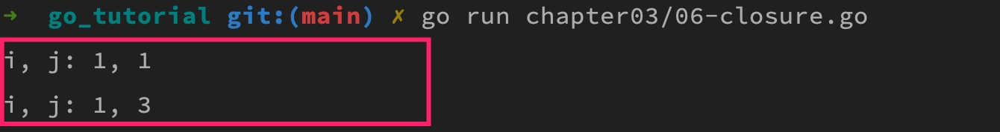
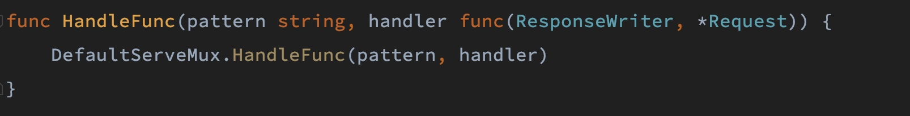

# 匿名函数与闭包

## 一. 匿名函数的定义和使用

匿名函数是一种没有指定函数名的函数声明方式（与之相对的，有名字的函数被称为具名函数），在很多编程语言中都有实现和支持，比如 PHP、JavaScript（想想 Ajax 请求的实现）等，Go 语言中也提供了对匿名函数的支持，并且形式上和其他语言类似：

```go
func(a, b int) int { 
    return a + b
}
```

和其他语言一样，Go 匿名函数也可以赋值给一个变量或者直接执行：

```go
// 1、将匿名函数赋值给变量
add := func(a, b int) int {
    return a + b
}

// 调用匿名函数 add
fmt.Println(add(1, 2))  

// 2、定义时直接调用匿名函数
func(a, b int) {
    fmt.Println(a + b)
} (1, 2) 
```

## 二. 匿名函数与闭包

要解答这个问题，我们需要先了解闭包的概念。

所谓闭包指的是引用了自由变量（未绑定到特定对象的变量，通常在函数外定义）的函数，被引用的自由变量将和这个函数一同存在，即使已经离开了创造它的上下文环境也不会被释放（比如传递到其他函数或对象中）。简单来说，「闭」的意思是「封闭外部状态」，即使外部状态已经失效，闭包内部依然保留了一份从外部引用的变量。

显然，闭包只能通过匿名函数实现，我们可以把闭包看作是**有状态的匿名函数**，反过来，如果匿名函数引用了外部变量，就形成了一个闭包（Closure）。

闭包的价值在于可以作为持有外部变量的函数对象或者匿名函数，对于类型系统而言，这意味着不仅要表示数据还要表示代码。支持闭包的语言都将函数作为**第一类对象**（firt-class object，有的地方也译作第一级对象、一等公民等，都是一个意思），Go 语言也不例外，这意味 Go 函数和普通 Go 数据类型（整型、字符串、数组、切片、字典、结构体等）具有同等的地位，可以赋值给变量，也可以作为参数传递给其他函数，还能够被函数动态创建和返回。

> 注：所谓第一类对象指的是运行期可以被创建并作为参数传递给其他函数或赋值给变量的实体，在绝大多数语言中，数值和基本类型都是第一类对象，在支持闭包的编程语言中（比如 Go、PHP、JavaScript、Python 等），函数也是第一类对象，而像 C、C++ 等不支持匿名函数的语言中，函数不能在运行期创建，所以在这些语言中，函数不是第一类对象。

## 三. 匿名函数的常见使用场景

下面我们来看几个 Go 匿名函数的典型使用场景。

### 3.1 保证局部变量的安全性

匿名函数内部声明的局部变量无法从外部修改，从而确保了安全性（类似类的私有属性）：

```go
var j int = 1

f := func() {
    var i int = 1
    fmt.Printf("i, j: %d, %d\n", i, j)
}

f()
j += 2
f()
```

上述代码打印结果如下：



在上面的示例中，匿名函数引用了外部变量，所以同时也是个闭包，变量 `f` 指向的闭包引用了局部变量 `i` 和 `j`，`i` 在闭包内部定义，其值被隔离，不能从外部修改，而变量 `j` 在闭包外部定义，所以可以从外部修改，闭包持有的只是其引用。

### 3.2 将匿名函数作为函数参数

匿名函数除了可以赋值给普通变量外，还可以作为参数传递到函数中进行调用，就像普通数据类型一样：

```go
add := func(a, b int) int {
    return a + b
}

// 将函数类型作为参数
func(call func(int, int) int) {
    fmt.Println(call(1, 2))
}(add)
```

当我们将函数声明数据类型时，需要严格指定每个参数和返回值的类型，这才是一个完整的函数类型，因此 `add` 函数对应的函数类型是 `func(int, int) int`。

也可以将第二个匿名函数提取到 `main` 函数外，成为一个具名函数 `handleAdd`，然后定义不同的加法算法实现函数，并将其作为参数传入 `handleAdd`：

```go
func main() {
    ...

    // 普通的加法操作
    add1 := func(a, b int) int {
        return a + b
    }

    // 定义多种加法算法
    base := 10
    add2 := func(a, b int) int {
        return a * base + b
    }

    handleAdd(1, 2, add1)
    handleAdd(1, 2, add2)
}

// 将匿名函数作为参数
func handleAdd(a, b int, call func(int, int) int) {
    fmt.Println(call(a, b))
}
```

上述代码打印结果如下：


这样一来，就可以通过一个函数执行多种不同加法实现算法，提升了代码的复用性，我们可以基于这个功能特性实现一些更复杂的业务逻辑，比如 Go 官方 `net/http` 包底层的路由处理器也是这么实现的：



在这个示例中，第二个匿名函数 `add2` 引用了外部变量 `base`，形成了一个闭包，在调用 `handleAdd` 外部函数时传入了闭包 `add2` 作为参数，`add2` 闭包在外部函数中执行时，虽然作用域离开了 `main` 函数，但是还是可以访问到变量 `base`。

### 3.3 将匿名函数作为函数返回值

最后，还可以将匿名函数作为函数返回值：

```go
// 将函数作为返回值类型
func deferAdd(a, b int) func() int {
    return func() int {
        return a + b
    }
}

func main() {
    ...

    // 此时返回的是匿名函数
    addFunc := deferAdd(1, 2)
    // 这里才会真正执行加法操作
    fmt.Println(addFunc())
}
```

在上面这个示例代码中，调用 `deferAdd` 函数返回的是一个匿名函数，但是这个匿名函数引用了外部函数传入的参数，因此形成闭包，只要这个闭包存在，这些持有的参数变量就一直存在，即使脱离了 `deferAdd` 函数的作用域，依然可以访问它们。

另外调用 `deferAdd` 方法时并没有执行闭包，只有运行 `addFunc()` 时才会真正执行闭包中的业务逻辑（这里是加法运算），因此，我们可以通过将函数返回值声明为函数类型来实现业务逻辑的延迟执行，让执行时机完全掌握在开发者手中。
