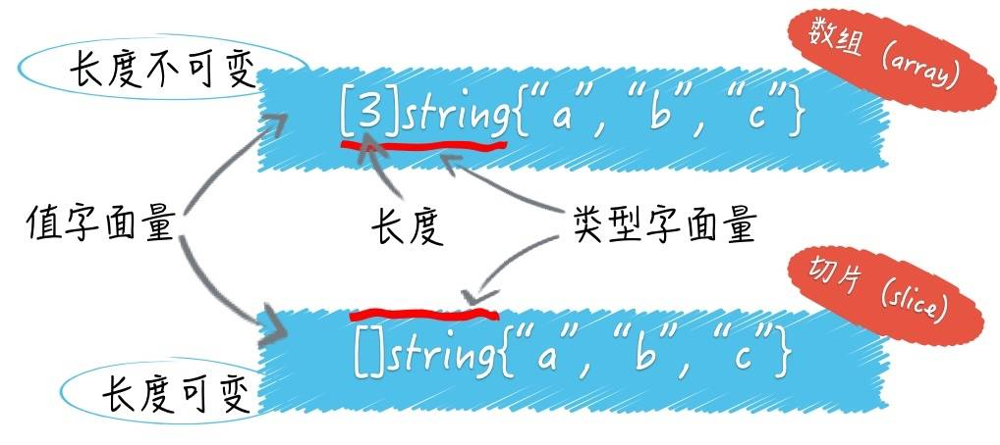

# 切片

在[前一篇教程](./_6数组.md)里我们已经介绍过数组的一个特点：数组的长度在定义之后无法修改，数组长度是数组类型本身的一部分，是数组的一个内置常量，因此我们无法在数组上做动态的元素增删操作。

显然这种数据结构无法完全满足开发者的日常开发需求，尤其是从动态语言转过来的开发人员（如 PHP），为此，Go 语言提供了切片（slice）来弥补数组的不足，切片一个最强大的功能就是支持对元素做动态增删操作，在介绍动态增删元素之前，我们先来了解下切片的定义和创建。

## 一. 切片的定义

在 Go 语言中，切片是一个新的数据类型，与数组最大的不同在于，切片的类型字面量中只有元素的类型，没有长度：

```go
var slice []string = []string{"a", "b", "c"}
```



因此它是一个可变长度的、同一类型元素集合，切片的长度可以随着元素数量的增长而增长（但不会随着元素数量的减少而减少），不过切片从底层管理上来看依然使用数组来管理元素，可以看作是对数组做了一层简单的封装。基于数组，切片添加了一系列管理功能，可以随时动态扩充存储空间，下面我们就来看看数组切片的创建和使用。

## 二. 创建切片

创建切片的方法主要有三种 —— 基于数组、基于切片和直接创建，下面我们来简要介绍一下这几种方法。

### 2.1 基于数组

切片可以基于一个已存在的数组创建。从这个层面来说，数组可以看作是切片的底层数组，而切片则可以看作是数组某个连续片段的引用。切片可以只使用数组的一部分元素或者整个数组来创建，甚至可以创建一个比所基于的数组还要大的切片：

```go
// 先定义一个数组
arr := [...]int{0, 1, 2, 3, 4, 5, 6, 7}
// 基于数组创建切片
q2 := arr[3:5]
fmt.Println(arr, q2) // 输出[0 1 2 3 4 5 6 7] [3 4]
```

Go 语言支持通过 `array[start:end]` 这样的方式基于数组生成一个切片，`start` 表示切片在数组中的下标起点，`end` 表示切片在数组中的下标终点，两者之间的元素就是切片初始化后的元素集合，通过上面的示例可以看到，和[字符串切片](https://geekr.dev/posts/go-string-and-encoding#toc-11)一样，这也是个**左闭右开**的集合，下面几种用法也都是合法的：

```go
a1 := months[:] // 基于 arr 的所有元素创建切片（全年）
a2 := months[:6] // 基于 arr 的前 6 个元素创建切片
a3 := months[6:]//基于从第 6 个元素开始的后续元素创建切片
```

需要注意的是，通过数组创建的切片底层还是指向的是原先的数组：

```go
// 先定义一个数组
arr := [...]int{0, 1, 2, 3, 4, 5, 6, 7}
// 基于数组创建切片
q2 := arr[3:6]
fmt.Println(arr, q2) // 输出[0 1 2 3 4 5 6 7] [3 4 5]
// 创建的切片底层，还是指向的原数组，修改切片元素，原数组也会发生改变
q2[0] = 8
fmt.Println(arr, q2) // 输出[0 1 2 8 4 5 6 7] [8 4 5]
```

切片底层引用了一个数组，由三个部分构成 —— 指针、长度和容量，指针指向数组起始下标，长度对应切片中元素的个数，容量则是切片起始位置到底层数组结尾的位置：


切片长度不能超过容量，比如上面的数组切片 `q2`，其指针指向底层数组 `arr` 下标为 `3` 的位置，切片长度是3，切片容量是4，和数组一样，我们可以通过内置函数 `len` 获取切片的长度，此外还可以通过 `cap` 函数获取切片容量：

```go
fmt.Println(len(q2), cap(q2)) // 输出 2 3
```

切片长度为3是因为我们进行切片操作指定了开始索引下标和结束索引，但是切片容量则有原先的数组长度所决定。

切片由于是从`arr[3]`开始的，所以从`arr[3]`开始往后数，原数组还剩余5个位置。如果我们往`q2`切片中添加元素，当元素个数小于等于5时，都会在原数组上进行，而不会生成新的数组。当元素个数大于5时，原先的`arr`数组不能满足需求，会自动创建一个cap*2的数组，并把原数组的值拷贝进去。

例如下面的程序中，由于只添加了两个元素，不需要触发扩容，还是在原数组上进行的修改：

```go
// 先定义一个数组
arr := [...]int{0, 1, 2, 3, 4, 5, 6, 7}
// 基于数组创建切片
q2 := arr[3:6]
fmt.Println(arr, q2) // 输出[0 1 2 3 4 5 6 7] [3 4 5]

// 由于q2基于 arr数组创建的切片，所以切片容量为5，当只添加两个元素时，实际上是在原数组上进行的操作
q3 := append(q2, 8, 9)

fmt.Println(arr, q2, q3) // 输出[0 1 2 3 4 5 8 9] [3 4 5] [3 4 5 8 9]
```

如果我们添加三个元素，就会触发扩容：

```go
// 先定义一个数组
arr := [...]int{0, 1, 2, 3, 4, 5, 6, 7}
// 基于数组创建切片
q2 := arr[3:6]
fmt.Println(arr, q2) // 输出[0 1 2 3 4 5 6 7] [3 4 5]

// 由于q2基于 arr数组创建的切片，所以切片容量为5，当添加三个元素时，容量不够，会触发扩容，生成新的底层数组
q3 := append(q2, 8, 9, 10)

fmt.Println(arr, q2, q3) // 输出[0 1 2 3 4 5 6 7] [3 4 5] [3 4 5 8 9 10]
```

### 2.2 基于切片

类似于切片可以基于一个数组创建，切片也可以基于另一个切片创建：

```go
// 先定义一个数组
arr := [...]int{0, 1, 2, 3, 4, 5, 6, 7}
// 基于数组创建切片
q2 := arr[3:6]
// 基于切片创建新的切片
q3 := q2[0,1]
```

以虽然是基于切片创建切片，但本质上还是基于数组。

### 2.3 直接创建

并非一定要事先准备一个数组才能创建切片，Go 语言提供的内置函数 `make()` 可以用于灵活地创建切片。

例如要创建一个初始长度为 5 的整型切片，可以这么做：

```go
mySlice1 := make([]int, 5)
```

要创建一个初始长度为 5、容量为 10 的整型切片，可以这么做（通过第三个参数设置容量）：

```go
mySlice2 := make([]int, 5, 10)
```

此外，还可以直接创建并初始化包含 5 个元素的数组切片（长度和容量均为5）：

```go
mySlice3 := []int{1, 2, 3, 4, 5}
```

和数组一样，所有未初始化的切片，会填充元素类型对应的零值。

事实上，使用直接创建的方式来创建切片时，Go 底层还是会有一个匿名数组被创建出来，然后调用基于数组创建切片的方式返回切片，只是上层不需要关心这个匿名数组的操作而已。所以，最终切片都是基于数组创建的，切片可以看做是操作数组的指针。

## 三. 遍历切片

由于切片可以看作是是数组指针，因此，操作数组元素的所有方法都适用于切片，比如切片也可以按下标读写元素，用 `len()` 函数获取元素个数，并支持使用 `range` 关键字来快速遍历所有元素。

传统的元素遍历方法如下:

```go
for i := 0; i < len(summer); i++ {
    fmt.Println("summer[", i, "] =", summer[i]) 
}
```

使用 `range` 关键字可以让遍历代码显得更简洁，`range` 表达式有两个返回值，第一个是索引，第二个是元素的值：

```go
for i, v := range summer { 
    fmt.Println("summer[", i, "] =", v) 
}
```

## 四. 动态增加元素

切片比数组更强大之处在于支持动态增加元素，甚至可以在容量不足的情况下自动扩容。在切片类型中，元素个数和实际可分配的存储空间是两个不同的值，元素的个数即切片的实际长度，而可分配的存储空间就是切片的容量。

一个切片的容量初始值根据创建方式的不同而不同：

- 对于基于数组和切片创建的切片而言，默认容量是从切片起始索引到对应底层数组的结尾索引；
- 对于通过内置 `make` 函数创建的切片而言，在没有指定容量参数的情况下，默认容量和切片长度一致。

所以，通常一个切片的长度值小于等于其容量值，我们可以通过 Go 语言内置的 `cap()` 函数和 `len()` 函数来获取某个切片的容量和实际长度：

```go
var oldSlice = make([]int, 5, 10)
fmt.Println("len(oldSlice):", len(oldSlice))
fmt.Println("cap(oldSlice):", cap(oldSlice))
```

程序运行结果如下：

```txt
len(oldSlice): 5
cap(oldSlice): 10
```

此时，切片 `oldSlice` 的默认值是 `[0 0 0 0 0]`，我们可以通过 `append()` 函数向切片追加新元素：

```go
newSlice := append(oldSlice, 1, 2, 3)
```

将返回的新切片赋值给 `newSlice`，此时 `newSlice` 的长度是 8，容量是 10，切片值是：

```txt
[0 0 0 0 0 1 2 3]
```

函数 `append()` 的第二个参数是一个不定参数，我们可以按自己需求添加若干个元素（大于等于 1 个），甚至直接将一个切片追加到另一个切片的末尾：

```go
appendSlice := []int{1, 2, 3, 4, 5}
newSlice := append(oldSlice, appendSlice...)  // 注意末尾的 ... 不能省略
```

### 4.1 自动扩容

如果追加的元素个数超出 `oldSlice` 的默认容量，则底层会自动进行扩容：

```go
newSlice := append(oldSlice, 1, 2, 3, 4, 5, 6)
fmt.Println(newSlice)
fmt.Println(len(newSlice))
fmt.Println(cap(newSlice))
```

此时 `newSlice` 的长度变成了 11，容量变成了 20，需要注意的是 `append()` 函数并不会改变原来的切片，而是会生成一个容量更大的切片，然后把原有的元素和新元素一并拷贝到新切片中。

默认情况下，扩容后新切片的容量将会是原切片容量的 2 倍，如果还不足以容纳新元素，则按照同样的操作继续扩容，直到新容量不小于原长度与要追加的元素数量之和。但是，当原切片的长度大于或等于 1024 时，Go 语言将会以原容量的 1.25 倍作为新容量的基准。

因此，如果事先能预估切片的容量并在初始化时合理地设置容量值，可以大幅降低切片内部重新分配内存和搬送内存块的操作次数，从而提高程序性能。

### 4.2 内容复制

切片类型还支持 Go 语言的另一个内置函数 `copy()`，用于将元素从一个切片复制到另一个切片。如果两个切片不一样大，就会按其中较小的那个切片的元素个数进行复制。

下面的示例展示了 `copy()` 函数的行为：

```go
slice1 := []int{1, 2, 3, 4, 5} 
slice2 := []int{5, 4, 3}

// 复制 slice1 到 slice 2
copy(slice2, slice1) // 只会复制 slice1 的前3个元素到 slice2 中
// slice2 结果: [1, 2, 3]
// 复制 slice2 到 slice 1
copy(slice1, slice2) // 只会复制 slice2 的 3 个元素到 slice1 的前 3 个位置
// slice1 结果：[5, 4, 3, 4, 5]
```

## 五. 动态删除元素

切片除了支持动态增加元素之外，还可以动态删除元素，在切片中动态删除元素可以通过多种方式实现（其实是通过切片的切片实现的「伪删除」）：

```go
slice3 := []int{1, 2, 3, 4, 5, 6, 7, 8, 9, 10}
slice3 = slice3[:len(slice3) - 5]  // 删除 slice3 尾部 5 个元素
slice3 = slice3[5:]  // 删除 slice3 头部 5 个元素
```

此外，还可以通过上述介绍的 `append` 函数和 `copy` 函数实现切片元素的「删除」：

```go
slice3 := []int{1, 2, 3, 4, 5, 6, 7, 8, 9, 10}
    
slice4 := append(slice3[:0], slice3[3:]...)  // 删除开头三个元素
slice5 := append(slice3[:1], slice3[4:]...)  // 删除中间三个元素
slice6 := append(slice3[:0], slice3[:7]...)  // 删除最后三个元素
slice7 := slice3[:copy(slice3, slice3[3:])]  // 删除开头前三个元素
```

`append` 相对好理解一些，`copy` 之所以可以用于删除元素，是因为其返回值是拷贝成功的元素个数，我们可以根据这个值完成新切片的设置从而达到「删除」元素的效果。

和动态增加元素一样，原切片的值并没有变动，而是创建出一个新的内存空间来存放新切片并将其赋值给其它变量。

关于 Go 切片元素的动态插入、新增、删除操作，还可以查看 [Go Slice Tricks Cheat Sheet](https://ueokande.github.io/go-slice-tricks/) 提供的图片示例有一个更直观的感受。