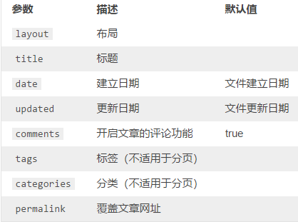

# Hexo博客文章撰写

虽然我们在前面介绍了如何创建一篇文章，但是文章撰写的一些细节我们还没有探究：


## 向文章中加入图片

在[文章资源文件夹的配置](./_11文章资源文件夹的配置.md)一文中详细介绍了如何在文章中插入图片。

图片的插入格式：``


## Front-matter

​	Front-matter用于**指定当前文章的属性**，例如：文章的标题、创建时间、文章分类、文章标签等。

​	Front-matter 是文件最上方以 `---` 分隔的区域，举例来说：

```shell
---
title: Hello World
date: 2013/7/13 20:46:25
---
```

### 初始化Front-matter配置

​	在我们使用`hexo new`创建一篇文章时，它会自动加入Front-matter，而我们可以通过修改`~/scaffolds/post.md`文件来修改默认值，我通常会把categories和tags属性加进去，因为这避免我们此编写文章需要手动输入这两个属性的尴尬局面。

### 参数

以下是预先定义的参数，您可在模板中使用这些参数值并加以利用:



### 分类与标签

​	我们可以通过categories和tags属性指定文章的分类与标签：

```shell
categories:
- Diary
- Life
tags:
- PS3
- Games
```

​	在Hexo中，不支持同级分类，也就是说在上面的规定中，Life是Diary的子分类，而不是同级分类。


## 文章首页显示折叠（icarus主题适用）

​	默认情况下，我们写的文章的全部内容都会在网站首页展示，但是我们通常希望在首页展示的只是文章的非常小的一部分，这样才能使得首页更加简洁。那我们该如何去做呢？

我们只需要在写文章的时候在特定位置加上`<!-- more -->`那么文章自然就会在首页折叠。


### 文章的目录显示

 	icarus主题为我们提供了文章目录的显示，我们只需要在Front-matter中添加`toc: true`即可。