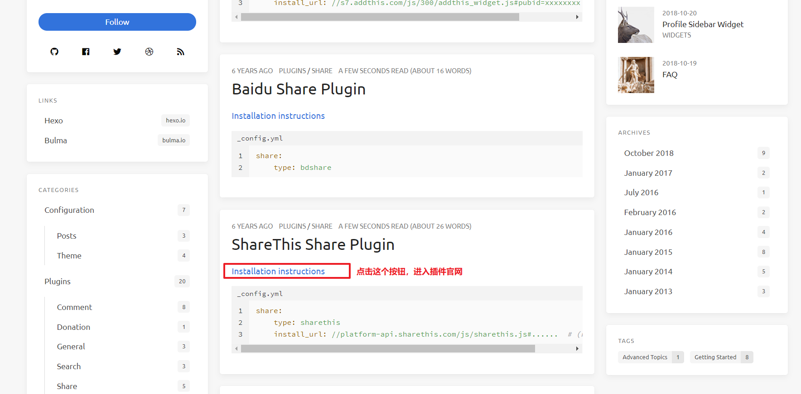
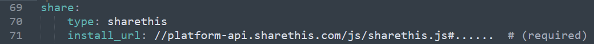

# 分享插件配置

我们以icarus官方文档为基础：https://blog.zhangruipeng.me/hexo-theme-icarus/categories/Plugins/Share/

## 第一步：进入插件官网

我们点击上面的链接可以查看Icarus主题的官方文档：

进入ShareThis官网后我们需要注册账户：

## 第二步：配置`~/themes/icarus/_config.yml`

我们将主题文档中的内容复制进去：

此时还没完，我们需要进入官网获取`install_url`的内容（官方文档只是给了一个案例）

复制下面内容到配置文件的`install_url`属性中去：

此时，我们本地的配置文件就部署完毕，我们需要执行`hexo clean` ，`hexo g`， `hexo d`三个动作，完成博客的部署（目的是刷新配置）。

## 第三步：校验配置

进入官网校验配置：

校验成功后会显示下面的效果：

## 第四步：配置插件

配置完成后一定要点最下面的：UPDATE按钮。然后等待5分钟再进入自己的博客即可看到效果：

