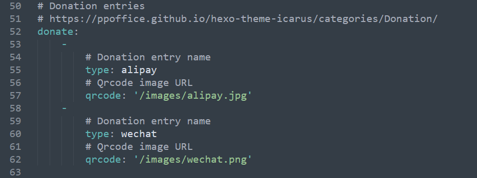

# 打赏按钮的配置

## 第一步：创建资源文件夹

在`~/themes/icarus/source`目录下创建images文件夹，将你的支付宝和微信收款码图片放进去。

也可以在`~/source`文件夹下创建images文件夹，这两个文件夹最终都会被发布到项目根目录。


## 第二步：配置打赏按钮

打开`~/themes/icarus/_config.yml`文件，配置如下内容：



```yml
donate:
    -
        # Donation entry name
        type: alipay    #支付宝
        # Qrcode image URL
        qrcode: '/images/alipay.jpg' #这里写图片路径即可
    -
        # Donation entry name
        type: wechat    #微信
        # Qrcode image URL
        qrcode: '/images/wechat.png' #这里写图片路径即可
```

配置完成后，重新生成静态页面，然后即可看到效果：


