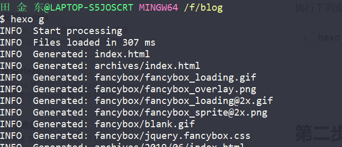

# 新建文章

## 第一步：使用命令创建一文章

执行下列命令：

```shell
hexo new 文章名
```


## 第二步：进入`source/_posts/`目录下去修改文章

Hexo博客文章采用markdown格式，你在部署的时候，Hexo框架会将Markdown格式文件转换成HTML格式，不熟悉的小伙伴可以去了解一下这个格式语法，同时我推荐大家使用Typora编辑器，这个编辑是个非常简约的编辑器。

如果你不想你的文章被处理，你可以将 Front-Matter 中的`layout:` 设为 `false` 。

## 第三步：生成目标HTML文件

​	在上一步中，我们完成了文章的编写，现在我们需要通过命令将Markdown文件生成为HTML文件：

```shell
hexo g 或hexo generate 
```



## 第四步：启动服务器

```shell
hexo s
```

启动服务器后，我即可看到刚刚创建的文章。