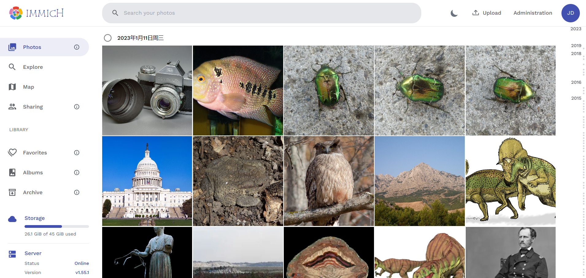
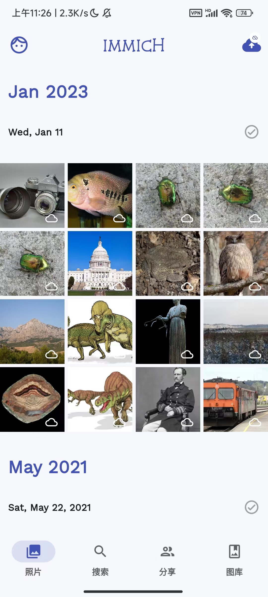
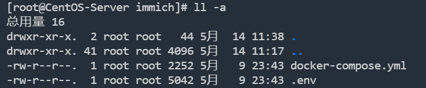
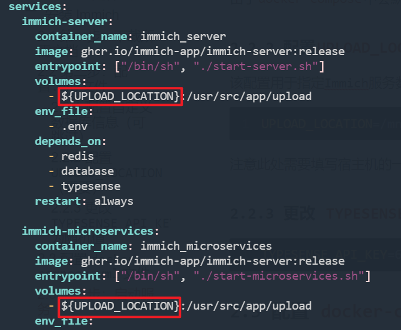
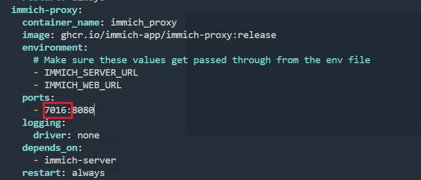

# 开源自托管照片备份管理安装与使用

## 一. Immich 是什么

Immich是一个开源的图片自托管服务，它能实现类似于百度网盘的照片自动备份、分类等功能，它同时提供了Web管理页面，和移动端APP，可以轻松备份手机中的照片至家庭服务器中。这一应用也在很多群辉玩家中用于替代“群辉相册”。

> GitHub：[immich-app/immich](https://github.com/immich-app/immich)

下面就是 Immich 服务的 Web管理页面和APP页面：



APP：




Immich 将设备上传的文件保存在“指定目录”，就算以后 Immich 服务停止维护了，也能在文件系统中轻松找到已经备份的照片。

许多朋友之所以离不开群晖，很大一部分原因是群晖的moments功能可以对图片进行自动分类。Immich也有此功能，但是根据项目描述，内置的深度学习算法需要cpu具备 `avx` 与 `avx2` 特性。

如果是比较老的cpu，是无法使用图片智能分类功能的，用以下命令可以查看是否有avx与avx2

```shell
more /proc/cpuinfo | grep flags
```

Immich 功能特性

| 功能特性                                    | 移动端  | 网页端 |
| ------------------------------------------- | ------- | ------ |
| 上传并查看照片和视频                        | 是      | 是     |
| 软件运行时自动备份                          | 是      | N/A    |
| 选择需要备份的相册                          | 是      | N/A    |
| 下载照片和视频到本地                        | 是      | 是     |
| 多用户支持                                  | 是      | 是     |
| 相册                                        | 是      | 是     |
| 共享相册                                    | 是      | 是     |
| 可拖动的快速导航栏                          | 是      | 是     |
| 支持RAW格式 (HEIC, HEIF, DNG, Apple ProRaw) | 是      | 是     |
| 元数据视图 (EXIF, 地图)                     | 是      | 是     |
| 通过元数据、对象和标签进行搜索              | 是      | No     |
| 管理功能 (用户管理)                         | N/A     | 是     |
| 后台备份                                    | Android | N/A    |
| 虚拟滚动                                    | 是      | 是     |
| OAuth支持                                   | 是      | 是     |
| 实时照片备份和查看 (仅iOS)                  | 是      | 是     |

## 二. 安装 Immich

Immich由于依赖大量组件，官方推荐使用 `docker-compose` 安装方案。官方文档：[Docker Compose [Recommended\] | Immich --- Docker Compose [推荐] |伊米希](https://immich.app/docs/install/docker-compose)

### 2.1 第一步：下载所需文档

创建一个您选择的目录（例如 `/opt/immich` ）来保存 `docker-compose.yml` 和 `.env` 文件。

```shell
mkdir /opt/immich
cd /opt/immich
```

通过运行以下命令下载 `docker-compose.yml` 和 `example.env` ：

```shell
wget https://github.com/immich-app/immich/releases/latest/download/docker-compose.yml
wget -O .env https://github.com/immich-app/immich/releases/latest/download/example.env
```

执行完成后，`/opt/immich` 目录下就多了两个文件：



### 2.2 第二步：配置`.env`文件

#### 2.2.1 配置自定义数据库信息（可跳过）

由于`docker-compose`中会默认启动一个数据库服务，所以一般情况下不需要手动更改数据库配置，除非你需要连接自定义的数据库。

#### 2.2.2 配置`UPLOAD_LOCATION`（重要）

该配置用于指定Immich服务数据存储挂载的目录，也就是用户上传的照片具体保存在宿主机哪个目录下：

```shell
UPLOAD_LOCATION=/mnt/hdd-relax/照片/immic
```

注意此处需要填写宿主机的一个绝对路径。

#### 2.2.3 更改 `TYPESENSE_API_KEY` 为随机值

```shell
TYPESENSE_API_KEY=6382340b49ce4903b3fd971f09bb0e96
```

### 2.3 配置 `docker-compose.yml` 文件

`docker-compose.yml` 大多数配置项，我们已经在`.env`中配置过了，我们通过命令启动时会自动替换该文件中的占位符：



#### 2.3.1 配置服务访问端口

我们按照需求配置服务的端口映射：




### 2.4 第三步：启动服务

进入第一步创建的目录中，执行如下命令：

```shell
docker-compose up -d  
```

这个命令需要的时间会比较长，这取决于你的网络

安装完成后，打开浏览器，输入 `http:\\ip:7016`

端口号取决于 `#2.3.1`中配置的端口


注册账号，搞定。手机APP，去Google Play商店下载即可。

