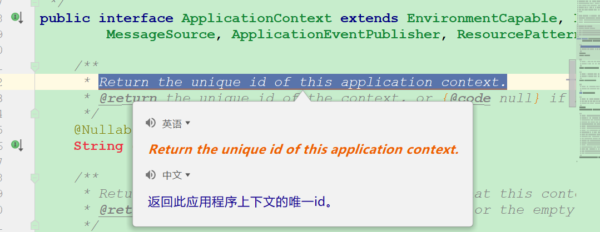
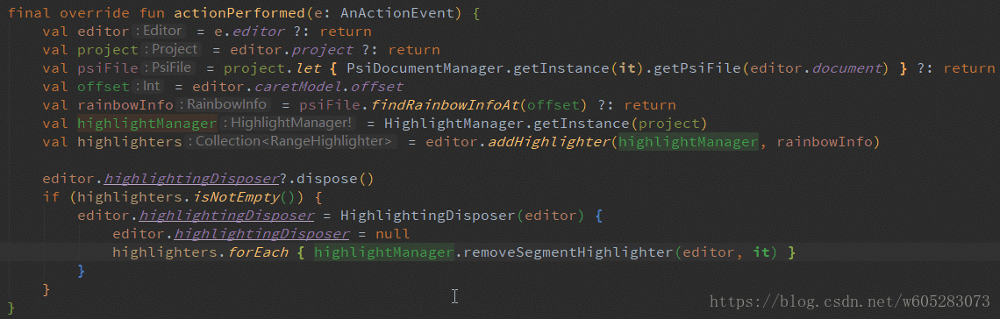
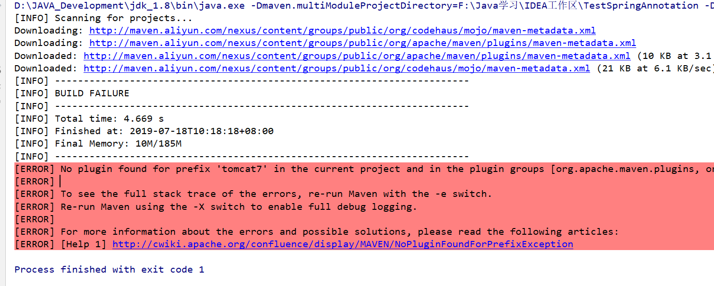

# IDEA酷炫插件推荐

好的插件可以大大提升我们的开发效率，下面我就推荐几款好用的插件：

## Key Promotor X

IDEA很多操作都是有快捷键的，但是我们无法短时间记住所有的快捷键，安装一个key Promoter X插件，它可以提示你每次操作对应的快捷键。

## Maven Helper

   此插件可用来方便显示maven的依赖树，在没有此插件时，如果想看maven的依赖树需要输入命令行： mvn dependency:tree  才可查看依赖。如果想看是否有依赖包冲突的话也需要输入命令行等等的操作。而如果安装Maven Helper插件就可免去命令行困扰。通过界面即可操作完成。

安装这个插件后还可以右击项目名，来运行命令：

## Translation

Translation插件是一个翻译插件，有时候我们在查看源码时，英文注释某些单词不熟悉直接划词翻译，不用另外打开其他的翻译插件：

该插件默认使用的是Google翻译，可以配置国内的有道翻译和百度翻译，翻译内容会更加详细。

## Rainbow Brackets

用于对括号进行着色：

高亮效果(默认快捷键 mac : command+鼠标右键单击, windows : ctrl+鼠标右键单击)：

选中部分外暗淡效果（默认快捷键 alt+鼠标右键单击）：

## MyBatisX

可以在Mapper.java和Mapper.xml互相跳转，并在编写接口方法后，生成配置文件对应的标签：

## MyBatis Log Plugin

Mybatis现在是java中操作数据库的首选，在开发的时候，我们都会把Mybatis的脚本直接输出在console中，但是默认的情况下，输出的脚本不是一个可以直接执行的。MyBatis Log Plugin 这款插件是直接将Mybatis执行的sql脚本显示出来，无需处理，可以直接复制出来执行的。

**安装完后默认不会显示`Mybatis Log`框，我们只需要进行如下操作:**

## Grep Console

根据日志不同等级信息进行上色：

## 其它插件

**Lombok Plugin**  Lombok 功能辅助插件 （省略Getter和Setter方法）

**GsonFormat**     把 JSON 字符串转换为Java类

