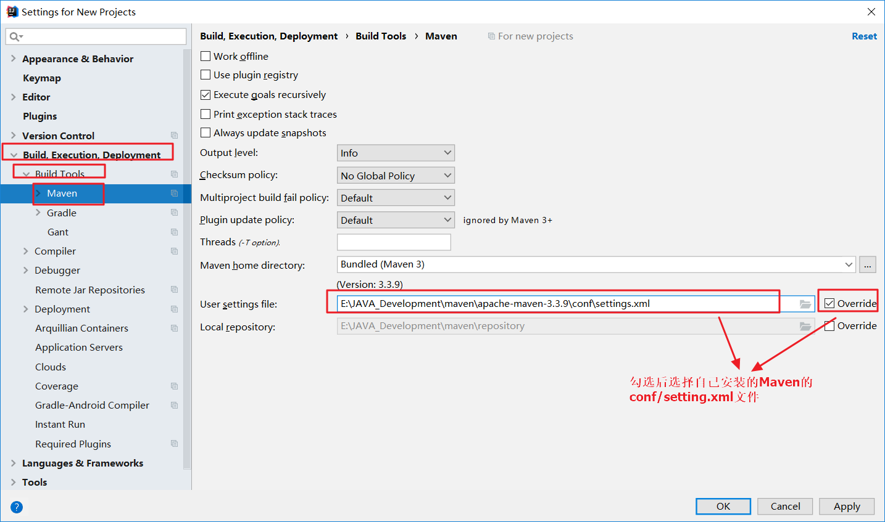
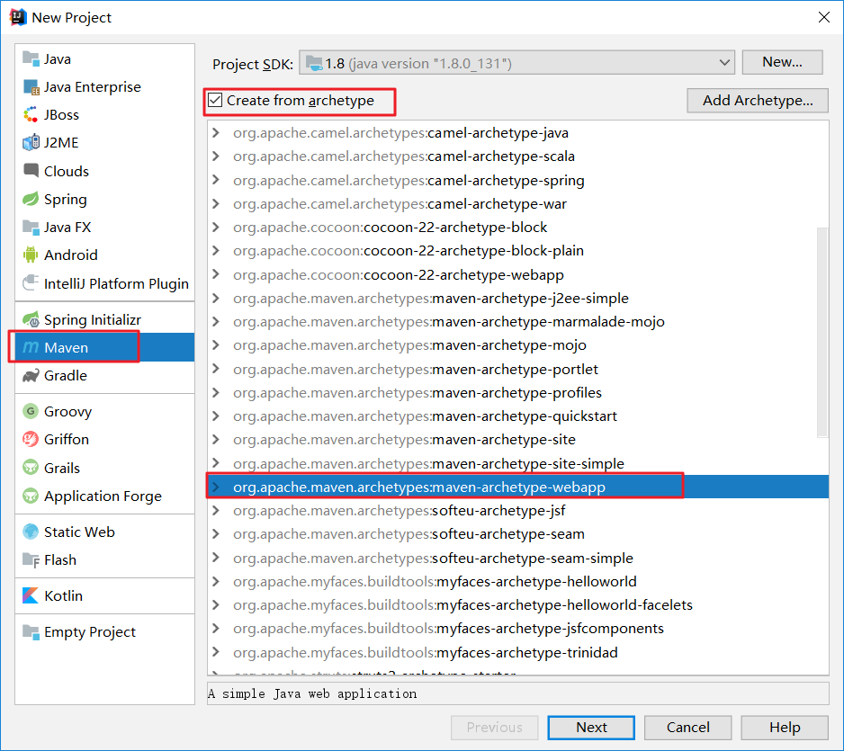
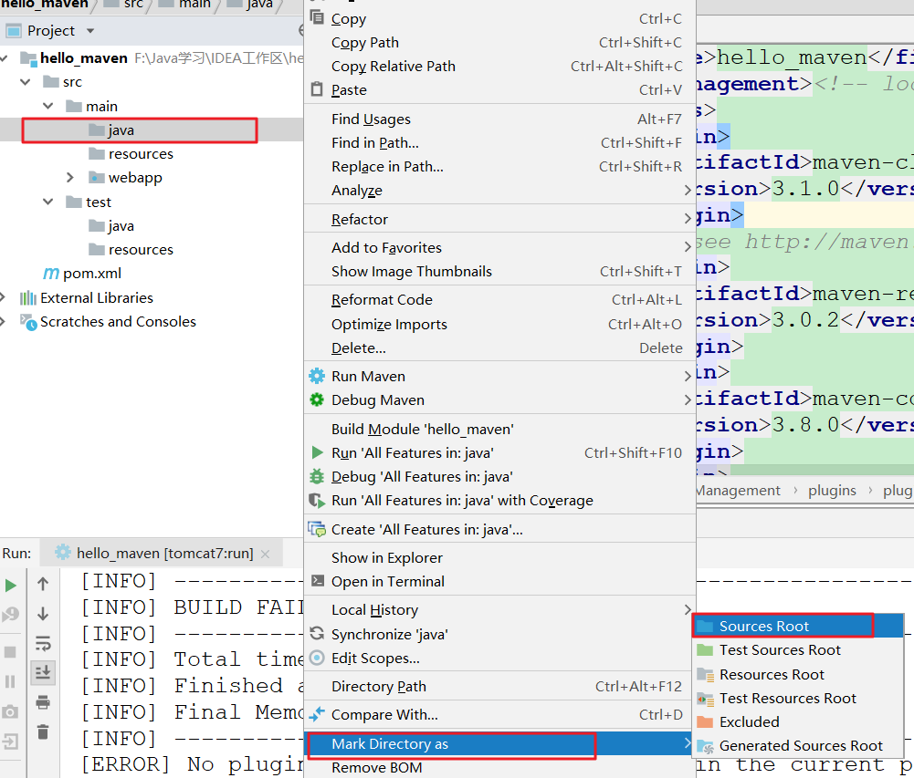

## 新建Maven普通项目

#### 第一步：配置Maven

​	在创建Maven之前，我们需要配置Maven



#### 第二步：创建普通Maven




#### 第三步：完善项目目录结构

​	创建完成后的目录结构：


​	但是这个目录结构是不符合标准的，我们需要手动创建`src/main/java` `src/main/resources` `src/test/java` `src/test/resources`：

​	

​	但是我们发现，我们创建的main/java目录是灰色的，它不能创建java文件，就算手动创建了也不会编译该文件，我们需要标记它为`sources root`：



​	或者我们点击：


​	**然后我们将目录结构标记为：**

- main/java	Sources
- main/resources	Resources
- test/java	Tests
- test/reources	Test Resources


#### 第四步：配置pom.xml

​	配置servlet、jsp的jar包，以及tomcat7插件

```xml
<?xml version="1.0" encoding="UTF-8"?>

<project xmlns="http://maven.apache.org/POM/4.0.0" xmlns:xsi="http://www.w3.org/2001/XMLSchema-instance"
  xsi:schemaLocation="http://maven.apache.org/POM/4.0.0 http://maven.apache.org/xsd/maven-4.0.0.xsd">
  <modelVersion>4.0.0</modelVersion>

  <groupId>cn.tjd</groupId>
  <artifactId>hello_maven</artifactId>
  <version>1.0-SNAPSHOT</version>
  <packaging>war</packaging>

  <name>hello_maven Maven Webapp</name>
  <!-- FIXME change it to the project's website -->
  <url>http://www.example.com</url>

  <properties>
    <project.build.sourceEncoding>UTF-8</project.build.sourceEncoding>
    <maven.compiler.source>1.7</maven.compiler.source>
    <maven.compiler.target>1.7</maven.compiler.target>
  </properties>
    
  <dependencies>
    <dependency>
      <groupId>junit</groupId>
      <artifactId>junit</artifactId>
      <version>4.11</version>
      <scope>test</scope>
    </dependency>
    <dependency>
      <groupId>javax.servlet</groupId>
      <artifactId>servlet-api</artifactId>
      <version>2.5</version>
      <scope>provided</scope>
    </dependency>
    <dependency>
      <groupId>javax.servlet</groupId>
      <artifactId>jsp-api</artifactId>
      <version>2.0</version>
      <scope>provided</scope>
    </dependency>
  </dependencies>
    
  <build>
      <plugins>
        <plugin>
          <groupId>org.apache.tomcat.maven</groupId>
          <artifactId>tomcat7-maven-plugin</artifactId>
          <configuration>
            <path>/</path>
            <port>8080</port>
          </configuration>
        </plugin>
      </plugins>
  </build>
</project>
```


#### 第五步：安装`Maven Helper`插件


#### 第六步：运行

**方式一：使用原始方式启动**


**第二步：使用Maven Helper插件启动**

**安装Maven Helper插件**


**启动：**


