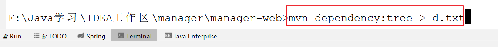
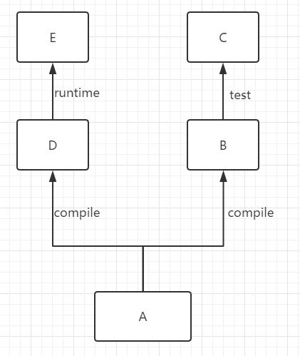

## Maven

#### Maven的核心功能

- jar包管理
- 项目构建

#### Maven的思想

- 约定优于配置（convention over configuration）	Maven通过`超级pom`约定了很多通用的配置（例如：目录结构）。

  `超级pom`的位置：

${Maven_Home}**/lib/maven-model-builder-3.3.9.jar**/org/apache/maven/model/pom4.0.0.xml

#### Maven配置文件加载顺序

```txt
${user_hoe}/.m2/setting.xml——>${MAVEN_HOME}/conf/setting.xml
```

#### 项目结构


#### `pom.xml`配置文件（Project Object Model）

- modelVersion	根元素下的第一个子元素，指定当前pom模型的版本，对于Maven2和Maven3来说只能是`4.0.0`
  
- groupId	域名倒写
  
- artifactId	功能名称（模块名称）

- version	版本号

- packaging	打包方式（pom,war,jar 默认,maven-plugin）

- properties	定义变量（通常是定义版本号，子标签名自定义），然后通过`${xxx}`的形式使用变量

  ```xml
  <properties>
       <junit.version>4.12</junit.version>
  </properties>
  ```

- dependencyManagement

  1.  只能出现在父pom（习惯约定） 
  2.  作用：统一版本号  
  3.  作用：声明 (子POM里用到再引)

- dependency

  - type

  - scope
  
  
    - system	本地jar包，在中央仓库没有的代码，我们要么需要将它安装到本地仓库中或私服中，此时Maven提供了第三种方法，通过`scope=system`表明这个jar包存在本地

      ```xml
    <dependency>
          <groupId>mysql</groupId>
        <artifactId>mysql-connector-java</artifactId>
          <scope>system</scope>
        <systemPath>本地路径</systemPath>
      </dependency>
      ```

#### 查看依赖树

​	在控制台，通过`mvn dependency:tree`命令可以查看当前项目的依赖结构（需要进入到当前目录中）

```shell
mvn dependency:tree > d.txt #意思打印当前项目依赖的树结构，将结果重定向到d.txt文件中
```


#### 依赖传递

​	在Maven中依赖是可以传递的


​	最左边的一列表示第一直接依赖范围，最上面一行表示第二直接依赖范围。

​	**表格的具体理解：**

​	

​	对于这张图，A->B和A->D就是第一直接依赖，B->C和D->E是第二直接依赖。第一和第二的概念是相对于现在所处的项目来说的。假如A项目使我们此时需要编码的项目，B、D都是本项目直接依赖的jar，那么C、E分别是B、D的直接依赖，那他们是否会随着B和D的引入而引入A项目呢？

​	根据表格得知，compile-test是无效的，也就是C根本不会被引入到A项目中；而compile-runtime是runtime也就是说E会被引入A项目，并且在A项目中E的scope是runtime。

#### 依赖仲裁

1. **版本声明原则**

   ​	优先按照依赖管理<dependencyManagement>元素中指定的版本声明进行仲裁，此时下面的两个原则都无效了。

2. **最短路径原则**


​	在此种依赖关系下，`gupao-web`到底依赖的是1.1版本还是1.0版本的`gupao-common-lib`。

​	根据最短路径原则，在`gupao-web`依赖的是1.0版本的，Maven会自动过滤掉1.1版本的`gupao-common-lib`

3. **最先声明原则**

   

   若`最短路径原则`无法做出仲裁，那么就需要使用`最先声明原则`了，在这个案例中，`gupao-common-lib`到底依赖哪个版本取决于，`gupao-biz`和`gupao-dal`谁先声明

#### 依赖冲突

1. **依赖冲突的原因**

   ​	大多数的依赖冲突发生的原因是因为maven的传递依赖会引入很多隐式的依赖，这些依赖可能会和我们显示依赖版本不一致。

   

   ​	如图，我们显示依赖了 spring-boot1.5.9，和spring-core4.0.8（当然这种情况在正常情况下不会发生）在这种情况，根据Maven的最短依赖路径原则，会使用spring-core4.0.8,当在启动项目的时候会报错。这是因为spring-boot1.5.9运行所需要的spring-core版本是4.3.13，但是项目中编译的spring-core版本是4.0.8。

   ​	**Maven冲突的实质是：不同版本的jar中会有部分API不一样，例如A依赖B的1.4版本中的某些新特性，但是系统根据`仲裁法则`选择了1.3版本的B，此时A所依赖的新特性用不了，这就导致项目无法运行。**

2. **解决方法**

   ​	冲突导致项目无法运行的原因是因为系统按照“`三大依赖仲裁法则`”留下的jar包的版本不适用于所有需求者，那么我们需要通过仲裁法则或者<exclutions>标签来解决冲突。

   ​	**解决冲突的最终目的就是将我们需要的版本留下来，让系统忽略不兼容的版本。**

   ​	解决依赖有两大种方法：

   1. 利用`依赖仲裁法则`选出我们需要的版本

      ​	例如在上图中，我们根据系统根据就近原则，选择了4.0.8版本的spring-core。那么我们可以根据系统的原理，直接删除下面那条线（即在project中去掉spring-core的坐标）；或者我们可以在父工程中使用<dependencyManagement>限制spring-core的版本。

   2. 利用<exclution>标签添加排除

      

      在IDEA中就会显示servlet-api冲突，（omitted for duplicate：省略重复的）

      ​	

      在当前这个情况中，我们以添加<exclution>进行排除

      ```xml
      <dependency>
          <groupId>javax.servlet</groupId>
          <artifactId>servlet-api</artifactId>
          <scope>provided</scope>
      </dependency>
      <dependency>
          <groupId>javax.servlet</groupId>
          <artifactId>jsp-api</artifactId>
          <scope>provided</scope>
          <exclusions>
              <exclusion>
                  <groupId>javax.servlet</groupId>
                  <artifactId>servlet-api</artifactId>
              </exclusion>
          </exclusions>
      </dependency>
      ```

#### 生命周期

​	Maven的生命周期分为：clean、default、site

​	1.  一个生命周期由多个阶段组成。

​	2.  阶段是由插件目标组成（A Build Phase is Made Up of Plugin Goals）


​	**生命周期中如果运行其中一个阶段，那么在此之前的阶段都会运行。**

#### 常用命令

​	`mvn dependency:list`：查看项目中所有引入的依赖

​	`mvn dependency:tree`：查看项目的依赖树

​	`mvn dependency:analyze`：帮助分析当前项目的依赖，结果主要分为两个部分：1. 使用但未声明的依赖，2. 未使用但声明的依赖。

​	

