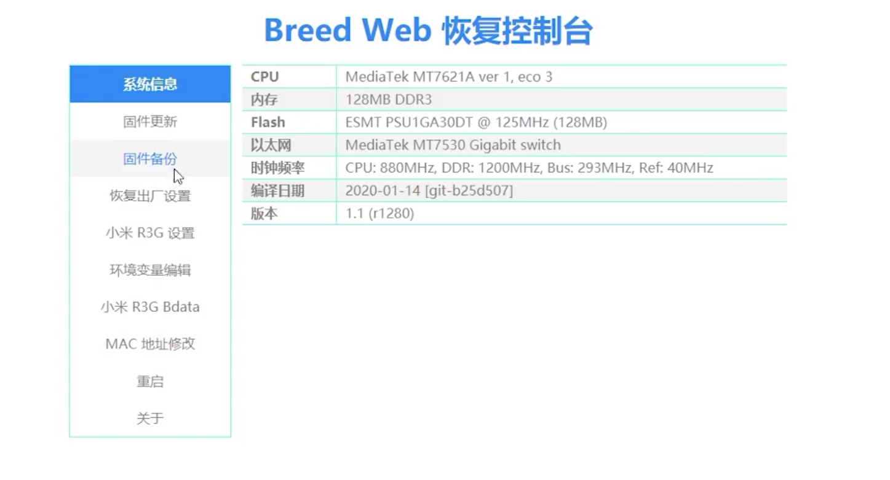
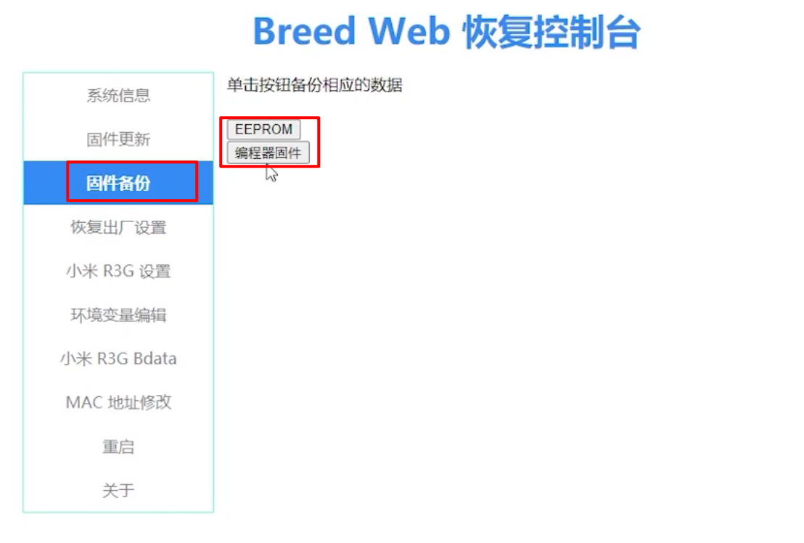
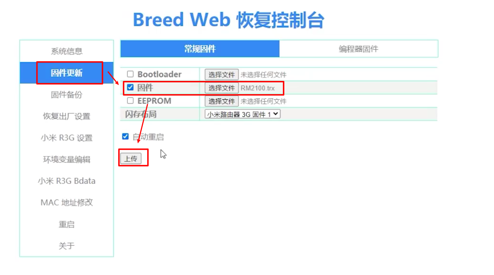
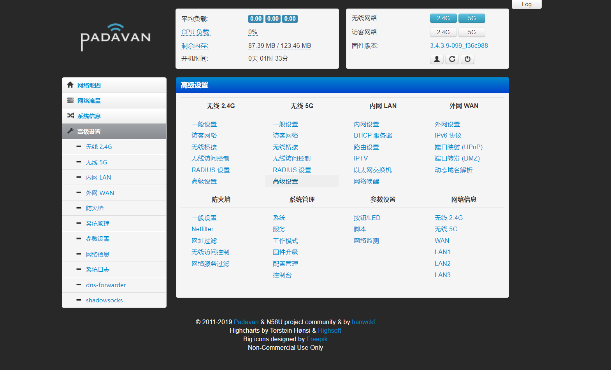

# RedmiAC2100路由器刷老毛子固件

最近搭建集群，为了方便的全局自定义DNS记录，并且各节点需要科学上网，所有就萌生了刷路由器固件的想法。网上翻阅了一些资料最终选择了”老毛子“固件。

> **本文相关文件**
>
> 链接：https://pan.baidu.com/s/1b4Sm5hpy9Am_jjz8YDWWlQ 
> 提取码：ghbl 
> 复制这段内容后打开百度网盘手机App，操作更方便哦

## 第一步：刷入Breed不死后台

Breed不死后台类似于PC的BIOS，刷入Breed后，路由器就可以自由的刷入固件了。

官方固件操作 （WAN口接互联网）：

WEB管理页面内-固件升级-手动升级下面2.0.7*版本固件  [地址1](https://wwx.lanzoux.com/i6iqxhqp98f) [地址2](http://cdn.cnbj1.fds.api.mi-img.com/xiaoqiang/rom/rm2100/miwifi_rm2100_firmware_d6234_2.0.7.bin)

**开启路由器SSSH**：

1. 进192.168.31.1 登陆管理页面，复制你的地址栏整段URL到记事本（例如下面）：
   http://192.168.31.1/cgi-bin/luci/;stok=DGJ49JG522debug6578F/web/home#router

2. 开启ssh方式：下面改红字部分，改为你记事本stok=那段（替换）；整段复制到地址栏打开，
   http://192.168.31.1/cgi-bin/luci/;stok=DGJ49JG522debug6578F/api/misystem/set_config_iotdev?bssid=Xiaomi&user_id=longdike&ssid=-h%3B%20nvram%20set%20ssh_en%3D1%3B%20nvram%20commit%3B%20sed%20-i%20's%2Fchannel%3D.*%2Fchannel%3D%5C%22debug%5C%22%2Fg'%20%2Fetc%2Finit.d%2Fdropbear%3B%20%2Fetc%2Finit.d%2Fdropbear%20start%3B

3. 再做下面这段设置ssh密码为admin
   http://192.168.31.1/cgi-bin/luci/;stok=DGJ49JG522debug6578F/api/misystem/set_config_iotdev?bssid=Xiaomi&user_id=longdike&ssid=-h%3B%20echo%20-e%20'admin%5Cnadmin'%20%7C%20passwd%20root%3B
4. ssh登陆192.168.31.1；用户名：root；密码：admin

**输入下面联网刷Breed (r3gbreed通用红米AC2100)**

下面命令建议分开执行，特别是下载文件要确认文件下载成功再执行`mtd ....`刷入Breed

```shell
cd /tmp 
curl -o breed-mt7621-xiaomi-r3g.bin https://breed.hackpascal.net/breed-mt7621-xiaomi-r3g.bin
mtd -r write breed-mt7621-xiaomi-r3g.bin Bootloader
```

或

```shell
cd /tmp && 
curl -o breed-mt7621-xiaomi-r3g.bin http://3322d.f3322.net:16999/other/breed/breed-mt7621-xiaomi-r3g.bin
mtd -r write breed-mt7621-xiaomi-r3g.bin Bootloader
```

等20秒后，断电进Breed，更改环境变量，编缉,新增字段"xiaomi.r3g.bootfw",值设置为 2,然后保存。

## 第二步：进入Breed后台

拔掉路由器电源，使用卡针按住reset键，插入电源，直到指示灯蓝色闪烁为止。

进入htttp://192.168.1.1即可进入Bread后台：

## 第三步：备份数据

、

## 第四步：刷入固件



上传完成后路由器会自动刷入固件，这段时间一定不能掉电，不然路由器就变砖了。等待蓝色灯常亮时即可访问路由器的后台管理页面了：

hanwckf固件

- 默认地址：192.168.2.1
- 用户名密码：admin
- wifi密码：1234567890

Hiboy固件

- 默认地址：192.168.123.1
- 用户名密码：admin
- wifi密码：1234567890

## 第五步：进入后台管理页面

