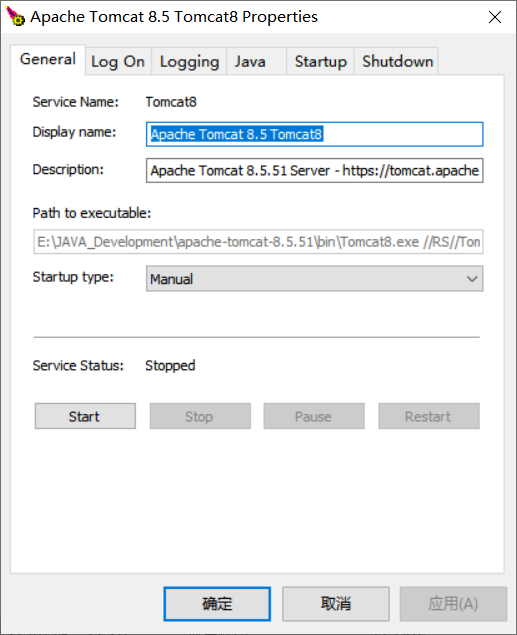
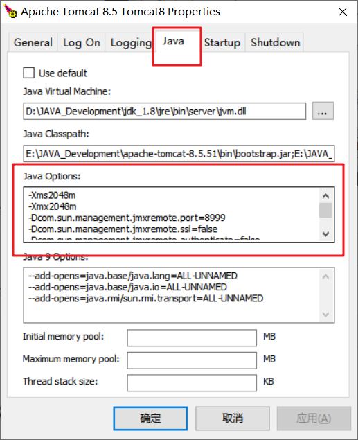
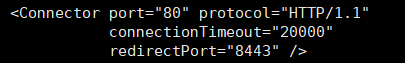
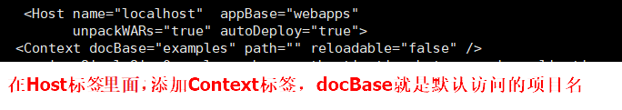

# Tomcat部署

## 一. Windows版Tomcat特殊操作

### 1.1 服务器启动


**第一步：安装服务**

```shell
service.bat install
```

**第二步：启动服务**

点击`{tomcat_home}/bin/Tomcat8w.exe`：


点击`start`：



### 1.2 start按钮变灰


**第一步：卸载服务**

```shell
service.bat remove
```

**第二步：安装服务**

```shell
service.bat install
```


### 1.3 配置虚拟机参数

在`java`选项卡中输入参数，使用服务启动时编辑`catlina.bat`不起作用。



```shell
-Xms2048m
-Xmx2048m

# 打开JMX，即可远程查看虚拟机允许状况
-Dcom.sun.management.jmxremote.port=8999
-Dcom.sun.management.jmxremote.ssl=false 
-Dcom.sun.management.jmxremote.authenticate=false
```


## 二. 公共操作

### 2.1 开启Tomcat管理页面权限

编辑`{tomcat_home}/conf/tomcat-users.xml`文件，在`<Context></Context>`标签中添加如下配置：

```xml
<role rolename="tomcat"/>
<role rolename="manager-script"/>
<role rolename="manager-gui"/>
<role rolename="manager-status"/>
<role rolename="admin-gui"/>
<role rolename="admin-script"/>
<user username="root" password="123456789" roles="manager-gui,manager-script,tomcat,admin-gui,admin-script"/>
```

但是这样配置后只能使用服务器本机访问管理页面，如果需要允许其他主机访问管理页面，需要编辑`{tomcat_home}/webapps/manager/META-INF/context.xml`，注释掉以下部分：

```xml
<!--
    <Valve className="org.apache.catalina.valves.RemoteAddrValve"
         allow="127\.\d+\.\d+\.\d+|::1|0:0:0:0:0:0:0:1" />
-->
```

经过测试7.x版本的不用注释如上内容，8.x后需要手动放开访问控制了，默认管理页面只允许服务器本地访问，可能是为了安全起见吧。

### 2.2 配置服务器默认端口

**第一步：开放端口**

```shell
/sbin/iptables -I INPUT -p tcp --dport 80 -j ACCEPT
```

```shell
/etc/rc.d/init.d/iptables save
```

**第二步：修改`{tomcat_home}/conf/server.xml`**




### 2.3 修改默认访问的项目

修改`{tomcat_home}/conf/server.xml`



