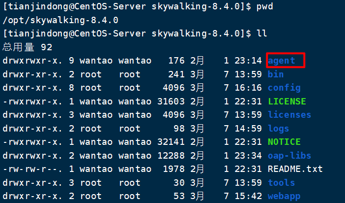

# SpringBoot项目使用Skywalking

### 第一步：将agent探针拷贝至Springboot项目部署的机器

Skywalking安装目录下的agent目录就是内置的agent探针



```shell
cp -r agent/ /opt/projects/
```

### 第二步：编辑`agent`目录中的`config/agent.config`文件中的应用名称

```shell
# 将agent.service_name更改为指定值
agent.service_name=${SW_AGENT_NAME:Your_ApplicationName} 
# 例如：
agent.service_name=${SW_AGENT_NAME:user-dl} 
```

其中`${A:B}`的意思是，优先读取系统环境变量中A的值，如果为空则使用值B

### 第三步：修改SpringBoot启动命令

```java
java -javaagent:/opt/projects/user-dl/agent/skywalking-agent.jar -jar user-dl.jar
```

需要在启动时使用`-javaagent`参数指定探针文件位置。	