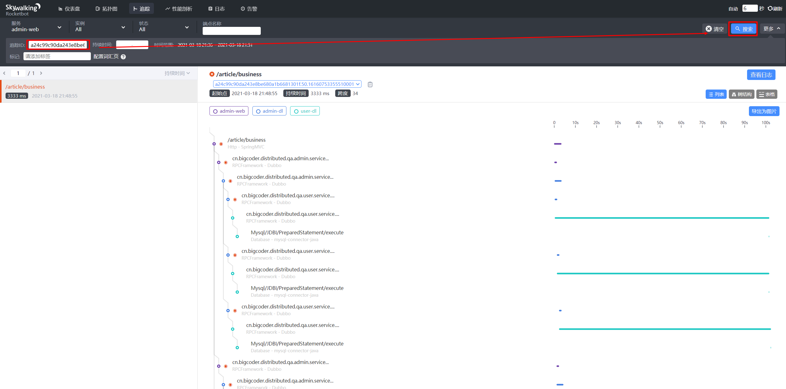

# 项目中获取TraceID

## 一. 为什么要获取TraceID

由于生产环境中用户访问非常频繁，如果遇到用户访问异常，能够快速的定位调用链将大大提高排错效率。




## 二. 项目中获取TraceID

### 2.1 引入依赖

```xml
<dependency>
    <groupId>org.apache.skywalking</groupId>
    <artifactId>apm-toolkit-trace</artifactId>
    <version>6.5.0</version>
</dependency>
```

### 2.2 方法调用

```java
import org.apache.skywalking.apm.toolkit.trace.TraceContext;

String traceId = TraceContext.traceId();  
```

#### 2.2.1 获取TraceID

我们可以在SpringMVC中配置统一异常处理，然后返回TraceId：

```java
package cn.bigcoder.distributed.qa.admin.web.handle;

import cn.bigcoder.distributed.qa.dto.JsonReturn;
import org.apache.skywalking.apm.toolkit.trace.TraceContext;
import org.slf4j.Logger;
import org.slf4j.LoggerFactory;
import org.springframework.web.bind.annotation.ExceptionHandler;
import org.springframework.web.bind.annotation.ResponseBody;
import org.springframework.web.bind.annotation.RestControllerAdvice;

@RestControllerAdvice
public class GlobalExceptionResolver {

    private static final Logger log = LoggerFactory.getLogger(GlobalExceptionResolver.class);

    @ExceptionHandler(Exception.class)
    @ResponseBody
    public JsonReturn handlerException(Exception exception) {
        log.error(exception.getMessage(), exception);
        String traceId = TraceContext.traceId();
        return JsonReturn.error("请求服务器异常，请联系管理员！traceId：" + traceId);
    }
}
```

#### 2.2.2 其他API

- `ActiveSpan.error()` 将当前 Span 标记为出错状态.
- `ActiveSpan.error(String errorMsg)` 将当前 Span 标记为出错状态, 并带上错误信息.
- `ActiveSpan.error(Throwable throwable)` 将当前 Span 标记为出错状态, 并带上 `Throwable`.
- `ActiveSpan.debug(String debugMsg)` 在当前 Span 添加一个 debug 级别的日志信息.
- `ActiveSpan.info(String infoMsg)` 在当前 Span 添加一个 info 级别的日志信息.