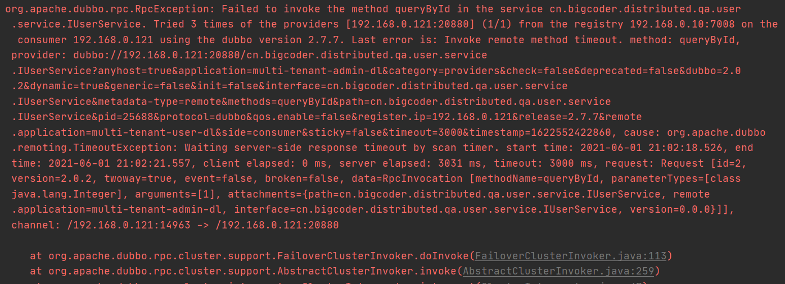
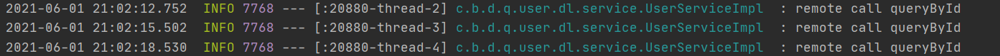

# Dubbo重试机制

## 一. timeout 与 retries 

Dubbo的服务可以通过`timeout`配置超时时间，防止远程调用失败，该属性的默认值为`1000`(ms)，用户可以在多个地方配置服务的超时时间：


图中涉及的配置方式从上至下优先级越来越低，总体来说配置覆盖遵循以下规律：consumer配置优先于provider配置，细粒度配置优先于整体配置。

我们在消费者中sleep一段时间人为制造超时效果：

```java
@DubboService(timeout = 3000)
@Slf4j
public class UserServiceImpl implements IUserService{
	@Override
    public UserDTO queryById(Integer userId) {
        if (userId == null) {
            throw new RuntimeException("参数不能为空");
        }
        log.info("remote call queryById");
        User user = userMapper.selectById(userId);
        try {
            Thread.sleep(5000);
        } catch (InterruptedException e) {
            e.printStackTrace();
        }
        return modelToDto(user);
    }
}
```

当我们消费者调用该服务时会出现超时异常：

```java
UserDTO userDTO = userService.queryById(1);
```



我们查看服务提供者的控制台，可以发现此次超时调用一个触发了3次：



在Dubbo中有一个参数`retries`，它表示消费者在调用远程服务时，出现超时等`RpcException`时会去最多重试调用N次服务，默认情况下`retries=2`这也是为什么在出现超时调用后，服务端会调用三次。

## 二. 集群容错机制

失败重试机制，在官方文档中称为[集群容错](https://dubbo.apache.org/zh/docs/v2.7/user/examples/fault-tolerent-strategy/)。

### 2.1 集群容错机制分类

Dubbo官方提供了多种失败重试机制，缺省值是`failover`。

- Failover Cluster：失败自动切换，当出现失败，重试其它服务器。通常用于读操作，但重试会带来更长延迟。可通过 `retries="2"` 来设置重试次数(不含第一次)。
- Failfast Cluster：快速失败，只发起一次调用，失败立即报错。通常用于非幂等性的写操作，比如新增记录。但是这里也会有问题的，如果是因为网络问题，Provider的响应时间慢，Consumer以为调用失败了，但是Provider却调用成功了，涉及到分布式事务的问题。
- Failsafe Cluster：失败安全，出现异常时，直接忽略。通常用于写入审计日志等操作。
- Failback Cluster：失败自动恢复。调用失败后，consumer不会重试，而是把这个消息丢到provider的重试的线程池里面，定时的重试调用一定的次数，调用失败写日志
- Forking Cluster：并行调用多个服务器，只要一个成功即返回。通常用于实时性要求较高的读操作，但需要浪费更多服务资源。可通过 `forks="2"` 来设置最大并行数。
- Broadcast Cluster：广播调用所有提供者，逐个调用，任意一台报错则报错。通常用于通知所有提供者更新缓存或日志等本地资源信息。现在广播调用中，可以通过 `broadcast.fail.percent `配置节点调用失败的比例，当达到这个比例后，`BroadcastClusterInvoker `将不再调用其他节点，直接抛出异常。` broadcast.fail.percent `取值在 0～100 范围内。默认情况下当全部调用失败后，才会抛出异常。 `broadcast.fail.percent` 只是控制的当失败后是否继续调用其他节点，并不改变结果(任意一台报错则报错)。`broadcast.fail.percent` 参数 在 `dubbo2.7.10 `及以上版本生效。

### 2.1 集群模式的配置

注解配置

```java
@reference(cluster = "broadcast", parameters = {"broadcast.fail.percent", "20"})
```

XML配置

```xml
<dubbo:service cluster="failsafe" />
<dubbo:reference cluster="failsafe" />
```

## 三. Failover Cluster

Dubbo默认使用的是`Failover Cluster`机制，如果不清楚这一机制那么写出的代码会有很多隐患。

服务的超时是开发人员不好控制的，如果某些时候因为机器负载波动导致一个写操作服务发生超时重试，那么就会出现重复写的问题，导致脏数据的产生。

Failover Cluster官方建议在读环境下使用，但是奈何很多同学都没有注意到这一点。


Failover Cluster的实现在`org.apache.dubbo.rpc.cluster.support.FailoverClusterInvoker`:

```java
public class FailoverClusterInvoker<T> extends AbstractClusterInvoker<T> {

    private static final Logger logger = LoggerFactory.getLogger(FailoverClusterInvoker.class);

    public FailoverClusterInvoker(Directory<T> directory) {
        super(directory);
    }

    @Override
    @SuppressWarnings({"unchecked", "rawtypes"})
    public Result doInvoke(Invocation invocation, final List<Invoker<T>> invokers, LoadBalance loadbalance) throws RpcException {
        List<Invoker<T>> copyInvokers = invokers;
        checkInvokers(copyInvokers , invocation);
        String methodName = RpcUtils.getMethodName(invocation);
        //最大调用次数 = 重试次数(retris) + 1
        int len = getUrl().getMethodParameter(methodName, RETRIES_KEY, DEFAULT_RETRIES) + 1;
        //防御性编程，防止用户将retris设置为小于0情况
        if (len <= 0) {
            len = 1;
        }
        // retry loop.
        RpcException le = null; // last exception.
        List<Invoker<T>> invoked = new ArrayList<Invoker<T>>(copyInvokers.size()); // invoked invokers.
        Set<String> providers = new HashSet<String>(len);
        // 调用N次，成功返回或provider抛出异常（不包括RpcException）后跳出勋魂
        for (int i = 0; i < len; i++) {
            //Reselect before retry to avoid a change of candidate `invokers`.
            //NOTE: if `invokers` changed, then `invoked` also lose accuracy.
            if (i > 0) {
                checkWhetherDestroyed();
                // 在进行重试前重新获取最新的invoker集合，这样做的好处是，如果在重试过程中某个服务挂了，通过list方法可以保证copyInvokes是最新的invoker列表
                copyInvokers = list(invocation);
                // check again
                checkInvokers(copyInvokers, invocation);
            }
            // 通过负载均衡策略选择一个Invoker
            Invoker<T> invoker = select(loadbalance, invocation, copyInvokers, invoked);
            // 维护已经调用过的invoker
            invoked.add(invoker);
            RpcContext.getContext().setInvokers((List) invoked);
            try {
                Result result = invoker.invoke(invocation);
                // 重试调用成功后才会进入这个if打印日志
                if (le != null && logger.isWarnEnabled()) {
                    logger.warn("Although retry the method " + methodName
                            + " in the service " + getInterface().getName()
                            + " was successful by the provider " + invoker.getUrl().getAddress()
                            + ", but there have been failed providers " + providers
                            + " (" + providers.size() + "/" + copyInvokers.size()
                            + ") from the registry " + directory.getUrl().getAddress()
                            + " on the consumer " + NetUtils.getLocalHost()
                            + " using the dubbo version " + Version.getVersion() + ". Last error is: "
                            + le.getMessage(), le);
                }
                return result;
            } catch (RpcException e) {
                // 如果是一个业务异常，则直接抛出异常。在Dubbo中继承至RuntimeException的自定义异常都会包装为RpcException，所以这里是为了判断是否是业务报错被封装成了RpcException
                // Dubbo这么设计是因为RuntimeException可以在接口未声明该异常的情况下抛出，而缺少了接口的约束会导致Consumer应用中可能出现未定义该异常的问题，最终导致序列化失败。
                if (e.isBiz()) { // biz exception.
                    throw e;
                }
                // 若不是则继续循环重试
                le = e;
            } catch (Throwable e) {
                le = new RpcException(e.getMessage(), e);
            } finally {
                providers.add(invoker.getUrl().getAddress());
            }
        }
        throw new RpcException(le.getCode(), "Failed to invoke the method "
                + methodName + " in the service " + getInterface().getName()
                + ". Tried " + len + " times of the providers " + providers
                + " (" + providers.size() + "/" + copyInvokers.size()
                + ") from the registry " + directory.getUrl().getAddress()
                + " on the consumer " + NetUtils.getLocalHost() + " using the dubbo version "
                + Version.getVersion() + ". Last error is: "
                + le.getMessage(), le.getCause() != null ? le.getCause() : le);
    }

}
```

