# Dubbo源码项目结构

## 一. 概述

本文主要分享 **Dubbo 的项目结构**。希望通过本文能让胖友对 Dubbo 的整体项目有个简单的了解。

在拉取 Dubbo 项目后，我们会发现拆分了很多 Maven 模块。是不是内心一紧，产生了恐惧感？不要慌，我们就是继续怼。

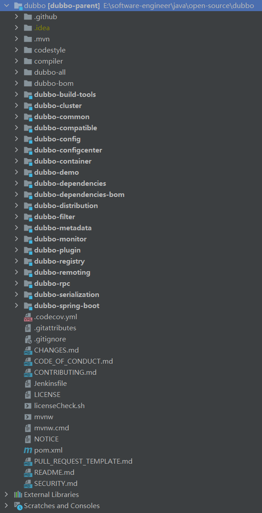

Dubbo 源码解析系列文章基于Dubbo 2.7.10版本进行，可以从 Github 上Fork一份代码：[Dubbo Github](https://github.com/apache/dubbo/tree/dubbo-2.7.10)

## 二. 项目一览

如果胖友看过 Dubbo 框架设计 ，就会发现有下面这张图。

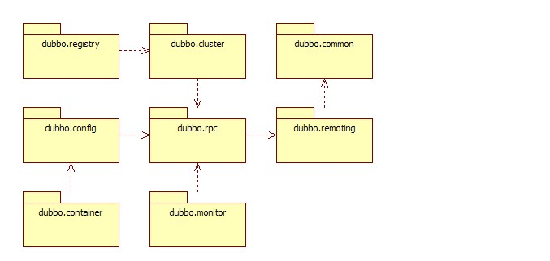

通过这图，我们可以很清晰的知道几个 Maven 模块的依赖关系。

### 2.1 dubbo-common

`dubbo-common` 公共逻辑模块：提供工具类和通用模型。

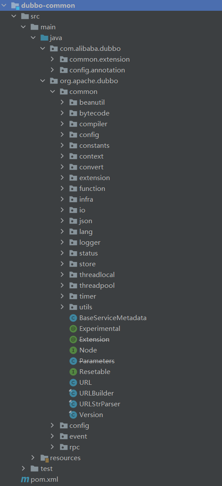

### 2.2 dubbo-remoting

`dubbo-remoting` 远程通信模块：提供**通用的**客户端和服务端的通讯功能。

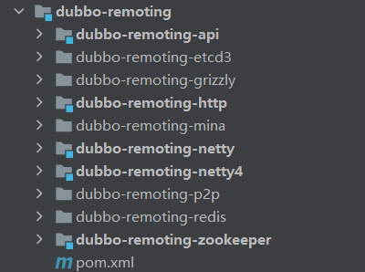

- `dubbo-remoting-zookeeper` ，相当于 Zookeeper Client ，和 Zookeeper Server 通信。
- `dubbo-remoting-api` ， 定义了 Dubbo Client 和 Dubbo Server 的**接口**。
- 实现 `dubbo-remoting-api`
  - `dubbo-remoting-grizzly` ，基于 [Grizzly](https://javaee.github.io/grizzly/) 实现。
  - `dubbo-remoting-http` ，基于 [Jetty](https://www.eclipse.org/jetty/) 或 [Tomcat](http://tomcat.apache.org/) 实现。
  - `dubbo-remoting-mina` ，基于 [Mina](https://mina.apache.org/) 实现。
  - `dubbo-remoting-netty` ，基于 [Netty 3](https://netty.io/) 实现。
  - `dubbo-remoting-netty4` ，基于 [Netty 4](https://netty.io/) 实现。
  - `dubbo-remoting-p2p` ，P2P 服务器。注册中心 `dubbo-registry-multicast` 项目的使用该项目。

从**最小化**的角度来看，我们只需要看：

- `dubbo-remoting-api` + `dubbo-remoting-netty4`
- `dubbo-remoting-zookeeper`

### 2.3 dubbo-rpc

`dubbo-rpc` 远程调用模块：抽象各种协议，以及动态代理，只包含一对一的调用，**不关心集群的管理**。

- 集群相关的管理，由 `dubbo-cluster` 提供特性。

在回过头看上面的图，我们会发现，`dubbo-rpc` 是整个 Dubbo 的**中心**。

- `dubbo-rpc-api` ，**抽象**各种协议以及动态代理，**实现**了一对一的调用。
- 其他模块，实现 `dubbo-rpc-api` ，提供对应的协议实现。
- 另外，`dubbo-rpc-default` 对应 `dubbo://` 协议。

### 2.4 dubbo-cluster

`dubbo-cluster` 集群模块：将多个服务提供方伪装为一个提供方，包括：负载均衡, 集群容错，路由，分组聚合等。集群的地址列表可以是静态配置的，也可以是由注册中心下发。

- 注册中心下发，由 `dubbo-registry` 提供特性。

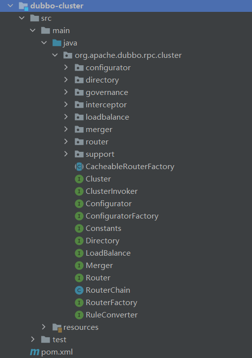

- 容错
  - `org.apache.dubbo.rpc.cluster.Cluster`接口 + `org.apache.dubbo.rpc.cluster.support` 包。
  - Cluster 将 Directory 中的多个 Invoker 伪装成一个 Invoker，对上层透明，伪装过程包含了容错逻辑，调用失败后，重试另一个。
  - 拓展参见 [《Dubbo 用户指南 —— 集群容错》](https://dubbo.apache.org/zh/docs3-v2/java-sdk/advanced-features-and-usage/service/fault-tolerent-strategy/) 和 [《Dubbo 开发指南 —— 集群扩展》](https://dubbo.apache.org/zh/docs3-v2/java-sdk/reference-manual/spi/description/cluster/) 文档。
- 目录
  - `org.apache.dubbo.rpc.cluster.Directory` 接口 + `org.apache.dubbo.rpc.cluster.directory` 包。
  - Directory 代表了多个 Invoker ，可以把它看成 List ，但与 List 不同的是，它的值可能是动态变化的，比如注册中心推送变更。
- 路由
  - `org.apache.dubbo.rpc.cluster.Router` 接口 + `org.apache.dubbo.rpc.cluster.router` 包。
  - 负责从多个 `Invoker` 中按路由规则选出子集，比如读写分离，应用隔离等。
- 配置
  - `org.apache.dubbo.rpc.cluster.Configurator` 接口 + `org.apache.dubbo.rpc.cluster.configurator` 包。
- 负载均衡
  - `org.apache.dubbo.rpc.cluster.LoadBalance` 接口 + `org.apache.dubbo.rpc.cluster.loadbalance` 包。
  - LoadBalance 负责从多个 Invoker 中选出具体的一个用于本次调用，选的过程包含了负载均衡算法，调用失败后，需要重选。
- 合并结果
  - `org.apache.dubbo.rpc.cluster.Merger` 接口 + `org.apache.dubbo.rpc.cluster.merger` 包。
  - 合并返回结果，用于分组聚合。
  - 拓展参见 [《Dubbo 用户指南 —— 分组聚合》](https://dubbo.apache.org/zh/docs3-v2/java-sdk/advanced-features-and-usage/service/group-merger/) 和 [《Dubbo 开发指南 —— 合并结果扩展》](https://dubbo.apache.org/zh/docs3-v2/java-sdk/reference-manual/spi/description/merger/) 文档。

整体流程如下：

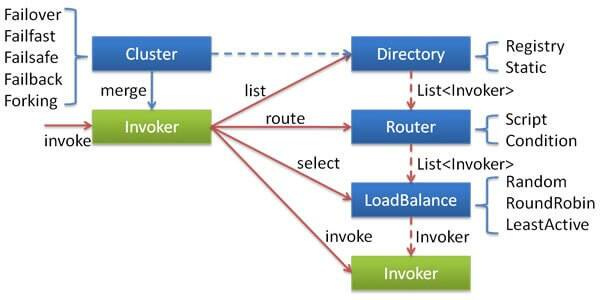

### 2.5 dubbo-registry

`dubbo-registry` 注册中心模块：基于注册中心下发地址的集群方式，以及对各种注册中心的抽象。

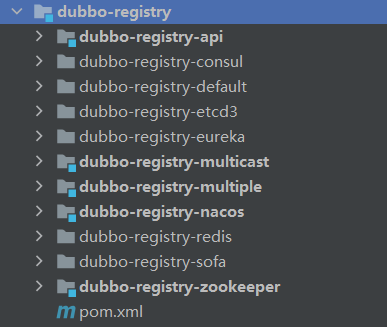

- `dubbo-registry-api` ，**抽象**注册中心的注册与发现接口。
- 其他模块，实现 `dubbo-registry-api` ，提供对应的注册中心实现。在 [《用户指南 —— 注册中心参考手册》](https://dubbo.apache.org/zh/docs/v2.7/user/references/registry/) 中，可以看到每种注册中心的介绍。
- 另外，`dubbo-registry-default` 对应 Simple 注册中心。
- 拓展参见 [《Dubbo 开发指南 —— 注册中心扩展》](https://dubbo.apache.org/zh/docs/v3.0/references/spis/registry/#m-zhdocsv30referencesspisregistry) 文档。

### 2.6 dubbo-monitor

`dubbo-monitor` 监控模块：统计服务调用次数，调用时间的，调用链跟踪的服务。

- 拓展参见 [《Dubbo 开发指南 —— 监控中心扩展》](https://dubbo.apache.org/zh/docs/v3.0/references/spis/monitor/#m-zhdocsv30referencesspismonitor) 。

目前社区里，有对 Dubbo 监控中心进行重构的项目，例如 ：

- https://github.com/handuyishe/dubbo-monitor
- https://github.com/zhongxig/dubbo-d-monitor

### 2.7 dubbo-config

`dubbo-config` 配置模块：是 Dubbo 对外的 API，用户通过 Config 使用 Dubbo，隐藏 Dubbo 所有细节。

- `dubbo-config-api` ，实现了 [API 配置](https://dubbo.apache.org/zh/docs/v3.0/references/configuration/api/) 和 [属性配置](https://dubbo.apache.org/zh/docs/v2.7/user/configuration/properties/) 功能。
- `dubbo-config-spring` ，实现了 [XML 配置](https://dubbo.apache.org/zh/docs/v3.0/languages/java/configuration/xml/) 和 [注解配置](https://dubbo.apache.org/zh/docs/v2.7/user/configuration/annotation/) 功能。

推荐阅读 [配置设计 | Apache Dubbo](https://dubbo.apache.org/zh/docs/v2.7/dev/principals/configuration/)

### 2.8 dubbo-container

`dubbo-container` 容器模块：是一个 Standlone 的容器，以简单的 Main 加载 Spring 启动，因为服务通常不需要 Tomcat/JBoss 等 Web 容器的特性，没必要用 Web 容器去加载服务。

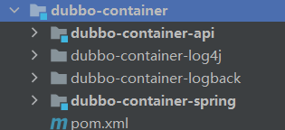

- `dubbo-container-api` ：定义了 `org.apache.dubbo.container.Container` 接口，并提供 加载所有容器启动的 Main 类。
- 实现 `dubbo-container-api`
  - `dubbo-container-spring` ，提供了 `org.apache.dubbo.container.spring.SpringContainer` 。
- 拓展参考 [《Dubbo 用户指南 —— 服务容器》](https://dubbo.apache.org/zh/docs/v3.0/references/features/service-container/) 和 [《Dubbo 开发指南 —— 容器扩展》](https://dubbo.apache.org/zh/docs/v3.0/references/spis/container/) 文档。

### 3.9 dubbo-filter

[`dubbo-filter`](https://github.com/alibaba/dubbo/tree/4bbc0ddddacc915ddc8ff292dd28745bbc0031fd/dubbo-filter) 过滤器模块：提供了内置的过滤器。

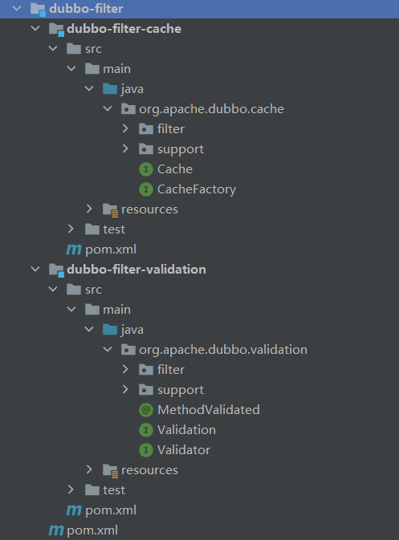

- dubbo-filter-cache ，缓存过滤器。
  - 拓展参考 [《Dubbo 用户指南 —— 结果缓存》](https://dubbo.apache.org/zh/docs/v2.7/user/examples/result-cache/) 和 [《Dubbo 开发指南 —— 缓存拓展》](https://dubbo.apache.org/zh/docs/v2.7/dev/impls/cache/) 文档。
- dubbo-filter-validation，参数验证过滤器。
  - 拓展参考 [《Dubbo 用户指南 —— 参数验证》](https://dubbo.apache.org/zh/docs/v2.7/user/examples/parameter-validation/) 和 [《Dubbo 开发指南 —— 验证扩展》](https://dubbo.apache.org/zh/docs/v2.7/dev/impls/validation/) 文档。

### 2.10 dubbo-plugin

[`dubbo-plugin`](https://github.com/alibaba/dubbo/tree/4bbc0ddddacc915ddc8ff292dd28745bbc0031fd/dubbo-plugin) 插件模块：提供了内置的插件。

- dubbo-qos，提供在线运维命令。
  - 拓展参考 [《在线运维命令参考手册》](https://dubbo.apache.org/zh/docs/v3.0/references/configuration/references/qos/) 和 [《Dubbo 开发指南 —— Telnet 命令扩展》](https://dubbo.apache.org/zh/docs/v3.0/references/spis/telnet-handler/) 文档。

### 2.11 dubbo-dependencies-bom

`dubbo-dependencies-bom/pom.xml`，Maven BOM(Bill Of Materials) ，统一定义了 Dubbo 依赖的三方库的版本号：

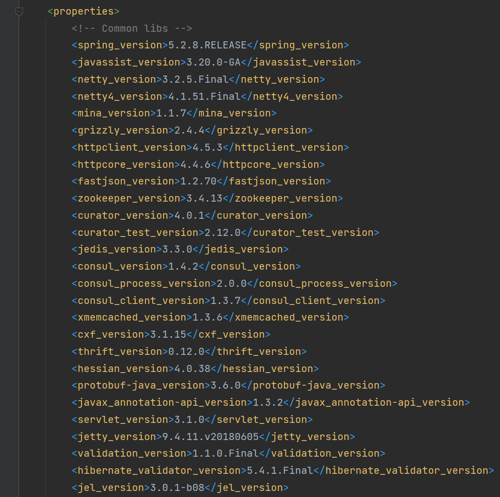

`dubbo-parent` 会引入该 BOM ：

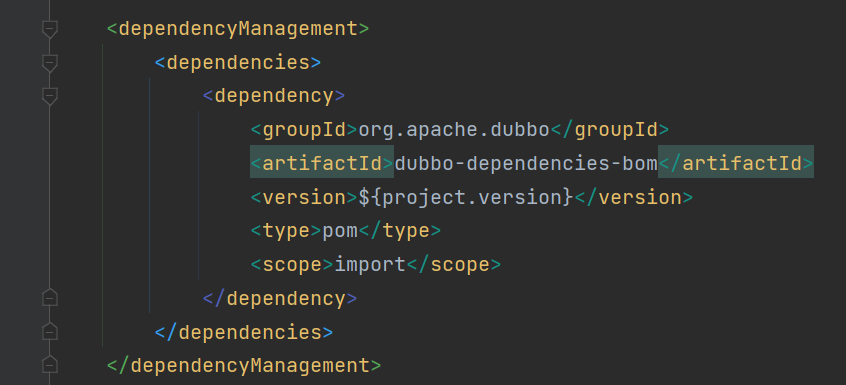