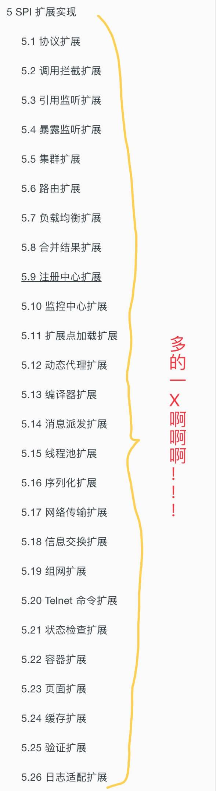
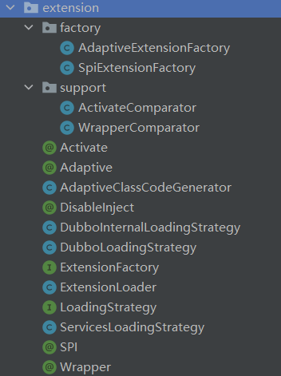
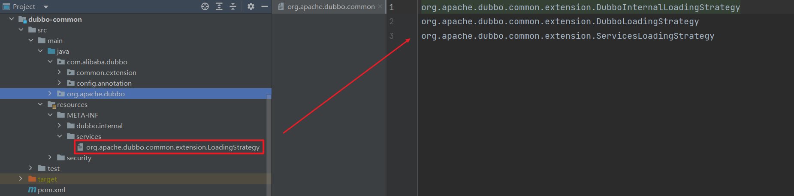
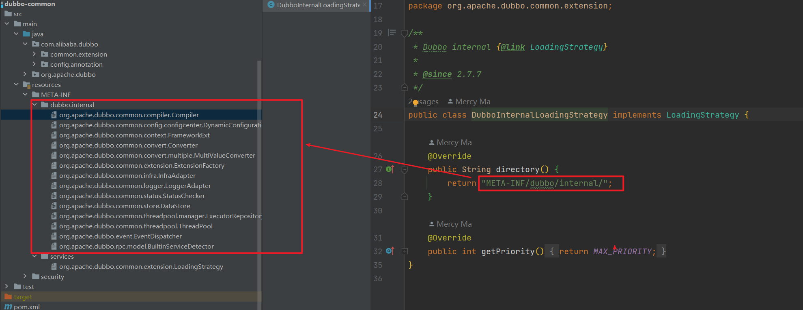
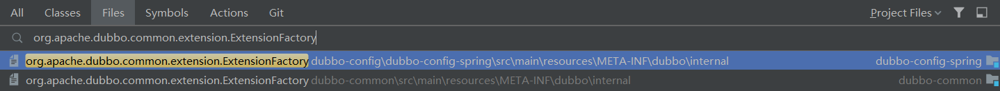
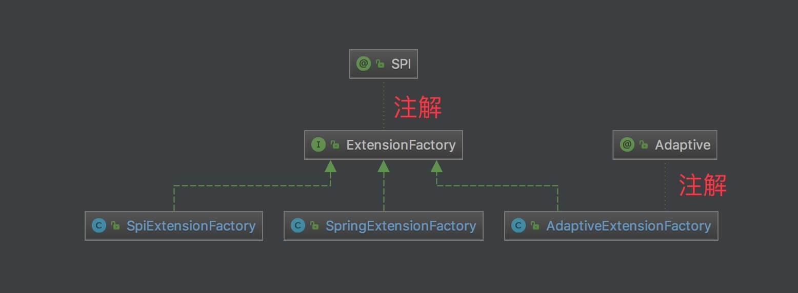

# Dubbo SPI

## 一. 概述

本文主要分享 **Dubbo 的拓展机制 SPI**。

想要理解 Dubbo ，理解 Dubbo SPI 是非常必须的。在 Dubbo 中，提供了大量的**拓展点**，基于 Dubbo SPI 机制加载。如下图所示：



> Dubbo SPI官方文档：[Dubbo SPI 概述 | Apache Dubbo](https://dubbo.apache.org/zh/docs3-v2/java-sdk/reference-manual/spi/overview/)

## 二. Dubbo SPI特性

在看具体的 Dubbo SPI 实现之前，我们先理解 Dubbo SPI 产生的背景：

Dubbo 的扩展点加载从 JDK 标准的 SPI (Service Provider Interface) 扩展点发现机制加强而来。

Dubbo 改进了 JDK 标准的 SPI 的以下问题：

1. JDK 标准的 SPI 会一次性实例化扩展点所有实现，如果有扩展实现初始化很耗时，但如果没用上也加载，会很浪费资源。
2. 如果扩展点加载失败，连扩展点的名称都拿不到了。比如：JDK 标准的 ScriptEngine，通过 getName() 获取脚本类型的名称，但如果 RubyScriptEngine 因为所依赖的 jruby.jar 不存在，导致 RubyScriptEngine 类加载失败，这个失败原因被吃掉了，和 ruby 对应不起来，当用户执行 ruby 脚本时，会报不支持 ruby，而不是真正失败的原因。
3. 增加了对扩展点 IoC 和 AOP 的支持，一个扩展点可以直接 setter 注入其它扩展点。

用户能够基于 Dubbo 提供的扩展能力，很方便基于自身需求扩展其他协议、过滤器、路由等。下面介绍下 Dubbo 扩展能力的特性。

- 按需加载。Dubbo 的扩展能力不会一次性实例化所有实现，而是用那个扩展类则实例化那个扩展类，减少资源浪费。
- 增加扩展类的 IOC 能力。Dubbo 的扩展能力并不仅仅只是发现扩展服务实现类，而是在此基础上更进一步，如果该扩展类的属性依赖其他对象，则 Dubbo 会自动的完成该依赖对象的注入功能。
- 增加扩展类的 AOP 能力。Dubbo 扩展能力会自动的发现扩展类的包装类，完成包装类的构造，增强扩展类的功能。
- 具备动态选择扩展实现的能力。Dubbo 扩展会基于参数，在运行时动态选择对应的扩展类，提高了 Dubbo 的扩展能力。
- 可以对扩展实现进行排序。能够基于用户需求，指定扩展实现的执行顺序。
- 提供扩展点的 Adaptive 能力。该能力可以使的一些扩展类在 consumer 端生效，一些扩展类在 provider 端生效。

从 Dubbo 扩展的设计目标可以看出，Dubbo 实现的一些例如动态选择扩展实现、IOC、AOP 等特性，能够为用户提供非常灵活的扩展能力。

## 三. 代码结构

Dubbo SPI 在 `dubbo-common` 的 `org.apache.dubbo.common.extension` 包实现，如下图所示：



## 四. ExtensionLoader

`org.apache.dubbo.common.extension.ExtensionLoader` ，拓展加载器。这是 Dubbo SPI 的**核心**。

### 4.1 属性

```java
 /**
     * 拓展加载器集合
     */
    private static final ConcurrentMap<Class<?>, ExtensionLoader<?>> EXTENSION_LOADERS = new ConcurrentHashMap<>(64);

    /**
     * 拓展加载器集合
     * key：拓展接口
     */
    private static final ConcurrentMap<Class<?>, Object> EXTENSION_INSTANCES = new ConcurrentHashMap<>(64);
    /**
     * 拓展接口
     */
    private final Class<?> type;
    /**
     * 对象工厂
     *
     * 用于调用 {@link #injectExtension(Object)} 方法，向拓展对象注入依赖属性。
     *
     * 例如，StubProxyFactoryWrapper 中有 `Protocol protocol` 属性。
     */
    private final ExtensionFactory objectFactory;
    /**
     * 缓存的拓展名与拓展类的映射。
     *
     * 和 {@link #cachedClasses} 的 KV 对调。
     *
     * 通过 {@link #loadExtensionClasses} 加载
     */
    private final ConcurrentMap<Class<?>, String> cachedNames = new ConcurrentHashMap<>();

    /**
     * 缓存的拓展实现类集合。
     *
     * 不包含如下两种类型：
     *  1. 自适应拓展实现类。例如 AdaptiveExtensionFactory
     *  2. 带唯一参数为拓展接口的构造方法的实现类，或者说拓展 Wrapper 实现类。例如，ProtocolFilterWrapper 。
     *   拓展 Wrapper 实现类，会添加到 {@link #cachedWrapperClasses} 中
     *
     * 通过 {@link #loadExtensionClasses} 加载
     */
    private final Holder<Map<String, Class<?>>> cachedClasses = new Holder<>();
    /**
     * 拓展名与 @Activate 的映射
     *
     * 例如，AccessLogFilter。
     *
     * 用于 {@link #getActivateExtension(URL, String)}
     */
    private final Map<String, Object> cachedActivates = new ConcurrentHashMap<>();
    /**
     * 缓存的拓展对象集合
     *
     * key：拓展名
     * value：拓展对象
     *
     * 例如，Protocol 拓展
     *      key：dubbo value：DubboProtocol
     *      key：injvm value：InjvmProtocol
     *
     * 通过 {@link #loadExtensionClasses} 加载
     */
    private final ConcurrentMap<String, Holder<Object>> cachedInstances = new ConcurrentHashMap<>();
    /**
     * 缓存的自适应( Adaptive )拓展对象
     */
    private final Holder<Object> cachedAdaptiveInstance = new Holder<>();
    /**
     * 缓存的自适应拓展对象的类
     *
     * {@link #getAdaptiveExtensionClass()}
     */
    private volatile Class<?> cachedAdaptiveClass = null;
    /**
     * 缓存的默认拓展名
     *
     * 通过 {@link SPI} 注解获得
     */
    private String cachedDefaultName;
    /**
     * 创建 {@link #cachedAdaptiveInstance} 时发生的异常。
     *
     * 发生异常后，不再创建，参见 {@link #createAdaptiveExtension()}
     */
    private volatile Throwable createAdaptiveInstanceError;
    /**
     * 拓展 Wrapper 实现类集合
     *
     * 带唯一参数为拓展接口的构造方法的实现类
     *
     * 通过 {@link #loadExtensionClasses} 加载
     */
    private Set<Class<?>> cachedWrapperClasses;
    /**
     * 拓展名 与 加载对应拓展类发生的异常 的 映射
     *
     * key：拓展名
     * value：异常
     *
     * 在 {@link #loadFile(Map, String)} 时，记录
     */
    private Map<String, IllegalStateException> exceptions = new ConcurrentHashMap<>();

    private static volatile LoadingStrategy[] strategies = loadLoadingStrategies();
```

我们将属性分成了两类：1）静态属性；2）对象属性。这是为啥呢？

- 【静态属性】一方面，ExtensionLoader 是 ExtensionLoader 的**管理容器**。一个拓展( 拓展接口 )对应一个 ExtensionLoader 对象。例如，Protocol 和 Filter **分别**对应一个 ExtensionLoader 对象。
- 【对象属性】另一方面，一个拓展通过其 ExtensionLoader 对象，加载它的拓展实现们。我们会发现多个属性都是 “cached” 开头。ExtensionLoader 考虑到性能和资源的优化，读取拓展配置后，会首先进行**缓存**。等到 Dubbo 代码**真正**用到对应的拓展实现时，进行拓展实现的对象的初始化。并且，初始化完成后，也会进行**缓存**。也就是说：
  - 缓存加载的拓展配置
  - 缓存创建的拓展实现对象

### 4.2 获得拓展配置

#### 4.2.1 getExtensionClasses

```java
    /**
     * 缓存的拓展实现类集合。
     *
     * 不包含如下两种类型：
     *  1. 自适应拓展实现类。例如 AdaptiveExtensionFactory
     *  2. 带唯一参数为拓展接口的构造方法的实现类，或者说拓展 Wrapper 实现类。例如，ProtocolFilterWrapper 。
     *   拓展 Wrapper 实现类，会添加到 {@link #cachedWrapperClasses} 中
     *
     * 通过 {@link #loadExtensionClasses} 加载
     */
    private final Holder<Map<String, Class<?>>> cachedClasses = new Holder<>();
    /**
     * 缓存的自适应拓展对象的类
     *
     * {@link #getAdaptiveExtensionClass()}
     */
    private volatile Class<?> cachedAdaptiveClass = null;
    /**
     * 拓展 Wrapper 实现类集合
     *
     * 带唯一参数为拓展接口的构造方法的实现类
     *
     * 通过 {@link #loadExtensionClasses} 加载
     */
    private Set<Class<?>> cachedWrapperClasses;


	/**
     * 获得拓展实现
     *
     * @return 拓展实现类数组
     */
    private Map<String, Class<?>> getExtensionClasses() {
        // 从缓存中，获得拓展实现类数组
        Map<String, Class<?>> classes = cachedClasses.get();
        if (classes == null) {
            synchronized (cachedClasses) {
                classes = cachedClasses.get();
                if (classes == null) {
                    // 从配置文件中，加载拓展实现类数组
                    classes = loadExtensionClasses();
                    // 设置到缓存中
                    cachedClasses.set(classes);
                }
            }
        }
        return classes;
    }
```

- cachedClasses属性，缓存的拓展实现类集合。它不包含如下两种类型的拓展实现：
  - 自适应拓展实现类。例如 AdaptiveExtensionFactory 。
    - 拓展 Adaptive 实现类，会添加到 `cachedAdaptiveClass` 属性中。
  - 带唯一参数为拓展接口的构造方法的实现类，或者说拓展 Wrapper 实现类。例如，ProtocolFilterWrapper 。
    - 拓展 Wrapper 实现类，会添加到 `cachedWrapperClasses` 属性中。
  - 总结来说，`cachedClasses` + `cachedAdaptiveClass` + `cachedWrapperClasses` 才是**完整**缓存的拓展实现类的配置。

#### 4.2.2 loadExtensionClasses

```java
    private Map<String, Class<?>> loadExtensionClasses() {
        // 加载默认的拓展名
        cacheDefaultExtensionName();

        Map<String, Class<?>> extensionClasses = new HashMap<>();

        // 循环加载策略，加载对应的拓展实现
        for (LoadingStrategy strategy : strategies) {
            loadDirectory(extensionClasses, strategy.directory(), type.getName(), strategy.preferExtensionClassLoader(), strategy.overridden(), strategy.excludedPackages());
            // 为了兼容 2.7 之前的老版本。在2.7之前，Dubbo还未进入Apache孵化，包名还是Alibaba
            loadDirectory(extensionClasses, strategy.directory(), type.getName().replace("org.apache", "com.alibaba"), strategy.preferExtensionClassLoader(), strategy.overridden(), strategy.excludedPackages());
        }

        return extensionClasses;
    }
```

第一步：加载默认的扩展名

第二步：遍历加载策略数组，去加载不同文件夹下的扩展。

strategies属性是在启动时，在 `loadLoadingStrategies` 方法中通过 Java SPI 加载的 `LoadingStrategy` 接口的实现类。

```java
    private static volatile LoadingStrategy[] strategies = loadLoadingStrategies();

    private static LoadingStrategy[] loadLoadingStrategies() {
        return stream(load(LoadingStrategy.class).spliterator(), false)
                .sorted()
                .toArray(LoadingStrategy[]::new);
    }
```

它会读取 `META-INF/services` 下的 `org.apache.dubbo.common.extension.LoadingStrategy` 文件中注册的实现类：



这些实现类中会指定，需要加载的拓展的配置文件路径：

```java
public class DubboInternalLoadingStrategy implements LoadingStrategy {

    // 加载 META-INF/dubbo/internal/ 下的扩展实现
    @Override
    public String directory() {
        return "META-INF/dubbo/internal/";
    }

    @Override
    public int getPriority() {
        return MAX_PRIORITY;
    }
}
```



**loadDirectory方法**

```java
    private void loadDirectory(Map<String, Class<?>> extensionClasses, String dir, String type,
                               boolean extensionLoaderClassLoaderFirst, boolean overridden, String... excludedPackages) {
        // 获得完整的文件名( 相对路径 )。例如："META-INF/dubbo/internal/com.alibaba.dubbo.common.extension.ExtensionFactory" 。
        String fileName = dir + type;// 第4行
        try {
            // 获得文件名对应的所有文件数组
            Enumeration<java.net.URL> urls = null;
            ClassLoader classLoader = findClassLoader();

            // try to load from ExtensionLoader's ClassLoader first
            if (extensionLoaderClassLoaderFirst) {
                ClassLoader extensionLoaderClassLoader = ExtensionLoader.class.getClassLoader();
                if (ClassLoader.getSystemClassLoader() != extensionLoaderClassLoader) {
                    urls = extensionLoaderClassLoader.getResources(fileName);
                }
            }

            if (urls == null || !urls.hasMoreElements()) { // 第 18 行
                if (classLoader != null) {
                    urls = classLoader.getResources(fileName);
                } else {
                    urls = ClassLoader.getSystemResources(fileName);
                }
            } // 第 24 行

            if (urls != null) {
                while (urls.hasMoreElements()) { // 第 27 行
                    java.net.URL resourceURL = urls.nextElement();
                    // 加载指定配置文件（resourceURL）下的实现
                    loadResource(extensionClasses, classLoader, resourceURL, overridden, excludedPackages);
                }
            } // 第 32 行
        } catch (Throwable t) {
            logger.error("Exception occurred when loading extension class (interface: " +
                    type + ", description file: " + fileName + ").", t);
        }
    }
```

- 第 4 行：获得完整的文件名( 相对路径 )。例如：`"META-INF/dubbo/internal/com.alibaba.dubbo.common.extension.ExtensionFactory"` 。

- 第 18 至 24 行：获得文件名对应的所有文件 URL 数组。例如：

  

- 第 27 至 32 行：遍历逐个**文件**。

**loadResource方法**

```java
    private void loadResource(Map<String, Class<?>> extensionClasses, ClassLoader classLoader,
                              java.net.URL resourceURL, boolean overridden, String... excludedPackages) {
        try {
            try (BufferedReader reader = new BufferedReader(new InputStreamReader(resourceURL.openStream(), StandardCharsets.UTF_8))) {
                String line;
                String clazz = null;
                while ((line = reader.readLine()) != null) {
                    // 去除 #注释
                    final int ci = line.indexOf('#');
                    if (ci >= 0) {
                        line = line.substring(0, ci);
                    }
                    line = line.trim();
                    if (line.length() > 0) {
                        try {
                            // 拆分，key=value 的配置格式
                            String name = null;
                            int i = line.indexOf('=');
                            if (i > 0) {
                                name = line.substring(0, i).trim();
                                clazz = line.substring(i + 1).trim();
                            } else {
                                // Dubbo SPI 会兼容 Java SPI 的配置格式，那么按照此处的解析方式，name 会为空。这种情况下，拓展名会自动生成
                                clazz = line;
                            }
                            if (StringUtils.isNotEmpty(clazz) && !isExcluded(clazz, excludedPackages)) {
                                // 加载配置文件配置拓展的实现类
                                loadClass(extensionClasses, resourceURL, Class.forName(clazz, true, classLoader), name, overridden);
                            }
                        } catch (Throwable t) {
                            IllegalStateException e = new IllegalStateException("Failed to load extension class (interface: " + type + ", class line: " + line + ") in " + resourceURL + ", cause: " + t.getMessage(), t);
                            exceptions.put(line, e);
                        }
                    }
                }
            }
        } catch (Throwable t) {
            logger.error("Exception occurred when loading extension class (interface: " +
                    type + ", class file: " + resourceURL + ") in " + resourceURL, t);
        }
    }
```

- 第 7 行：进入文件内部，逐**行**遍历。

**loadClass方法**

```java
    private void loadClass(Map<String, Class<?>> extensionClasses, java.net.URL resourceURL, Class<?> clazz, String name,
                           boolean overridden) throws NoSuchMethodException {
        // 判断拓展实现，是否实现拓展接口
        if (!type.isAssignableFrom(clazz)) {
            throw new IllegalStateException("Error occurred when loading extension class (interface: " +
                    type + ", class line: " + clazz.getName() + "), class "
                    + clazz.getName() + " is not subtype of interface.");
        }
        // 检测目标类上是否有 Adaptive 注解
        if (clazz.isAnnotationPresent(Adaptive.class)) {
            // 缓存自适应拓展对象的类到 `cachedAdaptiveClass`
            cacheAdaptiveClass(clazz, overridden);
        } else if (isWrapperClass(clazz)) {
            // 检测 clazz 是否是 Wrapper 类型
            // 缓存拓展 Wrapper 实现类到 `cachedWrapperClasses`
            cacheWrapperClass(clazz);
        } else {
            // 程序进入此分支，表明 clazz 是一个普通的拓展类
            clazz.getConstructor();
            // 未配置拓展名，自动生成。例如，DemoFilter 为 demo 。主要用于兼容 Java SPI 的配置。
            if (StringUtils.isEmpty(name)) {
                // 如果 name 为空，则尝试从 Extension 注解中获取 name，或使用小写的类名作为 name
                name = findAnnotationName(clazz);
                if (name.length() == 0) {
                    throw new IllegalStateException("No such extension name for the class " + clazz.getName() + " in the config " + resourceURL);
                }
            }

            // 获得拓展名，可以是数组，有多个拓展名。
            String[] names = NAME_SEPARATOR.split(name);
            if (ArrayUtils.isNotEmpty(names)) {
                // 缓存 @Activate 到 `cachedActivates` 。
                cacheActivateClass(clazz, names[0]);
                for (String n : names) {
                    // 缓存到 `cachedNames`
                    cacheName(clazz, n);
                    // 若 isWrapperClass 方法获取构造方法失败，则代表是普通的拓展实现类，缓存到 extensionClasses 变量中
                    saveInExtensionClass(extensionClasses, clazz, n, overridden);
                }
            }
        }
    }
```

### 4.3 获得拓展加载器

在 Dubbo 的代码里，常常能看到如下的代码：

```java
ExtensionLoader.getExtensionLoader(Protocol.class).getExtension(name)
```

#### 4.3.1 getExtensionLoader

```java
    /**
      * 根据拓展点的接口，获得拓展加载器
      *
      * @param type 接口
      * @param <T> 泛型
      * @return 加载器
      */
    public static <T> ExtensionLoader<T> getExtensionLoader(Class<T> type) {
        if (type == null) {
            throw new IllegalArgumentException("Extension type == null");
        }
        // 必须是接口
        if (!type.isInterface()) {
            throw new IllegalArgumentException("Extension type (" + type + ") is not an interface!");
        }
        // 必须包含 @SPI 注解
        if (!withExtensionAnnotation(type)) {
            throw new IllegalArgumentException("Extension type (" + type +
                    ") is not an extension, because it is NOT annotated with @" + SPI.class.getSimpleName() + "!");
        }

        // 获得接口对应的拓展点加载器
        ExtensionLoader<T> loader = (ExtensionLoader<T>) EXTENSION_LOADERS.get(type);
        if (loader == null) {
            // 若不存在，则创建 ExtensionLoader 对象，并添加到 EXTENSION_LOADERS。
            EXTENSION_LOADERS.putIfAbsent(type, new ExtensionLoader<T>(type));
            loader = (ExtensionLoader<T>) EXTENSION_LOADERS.get(type);
        }
        return loader;
    }
```

#### 4.3.2 构造方法

构造方法，代码如下：

```java
/**
 * 拓展接口。
 * 例如，Protocol
 */
private final Class<?> type;
/**
 * 对象工厂
 *
 * 用于调用 {@link #injectExtension(Object)} 方法，向拓展对象注入依赖属性。
 *
 * 例如，StubProxyFactoryWrapper 中有 `Protocol protocol` 属性。
 */
private final ExtensionFactory objectFactory;

private ExtensionLoader(Class<?> type) {
    this.type = type;
    objectFactory = (type == ExtensionFactory.class ? null : ExtensionLoader.getExtensionLoader(ExtensionFactory.class).getAdaptiveExtension()); // 第 17 行
}
```

- `objectFactory` 属性，对象工厂，**功能上和 Spring IOC 一致**。
  - 用于调用 `#injectExtension(instance)` 方法时，向创建的拓展注入其依赖的属性。例如，`CacheFilter.cacheFactory` 属性。
  - 第 17 行：当拓展接口非 ExtensionFactory 时（如果不加这个判断，会是一个死循环），调用 `ExtensionLoader#getAdaptiveExtension()` 方法，获得 ExtensionFactory 拓展接口的**自适应**拓展实现对象。**为什么呢**？在 后文详细解释。

### 4.4 获得指定拓展对象

在 Dubbo 的代码里，常常能看到如下的代码：

```java
ExtensionLoader.getExtensionLoader(Protocol.class).getExtension(name)
```

#### 4.4.1 getExtension

```java
     /**
      * 返回指定名字的扩展对象。如果指定名字的扩展不存在，则抛异常 {@link IllegalStateException}.
      *
      * @param name 拓展名
      * @return 拓展对象
      */
    @SuppressWarnings("unchecked")
    public T getExtension(String name) {
        return getExtension(name, true);
    }

    public T getExtension(String name, boolean wrap) {
        if (StringUtils.isEmpty(name)) {
            throw new IllegalArgumentException("Extension name == null");
        }
        // 查找 默认的 拓展对象
        if ("true".equals(name)) {
            return getDefaultExtension();
        }
        // 从 缓存中 获得对应的拓展对象
        final Holder<Object> holder = getOrCreateHolder(name);
        Object instance = holder.get();
        if (instance == null) {
            synchronized (holder) {
                instance = holder.get();
                // 从 缓存中 未获取到，进行创建缓存对象。
                if (instance == null) {
                    instance = createExtension(name, wrap);
                    // 设置创建对象到缓存中
                    holder.set(instance);
                }
            }
        }
        return (T) instance;
    }
```

#### 4.4.2 createExtension

`#createExtension(name)` 方法，创建拓展名的拓展对象，并缓存。代码如下：

```java
    /**
     * 创建拓展名的拓展对象，并缓存。
     *
     * @param name 拓展名
     * @return 拓展对象
     */
    @SuppressWarnings("unchecked")
    private T createExtension(String name, boolean wrap) {
        // 获得拓展名对应的拓展实现类
        Class<?> clazz = getExtensionClasses().get(name);
        if (clazz == null) {
            throw findException(name);
        }
        try {
            // 从缓存中，获得拓展对象。
            T instance = (T) EXTENSION_INSTANCES.get(clazz);
            if (instance == null) {
                // 当缓存不存在时，创建拓展对象，并添加到缓存中。
                EXTENSION_INSTANCES.putIfAbsent(clazz, clazz.getDeclaredConstructor().newInstance());
                instance = (T) EXTENSION_INSTANCES.get(clazz);
            }
            // 注入依赖的属性
            injectExtension(instance);


            if (wrap) {

                List<Class<?>> wrapperClassesList = new ArrayList<>();
                if (cachedWrapperClasses != null) {
                    wrapperClassesList.addAll(cachedWrapperClasses);
                    wrapperClassesList.sort(WrapperComparator.COMPARATOR);
                    Collections.reverse(wrapperClassesList);
                }

                if (CollectionUtils.isNotEmpty(wrapperClassesList)) {
                    for (Class<?> wrapperClass : wrapperClassesList) {
                        Wrapper wrapper = wrapperClass.getAnnotation(Wrapper.class);
                        if (wrapper == null
                                || (ArrayUtils.contains(wrapper.matches(), name) && !ArrayUtils.contains(wrapper.mismatches(), name))) {
                            // 创建 Wrapper 拓展对象
                            instance = injectExtension((T) wrapperClass.getConstructor(type).newInstance(instance));
                        }
                    }
                }
            }

            // 实例初始化
            initExtension(instance);
            return instance;
        } catch (Throwable t) {
            throw new IllegalStateException("Extension instance (name: " + name + ", class: " +
                    type + ") couldn't be instantiated: " + t.getMessage(), t);
        }
    }
```


> Wrapper 类同样实现了扩展点接口，但是 Wrapper 不是扩展点的真正实现。它的用途主要是用于从 ExtensionLoader 返回扩展点时，包装在真正的扩展点实现外。即从 ExtensionLoader 中返回的实际上是 Wrapper 类的实例，Wrapper 持有了实际的扩展点实现类。
>
> 扩展点的 Wrapper 类可以有多个，也可以根据需要新增。
>
> 通过 Wrapper 类可以把所有扩展点公共逻辑移至 Wrapper 中。新加的 Wrapper 在所有的扩展点上添加了逻辑，有些类似 AOP，即 Wrapper 代理了扩展点。
>
> - 例如：[ListenerExporterWrapper、[ProtocolFilterWrapper](https://github.com/YunaiV/dubbo/blob/6b8e51ac55880a0f10a34f297d0869fcdbb42369/dubbo-rpc/dubbo-rpc-api/src/main/java/com/alibaba/dubbo/rpc/protocol/ProtocolFilterWrapper.java) 。

#### 4.4.3 injectExtension

```java
 	private T injectExtension(T instance) {

        if (objectFactory == null) {
            return instance;
        }

        try {
            for (Method method : instance.getClass().getMethods()) {
                if (!isSetter(method)) {
                    continue;
                }
                /**
                 * Check {@link DisableInject} to see if we need auto injection for this property
                 */
                if (method.getAnnotation(DisableInject.class) != null) {
                    continue;
                }
                // 获得属性的类型
                Class<?> pt = method.getParameterTypes()[0];
                if (ReflectUtils.isPrimitives(pt)) {
                    continue;
                }

                try {
                    // 获取setter的属性名，例如:setVersion，返回"version"
                    String property = getSetterProperty(method);
                    // 获得属性值
                    Object object = objectFactory.getExtension(pt, property); // 第 28 行
                    // 设置属性值
                    if (object != null) {
                        method.invoke(instance, object);
                    }
                } catch (Exception e) {
                    logger.error("Failed to inject via method " + method.getName()
                            + " of interface " + type.getName() + ": " + e.getMessage(), e);
                }

            }
        } catch (Exception e) {
            logger.error(e.getMessage(), e);
        }
        return instance;
    }
```

- 第 28 行：获得**属性值**。**注意**，此处虽然调用的是 `ExtensionFactory#getExtension(type, name)` 方法，实际获取的不仅仅是拓展对象，也可以是 Spring Bean 对象。

### 4.5 获得自适应的拓展对象

在 Dubbo 的代码里，常常能看到如下的代码：

```java
ExtensionLoader.getExtensionLoader(Protocol.class).getAdaptiveExtension();
```

> 友情提示，胖友先看下 [「6. Adaptive」](http://svip.iocoder.cn/Dubbo/spi/#) 的内容再回到此处。
>
> Dubbo 自适应拓展的作用可以参考：[SPI 自适应拓展 | Apache Dubbo](https://dubbo.apache.org/zh/docsv2.7/dev/source/adaptive-extension/)

#### 4.5.1 getAdaptiveExtension

```java
    @SuppressWarnings("unchecked")
    public T getAdaptiveExtension() {
        // 从缓存中，获得自适应拓展对象
        Object instance = cachedAdaptiveInstance.get();
        if (instance == null) {
            // 若之前创建报错，则抛出异常 IllegalStateException
            if (createAdaptiveInstanceError != null) {
                throw new IllegalStateException("Failed to create adaptive instance: " +
                        createAdaptiveInstanceError.toString(),
                        createAdaptiveInstanceError);
            }

            synchronized (cachedAdaptiveInstance) {
                instance = cachedAdaptiveInstance.get();
                if (instance == null) {
                    try {
                        // 创建自适应拓展对象
                        instance = createAdaptiveExtension();
                        // 设置到缓存
                        cachedAdaptiveInstance.set(instance);
                    } catch (Throwable t) {
                        // 记录异常
                        createAdaptiveInstanceError = t;
                        throw new IllegalStateException("Failed to create adaptive instance: " + t.toString(), t);
                    }
                }
            }
        }

        return (T) instance;
    }
```

#### 4.5.2 createAdaptiveExtension

```java
    /**
     * 创建自适应拓展对象
     *
     * @return 拓展对象
     */
    @SuppressWarnings("unchecked")
    private T createAdaptiveExtension() {
        try {
            // 创建自适应拓展对象，并注入属性
            return injectExtension((T) getAdaptiveExtensionClass().newInstance());
        } catch (Exception e) {
            throw new IllegalStateException("Can't create adaptive extension " + type + ", cause: " + e.getMessage(), e);
        }
    }
```

#### 4.5.3 getAdaptiveExtensionClass

`#getAdaptiveExtensionClass()` 方法，获得自适应拓展类。代码如下：

```java
    /**
    * @return 自适应拓展类
    */
    private Class<?> getAdaptiveExtensionClass() {
        getExtensionClasses();
        // cachedAdaptiveClass 存在 直接返回
        if (cachedAdaptiveClass != null) {
            return cachedAdaptiveClass;
        }
        // 自动生成自适应拓展的代码实现，并编译后返回该类。
        return cachedAdaptiveClass = createAdaptiveExtensionClass();
    }
```

#### 4.5.4 createAdaptiveExtensionClass

```java
     /**
      * 自动生成自适应拓展的代码实现，并编译后返回该类。
      *
      * @return 类
      */
    private Class<?> createAdaptiveExtensionClass() {
        // 自动生成自适应拓展的代码实现的字符串
        String code = new AdaptiveClassCodeGenerator(type, cachedDefaultName).generate();// 第 5 行
        // 编译代码，并返回该类
        ClassLoader classLoader = findClassLoader();
        org.apache.dubbo.common.compiler.Compiler compiler = ExtensionLoader.getExtensionLoader(org.apache.dubbo.common.compiler.Compiler.class).getAdaptiveExtension();
        return compiler.compile(code, classLoader);
    }
```

第 5 行会生成自适应拓展的代码实现，然后会编译字符串生成 Class。我们以 `org.apache.dubbo.rpc.cluster.Cluster` 接口为例，它生成的自适应拓展实现如下：

```java
package org.apache.dubbo.rpc.cluster;

import org.apache.dubbo.common.extension.ExtensionLoader;


public class Cluster$Adaptive implements org.apache.dubbo.rpc.cluster.Cluster {
    public org.apache.dubbo.rpc.cluster.Cluster getCluster(
        java.lang.String arg0) {
        throw new UnsupportedOperationException(
            "The method public static org.apache.dubbo.rpc.cluster.Cluster org.apache.dubbo.rpc.cluster.Cluster.getCluster(java.lang.String) of interface org.apache.dubbo.rpc.cluster.Cluster is not adaptive method!");
    }

    public org.apache.dubbo.rpc.cluster.Cluster getCluster(
        java.lang.String arg0, boolean arg1) {
        throw new UnsupportedOperationException(
            "The method public static org.apache.dubbo.rpc.cluster.Cluster org.apache.dubbo.rpc.cluster.Cluster.getCluster(java.lang.String,boolean) of interface org.apache.dubbo.rpc.cluster.Cluster is not adaptive method!");
    }

    public org.apache.dubbo.rpc.Invoker join(
        org.apache.dubbo.rpc.cluster.Directory arg0)
        throws org.apache.dubbo.rpc.RpcException {
        if (arg0 == null) {
            throw new IllegalArgumentException(
                "org.apache.dubbo.rpc.cluster.Directory argument == null");
        }
		
        if (arg0.getUrl() == null) {
            throw new IllegalArgumentException(
                "org.apache.dubbo.rpc.cluster.Directory argument getUrl() == null");
        }
		// 获取请求的URL
        org.apache.dubbo.common.URL url = arg0.getUrl();
        // 获取URL上的 cluster 参数，如果没有该参数，则默认为 failover
        String extName = url.getParameter("cluster", "failover");

        if (extName == null) {
            throw new IllegalStateException(
                "Failed to get extension (org.apache.dubbo.rpc.cluster.Cluster) name from url (" +
                url.toString() + ") use keys([cluster])");
        }
		// 根据URL指定的集群容错策略，加载对应的Cluster实现类，并调用对应实现的join方法
        org.apache.dubbo.rpc.cluster.Cluster extension = (org.apache.dubbo.rpc.cluster.Cluster) ExtensionLoader.getExtensionLoader(org.apache.dubbo.rpc.cluster.Cluster.class)
                                                                                                               .getExtension(extName);

        return extension.join(arg0);
    }
}

```

生成的代码中，就是自适应拓展实现的核心，它会根据请求URL的参数，去动态加载对应的Cluster实现，完成不同的集群容错策略。

### 4.6 获得激活的拓展对象数组

在 Dubbo 的代码里，看到使用代码如下：

```java
List<Filter> filters = ExtensionLoader.getExtensionLoader(Filter.class).getActivateExtension(invoker.getUrl(), key, group);
```

#### 4.6.1 getActivateExtension

`#getActivateExtension(url, key, group)` 方法，获得符合自动激活条件的拓展对象数组。

```java
    /**
     * This is equivalent to {@code getActivateExtension(url, url.getParameter(key).split(","), null)}
     *  获得符合自动激活条件的拓展对象数组
     * @param url   url
     * @param key   url parameter key which used to get extension point names
     * @param group group
     * @return extension list which are activated.
     * @see #getActivateExtension(org.apache.dubbo.common.URL, String[], String)
     */
    public List<T> getActivateExtension(URL url, String key, String group) {
        // 从 Dubbo URL 获得参数值
        String value = url.getParameter(key);
        // 获得符合自动激活条件的拓展对象数组
        return getActivateExtension(url, StringUtils.isEmpty(value) ? null : COMMA_SPLIT_PATTERN.split(value), group);
    }

    /**
     * Get activate extensions.
     * 获得符合自动激活条件的拓展对象数组
     * @param url    url
     * @param values extension point names
     * @param group  group
     * @return extension list which are activated
     * @see org.apache.dubbo.common.extension.Activate
     */
    public List<T> getActivateExtension(URL url, String[] values, String group) {
        List<T> activateExtensions = new ArrayList<>();
        List<String> names = values == null ? new ArrayList<>(0) : asList(values);
        // 处理自动激活的拓展对象们
        // 判断不存在配置 `"-name"` 。例如，<dubbo:service filter="-default" /> ，代表移除所有默认过滤器。
        if (!names.contains(REMOVE_VALUE_PREFIX + DEFAULT_KEY)) {
            // 获得拓展实现类数组
            getExtensionClasses();
            for (Map.Entry<String, Object> entry : cachedActivates.entrySet()) {
                String name = entry.getKey();
                Object activate = entry.getValue();

                String[] activateGroup, activateValue;

                if (activate instanceof Activate) {
                    activateGroup = ((Activate) activate).group();
                    activateValue = ((Activate) activate).value();
                } else if (activate instanceof com.alibaba.dubbo.common.extension.Activate) {
                    activateGroup = ((com.alibaba.dubbo.common.extension.Activate) activate).group();
                    activateValue = ((com.alibaba.dubbo.common.extension.Activate) activate).value();
                } else {
                    continue;
                }
                if (isMatchGroup(group, activateGroup) // 匹配分组
                        && !names.contains(name)  // 不包含在自定义配置里。如果包含，会在下面的代码处理。
                        && !names.contains(REMOVE_VALUE_PREFIX + name) // 判断是否配置移除。例如 <dubbo:service filter="-monitor" />，则 MonitorFilter 会被移除
                        && isActive(activateValue, url)) { // 判断是否激活
                    activateExtensions.add(getExtension(name));
                }
            }
            // 排序
            activateExtensions.sort(ActivateComparator.COMPARATOR);
        }
        // 处理自定义配置的拓展对象们。例如在 <dubbo:service filter="demo" /> ，代表需要加入 DemoFilter 。
        List<T> loadedExtensions = new ArrayList<>();
        for (int i = 0; i < names.size(); i++) {
            String name = names.get(i);
            if (!name.startsWith(REMOVE_VALUE_PREFIX)
                    && !names.contains(REMOVE_VALUE_PREFIX + name)) {
                // 将配置的自定义在自动激活的拓展对象们前面。例如，<dubbo:service filter="demo,default,demo2" /> ，则 DemoFilter 就会放在默认的过滤器前面。
                if (DEFAULT_KEY.equals(name)) {
                    if (!loadedExtensions.isEmpty()) {
                        activateExtensions.addAll(0, loadedExtensions);
                        loadedExtensions.clear();
                    }
                } else {
                    // 获得拓展对象
                    loadedExtensions.add(getExtension(name));
                }
            }
        }
        // 添加到结果集
        if (!loadedExtensions.isEmpty()) {
            activateExtensions.addAll(loadedExtensions);
        }
        return activateExtensions;
    }
```

## 五. @SPI

`org.apache.dubbo.common.extension.SPI`，扩展点接口的标识。代码如下：

```java
@Documented
@Retention(RetentionPolicy.RUNTIME)
@Target({ElementType.TYPE})
public @interface SPI {

    /**
     * default extension name
     */
    String value() default "";

}
```

- `value` ，默认拓展实现类的名字。例如，Protocol 拓展接口，代码如下：

  ```
  @SPI("dubbo")
  public interface Protocol {
      // ... 省略代码
  }
  ```

  - 其中 `"dubbo"` 指的是 DubboProtocol 做为 Protocol 默认的拓展实现类。

## 六. @Adaptive

`org.apache.dubbo.common.extension.Adaptive`，自适应拓展信息的标记。代码如下：

```java
package org.apache.dubbo.common.extension;

import org.apache.dubbo.common.URL;

import java.lang.annotation.Documented;
import java.lang.annotation.ElementType;
import java.lang.annotation.Retention;
import java.lang.annotation.RetentionPolicy;
import java.lang.annotation.Target;

/**
 * Provide helpful information for {@link ExtensionLoader} to inject dependency extension instance.
 *
 * @see ExtensionLoader
 * @see URL
 */
@Documented
@Retention(RetentionPolicy.RUNTIME)
@Target({ElementType.TYPE, ElementType.METHOD})
public @interface Adaptive {

    /**
     * 从 {@link URL }的 Key 名，对应的 Value 作为要 Adapt 成的 Extension 名。
     * <p>
     * 如果 {@link URL} 这些 Key 都没有 Value ，使用 缺省的扩展（注解 @SPI 设置的值）。<br>
     * 比如，@Adptive({"key1", "key2"})，表示
     * <ol>
     *      <li>先在URL上找key1的Value作为要Adapt成的Extension名；
     *      <li>key1没有Value，则使用key2的Value作为要Adapt成的Extension名。
     *      <li>key2没有Value，使用默认的扩展。
     *      <li>如果没有设定缺省扩展，则方法调用会抛出{@link IllegalStateException}。
     * </ol>
     * <p>
     * 如果参数名为空，则根据接口的类名生成一个默认的参数名，其规则是 接口名称的全小写。
     * 例如 org.apache.dubbo.rpc.Protocol 接口，默认的参数名是：protocol
     
     * 详细逻辑参考：org.apache.dubbo.common.extension.AdaptiveClassCodeGenerator#getMethodAdaptiveValue
     *
     * @see SPI#value()
     */
    String[] value() default {};

}
```

`@Adaptive`注解，可添加**类**或**方法**上，分别代表了两种不同的使用方式。

> 友情提示：一个拓展接口，有且仅有一个 Adaptive 拓展实现类。

- 第一种，标记在**类**上，代表**手动实现**（代码中声明一个类）它是一个拓展接口的 Adaptive 拓展实现类。目前 Dubbo 项目里，只有 ExtensionFactory 拓展的实现类 AdaptiveExtensionFactory 有这么用。
- 第二种，标记在拓展接口的方法上，代表自动生成代码实现该接口的 Adaptive 拓展实现类（参考：[「4.5.4 createAdaptiveExtensionClassCode」](# 4.5.4 createAdaptiveExtensionClass)）。
  - value，从 Dubbo URL 获取参数中，使用键名（Key），获取键值。该值为真正的拓展名。
    - 自适应拓展实现类，会获取拓展名对应的**真正**的拓展对象。通过该对象，执行真正的逻辑。
    - 可以设置**多个**键名（Key），顺序获取直到**有值**。若最终获取不到，使用**默认拓展名**。
  - 在 [「4.5.4 createAdaptiveExtensionClassCode」](http://svip.iocoder.cn/Dubbo/spi/#) 详细解析。

## 七. @Activate

`org.apache.dubbo.common.extension.Activate`，自动激活条件的标记。代码如下：

```java
@Documented
@Retention(RetentionPolicy.RUNTIME)
@Target({ElementType.TYPE, ElementType.METHOD})
public @interface Activate {
    /**
     * Activate the current extension when one of the groups matches. The group passed into
     * {@link ExtensionLoader#getActivateExtension(URL, String, String)} will be used for matching.
     *
     * @return group names to match
     * @see ExtensionLoader#getActivateExtension(URL, String, String)
     */
    /**
     * Group过滤条件。
     * <br />
     * 包含{@link ExtensionLoader#getActivateExtension}的group参数给的值，则返回扩展。
     * <br />
     * 如没有Group设置，则不过滤。
     */
    String[] group() default {};

    /**
     * Activate the current extension when the specified keys appear in the URL's parameters.
     * <p>
     * For example, given <code>@Activate("cache, validation")</code>, the current extension will be return only when
     * there's either <code>cache</code> or <code>validation</code> key appeared in the URL's parameters.
     * </p>
     *
     * @return URL parameter keys
     * @see ExtensionLoader#getActivateExtension(URL, String)
     * @see ExtensionLoader#getActivateExtension(URL, String, String)
     */
    /**
     * Key过滤条件。包含{@link ExtensionLoader#getActivateExtension}的URL的参数Key中有，则返回扩展。
     * <p/>
     * 示例：<br/>
     * 注解的值 <code>@Activate("cache,validatioin")</code>，
     * 则{@link ExtensionLoader#getActivateExtension}的URL的参数有<code>cache</code>Key，或是<code>validatioin</code>则返回扩展。
     * <br/>
     * 如没有设置，则不过滤。
     */
    String[] value() default {};

    /**
     * Relative ordering info, optional
     * Deprecated since 2.7.0
     *
     * @return extension list which should be put before the current one
     */
    /**
     * 排序信息，可以不提供。
     */
    @Deprecated
    String[] before() default {};

    /**
     * Relative ordering info, optional
     * Deprecated since 2.7.0
     *
     * @return extension list which should be put after the current one
     */
    /**
     * 排序信息，可以不提供。
     */
    @Deprecated
    String[] after() default {};

    /**
     * Absolute ordering info, optional
     *
     * @return absolute ordering info
     */
    /**
     * 排序信息，可以不提供。
     */
    int order() default 0;
}
```

- 对于可以被框架中自动激活加载扩展，`@Activate` 用于配置扩展被自动激活加载条件。比如，Filter 扩展，有多个实现，使用 `@Activate` 的扩展可以根据**条件**被自动加载。
- 分成过滤条件和排序信息**两类属性**，大家可以看下代码里的注释。
- 在 [「4.6 获得激活的拓展对象数组」](#4.6 获得激活的拓展对象数组) 详细解析。

## 八. ExtensionFactory

`org.apache.dubbo.common.extension.ExtensionFactory`，拓展工厂接口。代码如下：

```java
/**
 * ExtensionFactory
 *
 * 拓展工厂接口
 */
@SPI
public interface ExtensionFactory {

    /**
     * Get extension.
     *
     * 获得拓展对象
     *
     * @param type object type. 拓展接口
     * @param name object name. 拓展名
     * @return object instance. 拓展对象
     */
    <T> T getExtension(Class<T> type, String name);

}
```

- ExtensionFactory 自身也是拓展接口，基于 Dubbo SPI 加载具体拓展实现类。
- `#getExtension(type, name)` 方法，在 [「4.4.3 injectExtension」](#4.4.3 injectExtension) 中，获得拓展对象，向创建的拓展对象**注入依赖属性**。在实际代码中，我们可以看到不仅仅获得的是拓展对象，也可以是 Spring 中的 Bean 对象。
- ExtensionFactory 子类类图如下：



### 8.1 AdaptiveExtensionFactory

`org.apache.dubbo.common.extension.factory.AdaptiveExtensionFactory`，自适应 ExtensionFactory 拓展实现类。代码如下：

```java
@Adaptive
public class AdaptiveExtensionFactory implements ExtensionFactory {

    /**
     * ExtensionFactory 拓展对象集合
     */
    private final List<ExtensionFactory> factories;

    public AdaptiveExtensionFactory() {
        // 使用 ExtensionLoader 加载拓展对象实现类。
        ExtensionLoader<ExtensionFactory> loader = ExtensionLoader.getExtensionLoader(ExtensionFactory.class);
        List<ExtensionFactory> list = new ArrayList<ExtensionFactory>();
        for (String name : loader.getSupportedExtensions()) {
            list.add(loader.getExtension(name));
        }
        factories = Collections.unmodifiableList(list);
    }

    @Override
    public <T> T getExtension(Class<T> type, String name) {
        // 遍历工厂数组，直到获得到属性
        for (ExtensionFactory factory : factories) {
            T extension = factory.getExtension(type, name);
            if (extension != null) {
                return extension;
            }
        }
        return null;
    }

}
```

- `@Adaptive` 注解，为 ExtensionFactory 的**自适应**拓展实现类。
- **构造**方法，使用 ExtensionLoader 加载 ExtensionFactory 拓展对象的实现类。若胖友没自己实现 ExtensionFactory 的情况下，`factories` 为 SpiExtensionFactory 和 SpringExtensionFactory 。
- `#getExtension(type, name)` 方法，遍历 `factories` ，调用其 `#getExtension(type, name)` 方法，直到获得到属性值。

### 8.2 SpiExtensionFactory

`org.apache.dubbo.common.extension.factory.SpiExtensionFactory`，SPI ExtensionFactory 拓展实现类。代码如下：

```java
public class SpiExtensionFactory implements ExtensionFactory {

    /**
     * 获得拓展对象
     *
     * @param type object type. 拓展接口
     * @param name object name. 拓展名
     * @param <T> 泛型
     * @return 拓展对象
     */
    @Override
    public <T> T getExtension(Class<T> type, String name) {
        if (type.isInterface() && type.isAnnotationPresent(SPI.class)) {// 校验是 @SPI
            // 加载拓展接口对应的 ExtensionLoader 对象
            ExtensionLoader<T> loader = ExtensionLoader.getExtensionLoader(type);
            // 加载拓展对象
            if (!loader.getSupportedExtensions().isEmpty()) {
                return loader.getAdaptiveExtension();
            }
        }
        return null;
    }

}
```

### 8.3 SpringExtensionFactory

`org.apache.dubbo.config.spring.extension.SpringExtensionFactory`，Spring ExtensionFactory 拓展实现类。代码如下：

```java
/*
 * Licensed to the Apache Software Foundation (ASF) under one or more
 * contributor license agreements.  See the NOTICE file distributed with
 * this work for additional information regarding copyright ownership.
 * The ASF licenses this file to You under the Apache License, Version 2.0
 * (the "License"); you may not use this file except in compliance with
 * the License.  You may obtain a copy of the License at
 *
 *     http://www.apache.org/licenses/LICENSE-2.0
 *
 * Unless required by applicable law or agreed to in writing, software
 * distributed under the License is distributed on an "AS IS" BASIS,
 * WITHOUT WARRANTIES OR CONDITIONS OF ANY KIND, either express or implied.
 * See the License for the specific language governing permissions and
 * limitations under the License.
 */
package org.apache.dubbo.config.spring.extension;

import org.apache.dubbo.common.extension.ExtensionFactory;
import org.apache.dubbo.common.extension.SPI;
import org.apache.dubbo.common.logger.Logger;
import org.apache.dubbo.common.logger.LoggerFactory;
import org.apache.dubbo.common.utils.ConcurrentHashSet;
import org.springframework.context.ApplicationContext;
import org.springframework.context.ConfigurableApplicationContext;

import java.util.Set;

import static org.apache.dubbo.config.spring.util.DubboBeanUtils.getOptionalBean;

/**
 * SpringExtensionFactory
 */
public class SpringExtensionFactory implements ExtensionFactory {
    private static final Logger logger = LoggerFactory.getLogger(SpringExtensionFactory.class);

    /**
     * Spring Context 集合
     */
    private static final Set<ApplicationContext> CONTEXTS = new ConcurrentHashSet<ApplicationContext>();

    public static void addApplicationContext(ApplicationContext context) {
        CONTEXTS.add(context);
        if (context instanceof ConfigurableApplicationContext) {
            ((ConfigurableApplicationContext) context).registerShutdownHook();
        }
    }

    public static void removeApplicationContext(ApplicationContext context) {
        CONTEXTS.remove(context);
    }

    public static Set<ApplicationContext> getContexts() {
        return CONTEXTS;
    }

    // currently for test purpose
    public static void clearContexts() {
        CONTEXTS.clear();
    }

    @Override
    @SuppressWarnings("unchecked")
    public <T> T getExtension(Class<T> type, String name) {

        //SPI should be get from SpiExtensionFactory
        if (type.isInterface() && type.isAnnotationPresent(SPI.class)) {
            return null;
        }

        for (ApplicationContext context : CONTEXTS) {
            // 获得属性
            T bean = getOptionalBean(context, name, type);
            if (bean != null) {
                return bean;
            }
        }

        //logger.warn("No spring extension (bean) named:" + name + ", try to find an extension (bean) of type " + type.getName());

        return null;
    }

}
```

例子:

DemoFilter 是笔者实现的 Filter 拓展实现类，代码如下：

```java
public class DemoFilter implements Filter {

    private DemoDAO demoDAO;

    @Override
    public Result invoke(Invoker<?> invoker, Invocation invocation) throws RpcException {
        return invoker.invoke(invocation);
    }

    public DemoFilter setDemoDAO(DemoDAO demoDAO) {
        this.demoDAO = demoDAO;
        return this;
    }
}
```

- DemoDAO ，笔者在 Spring 中声明对应的 Bean 对象。

  ```
  <bean id="demoDAO" class="com.alibaba.dubbo.demo.provider.DemoDAO" />
  ```

- 在 [「4.4.3 injectExtension」](http://svip.iocoder.cn/Dubbo/spi/#) 中，会调用 `#setDemoDAO(demo)` 方法，将 DemoFilter 依赖的属性 `demoDAO` 注入。


> 本文参考至：
>
> [Dubbo SPI | Apache Dubbo](https://dubbo.apache.org/zh/docsv2.7/dev/source/dubbo-spi/)
