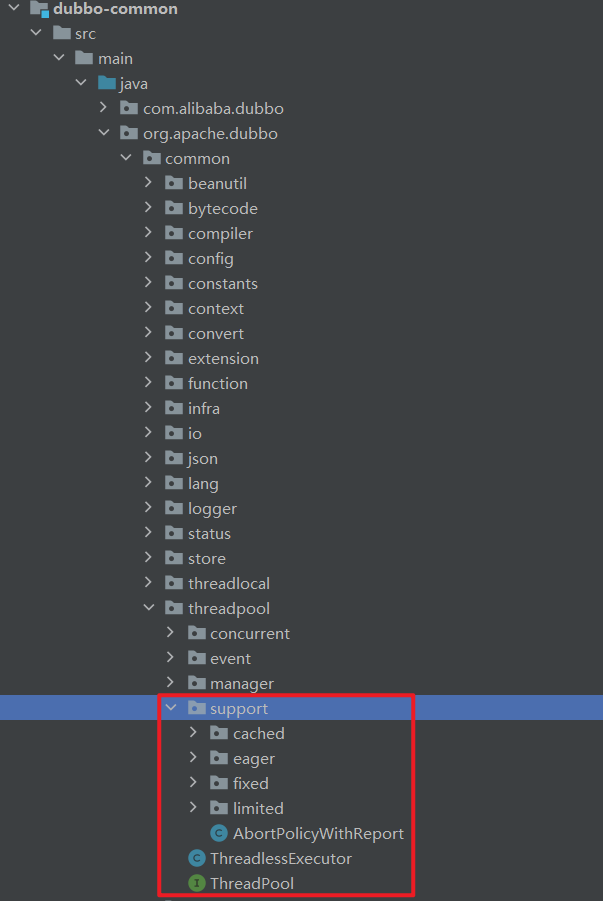
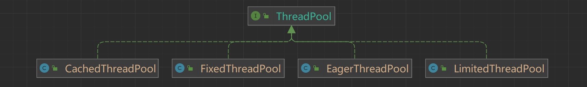
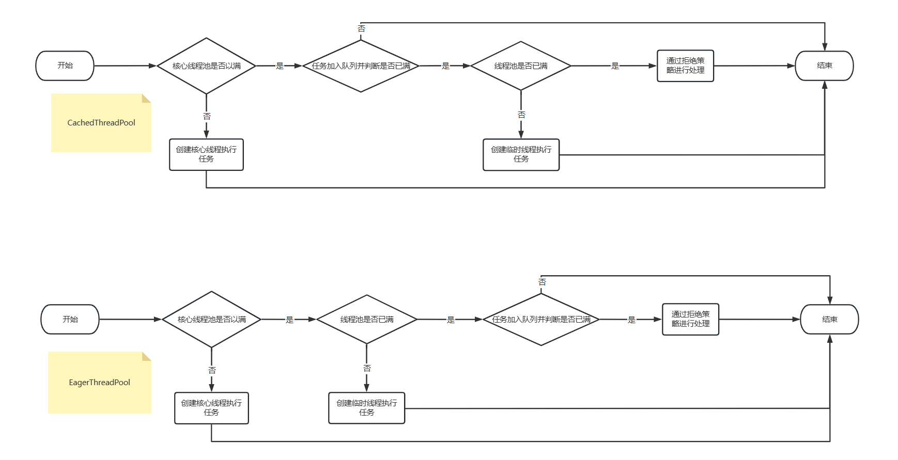

# 精尽 Dubbo 源码分析 —— 线程池

## 一. 概述

在 [《Dubbo 用户指南 —— 线程模型》](https://cn.dubbo.apache.org/zh/docs/advanced/thread-model/) 一文中，我们可以看到 Dubbo 提供了**四种线程池的实现**：

- `fixed` 固定大小线程池，启动时建立线程，不关闭，一直持有。(缺省)
- `cached` 缓存线程池，空闲一分钟自动删除，需要时重建。
- `limited` 可伸缩线程池，但池中的线程数只会增长不会收缩。只增长不收缩的目的是为了避免收缩时突然来了大流量引起的性能问题。
- `eager` 优先创建`Worker`线程池。在任务数量大于`corePoolSize`但是小于`maximumPoolSize`时，优先创建`Worker`来处理任务。当任务数量大于`maximumPoolSize`时，将任务放入阻塞队列中。阻塞队列充满时抛出`RejectedExecutionException`。(相比于`cached`，`cached`在)

在 [`dubbo-common`](https://github.com/apache/incubator-dubbo/tree/master/dubbo-common) 模块的 `threadpool` 包下实现，如下图所示：



## 二. ThreadPool

`org.apache.dubbo.common.threadpool.ThreadPool`，线程池接口。代码如下：

```java
@SPI("fixed")
public interface ThreadPool {

    /**
     * Thread pool
     *
     * @param url URL contains thread parameter
     * @return thread pool
     */
    @Adaptive({THREADPOOL_KEY})
    Executor getExecutor(URL url);

}
```

- `@SPI("fixed")` 注解，Dubbo SPI **拓展点**，默认为 `"fixed"` 。
- `@Adaptive({Constants.THREADPOOL_KEY})` 注解，基于 Dubbo SPI Adaptive 机制，加载对应的线程池实现，使用 `URL.threadpool`属性。
  - `#getExecutor(url)` 方法，获得**对应**的线程池的执行器。

子类类图：



### 2.1 FixedThreadPool

`org.apache.dubbo.common.threadpool.support.fixed.FixedThreadPool`，实现 ThreadPool 接口，固定大小线程池，启动时建立线程，不关闭，一直持有。代码如下：

```java
/**
 * 固定大小线程池，启动时建立线程，不关闭，一直持有。
 * Creates a thread pool that reuses a fixed number of threads
 *
 * @see java.util.concurrent.Executors#newFixedThreadPool(int)
 */
public class FixedThreadPool implements ThreadPool {

    @Override
    public Executor getExecutor(URL url) {
        // 线程名
        String name = url.getParameter(THREAD_NAME_KEY, DEFAULT_THREAD_NAME);
        // 线程数
        int threads = url.getParameter(THREADS_KEY, DEFAULT_THREADS);
        // 队列长度
        int queues = url.getParameter(QUEUES_KEY, DEFAULT_QUEUES);
        return new ThreadPoolExecutor(threads, threads, 0, TimeUnit.MILLISECONDS, //第16行
                queues == 0 ? new SynchronousQueue<Runnable>() :
                        (queues < 0 ? new LinkedBlockingQueue<Runnable>()
                                : new LinkedBlockingQueue<Runnable>(queues)),
                new NamedInternalThreadFactory(name, true), new AbortPolicyWithReport(name, url));//第21行
    }

}
```

- 第 5 至 10 行：获得线程名、线程数、队列数。目前只有服务提供者使用，配置方式如下：

  ```xml
  <dubbo:service interface="com.alibaba.dubbo.demo.DemoService" ref="demoService">
      
      <dubbo:parameter key="threadname" value="shuaiqi" />
      <dubbo:parameter key="threads" value="123" />
      <dubbo:parameter key="queues" value="10" />
  
  </dubbo:service>
  ```

- 第 16 至 21 行：创建执行器 ThreadPoolExecutor 对象。

  - 根据不同的队列数，使用不同的队列实现：
    - 第 13 行： `queues == 0` ， SynchronousQueue 对象。
    - 第 14 行：`queues < 0` ， LinkedBlockingQueue 对象。
    - 第 15 行：`queues > 0` ，带队列数的 LinkedBlockingQueue 对象。
  - 第 21 行：创建 [NamedThreadFactory](https://github.com/apache/incubator-dubbo/blob/bb8884e04433677d6abc6f05c6ad9d39e3dcf236/dubbo-common/src/main/java/com/alibaba/dubbo/common/utils/NamedThreadFactory.java) 对象，用于生成**线程名**。
  - 第 21 行：创建 AbortPolicyWithReport 对象，用于**当任务添加到线程池中被拒绝时**执行的拒绝策略。

### 2.2 CachedThreadPool

`org.apache.dubbo.common.threadpool.support.cached.CachedThreadPool`，实现 ThreadPool 接口，缓存线程池，空闲一定时长，自动删除，需要时重建。代码如下：

```java
/**
 * 缓存线程池，空闲一分钟自动删除，需要时重建。
 * This thread pool is self-tuned. Thread will be recycled after idle for one minute, and new thread will be created for
 * the upcoming request.
 *
 * @see java.util.concurrent.Executors#newCachedThreadPool()
 */
public class CachedThreadPool implements ThreadPool {

    @Override
    public Executor getExecutor(URL url) {
        // 线程池名
        String name = url.getParameter(THREAD_NAME_KEY, DEFAULT_THREAD_NAME); // 第13行
        // 核心线程数
        int cores = url.getParameter(CORE_THREADS_KEY, DEFAULT_CORE_THREADS);
        // 最大线程数
        int threads = url.getParameter(THREADS_KEY, Integer.MAX_VALUE);
        // 队列长度
        int queues = url.getParameter(QUEUES_KEY, DEFAULT_QUEUES);
        // 线程存活时长
        int alive = url.getParameter(ALIVE_KEY, DEFAULT_ALIVE); // 第21行
        // 创建执行器
        return new ThreadPoolExecutor(cores, threads, alive, TimeUnit.MILLISECONDS,
                queues == 0 ? new SynchronousQueue<Runnable>() :
                        (queues < 0 ? new LinkedBlockingQueue<Runnable>()
                                : new LinkedBlockingQueue<Runnable>(queues)),
                new NamedInternalThreadFactory(name, true), new AbortPolicyWithReport(name, url));
    }
}
```

- 第 13 至 21 行：获得线程名、核心线程数、最大线程数、队列数、线程存活时长。
  - 🙂 配置方式和 FixedThreadPool 类似，使用 `<dubbo:parameter />` 配置。

### 2.3 LimitedThreadPool

`org.apache.dubbo.common.threadpool.support.limited.LimitedThreadPool`，实现 ThreadPool 接口，可伸缩线程池，但池中的线程数只会增长不会收缩。只增长不收缩的目的是为了避免收缩时突然来了大流量引起的性能问题。代码如下：

```java
/**
 * 可伸缩线程池，但池中的线程数只会增长不会收缩。只增长不收缩的目的是为了避免收缩时突然来了大流量引起的性能问题。
 * Creates a thread pool that creates new threads as needed until limits reaches. This thread pool will not shrink
 * automatically.
 */
public class LimitedThreadPool implements ThreadPool {

    @Override
    public Executor getExecutor(URL url) {
        // 线程名
        String name = url.getParameter(THREAD_NAME_KEY, DEFAULT_THREAD_NAME);
        // 核心线程数
        int cores = url.getParameter(CORE_THREADS_KEY, DEFAULT_CORE_THREADS);
        // 最大线程数
        int threads = url.getParameter(THREADS_KEY, DEFAULT_THREADS);
        // 队列长度
        int queues = url.getParameter(QUEUES_KEY, DEFAULT_QUEUES);
        return new ThreadPoolExecutor(cores, threads, Long.MAX_VALUE, TimeUnit.MILLISECONDS,
                queues == 0 ? new SynchronousQueue<Runnable>() :
                        (queues < 0 ? new LinkedBlockingQueue<Runnable>()
                                : new LinkedBlockingQueue<Runnable>(queues)),
                new NamedInternalThreadFactory(name, true), new AbortPolicyWithReport(name, url));
    }

}
```

### 2.4 EagerThreadPool

`org.apache.dubbo.common.threadpool.support.eager.EagerThreadPool`，实现 ThreadPool 接口，在任务数量大于 `corePoolSize` 但是小于 `maximumPoolSize` 时，优先创建线程来处理任务。当任务数量大于 `maximumPoolSize` 时，将任务放入阻塞队列中。阻塞队列充满时抛出 `RejectedExecutionException`。(相比于 `CachedThreadPool` 在任务数量超过 `corePoolSize` 时，优先将任务放入阻塞队列，直到阻塞队列满了以后才会创建新的线程去执行阻塞队列的任务；而 `EagerThreadPool` 在)

```java
/**
 * 在任务数量大于 `corePoolSize` 但是小于 `maximumPoolSize` 时，优先创建线程来处理任务。
 * 当任务数量大于 `maximumPoolSize` 时，将任务放入阻塞队列中。阻塞队列充满时抛出 `RejectedExecutionException`。
 * (相比于`cached`:`cached`在任务数量超过`maximumPoolSize`时直接抛出异常而不是将任务放入阻塞队列)
 *
 * EagerThreadPool
 * When the core threads are all in busy,
 * create new thread instead of putting task into blocking queue.
 */
public class EagerThreadPool implements ThreadPool {

    @Override
    public Executor getExecutor(URL url) {
        // 线程名
        String name = url.getParameter(THREAD_NAME_KEY, DEFAULT_THREAD_NAME);
        // 核心线程数
        int cores = url.getParameter(CORE_THREADS_KEY, DEFAULT_CORE_THREADS);
        // 最大线程数
        int threads = url.getParameter(THREADS_KEY, Integer.MAX_VALUE);
        // 队列长度
        int queues = url.getParameter(QUEUES_KEY, DEFAULT_QUEUES);
        // 线程存活时长
        int alive = url.getParameter(ALIVE_KEY, DEFAULT_ALIVE);

        // init queue and executor
        // 这里并没有直接使用 LinkedBlockingQueue，目的是为了配合 EagerThreadPoolExecutor，实现当核心线程满了以后优先创建临时线程执行任务，而不是放入阻塞队列等待。
        TaskQueue<Runnable> taskQueue = new TaskQueue<Runnable>(queues <= 0 ? 1 : queues);
        EagerThreadPoolExecutor executor = new EagerThreadPoolExecutor(cores,
                threads,
                alive,
                TimeUnit.MILLISECONDS,
                taskQueue,
                new NamedInternalThreadFactory(name, true),
                new AbortPolicyWithReport(name, url));
        taskQueue.setExecutor(executor);
        return executor;
    }
}

```

- 与 `CachedThreadPool` 直接使用 `LinkedBlockingQueue` 作为阻塞队列不同的是，`EagerThreadPool` 使用 `TaskQueue` 作为阻塞队列。并且使用了 `EagerThreadPoolExecutor` 线程池，而不是JDK默认的线程池。

#### 2.4.1 EagerThreadPoolExecutor

```java
public class EagerThreadPoolExecutor extends ThreadPoolExecutor {

    /**
     * task count
     */
    private final AtomicInteger submittedTaskCount = new AtomicInteger(0);

    public EagerThreadPoolExecutor(int corePoolSize,
                                   int maximumPoolSize,
                                   long keepAliveTime,
                                   TimeUnit unit, TaskQueue<Runnable> workQueue,
                                   ThreadFactory threadFactory,
                                   RejectedExecutionHandler handler) {
        super(corePoolSize, maximumPoolSize, keepAliveTime, unit, workQueue, threadFactory, handler);
    }

    /**
     * @return current tasks which are executed
     */
    public int getSubmittedTaskCount() {
        return submittedTaskCount.get();
    }

    @Override
    protected void afterExecute(Runnable r, Throwable t) {
        submittedTaskCount.decrementAndGet();
    }

    @Override
    public void execute(Runnable command) {
        if (command == null) {
            throw new NullPointerException();
        }
        // do not increment in method beforeExecute!
        submittedTaskCount.incrementAndGet();
        try {
            super.execute(command);
        } catch (RejectedExecutionException rx) {
            // retry to offer the task into queue.
            final TaskQueue queue = (TaskQueue) super.getQueue();
            try {
                if (!queue.retryOffer(command, 0, TimeUnit.MILLISECONDS)) {
                    submittedTaskCount.decrementAndGet();
                    throw new RejectedExecutionException("Queue capacity is full.", rx);
                }
            } catch (InterruptedException x) {
                submittedTaskCount.decrementAndGet();
                throw new RejectedExecutionException(x);
            }
        } catch (Throwable t) {
            // decrease any way
            submittedTaskCount.decrementAndGet();
            throw t;
        }
    }
}
```

- `EagerThreadPoolExecutor` 继承了 `ThreadPoolExecutor`，它维护了 `submittedTaskCount`，在执行任务之前递增，在 `afterExecute` 的时候递减；其execute方法会捕获 `RejectedExecutionException`，然后使用 `TaskQueue` 的 `retryOffer` 再重新入队，入队不成功才抛出 `RejectedExecutionException`。

#### 2.4.2 TaskQueue

```java
public class TaskQueue<R extends Runnable> extends LinkedBlockingQueue<Runnable> {

    private static final long serialVersionUID = -2635853580887179627L;

    private EagerThreadPoolExecutor executor;

    public TaskQueue(int capacity) {
        super(capacity);
    }

    public void setExecutor(EagerThreadPoolExecutor exec) {
        executor = exec;
    }

    @Override
    public boolean offer(Runnable runnable) {
        if (executor == null) {
            throw new RejectedExecutionException("The task queue does not have executor!");
        }

        // 线程池中的当前线程数
        int currentPoolThreadSize = executor.getPoolSize();
        // have free worker. put task into queue to let the worker deal with task.
        if (executor.getSubmittedTaskCount() < currentPoolThreadSize) {
            return super.offer(runnable);
        }

        // return false to let executor create new worker.
        if (currentPoolThreadSize < executor.getMaximumPoolSize()) {
            return false;
        }

        // currentPoolThreadSize >= max
        return super.offer(runnable);
    }

    /**
     * retry offer task
     *
     * @param o task
     * @return offer success or not
     * @throws RejectedExecutionException if executor is terminated.
     */
    public boolean retryOffer(Runnable o, long timeout, TimeUnit unit) throws InterruptedException {
        if (executor.isShutdown()) {
            throw new RejectedExecutionException("Executor is shutdown!");
        }
        return super.offer(o, timeout, unit);
    }
}
```

- `TaskQueue` 继承了 `LinkedBlockingQueue`，它覆盖了 `offer` 方法，该方法在 `submittedTaskCount` 小于 `currentPoolThreadSize` 的时候会入队，此时线程池中的线程就已经能够立即执行当前任务了。
- 如果 `submittedTaskCount` 大于 `currentPoolThreadSize`，则再判断 `currentPoolThreadSize` 是否小于 `maximumPoolSize` ，如果小于则返回false让线程池创建新线程，最后在 `currentPoolThreadSize` 大于等于 `maximumPoolSize` 的时候入队。

#### 2.4.3 ThreadPoolExecutor#execute

`EagerThreadPoolExecutor` 继承至 `ThreadPoolExecutor`，`EagerThreadPoolExecutor#execute` 本质上还是会调用 `ThreadPoolExecutor#execute` 完成线程池的核心逻辑：

```java
    // java.util.concurrent.ThreadPoolExecutor#execute
	public void execute(Runnable command) {
        if (command == null)
            throw new NullPointerException();
        /*
         * Proceed in 3 steps:
         *
         * 1. If fewer than corePoolSize threads are running, try to
         * start a new thread with the given command as its first
         * task.  The call to addWorker atomically checks runState and
         * workerCount, and so prevents false alarms that would add
         * threads when it shouldn't, by returning false.
         *
         * 2. If a task can be successfully queued, then we still need
         * to double-check whether we should have added a thread
         * (because existing ones died since last checking) or that
         * the pool shut down since entry into this method. So we
         * recheck state and if necessary roll back the enqueuing if
         * stopped, or start a new thread if there are none.
         *
         * 3. If we cannot queue task, then we try to add a new
         * thread.  If it fails, we know we are shut down or saturated
         * and so reject the task.
         */
        int c = ctl.get();
        // 判断当前工作的线程数是否小于corePoolSize
        if (workerCountOf(c) < corePoolSize) {
            // 新增工作线程，执行任务
            if (addWorker(command, true))
                return;
            c = ctl.get();
        }
        // 如果当前工作的线程数 >= corePoolSize，则将任务放入阻塞队列中，如果workQueue是 LinkedBlockingQueue 的有界队列，且当前队列长度未超过限额，则会成功放到阻塞队列中，返回true；反之超过限额，则放入失败，返回false。
        if (isRunning(c) && workQueue.offer(command)) { // 第34行
            int recheck = ctl.get();
            if (! isRunning(recheck) && remove(command))
                reject(command);
            else if (workerCountOf(recheck) == 0)
                addWorker(null, false);
        }
        // 如果放入阻塞队列失败，则尝试新建线程，执行任务
        else if (!addWorker(command, false)) // 第42行
            reject(command);
    }
```

- 我们知道，当我们使用 `LinkedBlockingQueue` 作为线程池的阻塞队列时，线程数量达到 `corePoolSize` 之后，只有当阻塞队列满了以后才会新增线程去执行任务。这也就是 `CachedThreadPool` 的工作模式。
- 而 `EagerThreadPoolExecutor` 使用的 `TaskQueue`作为阻塞队列，它重写 `offer` 方法，使得线程数达到 `corePoolSize` 的时候，调用阻塞对列 offer 方法时（第34行），会优先失败，这样就会在工作线程未达到 `maximumPoolSize` 优先创建线程去执行任务，当达到 `maximumPoolSize` 时 `java.util.concurrent.ThreadPoolExecutor#execute` 会抛出 `RejectedExecutionException` 然后被 `EagerThreadPoolExecutor#execute` 捕获，调用 `retryOffer` 重新入队。

#### 2.4.4 CachedThreadPool VS EagerThreadPool



## 三. AbortPolicyWithReport

`org.apache.dubbo.common.threadpool.support.AbortPolicyWithReport`，实现 `java.util.concurrent.ThreadPoolExecutor.AbortPolicy`，拒绝策略实现类。**打印 JStack ，分析线程状态**。

### 3.1 属性

```java
/**
 * 线程名
 */
private final String threadName;
/**
 * URL 对象
 */
private final URL url;
/**
 * 最后打印时间
 */
private static volatile long lastPrintTime = 0;
/**
 * 信号量，大小为 1 。
 */
private static Semaphore guard = new Semaphore(1);

public AbortPolicyWithReport(String threadName, URL url) {
    this.threadName = threadName;
    this.url = url;
}
```

### 3.2 rejectedExecution

`#rejectedExecution(Runnable, ThreadPoolExecutor)` 实现方法，代码如下：

```java
    @Override
    public void rejectedExecution(Runnable r, ThreadPoolExecutor e) {
        // 打印告警日志
        String msg = String.format("Thread pool is EXHAUSTED!" +
                " Thread Name: %s, Pool Size: %d (active: %d, core: %d, max: %d, largest: %d), Task: %d (completed: "
                + "%d)," +
                " Executor status:(isShutdown:%s, isTerminated:%s, isTerminating:%s), in %s://%s:%d!",
            threadName, e.getPoolSize(), e.getActiveCount(), e.getCorePoolSize(), e.getMaximumPoolSize(),
            e.getLargestPoolSize(),
            e.getTaskCount(), e.getCompletedTaskCount(), e.isShutdown(), e.isTerminated(), e.isTerminating(),
            url.getProtocol(), url.getIp(), url.getPort());
        logger.warn(msg);
        // 打印 JStack ，分析线程状态。
        dumpJStack();
        dispatchThreadPoolExhaustedEvent(msg);
        // 抛出 RejectedExecutionException 异常
        throw new RejectedExecutionException(msg);
    }

```

### 3.3 dumpJStack

`#dumpJStack()` 方法，打印 JStack。代码如下：

```java
    private void dumpJStack() {
        long now = System.currentTimeMillis();

        //dump every 10 minutes
        // 每 10 分钟，打印一次。
        if (now - lastPrintTime < TEN_MINUTES_MILLS) {
            return;
        }

        // 获得信号量
        if (!guard.tryAcquire()) {
            return;
        }

        // 创建线程池，后台执行打印 JStack
        ExecutorService pool = Executors.newSingleThreadExecutor();
        pool.execute(() -> {
            String dumpPath = getDumpPath();

            SimpleDateFormat sdf;

            // 获得系统名称
            String os = System.getProperty(OS_NAME_KEY).toLowerCase();

            // window system don't support ":" in file name
            if (os.contains(OS_WIN_PREFIX)) {
                sdf = new SimpleDateFormat(WIN_DATETIME_FORMAT);
            } else {
                sdf = new SimpleDateFormat(DEFAULT_DATETIME_FORMAT);
            }

            String dateStr = sdf.format(new Date());
            //try-with-resources
            // 获得输出流
            try (FileOutputStream jStackStream = new FileOutputStream(
                new File(dumpPath, "Dubbo_JStack.log" + "." + dateStr))) {
                // 打印 JStack
                JVMUtil.jstack(jStackStream);
            } catch (Throwable t) {
                logger.error("dump jStack error", t);
            } finally {
                guard.release();
            }
            lastPrintTime = System.currentTimeMillis();
        });
        //must shutdown thread pool ,if not will lead to OOM
        pool.shutdown();

    }
```

### 3.4 JVMUtil

`org.apache.dubbo.common.utils.JVMUtil`，JVM 工具类。目前，仅有 JStack 功能，胖友可以点击链接，自己查看下代码。

如下是一个 JStack 日志的示例：

```txt
123312:tmp yunai$ cat Dubbo_JStack.log.2018-03-27_18\:57\:32
"pool-2-thread-1" Id=11 RUNNABLE
	at sun.management.ThreadImpl.dumpThreads0(Native Method)
	at sun.management.ThreadImpl.dumpAllThreads(ThreadImpl.java:454)
	at com.alibaba.dubbo.common.utils.JVMUtil.jstack(JVMUtil.java:34)
	at com.alibaba.dubbo.common.threadpool.support.AbortPolicyWithReport$1.run(AbortPolicyWithReport.java:122)
	at java.util.concurrent.ThreadPoolExecutor.runWorker(ThreadPoolExecutor.java:1142)
	at java.util.concurrent.ThreadPoolExecutor$Worker.run(ThreadPoolExecutor.java:617)
	at java.lang.Thread.run(Thread.java:745)

	Number of locked synchronizers = 1
	- java.util.concurrent.ThreadPoolExecutor$Worker@5cbc508c

"Monitor Ctrl-Break" Id=5 RUNNABLE (in native)
	at java.net.SocketInputStream.socketRead0(Native Method)
	at java.net.SocketInputStream.socketRead(SocketInputStream.java:116)
	at java.net.SocketInputStream.read(SocketInputStream.java:171)
	at java.net.SocketInputStream.read(SocketInputStream.java:141)
	at sun.nio.cs.StreamDecoder.readBytes(StreamDecoder.java:284)
	at sun.nio.cs.StreamDecoder.implRead(StreamDecoder.java:326)
	at sun.nio.cs.StreamDecoder.read(StreamDecoder.java:178)
	-  locked java.io.InputStreamReader@5c7efb52
	at java.io.InputStreamReader.read(InputStreamReader.java:184)
	at java.io.BufferedReader.fill(BufferedReader.java:161)
	at java.io.BufferedReader.readLine(BufferedReader.java:324)
	-  locked java.io.InputStreamReader@5c7efb52
	at java.io.BufferedReader.readLine(BufferedReader.java:389)
	at com.intellij.rt.execution.application.AppMainV2$1.run(AppMainV2.java:64)

"Signal Dispatcher" Id=4 RUNNABLE

"Finalizer" Id=3 WAITING on java.lang.ref.ReferenceQueue$Lock@197c6eb9
	at java.lang.Object.wait(Native Method)
	-  waiting on java.lang.ref.ReferenceQueue$Lock@197c6eb9
	at java.lang.ref.ReferenceQueue.remove(ReferenceQueue.java:143)
	at java.lang.ref.ReferenceQueue.remove(ReferenceQueue.java:164)
	at java.lang.ref.Finalizer$FinalizerThread.run(Finalizer.java:209)

"Reference Handler" Id=2 WAITING on java.lang.ref.Reference$Lock@7b19fa34
	at java.lang.Object.wait(Native Method)
	-  waiting on java.lang.ref.Reference$Lock@7b19fa34
	at java.lang.Object.wait(Object.java:502)
	at java.lang.ref.Reference.tryHandlePending(Reference.java:191)
	at java.lang.ref.Reference$ReferenceHandler.run(Reference.java:153)

"main" Id=1 TIMED_WAITING
	at java.lang.Thread.sleep(Native Method)
	at com.alibaba.dubbo.common.threadpool.AbortPolicyWithReportTest.jStackDumpTest(AbortPolicyWithReportTest.java:44)
	at sun.reflect.NativeMethodAccessorImpl.invoke0(Native Method)
	at sun.reflect.NativeMethodAccessorImpl.invoke(NativeMethodAccessorImpl.java:62)
	at sun.reflect.DelegatingMethodAccessorImpl.invoke(DelegatingMethodAccessorImpl.java:43)
	at java.lang.reflect.Method.invoke(Method.java:498)
	at org.junit.runners.model.FrameworkMethod$1.runReflectiveCall(FrameworkMethod.java:50)
	at org.junit.internal.runners.model.ReflectiveCallable.run(ReflectiveCallable.java:12)
	at org.junit.runners.model.FrameworkMethod.invokeExplosively(FrameworkMethod.java:47)
	at org.junit.internal.runners.statements.InvokeMethod.evaluate(InvokeMethod.java:17)
	at org.junit.runners.ParentRunner.runLeaf(ParentRunner.java:325)
	at org.junit.runners.BlockJUnit4ClassRunner.runChild(BlockJUnit4ClassRunner.java:78)
	at org.junit.runners.BlockJUnit4ClassRunner.runChild(BlockJUnit4ClassRunner.java:57)
	at org.junit.runners.ParentRunner$3.run(ParentRunner.java:290)
	at org.junit.runners.ParentRunner$1.schedule(ParentRunner.java:71)
	at org.junit.runners.ParentRunner.runChildren(ParentRunner.java:288)
	at org.junit.runners.ParentRunner.access$000(ParentRunner.java:58)
	at org.junit.runners.ParentRunner$2.evaluate(ParentRunner.java:268)
	at org.junit.runners.ParentRunner.run(ParentRunner.java:363)
	at org.junit.runner.JUnitCore.run(JUnitCore.java:137)
	at com.intellij.junit4.JUnit4IdeaTestRunner.startRunnerWithArgs(JUnit4IdeaTestRunner.java:68)
	at com.intellij.rt.execution.junit.IdeaTestRunner$Repeater.startRunnerWithArgs(IdeaTestRunner.java:47)
	at com.intellij.rt.execution.junit.JUnitStarter.prepareStreamsAndStart(JUnitStarter.java:242)
	at com.intellij.rt.execution.junit.JUnitStarter.main(JUnitStarter.java:70)
```

