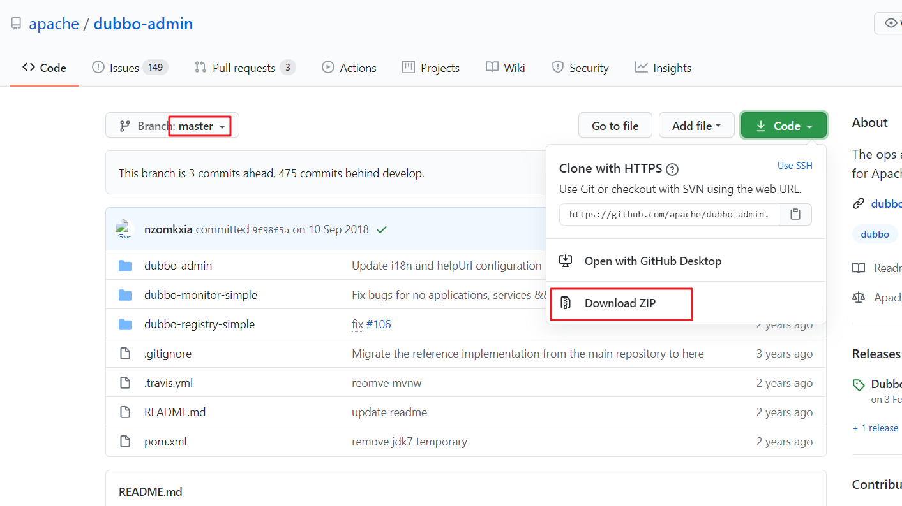
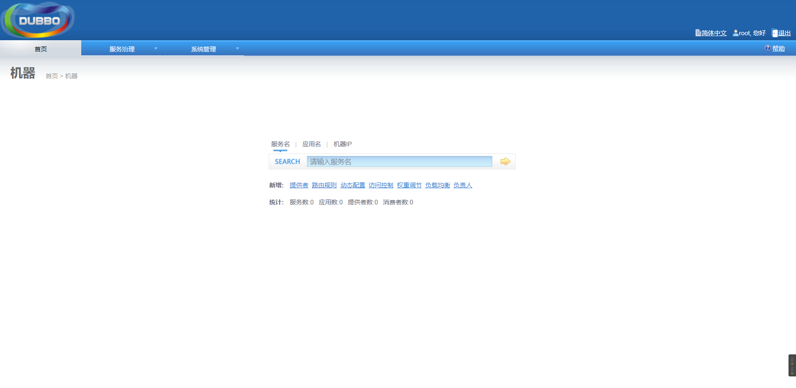

# 搭建Dubbo管理控制台

## 一.下载

进入Dubbo-admin的Github地址：[https://github.com/apache/dubbo-admin](https://github.com/apache/dubbo-admin)

切换到master分支，然后下载master分支的zip包：



## 第二步：修改配置文件

解压下载后的zip包，进入dubbo-admin文件夹，可以发现这是一个标准的Maven项目，然后我们修改`src/main/resources/application.properties`文件中的`dubbo.registry.address`属性，根据自身情况修改Zookeeper的服务器地址：

```properties
server.port=7001  #web服务端口
spring.velocity.cache=false
spring.velocity.charset=UTF-8
spring.velocity.layout-url=/templates/default.vm
spring.messages.fallback-to-system-locale=false
spring.messages.basename=i18n/message
spring.root.password=root
spring.guest.password=guest

dubbo.registry.address=zookeeper://192.168.2.112:2181 #注册中心地址
```

## 第三步：打包

进入`dubbo-admin`目录下，运行`mvn package`命令进行打包。该源码是一个SpringBoot项目，打包后是一个可执行的jar包。

## 第四步：运行

进入`dubbo-admin/target/`目录下，运行`java -jar dubbo-admin-0.0.1-SNAPSHOT.jar`即可运行。登录`http://localhost:7001`即可访问。

默认的用户名和密码都是root：

