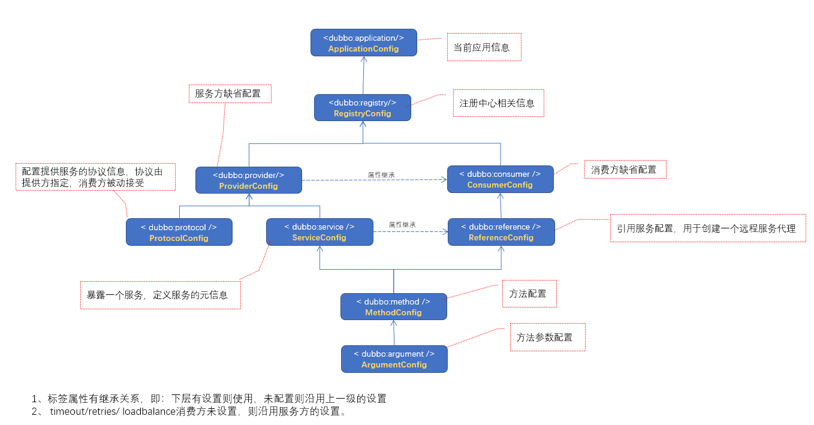
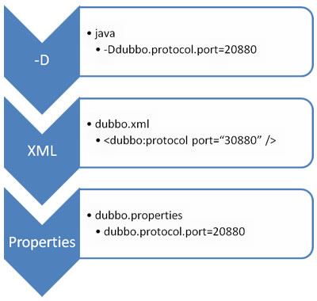

# Dubbo标签及其性质



## 一.特性

### 1.1 标签属性的继承性

Dubbo中很多标签属性在服务提供者和消费者两端都可配置，例如：

`<dubbo:reference ... timeout="50"/>`和`<dubbo:service ... timeout="50"/>`两个标签都可以配置`timeout`属性。但是通常情况下，我们只会在服务提供端配置`timeout`，而我们使用`dubbo:reference`标签生成服务代理对象时就会自动继承服务提供者的配置项。

### 2.2 不同粒度配置的覆盖关系

以 timeout 为例，下图显示了配置的查找顺序，其它 retries, loadbalance, actives 等类似：

- 方法级优先，接口级次之，全局配置再次之。
- 如果级别一样，则消费方优先，提供方次之。

其中，服务提供方配置，通过 URL 经由注册中心传递给消费方。


### 1.3 属性配置优先级

#### 重写与优先级

如果你的应用足够简单，例如，不需要多注册中心或多协议，并且需要在spring容器中共享配置，那么，我们可以直接使用 `dubbo.properties`作为默认配置。



Dubbo可以自动加载`classpath`根目录下的`dubbo.properties`，但是你同样可以使用JVM参数来指定路径：`-Ddubbo.properties.file=xxx.properties`。

#### 映射规则

可以将xml的tag名和属性名组合起来，用‘.’分隔。每行一个属性。

- `dubbo.application.name=foo` 相当于 `<dubbo:application name="foo" />`
- `dubbo.registry.address=10.20.153.10:9090` 相当于 `<dubbo:registry address="10.20.153.10:9090" />`

如果在xml配置中有超过一个的tag，那么你可以使用‘id’进行区分。如果你不指定id，它将作用于所有tag。

- `dubbo.protocol.rmi.port=1099` 相当于 `<dubbo:protocol id="rmi" name="rmi" port="1099" />`
- `dubbo.registry.china.address=10.20.153.10:9090` 相当于 `<dubbo:registry id="china" address="10.20.153.10:9090" />`

如下，是一个典型的dubbo.properties配置样例。

```properties
dubbo.application.name=foo
dubbo.application.owner=bar
dubbo.registry.address=10.20.153.10:9090
```

## 二. 标签

| 标签                   | 用途         | 解释                                                         |
| ---------------------- | ------------ | ------------------------------------------------------------ |
| `<dubbo:service/>`     | 服务配置     | 用于暴露一个服务，定义服务的元信息，一个服务可以用多个协议暴露，一个服务也可以注册到多个注册中心 |
| `<dubbo:reference/>`   | 引用配置     | 用于创建一个远程服务代理，一个引用可以指向多个注册中心       |
| `<dubbo:protocol/>`    | 协议配置     | 用于配置提供服务的协议信息，协议由提供方指定，消费方被动接受 |
| `<dubbo:application/>` | 应用配置     | 用于配置当前应用信息，不管该应用是提供者还是消费者           |
| `<dubbo:module/>`      | 模块配置     | 用于配置当前模块信息，可选                                   |
| `<dubbo:registry/>`    | 注册中心配置 | 用于配置连接注册中心相关信息                                 |
| `<dubbo:monitor/>`     | 监控中心配置 | 用于配置连接监控中心相关信息，可选                           |
| `<dubbo:provider/>`    | 提供方配置   | 当 ProtocolConfig 和 ServiceConfig 某属性没有配置时，采用此缺省值，可选 |
| `<dubbo:consumer/>`    | 消费方配置   | 当 ReferenceConfig 某属性没有配置时，采用此缺省值，可选      |
| `<dubbo:method/>`      | 方法配置     | 用于 ServiceConfig 和 ReferenceConfig 指定方法级的配置信息   |
| `<dubbo:argument/>`    | 参数配置     | 用于指定方法参数配置                                         |

