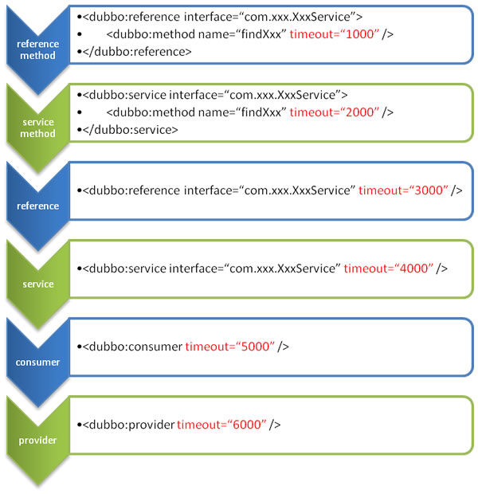
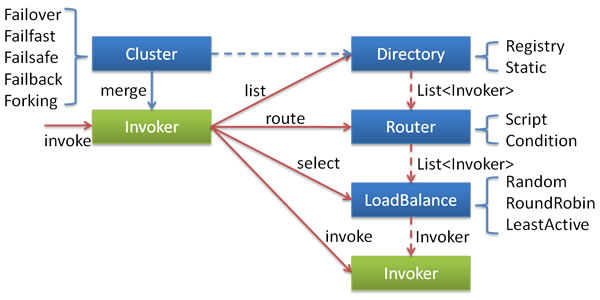

# 常用配置项

## 一. 启动时检查

> 说明：转载至Dubbo官方文档：http://dubbo.apache.org/zh-cn/docs/user/demos/preflight-check.html

Dubbo 缺省会在启动时检查依赖的服务是否可用，不可用时会抛出异常，阻止 Spring 初始化完成，以便上线时，能及早发现问题，默认 `check="true"`。

可以通过 `check="false"` 关闭检查，比如，测试时，有些服务不关心，或者出现了循环依赖，必须有一方先启动。

另外，如果你的 Spring 容器是懒加载的，或者通过 API 编程延迟引用服务，请关闭 check，否则服务临时不可用时，会抛出异常，拿到 null 引用，如果 `check="false"`，总是会返回引用，当服务恢复时，能自动连上。

### 1.1 通过 spring 配置文件

1. 关闭某个服务的启动时检查 (没有提供者时报错)：

```xml
<dubbo:reference interface="com.foo.BarService" check="false" />
```

2. 关闭所有服务的启动时检查 (没有提供者时报错)：

```xml
<dubbo:consumer check="false" />
```

3. 关闭注册中心启动时检查 (注册订阅失败时报错)：

```xml
<dubbo:registry check="false" />
```

### 1.2 通过 dubbo.properties

```properties
dubbo.reference.com.foo.BarService.check=false
dubbo.reference.check=false
dubbo.consumer.check=false
dubbo.registry.check=false
```

### 1.3 通过 -D 参数

```sh
java -Ddubbo.reference.com.foo.BarService.check=false
java -Ddubbo.reference.check=false
java -Ddubbo.consumer.check=false 
java -Ddubbo.registry.check=false
```

### 1.4 配置的含义

`dubbo.reference.check=false`，强制改变所有 reference 的 check 值，就算配置中有声明，也会被覆盖。

`dubbo.consumer.check=false`，是设置 check 的缺省值，如果配置中有显式的声明，如：`<dubbo:reference check="true"/>`，不会受影响。

`dubbo.registry.check=false`，前面两个都是指订阅成功，但提供者列表是否为空是否报错，如果注册订阅失败时，也允许启动，需使用此选项，将在后台定时重试。


## 二. 超时时间

远程服务调用超时时间(毫秒)可以手动配置，需要注意的是超时时间在服务提供端和消费端都可以配置，它们的覆盖关系如下：




## 三. 重试次数

我们可以手动配置远程服务调用失败后的重试次数（重试次数不包括第一次调用），不需要重试请设为0，仅在cluster为failback/failover时有效：

```xml
<dubbo:reference  ... retries="2">
```

如果需要演示调用失败重试的效果，可以通过配置调用过程的超时时间为10ms，然后在服务提供者中通过sleep方法阻塞代码执行，人为制造调用超时的效果，这样就可以触发消费者的调用重试。

### 3.1 接口幂等性

接口幂等性就是用户对于同一操作发起的一次请求或者多次请求的结果是一致的，不会因为多次点击而产生了副作用。举个最简单的例子，那就是支付，用户购买商品后支付，支付扣款成功，但是返回结果的时候网络异常，此时钱已经扣了，用户再次点击按钮，此时会进行第二次扣款，返回结果成功，用户查询余额返发现多扣钱了，流水记录也变成了两条．．．,这就没有保证接口的幂等性

**一般情况幂等接口可以设置重试次数，非幂等接口不能设置重试次数**。特别是对于有数据库查询、修改、删除操作的接口是可以设置重试次数的，但是对于需要新增数据的接口是不能设置重试次数的。


## 四. 多版本

当一个接口实现，出现不兼容升级时，可以用版本号过渡，版本号不同的服务相互间不引用。

可以按照以下的步骤进行版本迁移：

1. 在低压力时间段，先升级一半提供者为新版本
2. 再将所有消费者升级为新版本
3. 然后将剩下的一半提供者升级为新版本

老版本服务提供者配置：

```xml
<dubbo:service interface="com.foo.BarService" version="1.0.0" />
```

新版本服务提供者配置：

```xml
<dubbo:service interface="com.foo.BarService" version="2.0.0" />
```

老版本服务消费者配置：

```xml
<dubbo:reference id="barService" interface="com.foo.BarService" version="1.0.0" />
```

新版本服务消费者配置：

```xml
<dubbo:reference id="barService" interface="com.foo.BarService" version="2.0.0" />
```

如果不需要区分版本，可以按照以下的方式配置 [[1\]](http://dubbo.apache.org/zh-cn/docs/user/demos/multi-versions.html#fn1)：

```xml
<dubbo:reference id="barService" interface="com.foo.BarService" version="*" />
```


## 五. 负载均衡

在集群负载均衡时，Dubbo 提供了多种均衡策略，缺省为 `random` 随机调用。

可以自行扩展负载均衡策略，参见：[负载均衡扩展](http://dubbo.apache.org/zh-cn/docs/dev/impls/load-balance.html)

### 5.1 负载均衡策略

#### Random LoadBalance

- **随机**，按权重设置随机概率。
- 在一个截面上碰撞的概率高，但调用量越大分布越均匀，而且按概率使用权重后也比较均匀，有利于动态调整提供者权重。

#### RoundRobin LoadBalance

- **轮询**，按公约后的权重设置轮询比率。
- 存在慢的提供者累积请求的问题，比如：第二台机器很慢，但没挂，当请求调到第二台时就卡在那，久而久之，所有请求都卡在调到第二台上。

#### LeastActive LoadBalance

- **最少活跃调用数**，相同活跃数的随机，活跃数指调用前后计数差。

- 使慢的提供者收到更少请求，因为越慢的提供者的调用前后计数差会越大。

  #### ConsistentHash LoadBalance

  - **一致性 Hash**，相同参数的请求总是发到同一提供者。
  - 当某一台提供者挂时，原本发往该提供者的请求，基于虚拟节点，平摊到其它提供者，不会引起剧烈变动。
  - 算法参见：<http://en.wikipedia.org/wiki/Consistent_hashing>
  - 缺省只对第一个参数 Hash，如果要修改，请配置 `<dubbo:parameter key="hash.arguments" value="0,1" />`
  - 缺省用 160 份虚拟节点，如果要修改，请配置 `<dubbo:parameter key="hash.nodes" value="320" />`

 ### 5.2 配置

#### 服务端服务级别

```xml
<dubbo:service interface="..." loadbalance="roundrobin" />
```

#### 客户端服务级别

```xml
<dubbo:reference interface="..." loadbalance="roundrobin" />
```

#### 服务端方法级别

```xml
<dubbo:service interface="...">
    <dubbo:method name="..." loadbalance="roundrobin"/>
</dubbo:service>
```

#### 客户端方法级别

```xml
<dubbo:reference interface="...">
    <dubbo:method name="..." loadbalance="roundrobin"/>
</dubbo:reference>
```


## 六. 集群容错

在集群调用失败时，Dubbo 提供了多种容错方案，缺省为 failover 重试。



各节点关系：

- 这里的 `Invoker` 是 `Provider` 的一个可调用 `Service` 的抽象，`Invoker` 封装了 `Provider` 地址及 `Service` 接口信息
- `Directory` 代表多个 `Invoker`，可以把它看成 `List<Invoker>` ，但与 `List` 不同的是，它的值可能是动态变化的，比如注册中心推送变更
- `Cluster` 将 `Directory` 中的多个 `Invoker` 伪装成一个 `Invoker`，对上层透明，伪装过程包含了容错逻辑，调用失败后，重试另一个
- `Router` 负责从多个 `Invoker` 中按路由规则选出子集，比如读写分离，应用隔离等
- `LoadBalance` 负责从多个 `Invoker` 中选出具体的一个用于本次调用，选的过程包含了负载均衡算法，调用失败后，需要重选

### 6.1 集群容错模式

可以自行扩展集群容错策略，参见：[集群扩展](http://dubbo.apache.org/zh-cn/docs/dev/impls/cluster.html)

#### **Failover Cluster**

失败自动切换，当出现失败，重试其它服务器 [[1\]](http://dubbo.apache.org/zh-cn/docs/user/demos/fault-tolerent-strategy.html#fn1)。通常用于读操作，但重试会带来更长延迟。可通过 `retries="2"` 来设置重试次数(不含第一次)。

重试次数配置如下：

```xml
<dubbo:service retries="2" />
```

或

```xml
<dubbo:reference retries="2" />
```

或

```xml
<dubbo:reference>
    <dubbo:method name="findFoo" retries="2" />
</dubbo:reference>
```

#### **Failfast Cluster**

快速失败，只发起一次调用，失败立即报错。通常用于非幂等性的写操作，比如新增记录。

#### **Failsafe Cluster**

失败安全，出现异常时，直接忽略。通常用于写入审计日志等操作。

#### **Failback Cluster**

失败自动恢复，后台记录失败请求，定时重发。通常用于消息通知操作。

#### **Forking Cluster**

并行调用多个服务器，只要一个成功即返回。通常用于实时性要求较高的读操作，但需要浪费更多服务资源。可通过 `forks="2"` 来设置最大并行数。

#### **Broadcast Cluster**

广播调用所有提供者，逐个调用，任意一台报错则报错 [[2\]](http://dubbo.apache.org/zh-cn/docs/user/demos/fault-tolerent-strategy.html#fn2)。通常用于通知所有提供者更新缓存或日志等本地资源信息。

### 6.2 集群模式配置

按照以下示例在服务提供方和消费方配置集群模式

```xml
<dubbo:service cluster="failsafe" />
```

或

```xml
<dubbo:reference cluster="failsafe" />
```