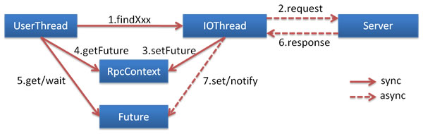

# Dubbo异步调用与执行

> 本文转载至：[异步执行 | Apache Dubbo](http://dubbo.apache.org/zh/docs/v2.7/user/examples/async-execute-on-provider/)、[异步调用 | Apache Dubbo](http://dubbo.apache.org/zh/docs/v2.7/user/examples/async-call/)

## 一. 异步调用

从 2.7.0 开始，Dubbo 的所有异步编程接口开始以 CompletableFuture 为基础 基于 NIO 的非阻塞实现并行调用，客户端不需要启动多线程即可完成并行调用多个远程服务，相对多线程开销较小。



### 使用 CompletableFuture 签名的接口

需要服务提供者事先定义 CompletableFuture 签名的服务：

```java
/**
 * @author: Jindong.Tian
 * @date: 2020-10-08
 * @description:
 **/
public interface AsyncExecuteService {
    CompletableFuture<String> asyncSearchAll();
}
```

定义服务提供者：

```java
@DubboService
public class AsyncExecuteServiceImpl implements AsyncExecuteService {

    @Override
    public CompletableFuture<String> asyncSearchAll() {
        for (int i = 0; i < 5; i++) {
            System.out.println("等待：" + i);
            try {
                Thread.sleep(1000);
            } catch (InterruptedException e) {
                e.printStackTrace();
            }
        }
        return CompletableFuture.completedFuture("success");
    }
}
```

服务消费者：

```java
CompletableFuture<String> future = asyncExecuteService.asyncSearchAll();
System.out.println("Controller没有阻塞");
...
// 方式一：阻塞获取结果值
System.out.println("成功获取到值：" + future.get());
// 方式二：当Provider返回时执行回调
future.whenComplete((v, t) -> {
    if (t != null) {
        t.printStackTrace();
    } else {
        System.out.println("Response: " + v);
    }
});
```

Provider方声明了`CompletableFuture`作为异步标识，客户端在调用时会立刻返回，只有当客户端使用`CompletableFuture`实例的`get`方法获取调用结果时才会阻塞等待结果。

## 二. 异步执行

**Provider端异步执行将阻塞的业务从Dubbo内部线程池切换到业务自定义线程，避免Dubbo线程池的过度占用**，有助于避免不同服务间的互相影响。异步执行无益于节省资源或提升RPC响应性能，因为如果业务执行需要阻塞，则始终还是要有线程来负责执行。

#### 注意

Provider 端异步执行和 Consumer 端异步调用是相互独立的，你可以任意正交组合两端配置

- Consumer同步 - Provider同步
- Consumer异步 - Provider同步
- Consumer同步 - Provider异步
- Consumer异步 - Provider异步

在上面的例子中虽然实现了服务的异步调用，但是服务的提供者仍是处于同步执行的状态，我们可以使用`CompletableFuture`的API实现Provider的异步执行：

```java
public class AsyncExecuteServiceImpl implements AsyncExecuteService {
    @Override
    public CompletableFuture<String> asyncSearchAll() {
        // 建议为supplyAsync提供自定义线程池，避免使用JDK公用线程池
        return CompletableFuture.supplyAsync(() -> {
            try {
                Thread.sleep(5000);
            } catch (InterruptedException e) {
                e.printStackTrace();
            }
            return "async response from provider.";
        });
    }
}
```

## 三. 总结

Dubbo异步调用和执行都是以`CompletableFuture`为基础进行的，当你调用的方法返回值是一个`CompletableFuture`类型时，Dubbo会立即返回一个`CompletableFuture`对象，至于消费者如何进行后面的异步逻辑，则全部依赖于`CompletableFuture`的API（[CompletableFuture详解](../../../基础笔记/并发编程/subfile/_27CompletableFuture.md)）。同理Provider的异步执行同样是交由`CompletableFuture`来处理的。Dubbo做的事情是将跨进程的`CompletableFuture`打通，就像是我们在单进程项目中使用`CompletableFuture`一样方便。