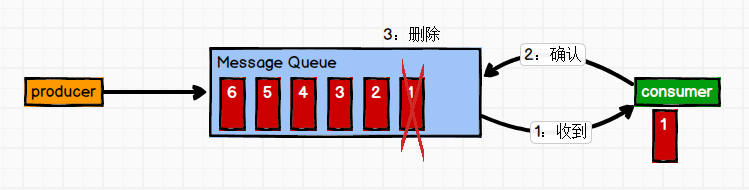
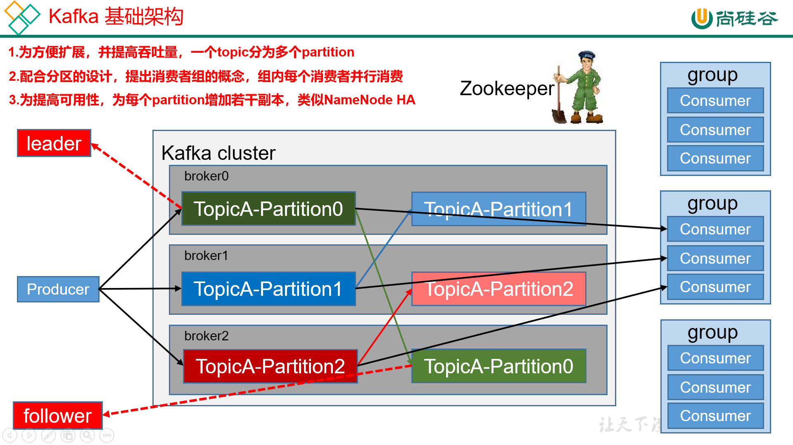
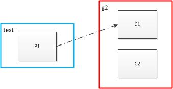
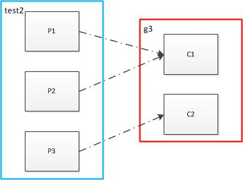
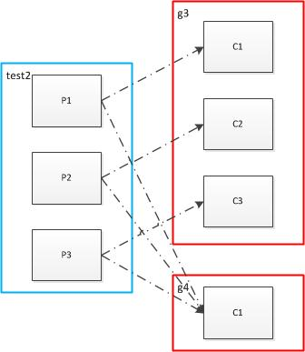
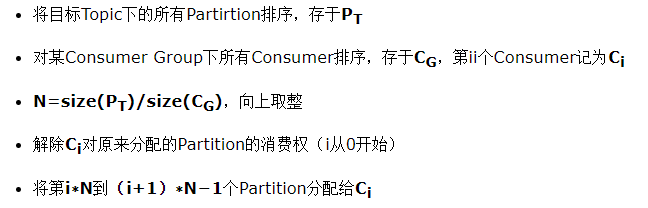

# Kafka的基础架构

## 一. Kafka概述

### 1.1 定义

Kafka是一个分布式的基于发布/订阅模式的**消息队列，**主要应用于大数据实时处理领域。

### 1.2 消息队列消息队列的两种模式

#### (1) 点对点模式

消息生产者生产消息发送到Queue中，然后消息消费者从Queue中取出并且消费消息。

消息被消费以后，queue中不再有存储，所以消息消费者不可能消费到已经被消费的消息。Queue支持存在多个消费者，但是对一个消息而言，只会有一个消费者可以消费。



#### (2) 发布/订阅模式（一对多，消费者消费数据之后不会清除消息）

消息生产者（发布）将消息发布到topic中，同时有多个消息消费者（订阅）消费该消息。和点对点方式不同，发布到topic的消息会被所有订阅者消费。


## 二. Kafka的基本架构



- **Producer ：**消息生产者，就是向kafka broker发消息的客户端；
- **Consumer** **：**消息消费者，向kafka broker取消息的客户端；
- **Consumer Group （CG）**：消费者组，由多个consumer组成。**消费者组内每个消费者负责消费不同分区的数据，一个分区只能由一个消费者消费；消费者组之间互不影响。**所有的消费者都属于某个消费者组，即**消费者组是逻辑上的一个订阅者**。
- **Broker** **：**一台kafka服务器就是一个broker。一个集群由多个broker组成。一个broker可以容纳多个topic。
- **Topic** **：**可以理解为一个队列，**生产者和消费者面向的都是一个topic**；
- **Partition：**为了实现扩展性，一个非常大的topic可以分布到多个broker（即服务器）上，**一个topic可以分为多个partition**，每个partition是一个有序的队列；
- **Replica**：副本，为保证集群中的某个节点发生故障时，**该节点上的partition数据不丢失，且kafka仍然能够继续工作**，kafka提供了副本机制，一个topic的每个分区都有若干个副本，一个**leader**和若干个**follower**。
- **Leader**：每个分区多个副本的“主”，生产者发送数据的对象，以及消费者消费数据的对象都是leader。
- **Follower**：每个分区多个副本中的“从”，实时从leader中同步数据，保持和leader数据的同步。leader发生故障时，某个follower会成为新的follower。

### 3.1 kafka中partition和消费者对应关系

**1个partition只能被同组的一个consumer消费，同组的consumer则起到均衡效果**

#### 3.1.1 消费者多于partition

topic： test 只有一个partition
创建一个topic——test，

```
bin/kafka-topics.sh --create --zookeeper localhost:2181 --replication-factor 1 --partitions 1 --topic test
```

在g2组中启动两个consumer，

```
1. bin/kafka-console-consumer.sh --bootstrap-server localhost:9092 --topic test --from-beginning --consumer.config config/consumer_g2.properties
2. bin/kafka-console-consumer.sh --bootstrap-server localhost:9092 --topic test --from-beginning --consumer.config config/consumer_g2.properties
```

消费者数量为2大于partition数量1，此时partition和消费者进程对应关系如下：

```
bin/kafka-consumer-groups.sh --bootstrap-server localhost:9092 --describe --group g2
TOPIC PARTITION CURRENT-OFFSET LOG-END-OFFSET LAG CONSUMER-ID HOST CLIENT-ID
test 0 9 9 0 consumer-1-4a2a4aa8-32f4-4904-9c16-1c0bdf7128a2 /127.0.0.1 consumer-1
- - - - - consumer-1-fd7b120f-fd21-4e07-8c23-87b71c1ee8a5 /127.0.0.1 consumer-1
```

消费者consumer-1-fd7b120f-fd21-4e07-8c23-87b71c1ee8a5无对应的partition。用图表示为：



如上图，向test发送消息：1，2， 3，4，5，6，7，8，9

只有C1能接收到消息，C2则不能接收到消息，

即同一个partition内的消息只能被同一个组中的一个consumer消费。当消费者数量多于partition的数量时，多余的消费者空闲。也就是说如果只有一个partition你在同一组启动多少个consumer都没用，partition的数量决定了此topic在同一组中被可被均衡的程度，例如partition=4，则可在同一组中被最多4个consumer均衡消费。

#### 3.1.2 消费者少于和等于partition

topic：test2包含3个partition

```
bin/kafka-topics.sh --create --zookeeper localhost:2181 --replication-factor 1 --partitions 3 --topic test2
```

开始时，在g3组中启动2个consumer,

```
1.bin/kafka-console-consumer.sh --bootstrap-server localhost:9092 --topic test2 --from-beginning --consumer.config config/consumer_g3.properties
2.bin/kafka-console-consumer.sh --bootstrap-server localhost:9092 --topic test2 --from-beginning --consumer.config config/consumer_g3.properties
```

则对应关系如下：

```
TOPIC PARTITION CURRENT-OFFSET LOG-END-OFFSET LAG CONSUMER-ID HOST CLIENT-ID
test2 0 8 8 0 consumer-1-8b872ef7-a2f0-4bd3-b2a8-7b26e4d8ab2c /127.0.0.1 consumer-1
test2 1 7 7 0 consumer-1-8b872ef7-a2f0-4bd3-b2a8-7b26e4d8ab2c /127.0.0.1 consumer-1
test2 2 8 8 0 consumer-1-f362847d-1094-4895-ad8b-1e1f1c88936c /127.0.0.1 consumer-1
```

其中，consumer-1-8b872ef7-a2f0-4bd3-b2a8-7b26e4d8ab2c对应了2个partition



消费者数量2小于partition的数量3，此时，向test2发送消息1，2，3，4，5，6，7，8，9

C1接收到1，3，4，6，7，9

C2接收到2，5，8

此时P1、P2对对应C1，即多个partition对应一个消费者，C1接收到消息量是C2的两倍

然后，在g3组中再启动一个消费者，使得消费者数量为3等于topic2中partition的数量

```
3.bin/kafka-console-consumer.sh --bootstrap-server localhost:9092 --topic test2 --from-beginning --consumer.config config/consumer_g3.properties
```

对应关系如下：

```
TOPIC PARTITION CURRENT-OFFSET LOG-END-OFFSET LAG CONSUMER-ID HOST CLIENT-ID
test2 0 8 8 0 consumer-1-8b872ef7-a2f0-4bd3-b2a8-7b26e4d8ab2c /127.0.0.1 consumer-1
test2 1 7 7 0 consumer-1-ab472ed5-de11-4e56-863a-67bf3a3cc36a /127.0.0.1 consumer-1
test2 2 8 8 0 consumer-1-f362847d-1094-4895-ad8b-1e1f1c88936c /127.0.0.1 consumer-1
```

此时，partition和消费者是一对一关系，向test2发送消息1，2，3，4，5，6，7，8，9
C1接收到了：2，5，8
C2接收到了：3，6，9
C3接收到了：1，4，7
C1，C2，C3均分了test2的所有消息，即**消息在同一个组之间的消费者之间均分了!**

**多个消费者组**

启动g4组，仅包含一个消费者C1，消费topic2的消息，此时消费端有两个消费者组

```
bin/kafka-console-consumer.sh --bootstrap-server localhost:9092 --topic test2 --from-beginning --consumer.config config/consumer_g4.properties --delete-consumer-offsets
```

g4组的C1的对应了test2的所有partition:

```
bin/kafka-consumer-groups.sh --bootstrap-server localhost:9092 --describe --group g4
TOPIC PARTITION CURRENT-OFFSET LOG-END-OFFSET LAG CONSUMER-ID HOST CLIENT-ID
test2 0 36 36 0 consumer-1-befc9234-260d-4ad3-b283-b67a2bf446ca /127.0.0.1 consumer-1
test2 1 35 35 0 consumer-1-befc9234-260d-4ad3-b283-b67a2bf446ca /127.0.0.1 consumer-1
test2 2 36 36 0 consumer-1-befc9234-260d-4ad3-b283-b67a2bf446ca /127.0.0.1 consumer-1
```



生产者消费者对应关系3.jpg

如上图，向test2发送消息1，2，3，4，5，6，7，8，9

那么g3组各个消费者及g4组的消费者接收到的消息是怎样地呢？欢迎思考！！

答案：

消息被g3组的消费者均分，g4组的消费者在接收到了所有的消息。

g3组：

C1接收到了：2，5，8

C2接收到了：3，6，9

C3接收到了：1，4，7

g4组：

C1接收到了：1，2，3，4，5，6，7，8，9

启动多个组，则会使同一个消息被消费多次

Consumer Rebalance的算法如下：

