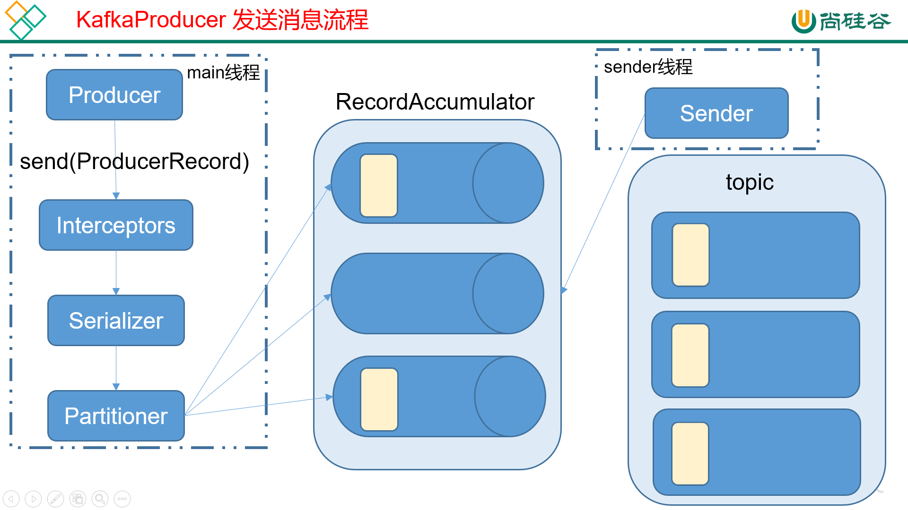

# Kafka API

## 一. Producer API

### 1.1 消息发送流程

Kafka的Producer发送消息采用的是异步发送的方式。在消息发送的过程中，涉及到了两个线程——main线程和Sender线程，以及一个线程共享变量——RecordAccumulator。main线程将消息发送给RecordAccumulator，Sender线程不断从RecordAccumulator中拉取消息发送到Kafka broker。



相关参数：

- batch.size：只有数据积累到batch.size之后，sender才会发送数据。
- linger.ms：如果数据迟迟未达到batch.size，sender等待linger.time之后就会发送数据。


### 1.2 异步发送API

#### 1.2.1 导入依赖

```xml
<dependency>
	<groupId>org.apache.kafka</groupId>
	<artifactId>kafka-clients</artifactId>
	<version>0.11.0.0</version>
</dependency>
```

#### 1.2.2 编写代码

需要用到的类：

- KafkaProducer：需要创建一个生产者对象，用来发送数据
- ProducerConfig：获取所需的一系列配置参数
- ProducerRecord：每条数据都要封装成一个ProducerRecord对象

#### 1.2.3 不带回调函数的API

```java
public static void main(String[] args) throws ExecutionException, InterruptedException {
    Properties props = new Properties();
    //kafka集群，broker-list
    props.put(ProducerConfig.BOOTSTRAP_SERVERS_CONFIG, "192.168.2.113:9092");
    props.put(ProducerConfig.ACKS_CONFIG, "all");
    //重试次数
    props.put(ProducerConfig.RETRIES_CONFIG, 1);
    //批次大小
    props.put(ProducerConfig.BATCH_SIZE_CONFIG, 16384);
    //等待时间
    props.put(ProducerConfig.LINGER_MS_CONFIG, 1);
    //RecordAccumulator缓冲区大小
    props.put(ProducerConfig.BUFFER_MEMORY_CONFIG, 33554432);
    //key的序列化器
    props.put(ProducerConfig.KEY_SERIALIZER_CLASS_CONFIG, "org.apache.kafka.common.serialization.StringSerializer");
    //value的序列化器
    props.put(ProducerConfig.VALUE_SERIALIZER_CLASS_CONFIG, "org.apache.kafka.common.serialization.StringSerializer");
    //创建生产者对象
    Producer<String, String> producer = new KafkaProducer<>(props);

    for (int i = 0; i < 100; i++) {
        //封装需要发送的消息
        ProducerRecord<String, String> record = new ProducerRecord<>("tjd", Integer.toString(i), Integer.toString(i));
        producer.send(record);
    }
    //关闭生产者
    producer.close();
}
```

#### 1.2.4 带回调函数的API

回调函数会在producer收到ack时调用，为异步调用，该方法有两个参数，分别是RecordMetadata和Exception，如果Exception为null，说明消息发送成功，如果Exception不为null，说明消息发送失败。

注意：消息发送失败会自动重试，不需要我们在回调函数中手动重试。

```java
public static void main(String[] args) throws ExecutionException, InterruptedException {
    Properties props = new Properties();
    //kafka集群，broker-list
    props.put(ProducerConfig.BOOTSTRAP_SERVERS_CONFIG, "192.168.2.113:9092");
    props.put(ProducerConfig.ACKS_CONFIG, "all");
    //重试次数
    props.put(ProducerConfig.RETRIES_CONFIG, 1);
    //批次大小
    props.put(ProducerConfig.BATCH_SIZE_CONFIG, 16384);
    //等待时间
    props.put(ProducerConfig.LINGER_MS_CONFIG, 1);
    //RecordAccumulator缓冲区大小
    props.put(ProducerConfig.BUFFER_MEMORY_CONFIG, 33554432);
    //key的序列化器
    props.put(ProducerConfig.KEY_SERIALIZER_CLASS_CONFIG, "org.apache.kafka.common.serialization.StringSerializer");
    //value的序列化器
    props.put(ProducerConfig.VALUE_SERIALIZER_CLASS_CONFIG, "org.apache.kafka.common.serialization.StringSerializer");
    //创建生产者对象
    Producer<String, String> producer = new KafkaProducer<>(props);

    for (int i = 0; i < 100; i++) {
        //封装需要发送的消息
        ProducerRecord<String, String> record = new ProducerRecord<>("tjd", Integer.toString(i), Integer.toString(i));
        producer.send(record, new Callback() {
            @Override
            public void onCompletion(RecordMetadata metadata, Exception exception) {
                if (exception == null) {
                    System.out.println("发送成功");
                }else{
                    System.out.println("发送失败");
                }
            }
        });
    }
    //关闭生产者
    producer.close();
}
```

### 1.3 同步发送API

同步发送的意思就是，一条消息发送之后，会阻塞当前线程，直至返回ack。

由于send方法返回的是一个Future对象，根据Futrue对象的特点，我们也可以实现同步发送的效果，只需在调用Future对象的get方发即可。

```java
public static void main(String[] args) throws ExecutionException, InterruptedException {
    Properties props = new Properties();
    //kafka集群，broker-list
    props.put(ProducerConfig.BOOTSTRAP_SERVERS_CONFIG, "192.168.2.113:9092");
    props.put(ProducerConfig.ACKS_CONFIG, "all");
    //重试次数
    props.put(ProducerConfig.RETRIES_CONFIG, 1);
    //批次大小
    props.put(ProducerConfig.BATCH_SIZE_CONFIG, 16384);
    //等待时间
    props.put(ProducerConfig.LINGER_MS_CONFIG, 1);
    //RecordAccumulator缓冲区大小
    props.put(ProducerConfig.BUFFER_MEMORY_CONFIG, 33554432);
    //key的序列化器
    props.put(ProducerConfig.KEY_SERIALIZER_CLASS_CONFIG, "org.apache.kafka.common.serialization.StringSerializer");
    //value的序列化器
    props.put(ProducerConfig.VALUE_SERIALIZER_CLASS_CONFIG, "org.apache.kafka.common.serialization.StringSerializer");
    //创建生产者对象
    Producer<String, String> producer = new KafkaProducer<>(props);

    for (int i = 0; i < 100; i++) {
        //封装需要发送的消息
        ProducerRecord<String, String> record = new ProducerRecord<>("tjd", Integer.toString(i), Integer.toString(i));
        //通过Future的get方法获取返回值，这个方法会阻塞当前线程，直到Kafka返回ACK
        Future<RecordMetadata> future = producer.send(record);
        future.get();
    }
    //关闭生产者
    producer.close();
}
```

有的人可能会有疑问Kafka发送是按批发送的，只有等到发送的数量达到时才会一起发送，那这里为什么会一条一条发送呢？其实这是因为我们将LINGER_MS_CONFIG设置成1ms了，当达到1ms时哪怕缓冲区数量不够同样会发送。

## 二. Consumer API

Consumer消费数据时的可靠性是很容易保证的，因为数据在Kafka中是持久化的，故不用担心数据丢失问题。

由于consumer在消费过程中可能会出现断电宕机等故障，consumer恢复后，需要从故障前的位置的继续消费，所以consumer需要实时记录自己消费到了哪个offset，以便故障恢复后继续消费。

### 2.1 kafka 消费者offset记录位置和方式

我们大家都知道，kafka消费者在会保存其消费的进度，也就是offset，存储的位置根据选用的kafka api不同而不同。

首先来说说消费者如果是根据Java api来消费，也就是`kafka.javaapi.consumer.ConsumerConnector`，我们会配置参数`zookeeper.connect`来消费。这种情况下，消费者的offset会更新到zookeeper的`consumers/{group}/offsets/{topic}/{partition}`目录下，例如：

```shell
[zk: localhost(CONNECTED) 0] get /kafka/consumers/zoo-consumer-group/offsets/my-topic/0
5662
cZxid = 0x20006d28a
ctime = Wed Apr 12 18:20:51 CST 2017
mZxid = 0x30132b0ed
mtime = Tue Aug 22 18:53:22 CST 2017
pZxid = 0x20006d28a
cversion = 0
dataVersion = 5758
aclVersion = 0
ephemeralOwner = 0x0
dataLength = 4
numChildren = 0
```

如果是根据kafka默认的api来消费，即`org.apache.kafka.clients.consumer.KafkaConsumer`，我们会配置参数`bootstrap.servers`来消费。而其消费者的offset会更新到一个kafka自带的topic`__consumer_offsets`下面，查看当前group的消费进度，则要依靠kafka自带的工具`kafka-consumer-offset-checker`，例如：

```shell
[root@localhost data]# kafka-consumer-offset-checker --zookeeper localhost :2181/kafka --group test-consumer-group  --topic stable-test
[2017-08-22 19:24:24,222] WARN WARNING: ConsumerOffsetChecker is deprecated and will be dropped in releases following 0.9.0. Use ConsumerGroupCommand instead. (kafka.tools.ConsumerOffsetChecker$)
Group                 Topic                       Pid  Offset          logSize         Lag             Owner
test-consumer-group stable-test                    0   601808          601808          0               none
test-consumer-group stable-test                    1   602826          602828          2               none
test-consumer-group stable-test                    2   602136          602136          0               none
```

上面结果的说明：

- Group : 消费者组名称
- Topic : topic的名称
- Pid : 分区的ID
- Offset : kafka消费者在对应分区上已经消费的消息数【位置】
- logSize : 已经写到该分区的消息数【位置】
- Lag : 还有多少消息未读取（Lag = logSize - Offset）
- Owner : 分区创建在哪个broker

offset更新的方式，不区分是用的哪种api，大致分为两类：

1. 自动提交，设置enable.auto.commit=true，更新的频率根据参数【auto.commit.interval.ms】来定。这种方式也被称为【**at most once**】，fetch到消息后就可以更新offset，无论是否消费成功。
2. 手动提交，设置enable.auto.commit=false，这种方式称为【**at least once**】。fetch到消息后，等消费完成再调用方法`consumer.commitSync()`，手动更新offset；如果消费失败，则offset也不会更新，此条消息会被重复消费一次。

### 2.2 手动提交offset

需要用到的类：

- KafkaConsumer：需要创建一个消费者对象，用来消费数据
- ConsumerConfig：获取所需的一系列配置参数
- ConsuemrRecord：每条数据都要封装成一个ConsumerRecord对象

```java
public static void main(String[] args) {
    Properties properties = new Properties();
    properties.setProperty(ConsumerConfig.BOOTSTRAP_SERVERS_CONFIG, "192.168.2.113:9092");
    //消费者组，只要group.id相同，就属于同一个消费者组
    properties.setProperty(ConsumerConfig.GROUP_ID_CONFIG, "test1");
    //设置key、value的反序列化器
    properties.setProperty(ConsumerConfig.KEY_DESERIALIZER_CLASS_CONFIG, StringDeserializer.class.getName());
    properties.setProperty(ConsumerConfig.VALUE_DESERIALIZER_CLASS_CONFIG, StringDeserializer.class.getName());
    //关闭自动提交offset
    properties.setProperty(ConsumerConfig.ENABLE_AUTO_COMMIT_CONFIG, "false");
    //设置消费者第一次消费时没有offset时的应对策略，
    // latest表示从最后的消息开始消费
    // earliest: 表示自动将偏移量重置为最早的偏移量
    //none：如果未找到消费者组的offset，则向消费者抛出异常
    properties.setProperty(ConsumerConfig.AUTO_OFFSET_RESET_CONFIG,"latest");

    //创建一个消费者
    KafkaConsumer<String, String> consumer = new KafkaConsumer(properties);
    consumer.subscribe(Arrays.asList("tjd"));
    while (true) {
        ConsumerRecords<String, String> records = consumer.poll(100);
        for (ConsumerRecord<String, String> record : records) {
            System.out.println(record.key() + ":" + record.value());
        }
        //提交offset偏移量
        consumer.commitAsync();
    }
}
```

具体的配置信息请查看官方文档：<http://kafka.apache.org/documentation/#consumerconfigs>

**代码解读**：

手动提交offset的方法有两种：分别是commitSync（同步提交）和commitAsync（异步提交）。两者的相同点是，都会将本次poll的一批数据最高的偏移量提交；不同点是，commitSync会失败重试，一直到提交成功（如果由于不可恢复原因导致，也会提交失败）；而commitAsync则没有失败重试机制，故有可能提交失败。

至于异步提交为什么不设计重试机制，是因为如果异步提交也设计重试机制的话会导致，重试的提交将正常提交覆盖的情况。例如：第一次提交offset=1000，但是失败了，由于是异步提交，消费者马上可以再消费一次，并且再一次进入提交流程，第二次提交offset=2000成功了，此时第一次失败的提交仍在不断重试，此时终于提交成功将offset设置为了1000。

**数据重复消费的问题**：

假如kafka中有`[1,2,3,4,5,6]`这六个消息，当前的offset=4，此时消费者去Kafka中消费，返回的消息是`[4,5,6]`，此时我们对这三个消息进行相应的处理........处理完后，正提交offset时消费者挂掉了，offset也没能提交上去，过了一会消费者重新连上来了，但是offset还是等于4，所以又将[4,5,6]消费了一遍。

### 2.3 自动提交offset

为了使我们能够专注于自己的业务逻辑，Kafka提供了自动提交offset的功能。 自动提交offset的相关参数：

- enable.auto.commit：是否开启自动提交offset功能（默认为true）
- auto.commit.interval.ms：自动提交offset的时间间隔

```java
public static void main(String[] args) {
    Properties properties = new Properties();
    properties.setProperty(ConsumerConfig.BOOTSTRAP_SERVERS_CONFIG, "192.168.2.113:9092");
    //消费者组，只要group.id相同，就属于同一个消费者组
    properties.setProperty(ConsumerConfig.GROUP_ID_CONFIG, "test1");
    //设置key、value的反序列化器
    properties.setProperty(ConsumerConfig.KEY_DESERIALIZER_CLASS_CONFIG, StringDeserializer.class.getName());
    properties.setProperty(ConsumerConfig.VALUE_DESERIALIZER_CLASS_CONFIG, StringDeserializer.class.getName());
    //自动提交offset(可省略，默认就是true)
    properties.setProperty(ConsumerConfig.ENABLE_AUTO_COMMIT_CONFIG,"true");
    //自动提交offset的时间间隔
    properties.setProperty(ConsumerConfig.AUTO_COMMIT_INTERVAL_MS_CONFIG,"1");

    //创建一个消费者
    KafkaConsumer<String, String> consumer = new KafkaConsumer(properties);
    consumer.subscribe(Arrays.asList("tjd"));
    while (true) {
        ConsumerRecords<String, String> records = consumer.poll(100);
        for (ConsumerRecord<String, String> record : records) {
            System.out.println(record.key() + ":" + record.value());
        }
    }
}
```

### 2.4 分区再分配监听器

我们知道一个kafka集群可以有多个topic（主题），每个topic又会有多个partition（分区），当消费者消费时只需要指定topic和自己所处的消费组，这样Kafka会根据配置的策略将partition分配给消费者组中的消费者，而一个消费者组一旦有新的消费者加入进来，则需要将分配好的partition回收然后重新分配下去，而Kafka API提供了一个接口去接入Partition回收和分配过程。


在使用`KafkaConsumer:subscribe()`方法订阅指定主题时，我们可以传入`ConsumerRebalanceListener`实例，它分别有两个方法：

- onPartitionsRevoked：当有新的消费者加入消费者组时，原先分配的Partition就需要回收进行重新分配，而重新分配之前会调用onPartitionsRevoked方法，我们**可以获取到回收之前，当前消费者与哪些分区绑定**。
- onPartitionsAssigned：重新分配完成后会调用onPartitionsAssigned方法，我们**可以获得重新分配之后，当前消费者与哪些分区绑定**。

```java
public static void main(String[] args) {
    Properties properties = new Properties();
    properties.setProperty(ConsumerConfig.BOOTSTRAP_SERVERS_CONFIG, "192.168.2.113:9092");
    properties.setProperty(ConsumerConfig.GROUP_ID_CONFIG, "test1");
    properties.setProperty(ConsumerConfig.KEY_DESERIALIZER_CLASS_CONFIG, StringDeserializer.class.getName());
    properties.setProperty(ConsumerConfig.VALUE_DESERIALIZER_CLASS_CONFIG, StringDeserializer.class.getName());
    properties.put(ConsumerConfig.ENABLE_AUTO_COMMIT_CONFIG, "false");
    properties.setProperty(ConsumerConfig.AUTO_OFFSET_RESET_CONFIG, "latest");
    properties.setProperty(ConsumerConfig.ENABLE_AUTO_COMMIT_CONFIG, "false");

    //创建一个消费者
    KafkaConsumer<String, String> consumer = new KafkaConsumer(properties);
    consumer.subscribe(Arrays.asList("tjd"), new ConsumerRebalanceListener() {

        /**
         * 当有新的消费者加入消费者组时，原先分配的Partition就需要回收进行重新分配，而重新分配之前会调用onPartitionsRevoked方法
         * @param partitions 当前消费者原先分配的partition
         */
        @Override
        public void onPartitionsRevoked(Collection<TopicPartition> partitions) {
            System.out.println("-----------被回收的分区对象------------");
            partitions.stream().forEach(System.out::println);
        }

        /**
         * 重新分配完成后会调用onPartitionsAssigned方法
         * @param partitions 为当前消费者新分配的分区
         */
        @Override
        public void onPartitionsAssigned(Collection<TopicPartition> partitions) {
            System.out.println("-----------新分配的分区对象------------");
            partitions.stream().forEach(System.out::println);
        }
    });

    while (true) {
        ConsumerRecords<String, String> records = consumer.poll(100);
        for (ConsumerRecord<String, String> record : records) {
            String value = record.value();
        }
    }
}
```

### 2.5 自己实现offset的维护

offset通常情况下由Kafka自己维护，我们并不需要维护，但是我们可以借助`分区再分配监听器`来自己维护offset：

```java
public class CustomOffsetConsumer {

    public static void main(String[] args) {

        Properties props = new Properties();
        props.put("bootstrap.servers", "hadoop102:9092");
        props.put("group.id", "test");//消费者组，只要group.id相同，就属于同一个消费者组
        props.put("enable.auto.commit", "false");//自动提交offset
        props.put("key.deserializer", "org.apache.kafka.common.serialization.StringDeserializer");
        props.put("value.deserializer", "org.apache.kafka.common.serialization.StringDeserializer");
        KafkaConsumer<String, String> consumer = new KafkaConsumer<>(props);
        consumer.subscribe(Arrays.asList("first"), new ConsumerRebalanceListener() {

            //提交当前负责的分区的offset
            @Override
            public void onPartitionsRevoked(Collection<TopicPartition> partitions) {


            }

            //定位新分配的分区的offset
            @Override
            public void onPartitionsAssigned(Collection<TopicPartition> partitions) {
                for (TopicPartition partition : partitions) {
                    //自己实现getPartitionOffset，底层可以保存在Redis等地方，通过getPartitionOffset获取当前分区的offset
                    Long offset = getPartitionOffset(partition);
                    //将自己维护的offset放入consumer中
                    consumer.seek(partition,offset);
                }
            }
        });


        while (true) {
            ConsumerRecords<String, String> records = consumer.poll(100);
            for (ConsumerRecord<String, String> record : records) {

                System.out.printf("offset = %d, key = %s, value = %s%n", record.offset(), record.key(), record.value());
                TopicPartition topicPartition = new TopicPartition(record.topic(), record.partition());
                //自己实现commitOffset实现offset保存
                commitOffset(topicPartition,record.offset()+1);
            }
        }
    }

    private static void commitOffset(TopicPartition topicPartition, long l) {

    }

    private static Long getPartitionOffset(TopicPartition partition) {
        return null;
    }

}
```

## 三. 拦截器

Producer拦截器(interceptor)是在Kafka 0.10版本被引入的，主要用于实现clients端的定制化控制逻辑。

对于producer而言，interceptor使得用户在消息发送前以及producer回调逻辑前有机会对消息做一些定制化需求，比如修改消息等。同时，producer允许用户指定多个interceptor按序作用于同一条消息从而形成一个拦截链(interceptor chain)。Intercetpor的实现接口是`org.apache.kafka.clients.producer.ProducerInterceptor`，其定义的方法包括：

- configure(configs)
  获取配置信息和初始化数据时调用。
- onSend(ProducerRecord)：
  该方法封装进KafkaProducer.send方法中，即它运行在用户主线程中。Producer确保在消息被序列化以及计算分区前调用该方法。用户可以在该方法中对消息做任何操作，但最好保证不要修改消息所属的topic和分区，否则会影响目标分区的计算。
- onAcknowledgement(RecordMetadata, Exception)：
  该方法会在消息从RecordAccumulator成功发送到Kafka Broker之后，或者在发送过程中失败时调用。并且通常都是在producer回调逻辑触发之前。onAcknowledgement运行在producer的IO线程中，因此不要在该方法中放入很重的逻辑，否则会拖慢producer的消息发送效率。
- close：
  关闭interceptor，主要用于执行一些资源清理工作。如前所述，interceptor可能被运行在多个线程中，因此在具体实现时用户需要自行确保线程安全。另外倘若指定了多个interceptor，则producer将按照指定顺序调用它们，并仅仅是捕获每个interceptor可能抛出的异常记录到错误日志中而非在向上传递。这在使用过程中要特别留意。

需要注意的是，拦截器在整个流程中的接入点是在`Producer`和`Serializer`之间，也就是说拦截器中拦截的的`ProducerRecord`并没有经过`Serializer`和`Partitioner`（分区器）处理：


### 3.1 拦截器实例

实现一个简单的双interceptor组成的拦截链。第一个interceptor会在消息发送前将时间戳信息加到消息value的最前部；第二个interceptor会在消息发送后更新成功发送消息数或失败发送消息数。

时间戳拦截器：

```java
package cn.tjd.kafkademo;
public class TimeInterceptor implements ProducerInterceptor<String, String> {

    @Override
    public void configure(Map<String, ?> configs) {}

    @Override
    public ProducerRecord<String, String> onSend(ProducerRecord<String, String> record) {
        // 创建一个新的record，把时间戳写入消息体的最前部
        return new ProducerRecord(record.topic(), record.partition(), record.timestamp(), record.key(),
                System.currentTimeMillis() + "," + record.value().toString());
    }

    @Override
    public void onAcknowledgement(RecordMetadata metadata, Exception exception) {}

    @Override
    public void close() {}
}
```

统计发送消息成功和发送失败消息数，并在producer关闭时打印这两个计数器：

```java
package cn.tjd.kafkademo;
public class CounterInterceptor implements ProducerInterceptor<String, String> {
    private int errorCounter = 0;
    private int successCounter = 0;

    @Override
    public void configure(Map<String, ?> configs) {}

    @Override
    public ProducerRecord<String, String> onSend(ProducerRecord<String, String> record) {
        return record;
    }

    @Override
    public void onAcknowledgement(RecordMetadata metadata, Exception exception) {
        // 统计成功和失败的次数
        if (exception == null) {
            successCounter++;
        } else {
            errorCounter++;
        }
    }

    @Override
    public void close() {
        // 保存结果
        System.out.println("Successful sent: " + successCounter);
        System.out.println("Failed sent: " + errorCounter);
    }
}
```

生产者调用：

```java
package cn.tjd.kafkademo;
public class InterceptorProducer {

    public static void main(String[] args) throws Exception {
        // 1 设置配置信息
        Properties props = new Properties();
        props.put(ProducerConfig.BOOTSTRAP_SERVERS_CONFIG, "hadoop102:9092");
        props.put(ProducerConfig.ACKS_CONFIG, "all");
        props.put(ProducerConfig.RETRIES_CONFIG, 0);
        props.put(ProducerConfig.BATCH_SIZE_CONFIG, 16384);
        props.put(ProducerConfig.LINGER_MS_CONFIG, 1);
        props.put(ProducerConfig.BUFFER_MEMORY_CONFIG, 33554432);
        props.put(ProducerConfig.KEY_SERIALIZER_CLASS_CONFIG, "org.apache.kafka.common.serialization.StringSerializer");
        props.put(ProducerConfig.VALUE_SERIALIZER_CLASS_CONFIG, "org.apache.kafka.common.serialization.StringSerializer");

        // 2 构建拦截链
        List<String> interceptors = new ArrayList<>();
        interceptors.add("cn.tjd.kafkademo.TimeInterceptor");
        interceptors.add("cn.tjd.kafkademo.InterceptorProducer");
        props.put(ProducerConfig.INTERCEPTOR_CLASSES_CONFIG, interceptors);

        String topic = "first";
        Producer<String, String> producer = new KafkaProducer<>(props);

        // 3 发送消息
        for (int i = 0; i < 10; i++) {
            ProducerRecord<String, String> record = new ProducerRecord<>(topic, "message" + i);
            producer.send(record);
        }

        // 4 一定要关闭producer，这样才会调用interceptor的close方法
        producer.close();
    }
}
```

