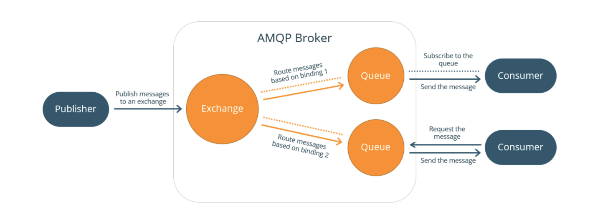

# AMQP协议

## 一. 协议架构

AMQP全称高级消息队列协议（Advanced Message Queuing Protocol），是一种标准，类似于JMS，兼容JMS协议。目前RabbitMQ主流支持`AMQP 0-9-1`，3.8.4版本支持`AMQP 1.0`。

## 二. AMQP中的概念

**Publisher**：消息发送者，将消息发送到Exchange并指定RoutingKey，以便queue可以接收到指定的消息。

**Consumer**：消息消费者，从queue获取消息，一个Consumer可以订阅多个queue以从多个queue中接收消息。

**Server**：一个具体的MQ服务实例，也称为Broker。

**Virtual host**：虚拟主机，一个Server下可以有多个虚拟主机，用于隔离不同项目，一个Virtualhost通常包含多个Exchange、Message Queue。

**Exchange**：交换器，接收Producer发送来的消息，把消息转发到对应的Message Queue中。

**Routing key**：路由键，用于指定消息路由规则（Exchange将消息路由到具体的queue中），通常需要和具体的Exchange类型、Binding的Routing key结合起来使用。

**Bindings**：指定了Exchange和Queue之间的绑定关系。Exchange根据消息的Routing key和Binding配置（绑定关系、Binding、Routing key等）来决定把消息分派到哪些具体的queue中。这依赖于Exchange类型。

**Message Queue**：实际存储消息的容器，并把消息传递给最终的Consumer。

## 三. 传输层架构

### 3.1 简要概要

AMQP是一个二进制的协议，信息被组织成数据帧，有很多类型。数据帧携带协议方法和其他信息。所有数据帧都拥有基本相同的格式：帧头，负载，帧尾。数据帧负载的格式依赖于数据帧的类型。

我们假定有一个可靠的面向流的网络传输层（TCP/IP或等价的协议）。

在一个单一的socket连接中，可能有多个相互独立的控制线程，称为“channel”。每个数据帧使用通道号码编号。通过数据帧的交织，不同的通道共享一个连接。对于任意给定通道，数据帧严格按照序列传输。

我们使用小的数据类型来构造数据帧，如bit，integer，string以及字段表。数据帧的字段做了轻微的封装，不会让传输变慢或解析困难。根据协议规范机械地生成成数据帧层相对简单。

### 3.2 数据类型

AMQP使用的数据类型如下：

- Integers（数值范围1-8的十进制数字）：用于表示大小，数量，限制等，整数类型无符号的，可以在帧内不对齐。
- Bits（统一为8个字节）：用于表示开/关值。
- Short strings：用于保存简短的文本属性，字符串个数限制为255，8个字节
- Long strings：用于保存二进制数据块。
- Field tables：包含键值对，字段值一般为字符串，整数等。

### 3.3 协议协商

AMQP客户端和服务端进行协议协商。意味着当客户端连接上之后，服务端会向客户端提出一些选项，客户端必须能接收或修改。如果双方都认同协商的结果，继续进行连接的建立过程。协议协商是一个很有用的技术手段，因为它可以让我们断言假设和前置条件。

在AMQP中，我们需要协商协议的一些特殊方面：

- 真实的协议和版本。服务器可能在同一个端口支持多个协议。
- 双方的加密参数和认证方式。这是功能层的一部分。
- 数据帧最大大小，通道数量以及其他操作限制。

对限制条件的认同可能会导致双方重新分配key的缓存，避免死锁。每个发来的数据帧要么遵守认同的限制，也就是安全的，要么超过了限制，此时另一方出错，必须断开连接。出色地践行了“要么一切工作正常，要么完全不工作”的RabbitMQ哲学。

协商双方认同限制到一个小的值，如下：

1. 服务端必须告诉客户端它加上了什么限制。
2. 客户端响应服务器，或许会要求对客户端的连接降低限制。

### 3.4 数据帧界定

TCP/IP是流协议，没有内置的机制用于界定数据帧。现有的协议从以下几个方面来解决：

- 每个连接发送单一数据帧。简单但是慢。
- 在流中添加帧的边界。简单，但是解析很慢。
- 计算数据帧的大小，在每个数据帧头部加上该数据帧大小。这简单，快速，AMQP的选择。

