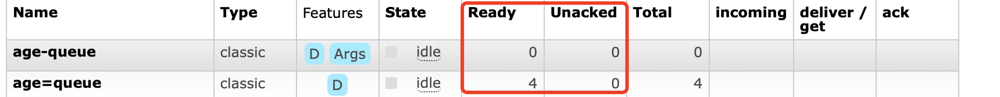

# RabbitMQ API使用

## 一. 生产者发送消息

```java
ConnectionFactory factory = new ConnectionFactory();
factory.setHost("192.168.0.10");
factory.setUsername("guest");
factory.setPassword("guest");
Connection connection = factory.newConnection();
Channel channel = connection.createChannel();
//声明队列
channel.queueDeclare("queue-test", false, false, false, null);
//声明交换机
channel.exchangeDeclare("direct-exchange-test", BuiltinExchangeType.DIRECT, false, true, null);
//声明交换机和队列绑定
channel.queueBind("queue-test", "direct-exchange-test", "123");

for (int i = 0; i < 20; i++) {
    System.out.println("send " + i);
    //发送消息
    channel.basicPublish("direct-exchange-test", "123", null, ("Hello" + i).getBytes());
}
```

### 1.1 创建连接

不仅可以使用上面的方式创建连接，还可以使用uri的形式创建连接：

```java
factory.setUri("amqp://{userName}:{password}@{ipAddress}:{portNumber}/virtualHost");
Connection connection = factory.newConnection();
```

Connection可以用来创建多个Channel实例，但是**Channel实例不能在线程间共享**，应用程序应该为每一个线程开辟一个Channel。某些情况下Channel的操作可以并发运行，但是在其他情况下会导致在网络上出现错误的通信帧交错，同时也会影响发送方确认(publisherconfirm)机制的运行，所以多线程间共享Channel实例是非线程安全的。

### 1.2 创建交换机

exchangeDeclare有多个重载方法，这些重载方法都是由下面这个方法中缺省的某些参数构成的。

```java
Exchange.DeclareOk exchangeDeclare(String exchange,
	String type, boolean durable,
	boolean autoDelete, boolean internal,
	Map<String, Object> arguments) throws IOException;
```

这个方法的返回值是Exchange . Declare0K，用来标识成功声明了一个交换器。

- exchange: 交换器的名称。
- type: 交换器的类型，常见的如fanout、direct、 topic
- durable: 设置是否持久化。durable 设置为true表示持久化，反之是非持久化。持久化可以将交换器存盘，在服务器重启的时候不会丢失相关信息。
- autoDelete: 设置是否自动删除。autoDelete 设置为true则表示自动删除。自动删除的前提是至少有一个队列或者交换器与这个交换器绑定,之后所有与这个交换器绑定的队列或者交换器都与此解绑。注意不能错误地把这个参数理解为:“当与此交换器连接的客户端都断开时，RabbitMQ 会自动删除本交换器”。
- internal: 设置是否是内置的。如果设置为true,则表示是内置的交换器，客户端程序无法直接发送消息到这个交换器中，只能通过交换器路由到交换器这种方式。
- argument: 其他一些结构化参数，比如alternate-exchange。

### 1.3 创建队列

queueDeclare相对于exchangeDeclare方法而言，重载方法的个数就少很多，它只有两个重载方法:

```java
Queue.DeclareOk queueDeclare() throws IOException;

Queue.DeclareOk queueDeclare(String queue, boolean durable, boolean exclusive, boolean autoDelete, Map<String, Object> arguments) throws IOException;
```

不带任何参数的queueDeclare方法默认创建一个由RabbitMQ命名的(类似这种`amq.gen-LhQz1gv3GhDOv8PIDabOXA名称，这种队列也称之为匿名队列`)、排他的、自动删除的、非持久化的队列。

- `queue`: 队列的名称。
- `durable`: 设置是否持久化。为true 则设置队列为持久化。持久化的队列会存盘，在服务器重启的时候可以保证不丢失相关信息。
- `exclusive`: 设置是否排他。为true 则设置队列为排他的。如果一个队列被声明为排他队列，该队列仅对首次声明它的连接可见，并在连接断开时自动删除。这里需要注意三点:
  - 排他队列是基于连接(Connection) 可见的，同一个连接的不同信道(Channel)是可以同时访问同一连接创建的排他队列;
  - “首次”是指如果一个连接已经声明了一个排他队列，其他连接是不允许建立同名的排他队列的，这个与普通队列不同;
  - 即使该队列是持久化的，一旦连接关闭或者客户端退出，该排他队列都会被自动删除，这种队列适用于一个客户端同时发送和读取消息的应用场景。

- `autoDelete`: 设置是否自动删除。为true则设置队列为自动删除。自动删除的前提是：至少有一个消费者连接到这个队列，之后所有与这个队列连接的消费者都断开时，才会自动删除。不能把这个参数错误地理解为:“当连接到此队列的所有客户端断开时，这个队列自动删除”，因为生产者客户端创建这个队列，或者没有消费者客户端与这个队列连接时，都不会自动删除这个队列。

- `arguments`：设置队列的其他一些参数，如x-message=ttl、x-expires、x-max-length、x-max-length-bytes、x-dead-letter-exchange、x-dead-letter-routing-key、x-max-priority等。

注意要点：生产者和消费者都能够使用queueDeclare来声明一个队列，但是`如果消费者在同一个信道上订阅了另一个队列，就无法再声明队列了`。必须先取消订阅，然后将信道置为“传输”模式，之后才能声明队列。

### 1.4 绑定队列和交换机

```java
Queue.BindOk queueBind(String queue, String exchange, String routingKey) throws IOException;

Queue.BindOk queueBind(String queue, String exchange, String routingKey, Map<String, Object> arguments) throws IOException;

void queueBindNoWait(String queue, String exchange, String routingKey, Map<String, Object> arguments) throws IOException;
```

- `queue`: 队列名称
- `exchange`: 交换器的名称
- `routingKey`: 用来绑定队列和交换器的路由键（通常称这个key为bindingKey），生产者在发送消息时会指定一个routingKey，当routingKey和bindingKey匹配时Exchange才会将这个消息转发到队列上，需要注意的是fanout类型的Exchange不会处理routingKey而是将消息广播到所有队列上，所以在绑定Fanout类型的交换机，指定routingKey是无效的。
- `argument`: 定义绑定的一些参数。

### 1.5 发送消息

```java
void basicPublish(String exchange, String routingKey, BasicProperties props, byte[] body) throws IOException;
```

- exchangeName：交换机名称，生产者只能向Exchange发送数据，再由Exchange将数据转发到Queue中。
- routingKey：路由键，Exchange根据发送消息时指定的routingKey去交换机已经绑定列表中寻找bindingKey相同的绑定进行发送，Exchange既可以绑定Queue也可以绑定Exchange、
- props：消息参数（消费者可以获取）
- body：消息内容

## 二. 消费者消费消息

```java
ConnectionFactory factory = new ConnectionFactory();
factory.setHost("192.168.0.10");
Connection connection = factory.newConnection();
Channel channel = connection.createChannel();

channel.queueDeclare("simple-test", false, false, false, null);


channel.basicConsume("simple-test", false, (consumerTag, message) -> {
    try {
        Thread.sleep(1000);
    } catch (InterruptedException e) {
        e.printStackTrace();
    }
    String msg = new String(message.getBody(), "UTF-8");
    System.out.println(" [x] Received '" + msg + "'");
    channel.basicAck(message.getEnvelope().getDeliveryTag(), false);
}, consumerTag -> {});
```

RabbitMQ的消费模式分两种:

- 推(Push)模式
- 拉(Pull)模式

推模式采用Basic.Consume进行消费，而拉模式则是调用Basic.Get进行消费。

### 2.1 推模式

在推模式中，可以通过持续订阅的方式来消费消息，使用到的类有：

```java
com.rabbitmq.client.Consumer
com.rabbitmq.client.DefaultConsumer
```

接收消息一般通过实现Consumer接口或者继承DefaultConsumer类来实现。当调用与Consumer相关的API方法时，不同的订阅采用不同的消费者标签(consumerTag) 来区分彼此，在同一个Channel中的消费者也需要通过唯一的消费者标签以作区分，代码如下：

```java
String basicConsume(String queue, boolean autoAck, DeliverCallback deliverCallback, CancelCallback cancelCallback) throws IOException;
```

- queue: 队列的名称;
- autoAck:设置是否自动确认。建议设成false,即不自动确认;
- consumerTag: 消费者标签，用来区分多个消费者;
- noLocal: 设置为true则表示不能将同一个Connection中生产者发送的消息传送给这个Connection中的消费者;
- exclusive: 设置是否排他;
- arguments: 设置消费者的其他参数;
- callback: 设置消费者的回调函数。用来处理RabbitMQ 推送过来的消息，比如DefaultConsumer,使用时需要客户端重写(override) 其中的方法

### 2.2 拉模式

通过使用`Channel.basicGet`显示拉取消息，返回的数据类型是`GetResponse`实例。

```java
boolean autoAck = false;
GetResponse response = channel.basicGet(queueName, autoAck);
if (response == null) {
    // No message retrieved.
} else {
    AMQP.BasicProperties props = response.getProps();
    byte[] body = response.getBody();
    long deliveryTag = response.getEnvelope().getDeliveryTag();
    ...
    ...
    channel.basicAck(method.deliveryTag, false); // acknowledge receipt of the message
}
```

### 2.3 消费端的确认与拒绝

#### 2.3.1 消息确认

为了保证消息从队列可靠地达到消费者，RabbitMQ 提供了消息确认机制(message acknowledgement)。消费者在订阅队列时，可以指定autoAck参数，当autoAck等于false时，RabbitMQ 会等待消费者显式地回复确认信号后才从内存(或者磁盘)中移去消息(实质上是先打上删除标记，之后再删除)。当autoAck等于true 时，RabbitMQ 会自动把发送出去的消息置为确认，然后从内存(或者磁盘)中删除，而不管消费者是否真正地消费到了这些消息。

采用消息确认机制后，只要设置 autoAck 参数为false，消费者就有足够的时间处理消息(任务)，不用担心处理消息过程中消费者进程挂掉后消息丢失的问题，因为RabbitMQ会一直等待持有消息直到消费者显式调用Basic.Ack命令为止。

当autoAck参数置为false，对于RabbitMQ服务端而言，队列中的消息分成了两个部分:

1. 一部分是等待投递给消费者的消息;
2. 一部分是已经投递给消费者，但是还没有收到消费者确认信号的消息。

如果RabbitMQ一直没有收到消费者的确认信号，并且消费此消息的消费者已经断开连接，则RabbitMQ会安排该消息重新进入队列，等待投递给下一个消费者，当然也有可能还是原来的那个消费者。

RabbitMQ不会为未确认的消息设置过期时间，它判断此消息是否需要重新投递给消费者的唯一依据是消费该消息的消费者连接是否已经断开，这么设计的原因是RabbitMQ允许消费者消费一条消息的时间可以很久很久。

RabbtiMQ的Web管理平台上可以看 到当前队列中的“Ready”状态和“Unacknowledged”状态的消息数，分别对应上文中的等待投递给消费者的消息数和已经投递给消费者但是未收到确认信号的消息数



#### 2.3.2 拒绝消息

在消费者接收到消息后，如果想明确拒绝当前的消息而不是确认，那么应该怎么做呢？RabbitMQ在2.0.0 版本开始引入了Basic.Reject这个命令，消费者客户端可以调用与其对应的`channel.basicReject`方法来告诉RabbitMQ拒绝这个消息。

```java
void basicReject(long deliveryTag, boolean requeue) throws IOException;
```

其中deliveryTag 可以看作消息的编号，它是一个64位的长整型值，最大值是9223372036854775807。

- 如果requeue参数设置为true，则RabbitMQ会重新将这条消息存入队列，以便可以发送给下一个订阅的消费者;
- 如果requeue参数设置为false, 则RabbitMQ立即会把消息从队列中移除，而不会把它发送给新的消费者;

`Basic.Reject`命令一次只能拒绝一条消息，如果想要批量拒绝消息，则可以使用`Basic.Nack`这个命令。消费者客户端可以调用`channel .basicNack`方法来实现，方法定义如下:

```java
void basicNack(long deliveryTag, boolean multiple, boolean requeue)
            throws IOException;
```

- multiple 参数设置为false 则表示拒绝编号为deliveryTag的这一条消息，这时候basicNack和basicReject方法一样;
- multiple参数设置为true 则表示拒绝deliveryTag编号之前所有未被当前消费者确认的消息。

注意：将`channel.basicReject`或者`channel.basicNack`中的requeue设置为false，可以启用“死信队列”的功能。死信队列可以通过检测被拒绝或者未送达的消息来追踪问题。

#### 2.3.3 重新发送未确认的消息

对于requeue, AMQP中还有一个命令Basic. Recover具备可重入队列的特性。其对应的客户端方法为:

```java
Basic.RecoverOk basicRecover() throws IOException;

Basic.RecoverOk basicRecover(boolean requeue) throws IOException;
```

这个`channel.basicRecover`方法用来请求RabbitMQ重新发送还未被确认的消息。如果requeue参数设置为true,则未被确认的消息会被重新加入到队列中，这样对于同一条消息来说，可能会被分配给与之前不同的消费者。如果requeue参数设置为false,那么同一条消息会被分配给与之前相同的消费者。默认情况下，如果不设置requeue这个参数，相当于channel . basicRecover (true)，即requeue默认为true。

## 三. 交换机、队列、绑定三者声明的时机

本质上来说交换机、队列以及两者的绑定不是生产者的固定步骤。因为交换机、队列创建完成后就不用再创建了，我们只需要保证在生产者在发送消息的时候Exchange已经创建就好了，消费者消费消息时队列已经创建好了即可。

创建交换机、队列以及两者的绑定过程甚至可以交给运维去完成，开发者只需要在代码中向Exchange发消息，以及订阅Queue中的消息即可，然后在代码上线之前保证Exchange、Queue、Binding都已经准备完毕（运维）即可。

