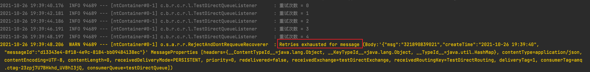
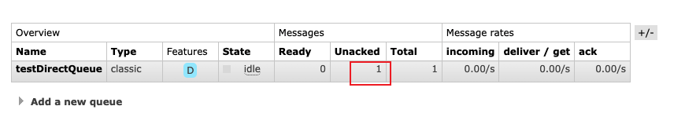
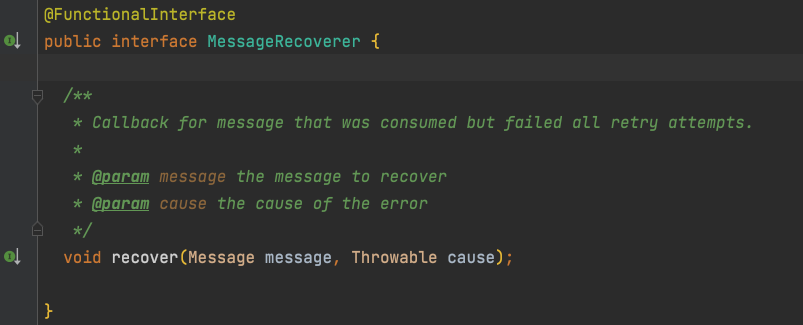
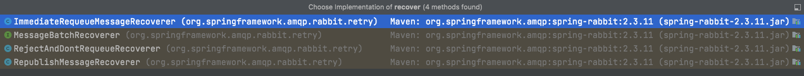

# Spring RabbitMQ重试机制

> 本文参考至：[RabbitMQ 重试机制(十一) - 掘金 (juejin.cn)](https://juejin.cn/post/6979390382371143694#heading-6)

消费者在处理消息的过程中可能会发生异常，那么此时此刻该如何处理这个异常的消息呢？

`RabbitMQ`有两个方法`channel.basicNack` 或 `channel.basicReject`能够让消息重新回到原队列中，这样子可以实现重试。但是如果第二次消费又发生了异常，一直消费一直异常。由于没有明确重试次数，会造就无限重试，这是一个致命的问题。

本文就来使用`spring-rabbit`中自带的`retry`功能来解决这个问题。

## 一. 编码

### 1.1 依赖

`starter-amqp`中包含了`spring-rabbit`。

```xml
<dependency>
    <groupId>org.springframework.boot</groupId>
    <artifactId>spring-boot-starter-amqp</artifactId>
</dependency>

<dependency>
    <groupId>org.springframework.boot</groupId>
    <artifactId>spring-boot-starter-web</artifactId>
</dependency>

<dependency>
    <groupId>org.projectlombok</groupId>
    <artifactId>lombok</artifactId>
    <version>1.18.16</version>
    <scope>compile</scope>
</dependency>
```

### 1.2 配置

需要进行简单的配置即可开启

```yaml
spring:
  rabbitmq:
    listener:
      simple:
        acknowledge-mode: auto  # 消息确认方式，其有三种配置方式，分别是none、manual(手动ack) 和auto(自动ack) 默认auto
        retry:
          enabled: true  # 开启重试监听机制，如果不开启，如果发生异常会无限重试下去
          max-attempts: 5   #最大重试次数 默认为3
          initial-interval: 2000  # 传递消息的时间间隔 默认1s
    host: 127.0.0.1
    port: 5672
    virtual-host: /
    username: guest
    password: guest
```

### 1.3 配置队列和交换机

```java
package cn.bigcoder.rabbitmq.consumer.rabbitmqconsumer.config;

import org.springframework.amqp.core.Binding;
import org.springframework.amqp.core.BindingBuilder;
import org.springframework.amqp.core.DirectExchange;
import org.springframework.amqp.core.Queue;
import org.springframework.amqp.rabbit.connection.ConnectionFactory;
import org.springframework.amqp.rabbit.core.RabbitTemplate;
import org.springframework.amqp.rabbit.listener.adapter.MessageListenerAdapter;
import org.springframework.amqp.support.converter.Jackson2JsonMessageConverter;
import org.springframework.context.annotation.Bean;
import org.springframework.context.annotation.Configuration;

/**
 * @author: Jindong.Tian
 * @date: 2021-10-26
 **/
@Configuration
public class RabbitConfig {

  @Bean
  public MessageListenerAdapter messageListenerAdapter(){
    MessageListenerAdapter messageListenerAdapter = new MessageListenerAdapter();
    messageListenerAdapter.setMessageConverter(new Jackson2JsonMessageConverter());
    return messageListenerAdapter;
  }

  @Bean
  public Queue testDirectQueue() {
    // durable:是否持久化,默认是false,持久化队列：会被存储在磁盘上，当消息代理重启时仍然存在，暂存队列：当前连接有效
    // exclusive:默认也是false，只能被当前创建的连接使用，而且当连接关闭后队列即被删除。此参考优先级高于durable
    // autoDelete:是否自动删除，当没有生产者或者消费者使用此队列，该队列会自动删除。

    //一般设置一下队列的持久化就好,其余两个就是默认false
    return new Queue("testDirectQueue", true);
  }

  @Bean
  DirectExchange testDirectExchange() {
    //  return new DirectExchange("TestDirectExchange",true,true);
    return new DirectExchange("testDirectExchange", true, false);
  }

  @Bean
  public Binding bindingDirect(Queue testDirectQueue, DirectExchange testDirectExchange) {
    return BindingBuilder.bind(testDirectQueue).to(testDirectExchange).with("TestDirectRouting");
  }

}
```

### 1.4 生产者配置序列化方式

默认情况下，spring-rabbit使用的是java自带的序列化方式，为了得到更好的通用性，建议将序列化方式改为json

```java

  /**
   * 配置序列化方式
   * @param connectionFactory
   * @return
   */
  @Bean
  public RabbitTemplate rabbitTemplate(ConnectionFactory connectionFactory) {
    RabbitTemplate rabbitTemplate = new RabbitTemplate(connectionFactory);
    rabbitTemplate.setMessageConverter(new Jackson2JsonMessageConverter());
    return rabbitTemplate;
  }
```

### 1.5 生产者

```java
@RestController
public class MessageController {

  @Autowired
  private RabbitTemplate rabbitTemplate;

  @RequestMapping("/send")
  public String sendMessage(String msg) {
    String messageId = String.valueOf(UUID.randomUUID());
    String createTime = LocalDateTime.now().format(DateTimeFormatter.ofPattern("yyyy-MM-dd HH:mm:ss"));
    Map<String, Object> map = new HashMap<>();
    map.put("messageId", messageId);
    map.put("createTime", createTime);
    map.put("msg", msg);
    //将消息携带绑定键值：TestDirectRouting 发送到交换机TestDirectExchange
    rabbitTemplate.convertAndSend("testDirectExchange", "TestDirectRouting", map);
    return messageId;
  }
}
```

### 1.6 消费者

```java
@Component
@Slf4j
public class TestDirectQueueListener {
  private int count = 0;

  @RabbitListener(queues = "testDirectQueue")
  public void process(Message message) throws UnsupportedEncodingException {
    log.info("重试次数 = {}", count++);
    int i = 10 / 0;
  }
}
```

#### 1.7 测试

然后调用接口：http://localhost:8080/send?msg=123123 ，消息会被发送到 `testDirectQueue`这个队列。然后重试 5 次。



每次重试时间间隔为2秒，最大尝试次数为5次，与配置相符。

> 注意： 重试并不是 RabbitMQ 重新发送了消息到了队列，仅仅是消费者内部进行了重试，换句话说就是重试跟mq没有任何关系。上述消费者代码不能添加try{}catch(){}，一旦捕获了异常，在自动 ack 模式下，就相当于消息正确处理了，消息直接被确认掉了，不会触发重试的。

## 二. MessageRecoverer

上面的例子在测试中我们还发现了一个问题，就是经过 5 次重试以后，控制台输出了一个异常的堆栈日志，然后队列中的数据也被 ack 掉了（因为我配置了 auto， 自动ack模式）。如果你配置的是 `manual`(手动ack)，结果就会如下：



五次重试后，消费处于一个未被确认的状态。因为需要你手动 ack！下次服务重启的时候，会继续消费这条消息。当前应用进程与RabbitMQ断开连接后，该消息将会自动变为ready状态，可再次被消费者消费。

首先我们先来看一下这个异常日志是什么：

```java
org.springframework.amqp.rabbit.support.ListenerExecutionFailedException: 
Retry Policy Exhausted
```

出现上述异常的原因是因为在构建`SimpleRabbitListenerContainerFactoryConfigurer`类时使用了 `MessageRecoverer`接口，这个接口有一个`recover`方法，用来实现重试完成之后对消息的处理，源码如下：

```java
public final class SimpleRabbitListenerContainerFactoryConfigurer
		extends AbstractRabbitListenerContainerFactoryConfigurer<SimpleRabbitListenerContainerFactory> {

	@Override
	public void configure(SimpleRabbitListenerContainerFactory factory, ConnectionFactory connectionFactory) {
		PropertyMapper map = PropertyMapper.get();
		RabbitProperties.SimpleContainer config = getRabbitProperties().getListener().getSimple();
		configure(factory, connectionFactory, config);  >> 1
		map.from(config::getConcurrency).whenNonNull().to(factory::setConcurrentConsumers);
		map.from(config::getMaxConcurrency).whenNonNull().to(factory::setMaxConcurrentConsumers);
		map.from(config::getBatchSize).whenNonNull().to(factory::setBatchSize);
	}

}
```

注意标记为 `>> 1` 的`configure`方法

```java
ListenerRetry retryConfig = configuration.getRetry();
if (retryConfig.isEnabled()) {
    RetryInterceptorBuilder<?, ?> builder = (retryConfig.isStateless()) ? RetryInterceptorBuilder.stateless()
        : RetryInterceptorBuilder.stateful();
    RetryTemplate retryTemplate = new RetryTemplateFactory(this.retryTemplateCustomizers)
        .createRetryTemplate(retryConfig, RabbitRetryTemplateCustomizer.Target.LISTENER);
    builder.retryOperations(retryTemplate);
    MessageRecoverer recoverer = (this.messageRecoverer != null) ? this.messageRecoverer
        : new RejectAndDontRequeueRecoverer(); //<1>
    builder.recoverer(recoverer);
    factory.setAdviceChain(builder.build());
```

注意看`<1>`处的代码，默认使用的是`RejectAndDontRequeueRecoverer`类，这个类已经出现过了，注意笔者前面的那几张图。根据类的名字我们就可以看出来该实现类的作用就是**拒绝并且不会将消息重新发回队列**，也就是说，重试之后如果还没有成功，就认为该消息没救了，放弃它了。我们可以看一下这个实现类的具体内容：

```java
public class RejectAndDontRequeueRecoverer implements MessageRecoverer {
    protected Log logger = LogFactory.getLog(RejectAndDontRequeueRecoverer.class); // NOSONAR protected
    @Override
    public void recover(Message message, Throwable cause) {
        if (this.logger.isWarnEnabled()) {
                this.logger.warn("Retries exhausted for message " + message, cause);
        }
        throw new ListenerExecutionFailedException("Retry Policy Exhausted",
                                new AmqpRejectAndDontRequeueException(cause), message);
    }
}
```

上述源码给出了异常的来源。

`MessageRecoverer` 接口中就一个`recover`方法，回调已消费但所有重试尝试失败的消息。



重写了`recover`方法的有四个类，`MessageBatchRecoverer`这个不在本文范围内。



而`RejectAndDontRequeueRecoverer`的功能已经看到过了，毕竟是默认的。那还有另外两个实现类，分别是`RepublishMessageRecoverer`和`ImmediateRequeueMessageRecoverer`，意思大意分别是**重新发布消息和立即重新返回原队列**，下面我们分别测试一下这两个实现类的效果。

## 三. RepublishMessageRecoverer

将消息重新发送到指定队列。先创建一个队列，然后与交换机绑定进行绑定,绑定之后设置 `MessageRecoverer`。在 `RabbitConfig`类中增加代码。跟**死信队列**看起来差不多。

```java
@Autowired
private RabbitTemplate rabbitTemplate;


private static String errorTopicExchange = "error-topic-exchange";
private static String errorQueue = "error-queue";
private static String errorRoutingKey = "error-routing-key";

//创建异常交换机
@Bean
public TopicExchange errorTopicExchange(){
    return new TopicExchange(errorTopicExchange,true,false);
}

//创建异常队列
@Bean
public Queue errorQueue(){
    return new Queue(errorQueue,true);
}
//队列与交换机进行绑定
@Bean
public Binding BindingErrorQueueAndExchange(Queue errorQueue,TopicExchange errorTopicExchange){
    return BindingBuilder.bind(errorQueue).to(errorTopicExchange).with(errorRoutingKey);
}


//设置MessageRecoverer
@Bean
public MessageRecoverer messageRecoverer(){
    //AmqpTemplate和RabbitTemplate都可以
    return new RepublishMessageRecoverer(rabbitTemplate,errorTopicExchange,errorRoutingKey);
}
```

使用了我们所配置的`RepublishMessageRecoverer`，并且消息重试 5 次以后直接以新的 `routingKey`发送到了配置的交换机中，此时再查看监控页面，可以看原始队列中已经没有消息了，但是配置的异常队列中存在了一条消息。

## 四. ImmediateRequeueMessageRecoverer

使用`ImmediateRequeueMessageRecoverer`，重试失败的消息会立马回到原队列中。 修改`messageRecoverer`方法

```java
@Bean
public MessageRecoverer messageRecoverer(){
    return new ImmediateRequeueMessageRecoverer();
}
```

重试5次之后，返回队列，然后再被消费，继续重试5次，周而复始直到消息被正常消费为止。

