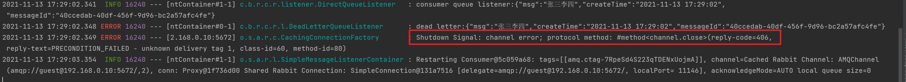

# RabbitMQ死信队列

> 本文参考至：[【RabbitMQ】一文带你搞定RabbitMQ死信队列 | 弗兰克的猫 (mfrank2016.github.io)](https://mfrank2016.github.io/breeze-blog/2020/05/04/rabbitmq/rabbitmq-how-to-use-dead-letter-queue/)

## 一. 死信队列是什么

死信，在官网中对应的单词为“Dead Letter”，可以看出翻译确实非常的简单粗暴。那么死信是个什么东西呢？

“死信”是RabbitMQ中的一种消息机制，当你在消费消息时，如果队列里的消息出现以下情况：

1. 消息被否定确认，使用 `channel.basicNack` 或 `channel.basicReject` ，并且此时`requeue` 属性被设置为`false`。

> tips：channel.basicNack 与 channel.basicReject 的区别在于basicNack可以拒绝多条消息，而basicReject一次只能拒绝一条消息

2. 消息在队列的存活时间超过设置的TTL时间。

3. 消息队列的消息数量已经超过最大队列长度。

那么该消息将成为“死信”。

“死信”消息会被RabbitMQ进行特殊处理，如果配置了死信队列信息，那么该消息将会被丢进死信队列中，如果没有配置，则该消息将会被丢弃。

## 二. 如何配置死信队列

这一部分将是本文的关键，如何配置死信队列呢？其实很简单，大概可以分为以下步骤：

1. 配置业务队列，绑定到业务交换机上
2. 为业务队列配置死信交换机和路由key
3. 为死信交换机配置死信队列

注意，并不是直接声明一个公共的死信队列，然后所以死信消息就自己跑到死信队列里去了。而是为每个需要使用死信的业务队列配置一个死信交换机，这里同一个项目的死信交换机可以共用一个，然后为每个业务队列分配一个单独的路由key。

有了死信交换机和路由key后，接下来，就像配置业务队列一样，配置死信队列，然后绑定在死信交换机上。也就是说，死信队列并不是什么特殊的队列，只不过是绑定在死信交换机上的队列。死信交换机也不是什么特殊的交换机，只不过是用来接受死信的交换机，所以可以为任何类型【Direct、Fanout、Topic】。一般来说，会为每个业务队列分配一个独有的路由key，并对应的配置一个死信队列进行监听，也就是说，一般会为每个重要的业务队列配置一个死信队列。

有了前文这些陈述后，接下来就是惊险刺激的实战环节，这里省略了RabbitMQ环境的部署和搭建环节。

先创建一个SpringBoot项目。然后在pom文件中添加 `spring-boot-starter-amqp` 和 `spring-boot-starter-web` 的依赖，接下来创建一个Config类，这里是关键：

```java
package cn.bigcoder.rabbitmq.consumer.rabbitmqconsumer.config;

import org.springframework.amqp.core.*;
import org.springframework.amqp.rabbit.retry.ImmediateRequeueMessageRecoverer;
import org.springframework.amqp.rabbit.retry.MessageRecoverer;
import org.springframework.beans.factory.annotation.Qualifier;
import org.springframework.context.annotation.Bean;
import org.springframework.context.annotation.Configuration;

import java.util.HashMap;
import java.util.Map;

/**
 * @author: Jindong.Tian
 * @date: 2021-10-26
 **/
@Configuration
public class RabbitConfig {

    /**
     * 声明业务队列，其中业务队列绑定死信交换机
     * @return
     */
    @Bean("directQueue")
    public Queue directQueue() {
        // durable:是否持久化,默认是false,持久化队列：会被存储在磁盘上，当消息代理重启时仍然存在，暂存队列：当前连接有效
        // exclusive:默认也是false，只能被当前创建的连接使用，而且当连接关闭后队列即被删除。此参考优先级高于durable
        // autoDelete:是否自动删除，当没有生产者或者消费者使用此队列，该队列会自动删除。

        //一般设置一下队列的持久化就好,其余两个就是默认false

        Map<String, Object> args = new HashMap<>(2);
        // x-dead-letter-exchange 这里声明当前队列绑定的死信交换机
        args.put("x-dead-letter-exchange", "deadLetterExchange");
        // x-dead-letter-routing-key 这里声明当前队列的死信路由key
        //args.put("x-dead-letter-routing-key", DEAD_LETTER_QUEUEB_ROUTING_KEY);
        return QueueBuilder.durable("directQueue").withArguments(args).build();
    }

    /**
     * 业务交换机
     * @return
     */
    @Bean("directExchange")
    DirectExchange directExchange() {
        //  return new DirectExchange("TestDirectExchange",true,true);
        return new DirectExchange("directExchange", true, false);
    }

    /**
     * 绑定业务队列和业务交换机
     * @param directQueue
     * @param directExchange
     * @return
     */
    @Bean
    public Binding bindingDirect(@Qualifier("directQueue") Queue directQueue, @Qualifier("directExchange") DirectExchange directExchange) {
        return BindingBuilder.bind(directQueue).to(directExchange).with("TestDirectRouting");
    }


    /**
     * 声明死信队列
     * @return
     */
    @Bean("deadLetterQueue")
    public Queue deadLetterQueue() {
        return new Queue("deadLetterQueue");
    }

    /**
     * 声明死信交换机
     * @return
     */
    @Bean
    public DirectExchange deadLetterExchange() {
        return new DirectExchange("deadLetterExchange", true, false);
    }

    /**
     * 绑定死信交换机和死信队列
     * @param deadLetterQueue
     * @param deadLetterExchange
     * @return
     */
    @Bean
    public Binding bindingDeadLetter(@Qualifier("deadLetterQueue") Queue deadLetterQueue, @Qualifier("deadLetterExchange") DirectExchange deadLetterExchange) {
        return BindingBuilder.bind(deadLetterQueue).to(deadLetterExchange).with("TestDirectRouting");
    }

}
```

这里声明了两个Exchange，一个是业务Exchange，另一个是死信Exchange，业务Exchange下绑定了一个业务队列，业务队列绑定了死信Exchange。

下面是配置文件application.yml：

```yaml
server:
  port: 8021
spring:
  application:
    name: rabbitmq-consumer
  rabbitmq:
    listener:
      simple:
        acknowledge-mode: auto #none manual auto 
    host: 192.168.0.10
    port: 5672
    username: guest
    password: guest
```

需要注意的是`acknowledge-mode`参数，该参数用于指定ack的模式，auto代表自动Ack，manual代表手动Ack。注意这里如果使用`auto`，消费者如果想要拒绝消息，就只能抛出`AmqpRejectAndDontRequeueException`，如果在`auto`模式下，通过channel进行basicReject，SpringAMQP会抛出下列报错信息：



此时只能通过抛出`AmqpRejectAndDontRequeueException`异常的方式拒绝消息：

```java
throw new AmqpRejectAndDontRequeueException("消息处理失败，被拒绝进入死信队列");
```

接下来，是业务队列的消费代码：

```java
@Component
@Slf4j
public class DirectQueueListener {

  @RabbitListener(queues = "directQueue")
  public void process(Message message, Channel channel) throws IOException {
    String msg = new String(message.getBody(), StandardCharsets.UTF_8);
    log.info("consumer queue listener:{}", msg);
      
    // 手动拒绝该消息，并不重新入队，那么这条消息会发向死信交换机
    //channel.basicReject(message.getMessageProperties().getDeliveryTag(), false);
    //使用AMQP自带的异常：
    throw new AmqpRejectAndDontRequeueException("消息处理失败，被拒绝进入死信队列");
  }

}
```

然后配置死信队列的消费者：

```java
@Slf4j
@Component
public class DeadLetterQueueListener {
    @RabbitListener(queues = "deadLetterQueue")
    public void process(Message message) throws UnsupportedEncodingException {
        String msg = new String(message.getBody(), StandardCharsets.UTF_8);
        log.error("dead letter:{}", msg);
    }
}
```

生产者代码：

```java
@RestController
public class MessageController {

  @Autowired
  private RabbitTemplate rabbitTemplate;

  @RequestMapping("/send")
  public String sendMessage(String msg) {
    String messageId = String.valueOf(UUID.randomUUID());
    String createTime = LocalDateTime.now().format(DateTimeFormatter.ofPattern("yyyy-MM-dd HH:mm:ss"));
    Map<String, Object> map = new HashMap<>();
    map.put("messageId", messageId);
    map.put("createTime", createTime);
    map.put("msg", msg);
    //将消息携带绑定键值：TestDirectRouting 发送到交换机TestDirectExchange
    rabbitTemplate.convertAndSend("directExchange", "TestDirectRouting", map);
    return messageId;
  }
}
```

当生产者向`directExchange`中发送消息，并指定“TestDirectRouting” routingKey时，消息会被`directQueue`接收，此时`DirectQueueListener`监听者，接收消息并`reject`了该条消息，那么该条消息会被RabbitMQ Server发送至`directQueue`绑定的`deadLetterExchange`死信交换机，由于我们没有设置`x-dead-letter-routing-key`参数，那么在发向死信交换机时该消息的`routingKey`仍然是业务方指定的“TestDirectRouting” routingKey。

## 三. 死信消息的变化

那么“死信”被丢到死信队列中后，会发生什么变化呢？

如果队列配置了参数 `x-dead-letter-routing-key` 的话，“死信”的路由key将会被替换成该参数对应的值。如果没有设置，则保留该消息原有的路由key。

举个栗子：

如果原有消息的路由key是`testA`，被发送到业务Exchage中，然后被投递到业务队列QueueA中，如果该队列没有配置参数`x-dead-letter-routing-key`，则该消息成为死信后，将保留原有的路由key`testA`，如果配置了该参数，并且值设置为`testB`，那么该消息成为死信后，路由key将会被替换为`testB`，然后被抛到死信交换机中。

另外，由于被抛到了死信交换机，所以消息的Exchange Name也会被替换为死信交换机的名称。

消息的Header中，也会添加很多奇奇怪怪的字段，修改一下上面的代码，在死信队列的消费者中添加一行日志输出：

```java
log.info("死信消息properties：{}", message.getMessageProperties());
```

然后重新运行一次，即可得到死信消息Header中被添加的信息：

```java
死信消息properties：MessageProperties [headers={__ContentTypeId__=java.lang.Object, x-first-death-exchange=directExchange, __KeyTypeId__=java.lang.Object, x-death=[{reason=rejected, count=1, exchange=directExchange, time=Sat Nov 13 17:32:31 CST 2021, routing-keys=[TestDirectRouting], queue=directQueue}], x-first-death-reason=rejected, x-first-death-queue=directQueue, __TypeId__=java.util.HashMap}, contentType=application/json, contentEncoding=UTF-8, contentLength=0, receivedDeliveryMode=PERSISTENT, priority=0, redelivered=false, receivedExchange=deadLetterExchange, receivedRoutingKey=TestDirectRouting, deliveryTag=1, consumerTag=amq.ctag-iEVkqqpvOtuu76tmEUW-wQ, consumerQueue=deadLetterQueue]
```

Header中看起来有很多信息，实际上并不多，只是值比较长而已。下面就简单说明一下Header中的值：

| 字段名                 | 含义                                                         |
| :--------------------- | :----------------------------------------------------------- |
| x-first-death-exchange | 第一次被抛入的死信交换机的名称                               |
| x-first-death-reason   | 第一次成为死信的原因，`rejected`：消息在重新进入队列时被队列拒绝，由于`default-requeue-rejected` 参数被设置为`false`。`expired` ：消息过期。`maxlen` ： 队列内消息数量超过队列最大容量 |
| x-first-death-queue    | 第一次成为死信前所在队列名称                                 |
| x-death                | 历次被投入死信交换机的信息列表，同一个消息每次进入一个死信交换机，这个数组的信息就会被更新 |

## 四. 死信队列的应用场景

通过上面的信息，我们已经知道如何使用死信队列了，那么死信队列一般在什么场景下使用呢？

一般用在较为重要的业务队列中，确保未被正确消费的消息不被丢弃，一般发生消费异常可能原因主要有由于消息信息本身存在错误导致处理异常，处理过程中参数校验异常，或者因网络波动导致的查询异常等等，当发生异常时，当然不能每次通过日志来获取原消息，然后让运维帮忙重新投递消息（没错，以前就是这么干的= =）。通过配置死信队列，可以让未正确处理的消息暂存到另一个队列中，待后续排查清楚问题后，编写相应的处理代码来处理死信消息，这样比手工恢复数据要好太多了。

## 五. 总结

死信队列其实并没有什么神秘的地方，不过是绑定在死信交换机上的普通队列，而死信交换机也只是一个普通的交换机，不过是用来专门处理死信的交换机。

总结一下死信消息的生命周期：

1. 业务消息被投入业务队列
2. 消费者消费业务队列的消息，由于处理过程中发生异常，于是进行了nck或者reject操作
3. 被nck或reject的消息由RabbitMQ投递到死信交换机中
4. 死信交换机将消息投入相应的死信队列
5. 死信队列的消费者消费死信消息

死信消息是RabbitMQ为我们做的一层保证，其实我们也可以不使用死信队列，而是在消息消费异常时，将消息主动投递到另一个交换机中，当你明白了这些之后，这些Exchange和Queue想怎样配合就能怎么配合。比如从死信队列拉取消息，然后发送邮件、短信、钉钉通知来通知开发人员关注。或者将消息重新投递到一个队列然后设置过期时间，来进行延时消费。

