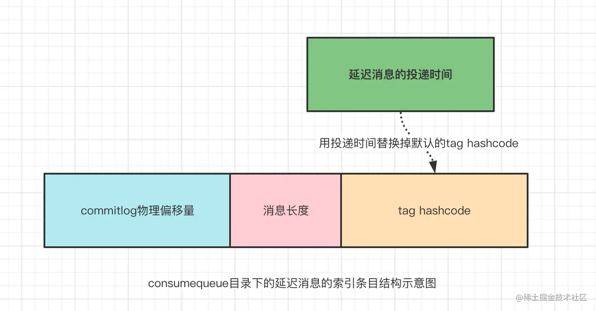
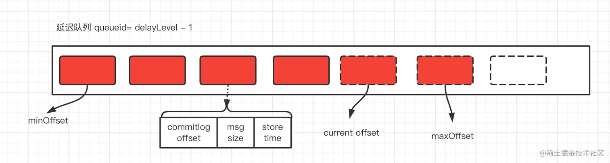
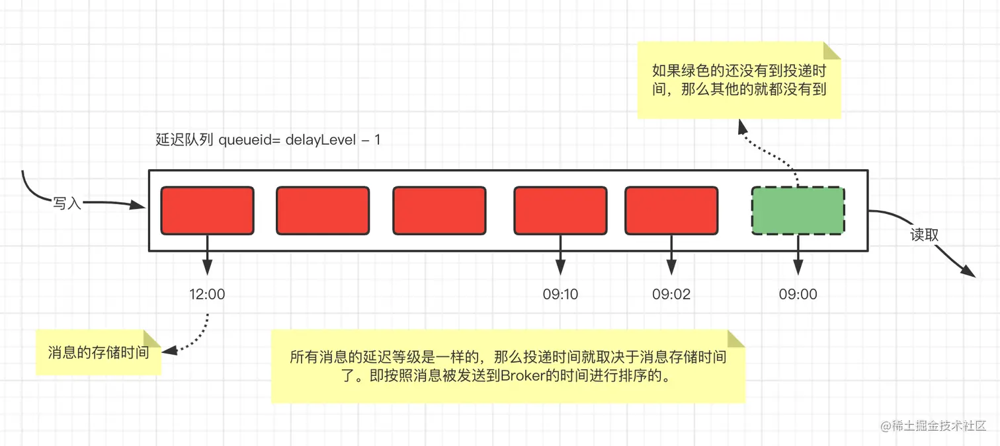
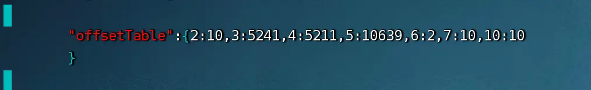

# RocketMQ延迟消息源码分析

## 一. 发送延迟消息

```java
public class Producer {

   public static void main(String[] args) throws Exception {
      // 实例化一个生产者来产生延时消息
      DefaultMQProducer producer = new DefaultMQProducer("DELAY_P_G");

      producer.setNamesrvAddr("127.0.0.1:9876");

      // 启动生产者
      producer.start();


      for (int i = 0; i < 1; i++) {
          Message message = new Message(MQConstant.DELAY_TOPIC, ("Hello scheduled message " + i).getBytes());

          /**
           * MessageStoreConfig
           * messageDelayLevel = "1s 5s 10s 30s 1m 2m 3m 4m 5m 6m 7m 8m 9m 10m 20m 30m 1h 2h";
           *
           * 共18个等级，依次是从1-18
           * 比如，level=3, 表示延迟10s 消费
           */
          message.setDelayTimeLevel(4);

          // 发送消息
          SendResult send = producer.send(message);
          System.out.println("send = " + send);
      }
       // 关闭生产者
      producer.shutdown();
  }
}

```

延迟消息的标志就是在发送时,通过消息对象`Message`的`setDelayTimeLevel(int level)`方法设置一个延迟等级,这样该条消息就是一个延迟消息了。那么延迟等级与延迟时间是如何对应的呢？

| 延迟等级 | 1    | 2    | 3    | 4    | 5    | 6    | 7    | 8    | 9    | 10   | 11   | 12   | 13   | 14   | 15   | 16   | 17   | 18   |
| -------- | ---- | ---- | ---- | ---- | ---- | ---- | ---- | ---- | ---- | ---- | ---- | ---- | ---- | ---- | ---- | ---- | ---- | ---- |
| 延迟时间 | 1s   | 5s   | 10s  | 30s  | 1m   | 2m   | 3m   | 4m   | 5m   | 6m   | 7m   | 8m   | 9m   | 10m  | 20m  | 30m  | 1h   | 2h   |

## 二. 存储延迟消息

其实延迟消息和普通消息并没有多大的差异，只不过broker在存储消息时，会判断消息的延迟属性是否为空，如果不为空，则判断是延迟消息，进而会做一些额外的处理，那么我们就看下broker存储时判断是否为延迟消息的逻辑:

```java
// org.apache.rocketmq.store.CommitLog#putMessage
public PutMessageResult putMessage(final MessageExtBrokerInner msg) {
    // Set the storage time
    msg.setStoreTimestamp(System.currentTimeMillis());
    // Set the message body BODY CRC (consider the most appropriate setting
    // on the client)
    msg.setBodyCRC(UtilAll.crc32(msg.getBody()));
    // Back to Results
    AppendMessageResult result = null;

    StoreStatsService storeStatsService = this.defaultMessageStore.getStoreStatsService();

    String topic = msg.getTopic();
    int queueId = msg.getQueueId();

    final int tranType = MessageSysFlag.getTransactionValue(msg.getSysFlag());
    if (tranType == MessageSysFlag.TRANSACTION_NOT_TYPE
            || tranType == MessageSysFlag.TRANSACTION_COMMIT_TYPE) {
        // 延迟消息判断，如果大于0则代表是延迟消息
        if (msg.getDelayTimeLevel() > 0) {
            if (msg.getDelayTimeLevel() > this.defaultMessageStore.getScheduleMessageService().getMaxDelayLevel()) {
                msg.setDelayTimeLevel(this.defaultMessageStore.getScheduleMessageService().getMaxDelayLevel());
            }

            // 将延迟消息的topic替换为broker固定的topic: SCHEDULE_TOPIC_XXXX
            topic = TopicValidator.RMQ_SYS_SCHEDULE_TOPIC;
            // 将queueid替换为（延迟级别-1)
            queueId = ScheduleMessageService.delayLevel2QueueId(msg.getDelayTimeLevel());

            // 备份原始的topic/queueid, 留着后面消息恢复至原始topic queue使用
            MessageAccessor.putProperty(msg, MessageConst.PROPERTY_REAL_TOPIC, msg.getTopic());
            MessageAccessor.putProperty(msg, MessageConst.PROPERTY_REAL_QUEUE_ID, String.valueOf(msg.getQueueId()));
            msg.setPropertiesString(MessageDecoder.messageProperties2String(msg.getProperties()));

            //将消息topic设置为延迟topic,这样订阅该topic的消费者不能及时去消费了
            //等到延迟时间到了，再将延迟消息发送至原始topic，消费者就可以消费了
            msg.setTopic(topic);
            msg.setQueueId(queueId);
        }
    }
    
    //...省略后续存储逻辑，和普通消息一样
}    
```

其实它要做的事情很简单，简单总结下：

1. 将原始topic替换为延迟消息固定的topic:`SCHEDULE_TOPIC_XXXX`（所有的延时消息共用这一个topic）。

2. 将原始queueid替换为（延迟级别-1)，也就是所有相同延迟级别的延迟消息都会发送至同一个queue中。

3. 备份原始topic/queueid，保存到原始消息的properties属性中。目的是为了等到延迟时间到了，将延迟消息发送至原始topic时使用。

4. 不过在消息分发(构建消息索引）时，将索引单元的的tag hashcode 替换为消息的**投递时间**

   

   

## 三. 延迟消息的投递

上面broker将延迟消息写到了commitlog中，由于broker替换了我们的原始topic，所以订阅该topic的消费者此时还无法消费该消息，只有当时间到了消费者才可以消费，那么我们就看下broker是如何处理的。 首先处理延迟消息的是`ScheduleMessageService`类，我们简单看下它的类结构：

   ```java
   /**
    * 定时消息的实现类
    *
    * ScheduleMessageService方法的调用顺序为构造方法→load()方法→start()方法。
    *
    * 定时消息的第一个设计关键点是，定时消息单独一个主题：
    * SCHEDULE_TOPIC_XXXX，该主题下的队列数量等于
    * MessageStoreConfig#messageDelayLevel配置的延迟级别，其对应关
    * 系为queueId等于延迟级别减1。ScheduleMessageService为每个延迟
    * 级别创建一个定时器，根据延迟级别对应的延迟时间进行延迟调度。
    * 在消息发送时，如果消息的延迟级别delayLevel大于0，将消息的原主
    * 题名称、队列ID存入消息属性，然后改变消息的主题、队列与延迟主
    * 题所属队列，消息将最终转发到延迟队列的消费队列中。
    *
    * 定时器会根据延迟级别的间隔，扫描对应的延迟队列（延迟级别和延迟队列ID的对应关系是：queueId等于延迟级别减1），如果发现有
    * 达到消费时间的延迟消息，则会将延迟消息重新发送至原始的topic，这样消费者就能开始消费这条消息了。
    */
   public class ScheduleMessageService extends ConfigManager {
       private static final InternalLogger log = InternalLoggerFactory.getLogger(LoggerName.STORE_LOGGER_NAME);
   
       /**
        * 定时消息统一主题
        */
       public static final String SCHEDULE_TOPIC = "SCHEDULE_TOPIC_XXXX";
       /**
        * 第一次调度时延迟的时间，默认为1s
        */
       private static final long FIRST_DELAY_TIME = 1000L;
       /**
        * 每一个延时级别调度一次后，延迟该时间间隔后再放入调度池
        */
       private static final long DELAY_FOR_A_WHILE = 100L;
       /**
        * 消息发送异常后延迟该时间后再继续参与调度
        */
       private static final long DELAY_FOR_A_PERIOD = 10000L;
   
       /**
        * 延迟级别，将“1s 5s 10s 30s 1m 2m 3m 4m 5m 6m 7m 8m 9m 10m 20m 30m 1h 2h” 字符串解析成delayLevelTable，转换后的数据结构类似
        * {1:1000,2:5000,3:30000,...}
        */
       private final ConcurrentMap<Integer /* level */, Long/* delay timeMillis */> delayLevelTable =
           new ConcurrentHashMap<Integer, Long>(32);
   
       /**
        * 延迟级别消息消费进度
        */
       private final ConcurrentMap<Integer /* level */, Long/* offset */> offsetTable =
           new ConcurrentHashMap<Integer, Long>(32);
       /**
        * 默认消息存储器
        */
       private final DefaultMessageStore defaultMessageStore;
       
   
       // ...省略其他属性和方法...
       
   
       // broker启动时，会调用该方法
       public void start() {
           if (started.compareAndSet(false, true)) {
               super.load();
               this.timer = new Timer("ScheduleMessageTimerThread", true);
               for (Map.Entry<Integer, Long> entry : this.delayLevelTable.entrySet()) {
                   Integer level = entry.getKey();
                   Long timeDelay = entry.getValue();
                   Long offset = this.offsetTable.get(level);
                   if (null == offset) {
                       offset = 0L;
                   }
   
                   if (timeDelay != null) {
                       // 处理延迟消息
                       this.timer.schedule(new DeliverDelayedMessageTimerTask(level, offset), FIRST_DELAY_TIME);
                   }
               }
   
               this.timer.scheduleAtFixedRate(new TimerTask() {
   
                   @Override
                   public void run() {
                       try {
                           // 持久化
                           if (started.get()) ScheduleMessageService.this.persist();
                       } catch (Throwable e) {
                           log.error("scheduleAtFixedRate flush exception", e);
                       }
                   }
               }, 10000, this.defaultMessageStore.getMessageStoreConfig().getFlushDelayOffsetInterval());
           }
       }
   
      
      // ...省略其他方法...
   }
   ```

关注的地方主要就是2个，一个是处理延迟消息，一个是持久化，那么我们就分别看下：

### 3.1 处理延迟消息

Broker中同一等级的所有延时消息会被写入到consumequeue 目录中SCHEDULE_TOPIC_XXXX目录下相同Queue中。即一个Queue中消息投递时间的延迟等级时间是相同的。那么投递时间就取决于消息存储时间了。即按照消息被发送到Broker的时间进行排序的。

```java
//org.apache.rocketmq.store.schedule.ScheduleMessageService#start

/**
 * 根据延迟级别创建对应的定时任务
 */
public void start() {
    if (started.compareAndSet(false, true)) {
        this.timer = new Timer("ScheduleMessageTimerThread", true);
        // 根据延迟队列创建定时任务。遍历延迟级别，根据延迟
        // 级别从offsetTable中获取消息队列的消费进度，如果不存在，则使用
        // 0。也就是说每个延迟级别对应一个消息消费队列。然后创建定时任
        // 务，每个定时任务第一次启动时，默认延迟1s后执行一次定时任务，
        // 从第二次调度开始，才使用相应的延迟时间执行定时任务。延迟级别
        // 与消息消费队列的映射关系为消息队列ID=延迟级别-1
        for (Map.Entry<Integer, Long> entry : this.delayLevelTable.entrySet()) {
            // 延迟级别
            Integer level = entry.getKey();
            // 延迟级别对应的毫秒值
            Long timeDelay = entry.getValue();
            // 对应延迟级别的消费进度
            Long offset = this.offsetTable.get(level);
            if (null == offset) {
                offset = 0L;
            }

            if (timeDelay != null) {
                this.timer.schedule(new DeliverDelayedMessageTimerTask(level, offset), FIRST_DELAY_TIME);
            }
        }

        // 创建定时任务，每隔10s持久化一次延迟队列的消息消费进度（延迟消息调进度），持久化频率可以通过flushDelayOffsetInterval配置属性进行设置
        this.timer.scheduleAtFixedRate(new TimerTask() {

            @Override
            public void run() {
                try {
                    if (started.get()) ScheduleMessageService.this.persist();
                } catch (Throwable e) {
                    log.error("scheduleAtFixedRate flush exception", e);
                }
            }
        }, 10000, this.defaultMessageStore.getMessageStoreConfig().getFlushDelayOffsetInterval());
    }
}
```

每一个延迟级别对应一个`DeliverDelayedMessageTimerTask`，所以相同延迟级别的消息共用同一个线程。

接下来我们就看下`DeliverDelayedMessageTimerTask`的逻辑：

```java
class DeliverDelayedMessageTimerTask extends TimerTask {
    private final int delayLevel;
    private final long offset;

    public DeliverDelayedMessageTimerTask(int delayLevel, long offset) {
        this.delayLevel = delayLevel;
        this.offset = offset;
    }

    @Override
    public void run() {
        try {
            if (isStarted()) {
                // 核心逻辑
                this.executeOnTimeup();
            }
        } catch (Exception e) {
            // XXX: warn and notify me
            log.error("ScheduleMessageService, executeOnTimeup exception", e);
            ScheduleMessageService.this.timer.schedule(new DeliverDelayedMessageTimerTask(
                this.delayLevel, this.offset), DELAY_FOR_A_PERIOD);
        }
    }
    
    // ....省略其他方法.......
 }
```

继续看下`executeOnTimeup()`方法的逻辑，内容比较多,不过还是很容易理解

```java
// org.apache.rocketmq.store.schedule.ScheduleMessageService.DeliverDelayedMessageTimerTask#executeOnTimeup
public void executeOnTimeup() {
    // 根据队列ID与延迟主题查找消息消费队列，如果未找到，说明当前不存在该延时级别的消息，则忽略本次任务，根据延时级别创建下一次调度任务
    ConsumeQueue cq =
        ScheduleMessageService.this.defaultMessageStore.findConsumeQueue(SCHEDULE_TOPIC,
            delayLevel2QueueId(delayLevel));

    long failScheduleOffset = offset;

    if (cq != null) {
        // 根据offset从消息消费队列中获取当前队列中所有有效的消息。如果未找到，则更新延迟队列的定时拉取进度并创建定时任务，待下一次继续尝试
        SelectMappedBufferResult bufferCQ = cq.getIndexBuffer(this.offset);
        if (bufferCQ != null) {
            try {
                long nextOffset = offset;
                int i = 0;
                // 遍历ConsumeQueue文件，每一个标准ConsumeQueue条目为20个字节。解析出消息的物理偏移量、消息长度、消息标志的哈希
                //码，为从CommitLog文件加载具体的消息做准备
                ConsumeQueueExt.CqExtUnit cqExtUnit = new ConsumeQueueExt.CqExtUnit();
                for (; i < bufferCQ.getSize(); i += ConsumeQueue.CQ_STORE_UNIT_SIZE) {
                    // 消息在CommitLog中物理偏移量
                    long offsetPy = bufferCQ.getByteBuffer().getLong();
                    // 消息长度
                    int sizePy = bufferCQ.getByteBuffer().getInt();
                    // tag hashcode, 如果为延迟消息，这8个字节放的是消息存储时间
                    long tagsCode = bufferCQ.getByteBuffer().getLong();

                    if (cq.isExtAddr(tagsCode)) {
                        if (cq.getExt(tagsCode, cqExtUnit)) {
                            tagsCode = cqExtUnit.getTagsCode();
                        } else {
                            //can't find ext content.So re compute tags code.
                            log.error("[BUG] can't find consume queue extend file content!addr={}, offsetPy={}, sizePy={}",
                                tagsCode, offsetPy, sizePy);
                            long msgStoreTime = defaultMessageStore.getCommitLog().pickupStoreTimestamp(offsetPy, sizePy);
                            // 根据延迟级别，计算当前消息应该消费的时间
                            tagsCode = computeDeliverTimestamp(delayLevel, msgStoreTime);
                        }
                    }


                    long now = System.currentTimeMillis();
                    // 计算投递时间，时间存储在 tag hashcode那8个字节中了
                    long deliverTimestamp = this.correctDeliverTimestamp(now, tagsCode);

                    nextOffset = offset + (i / ConsumeQueue.CQ_STORE_UNIT_SIZE);

                    long countdown = deliverTimestamp - now;

                    if (countdown <= 0) {
                        // 如果当前这个消息已经达到应该投递的事件了，则将延迟消息发送至原始的Topic中

                        // 去broker中将消息读取出来
                        MessageExt msgExt =
                            ScheduleMessageService.this.defaultMessageStore.lookMessageByOffset(
                                offsetPy, sizePy);

                        if (msgExt != null) {
                            try {
                                // 根据从延迟队列中拉取的消息，组装一个新的消息，恢复延迟消息原始的topic和queueId，删除延迟信息
                                MessageExtBrokerInner msgInner = this.messageTimeup(msgExt);
                                
                                // 将延迟消息发送至原始的topic中
                                PutMessageResult putMessageResult =
                                    ScheduleMessageService.this.writeMessageStore
                                        .putMessage(msgInner);

                                if (putMessageResult != null
                                    && putMessageResult.getPutMessageStatus() == PutMessageStatus.PUT_OK) {
                                    continue;
                                } else {
                                    // XXX: warn and notify me
                                    log.error(
                                        "ScheduleMessageService, a message time up, but reput it failed, topic: {} msgId {}",
                                        msgExt.getTopic(), msgExt.getMsgId());
                                    ScheduleMessageService.this.timer.schedule(
                                        new DeliverDelayedMessageTimerTask(this.delayLevel,
                                            nextOffset), DELAY_FOR_A_PERIOD);
                                    ScheduleMessageService.this.updateOffset(this.delayLevel,
                                        nextOffset);
                                    return;
                                }
                            } catch (Exception e) {
                                /*
                                 * XXX: warn and notify me


                                 */
                                log.error(
                                    "ScheduleMessageService, messageTimeup execute error, drop it. msgExt="
                                        + msgExt + ", nextOffset=" + nextOffset + ",offsetPy="
                                        + offsetPy + ",sizePy=" + sizePy, e);
                            }
                        }
                    } else {
                        // 当前消息未到消费的时候，则重新创建一个任务，等待下一次扫描 延迟队列
                        ScheduleMessageService.this.timer.schedule(
                            new DeliverDelayedMessageTimerTask(this.delayLevel, nextOffset),
                            countdown);
                        // 更新一下已经消费的延迟消息进度
                        ScheduleMessageService.this.updateOffset(this.delayLevel, nextOffset);
                        return;
                    }
                } // end of for

                nextOffset = offset + (i / ConsumeQueue.CQ_STORE_UNIT_SIZE);
                ScheduleMessageService.this.timer.schedule(new DeliverDelayedMessageTimerTask(
                    this.delayLevel, nextOffset), DELAY_FOR_A_WHILE);
                ScheduleMessageService.this.updateOffset(this.delayLevel, nextOffset);
                return;
            } finally {

                bufferCQ.release();
            }
        } // end of if (bufferCQ != null)
        else {

            long cqMinOffset = cq.getMinOffsetInQueue();
            if (offset < cqMinOffset) {
                failScheduleOffset = cqMinOffset;
                log.error("schedule CQ offset invalid. offset=" + offset + ", cqMinOffset="
                    + cqMinOffset + ", queueId=" + cq.getQueueId());
            }
        }
    } // end of if (cq != null)

    ScheduleMessageService.this.timer.schedule(new DeliverDelayedMessageTimerTask(this.delayLevel,
        failScheduleOffset), DELAY_FOR_A_WHILE);
}
```

我们简单对代码总结下：

1. 根据**延迟topic和延迟queueid**获取consumequeue，并从队列中读取索引单元

   

2. 计算消息的投递时间。从索引单元中取出消息的保存时间(延迟消息的索引单元会将tag hashcode 替换为消息的存储时间),然后根据延迟等级获取出延迟时间，然后二者相加就是消息的投递时间。

3. 如果投递时间到了。则根据索引单元中的commitlog offset 和 msg size 将该条消息A从commitlog中读取出来。然后将读取出来的消息属性复制到一个新的消息对象体B中，将A中备份的原始topic、queueid 读取出来重新设置到B中，并清除延迟属性，使其成为一条普通消息。最后调用`CommitLog#putMessage(msg)`方法，再次将消息B写入到commitlog中。这样消费者就可以消费到订阅了该topic的消息。

4. 如果投递时间没到。则计算剩余投递时间countdown（投递时间-当前时间)，然后开启一个JDK的Timer延迟任务，延迟时间就是countdown，继续执行`DeliverDelayedMessageTimerTask`的逻辑。

5. 更新延迟消息队列的消费进度(后面持久化也就是指的它）

这里简单说下：同一个Queue(delayLevel - 1)中消息投递时间的延迟等级是相同的。那么投递时间就取决于消息存储时间了。即按照消息被发送到Broker的时间进行排序的。



### 3.2 持久化

持久化其实也非常的简单，就是通过定时任务，每隔10s将延迟队列的消费进度offset写到文件中。



文件默认路径：`$user.home/store/config/delayOffset.json`。key 就是延迟等级，value 就是对应的消费进度offset。

## 四. 总结

本文从源码的角度分析了RocketMq是如何发送延迟消息的，那么我们就简单总结下：

1. 发送消息时，通过`setDelayTimeLevel(int level)` 来设置延迟等级，RocketMQ默认支持18种延迟等级，每个延迟等级对应不同的延迟时间
2. 所有延迟消息共用一个topic: `SCHEDULE_TOPIC_XXXX`
3. 相同延迟等级的消息会放到同一个队列中(queueid=delayLevel - 1)
4. 相同等级的消息会被同一个线程去处理。
5. 到达延迟的消费时间后，就会将延迟消息恢复至原始的topic queue中，这样消费者就能消费到这条消息了。

> 本文转载至：[RocketMQ源码分析12：延迟消息 - 掘金 (juejin.cn)](https://juejin.cn/post/7127533584922968077)