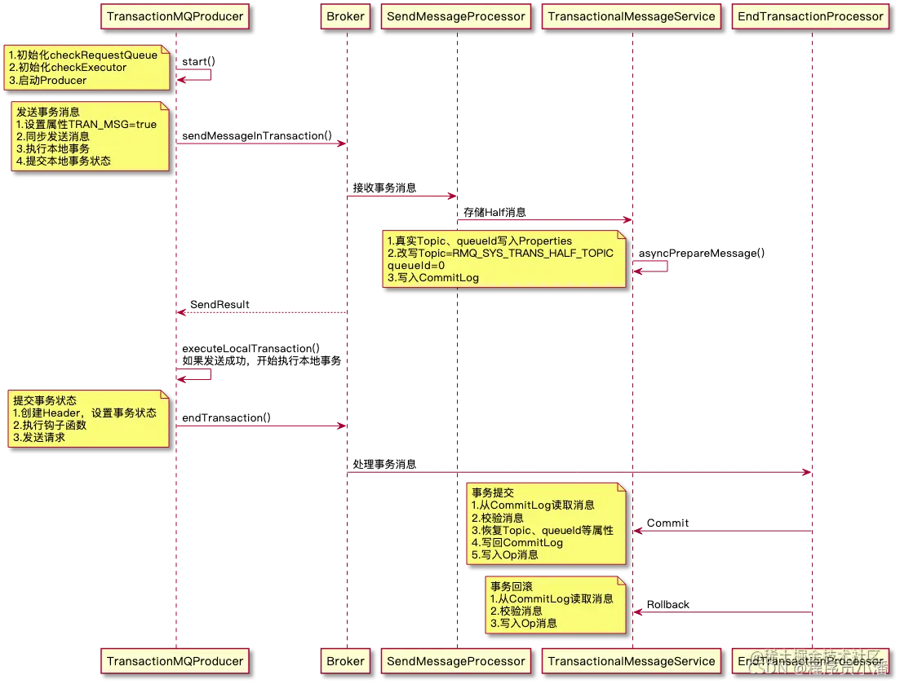
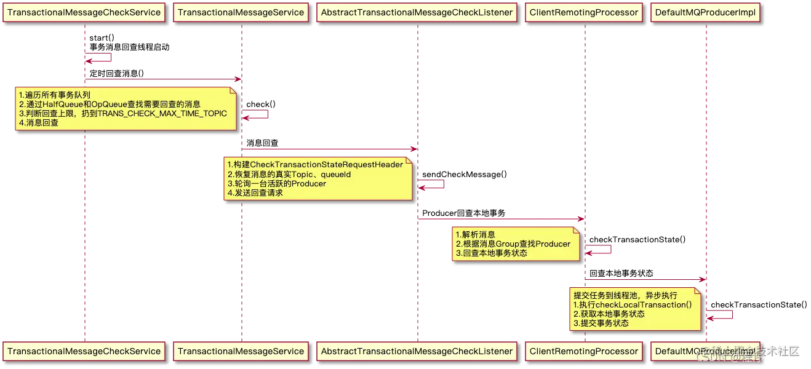

# RocketMQ事务消息源码解析

RocketMQ提供了事务消息的功能，采用**2PC**(两阶段协议)+补偿机制（事务回查）的分布式事务功能，通过这种方式能达到分布式事务的最终一致。

## 一. 概述

- 半事务消息：指的是发送至broker但是还没被commit的消息，在半事务消息被确认之前都是无法被消费者消费的。
- 消息回查：由于网络闪断、生产者应用重启等原因，导致某条事务消息的二次确认丢失，broker 通过扫描发现某条消息长期处于“半事务消息”时，需要主动向消息生产者询问该消息的最终状态（commit 或是 rollback），该询问过程即消息回查。

## 二. 交互流程


事务消息发送步骤如下：

1. 发送方将半事务消息发送至broker。
2. broker将消息持久化成功之后，向发送方返回 Ack，确认消息已经发送成功，此时消息为半事务消息。
3. 发送方开始执行本地事务逻辑。
4. 发送方根据本地事务执行结果向服务端提交二次确认（commit 或是 rollback），服务端收到 commit 状态则将半事务消息标记为可投递，订阅方最终将收到该消息；服务端收到 rollback 状态则“删除”半事务消息，订阅方将不会接受该消息。

5. 在断网或者是应用重启的特殊情况下，上述步骤 4 提交的二次确认最终未到达服务端，经过固定时间后服务端将对该消息发起消息回查。
6. 发送方收到消息回查后，需要检查对应消息的本地事务执行的最终结果。
7. 发送方根据检查得到的本地事务的最终状态再次提交二次确认，服务端仍按照步骤 4 对半事务消息进行操作。

## 三. 示例代码

```java
public static void main(String[] args) throws MQClientException, InterruptedException {
    TransactionMQProducer producer = new TransactionMQProducer("please_rename_unique_group_name");
    ExecutorService executorService = new ThreadPoolExecutor(2, 5, 100, TimeUnit.SECONDS, new ArrayBlockingQueue<Runnable>(2000), new ThreadFactory() {
        @Override
        public Thread newThread(Runnable r) {
            Thread thread = new Thread(r);
            thread.setName("client-transaction-msg-check-thread");
            return thread;
        }
    });

    producer.setExecutorService(executorService);
    producer.setTransactionListener(new TransactionListener() {
        @Override
        public LocalTransactionState executeLocalTransaction(Message msg, Object arg) {
            // 执行业务代码 ....

            // 最终返回业务代码的事务状态
            return LocalTransactionState.COMMIT_MESSAGE;
        }

        @Override
        public LocalTransactionState checkLocalTransaction(MessageExt msg) {
            // 回查本地事务状态
            return LocalTransactionState.ROLLBACK_MESSAGE;
        }
    });
    producer.start();

    String[] tags = new String[] {"TagA", "TagB", "TagC", "TagD", "TagE"};
    for (int i = 0; i < 10; i++) {
        try {
            Message msg =
                new Message("TopicTest1234", tags[i % tags.length], "KEY" + i,
                    ("Hello RocketMQ " + i).getBytes(RemotingHelper.DEFAULT_CHARSET));
            SendResult sendResult = producer.sendMessageInTransaction(msg, null);
            System.out.printf("%s%n", sendResult);

            Thread.sleep(10);
        } catch (MQClientException | UnsupportedEncodingException e) {
            e.printStackTrace();
        }
    }

    for (int i = 0; i < 100000; i++) {
        Thread.sleep(1000);
    }
    producer.shutdown();
}
```

`TransactionMQProducer` 支持事务消息的生产者，继承自 `DefaultMQProducer`，在默认生产者上进行了扩展，支持发送事务消息。它拥有一个线程池 `executorService` 用来异步执行本地事务和回查事务，还需要注册 `TransactionListener` 事务监听器，里面包含了执行本地事务和回查事务的逻辑。 

## 三. 源码分析

整个事务消息的处理流程，可以分为以下五个步骤：

1. Half消息发送
2. Half消息存储
3. 提交事务状态
4. 处理事务状态
5. 事务回查

### 3.1 Half消息发送

除事务回查外，事务消息的时序图大致如下：



`TransactionMQProducer` 是RocketMQ提供的，支持发送事务消息的生产者，它继承自 `DefaultMQProducer`，也是一个外观类，代码非常的简单，核心逻辑依然在 `DefaultMQProducerImpl`，属性如下：

```java
public class TransactionMQProducer extends DefaultMQProducer {
    // 事务回查监听
    private TransactionCheckListener transactionCheckListener;
    // 回查线程池最小线程数
    private int checkThreadPoolMinSize = 1;
    // 回查线程池最大线程数
    private int checkThreadPoolMaxSize = 1;
    // 最大回查请求数，阻塞队列容量
    private int checkRequestHoldMax = 2000;
    // 执行本地事务/事务回查的线程池
    private ExecutorService executorService;
    // 事务监听器:本地事务、事务回查逻辑
    private TransactionListener transactionListener;
}
```

启动 `TransactionMQProducer`，必须先注册 `TransactionListener`，实现本地事务的执行逻辑和事务回查逻辑，Producer在发送Half消息成功后会自动执行`executeLocalTransaction`，在Broker请求事务回查时自动执行`checkLocalTransaction`。 

然后，Producer就可以启动了，在启动默认Producer之前，会对`checkExecutor`和`checkRequestQueue`进行初始化，如果没有设置线程池会自动创建。

```java
public void initTransactionEnv() {
    TransactionMQProducer producer = (TransactionMQProducer) this.defaultMQProducer;
    if (producer.getExecutorService() != null) {
        this.checkExecutor = producer.getExecutorService();
    } else {
        // 事务回查请求队列
        this.checkRequestQueue = new LinkedBlockingQueue<Runnable>(producer.getCheckRequestHoldMax());
        // 事务回查线程池
        this.checkExecutor = new ThreadPoolExecutor(
            producer.getCheckThreadPoolMinSize(),
            producer.getCheckThreadPoolMaxSize(),
            1000 * 60,
            TimeUnit.MILLISECONDS,
            this.checkRequestQueue);
    }
}
```

初始化完成以后，就是Producer的正常启动逻辑，这里不再赘述。 

发送事务消息对应的方法是`sendMessageInTransaction`：

```java
// org.apache.rocketmq.client.impl.producer.DefaultMQProducerImpl#sendMessageInTransaction
public TransactionSendResult sendMessageInTransaction(final Message msg,
    final LocalTransactionExecuter localTransactionExecuter, final Object arg)
    throws MQClientException {
    // 判断检查本地事务Listener是否存在
    TransactionListener transactionListener = getCheckListener();
    if (null == localTransactionExecuter && null == transactionListener) {
        throw new MQClientException("tranExecutor is null", null);
    }

    // ignore DelayTimeLevel parameter
    if (msg.getDelayTimeLevel() != 0) {
        MessageAccessor.clearProperty(msg, MessageConst.PROPERTY_DELAY_TIME_LEVEL);
    }

    // 检查消息内容
    Validators.checkMessage(msg, this.defaultMQProducer);

    SendResult sendResult = null;
    // 标识当前消息为事务消息
    MessageAccessor.putProperty(msg, MessageConst.PROPERTY_TRANSACTION_PREPARED, "true");
    MessageAccessor.putProperty(msg, MessageConst.PROPERTY_PRODUCER_GROUP, this.defaultMQProducer.getProducerGroup());
    try {
        // 发送消息
        sendResult = this.send(msg);
    } catch (Exception e) {
        throw new MQClientException("send message Exception", e);
    }

    LocalTransactionState localTransactionState = LocalTransactionState.UNKNOW;
    Throwable localException = null;
    switch (sendResult.getSendStatus()) {
        case SEND_OK: {
            try {
                if (sendResult.getTransactionId() != null) {
                    msg.putUserProperty("__transactionId__", sendResult.getTransactionId());
                }
                String transactionId = msg.getProperty(MessageConst.PROPERTY_UNIQ_CLIENT_MESSAGE_ID_KEYIDX);
                if (null != transactionId && !"".equals(transactionId)) {
                    msg.setTransactionId(transactionId);
                }
                if (null != localTransactionExecuter) {
                    localTransactionState = localTransactionExecuter.executeLocalTransactionBranch(msg, arg);
                } else if (transactionListener != null) {
                    // 发送消息成功，执行本地事务
                    log.debug("Used new transaction API");
                    localTransactionState = transactionListener.executeLocalTransaction(msg, arg);
                }
                if (null == localTransactionState) {
                    localTransactionState = LocalTransactionState.UNKNOW;
                }

                if (localTransactionState != LocalTransactionState.COMMIT_MESSAGE) {
                    log.info("executeLocalTransactionBranch return {}", localTransactionState);
                    log.info(msg.toString());
                }
            } catch (Throwable e) {
                log.info("executeLocalTransactionBranch exception", e);
                log.info(msg.toString());
                localException = e;
            }
        }
        break;
        case FLUSH_DISK_TIMEOUT:
        case FLUSH_SLAVE_TIMEOUT:
        case SLAVE_NOT_AVAILABLE:
            localTransactionState = LocalTransactionState.ROLLBACK_MESSAGE;
            break;
        default:
            break;
    }

    try {
        // 执行endTransaction方法，如果半消息发送失败或本地事务执行失败告诉服务端是删除半消息，
        // 半消息发送成功且本地事务执行成功则告诉broker提交半消息
        this.endTransaction(sendResult, localTransactionState, localException);
    } catch (Exception e) {
        log.warn("local transaction execute " + localTransactionState + ", but end broker transaction failed", e);
    }

   // .......
}
```

它主要做了以下事情：

1. 设置属性TRAN_MSG=true
2. 同步发送Half消息
3. 消息发送成功，执行本地事务
4. 提交本地事务状态

Tips：事务消息不支持延时，会在发送前，自动忽略延迟级别。

```java
if (msg.getDelayTimeLevel() != 0) {
    MessageAccessor.clearProperty(msg, MessageConst.PROPERTY_DELAY_TIME_LEVEL);
}
```

Broker判断是否是事务消息的依据是通过Properties的`TRAN_MSG`属性判断的，Producer在发送消息前会进行设置。

```java
MessageAccessor.putProperty(msg, MessageConst.PROPERTY_TRANSACTION_PREPARED, "true");
```

消息属性设置完毕，调用`send`方法同步发送给Broker，并获取发送状态。

```java
SendResult sendResult = this.send(msg);	
```

### 3.2 Half消息存储

Half消息发送到Broker，Broker要负责存储，且此时消息对Consumer是不可见的，看看它是如何处理的。 

`SendMessageProcessor` 会对接收到的消息进行判断，如果是事务消息，会转交给`TransactionalMessageService` 处理，普通消息直接转交给 `MessageStore` 处理。

```java
// org.apache.rocketmq.broker.processor.SendMessageProcessor#sendMessage

// 是否是事务消息？通过TRAN_MSG属性判断
String transFlag = origProps.get(MessageConst.PROPERTY_TRANSACTION_PREPARED);
if (transFlag != null && Boolean.parseBoolean(transFlag)) {
    // 事务消息的处理
    if (this.brokerController.getBrokerConfig().isRejectTransactionMessage()) {
        response.setCode(ResponseCode.NO_PERMISSION);
        response.setRemark(
            "the broker[" + this.brokerController.getBrokerConfig().getBrokerIP1()
            + "] sending transaction message is forbidden");
        return CompletableFuture.completedFuture(response);
    }
    putMessageResult = this.brokerController.getTransactionalMessageService().prepareMessage(msgInner);
}
```

`TransactionalMessageService` 使用了桥接模式，大部分操作会交给桥接类 `TransactionalMessageBridge` 执行。在处理Half消息时，为了不让Consumer可见，会像处理延迟消息一样，改写Topic和queueId，将消息统一扔到`RMQ_SYS_TRANS_HALF_TOPIC`这个Topic下，默认的queueId为0。同时，为了后续消息Commit时重新写入正常消息，必须将真实的Topic和queueId等属性先保留到Properties中。

```java
// org.apache.rocketmq.broker.transaction.queue.TransactionalMessageBridge#parseHalfMessageInner
private MessageExtBrokerInner parseHalfMessageInner(MessageExtBrokerInner msgInner) {
    // 真实的Topic和queueId存储到Properties
    MessageAccessor.putProperty(msgInner, MessageConst.PROPERTY_REAL_TOPIC, msgInner.getTopic());
    MessageAccessor.putProperty(msgInner, MessageConst.PROPERTY_REAL_QUEUE_ID,
                                String.valueOf(msgInner.getQueueId()));
    msgInner.setSysFlag(
        MessageSysFlag.resetTransactionValue(msgInner.getSysFlag(), MessageSysFlag.TRANSACTION_NOT_TYPE));
    // 改写Topic为:RMQ_SYS_TRANS_HALF_TOPIC
    msgInner.setTopic(TransactionalMessageUtil.buildHalfTopic());
    msgInner.setQueueId(0);
    msgInner.setPropertiesString(MessageDecoder.messageProperties2String(msgInner.getProperties()));
    return msgInner;
}
```

消息的Topic被改写后，正常写入CommitLog，但不会对Consumer可见。

### 3.3 提交事务状态

Broker将消息写入CommitLog后，会返回结果SendResult，如果发送成功，Producer开始执行本地事务：

```java
// org.apache.rocketmq.client.impl.producer.DefaultMQProducerImpl#sendMessageInTransaction
if (sendResult.getTransactionId() != null) {
    // 设置事务ID
    msg.putUserProperty("__transactionId__", sendResult.getTransactionId());
}
String transactionId = msg.getProperty(MessageConst.PROPERTY_UNIQ_CLIENT_MESSAGE_ID_KEYIDX);
if (null != transactionId && !"".equals(transactionId)) {
    msg.setTransactionId(transactionId);
}
if (null != localTransactionExecuter) {
    // 老的本地事务处理，已经被废弃
    localTransactionState = localTransactionExecuter.executeLocalTransactionBranch(msg, arg);
} else if (transactionListener != null) {
    // 执行本地事务，获取事务状态
    localTransactionState = transactionListener.executeLocalTransaction(msg, arg);
}
if (null == localTransactionState) {
    localTransactionState = LocalTransactionState.UNKNOW;
}

if (localTransactionState != LocalTransactionState.COMMIT_MESSAGE) {
    log.info("executeLocalTransactionBranch return {}", localTransactionState);
    log.info(msg.toString());
}
```

将本地事务执行状态 `LocalTransactionState` 提交到 Broker，方法是`endTransaction`。先根据 `MessageQueue` 找到Broker的主机地址，然后构建提交事务请求头 `EndTransactionRequestHeader` 并设置相关属性，请求头属性如下：

```java
public class EndTransactionRequestHeader implements CommandCustomHeader {
    // 生产者组
    private String producerGroup;
    // ConsumeQueue Offset
    private Long tranStateTableOffset;
    // 消息所在CommitLog偏移量
    private Long commitLogOffset;
    // 事务状态
    private Integer commitOrRollback;
    // 是否Broker发起的回查？
    private Boolean fromTransactionCheck = false;
    // 消息ID
    private String msgId;
    // 事务ID
    private String transactionId;
}
```

事务状态 `commitOrRollback` 用数字表示，8代表Commit、12代表Rollback、0代表未知状态。请求头构建好以后，通过Netty发送数据包给Broker，对应的RequestCode为`END_TRANSACTION`。

```java
public void endTransaction(
    final Message msg,
    final SendResult sendResult,
    final LocalTransactionState localTransactionState,
    final Throwable localException) throws RemotingException, MQBrokerException, InterruptedException, UnknownHostException {
    final MessageId id;
    // 解析MessageId，内含消息Offset
    if (sendResult.getOffsetMsgId() != null) {
        id = MessageDecoder.decodeMessageId(sendResult.getOffsetMsgId());
    } else {
        id = MessageDecoder.decodeMessageId(sendResult.getMsgId());
    }
    String transactionId = sendResult.getTransactionId();
    // 获取MessageQueue所在Broker的Master主机地址
    final String brokerAddr = this.mQClientFactory.findBrokerAddressInPublish(sendResult.getMessageQueue().getBrokerName());
    // 创建请求头
    EndTransactionRequestHeader requestHeader = new EndTransactionRequestHeader();
    // 设置事务ID和偏移量
    requestHeader.setTransactionId(transactionId);
    requestHeader.setCommitLogOffset(id.getOffset());
    // 设置事务状态
    switch (localTransactionState) {
        case COMMIT_MESSAGE:
            requestHeader.setCommitOrRollback(MessageSysFlag.TRANSACTION_COMMIT_TYPE);
            break;
        case ROLLBACK_MESSAGE:
            requestHeader.setCommitOrRollback(MessageSysFlag.TRANSACTION_ROLLBACK_TYPE);
            break;
        case UNKNOW:
            requestHeader.setCommitOrRollback(MessageSysFlag.TRANSACTION_NOT_TYPE);
            break;
        default:
            break;
    }
    // 执行钩子函数
    doExecuteEndTransactionHook(msg, sendResult.getMsgId(), brokerAddr, localTransactionState, false);
    requestHeader.setProducerGroup(this.defaultMQProducer.getProducerGroup());
    requestHeader.setTranStateTableOffset(sendResult.getQueueOffset());
    requestHeader.setMsgId(sendResult.getMsgId());
    String remark = localException != null ? ("executeLocalTransactionBranch exception: " + localException.toString()) : null;
    // 发送请求
    this.mQClientFactory.getMQClientAPIImpl().endTransactionOneway(brokerAddr, requestHeader, remark,
                                                                   this.defaultMQProducer.getSendMsgTimeout());
}
```

### 3.4 处理事务状态

Broker通过 `EndTransactionProcessor` 类来处理 `Producer` 提交的事务请求，首先做校验，确保是Master处理该请求，因为Slave是没有写权限的

```java
// org.apache.rocketmq.broker.processor.EndTransactionProcessor#processRequest
if (BrokerRole.SLAVE == brokerController.getMessageStoreConfig().getBrokerRole()) {
    response.setCode(ResponseCode.SLAVE_NOT_AVAILABLE);
    LOGGER.warn("Message store is slave mode, so end transaction is forbidden. ");
    return response;
}
```

然后，解析请求头，获取事务状态，如果是commit操作，则根据请求头里的 `CommitLogOffset` 读取出完整的消息，从 `Properties` 中恢复消息真实的 `Topic`、`queueId` 等属性，再调用 `sendFinalMessage` 方法将消息重新写入 `CommitLog`，稍后构建好 `ConsumeQueue` 消息对 `Consumer` 就可见了，最后调用`deletePrepareMessage`方法删除Half消息。

```java
if (MessageSysFlag.TRANSACTION_COMMIT_TYPE == requestHeader.getCommitOrRollback()) {
    // 提交事务消息
    result = this.brokerController.getTransactionalMessageService().commitMessage(requestHeader);
    if (result.getResponseCode() == ResponseCode.SUCCESS) {
        RemotingCommand res = checkPrepareMessage(result.getPrepareMessage(), requestHeader);
        if (res.getCode() == ResponseCode.SUCCESS) {
            // 创建新的Message，恢复真实的Topic、queueId等属性，重新写入CommitLog
            MessageExtBrokerInner msgInner = endMessageTransaction(result.getPrepareMessage());
            msgInner.setSysFlag(MessageSysFlag.resetTransactionValue(msgInner.getSysFlag(), requestHeader.getCommitOrRollback()));
            msgInner.setQueueOffset(requestHeader.getTranStateTableOffset());
            msgInner.setPreparedTransactionOffset(requestHeader.getCommitLogOffset());
            msgInner.setStoreTimestamp(result.getPrepareMessage().getStoreTimestamp());
            MessageAccessor.clearProperty(msgInner, MessageConst.PROPERTY_TRANSACTION_PREPARED);
            RemotingCommand sendResult = sendFinalMessage(msgInner);
            if (sendResult.getCode() == ResponseCode.SUCCESS) {
                /**
                         * 事务消息提交，删除Half消息
                         * Half消息不会真的被删除，通过写入Op消息来标记它被处理。
                         */
                this.brokerController.getTransactionalMessageService().deletePrepareMessage(result.getPrepareMessage());
            }
            return sendResult;
        }
        return res;
    }
}
```

如果是Rollback，处理就更加简单了，因为消息本来就对Consumer是不可见的，只需要删除Half消息即可。

```java
else if (MessageSysFlag.TRANSACTION_ROLLBACK_TYPE == requestHeader.getCommitOrRollback()) {
    // 回滚事务消息，事实上没做任何处理
    result = this.brokerController.getTransactionalMessageService().rollbackMessage(requestHeader);
    if (result.getResponseCode() == ResponseCode.SUCCESS) {
        RemotingCommand res = checkPrepareMessage(result.getPrepareMessage(), requestHeader);
        if (res.getCode() == ResponseCode.SUCCESS) {
            // 写入Op消息，代表Half消息被处理
            this.brokerController.getTransactionalMessageService().deletePrepareMessage(result.getPrepareMessage());
        }
        return res;
    }
}
```

实际上，Half消息并不会删除，因为CommitLog是顺序写的，不可能删除单个消息。「删除Half消息」仅仅是给该消息打上一个标记，代表它的最终状态已知，不需要再回查了。RocketMQ通过引入Op消息来给Half消息打标记，Half消息状态确认后，会写入一条消息到Op队列，对应的Topic为`MQ_SYS_TRANS_OP_HALF_TOPIC`，反之Op队列中不存在的，就是状态未确认，需要回查的Half消息。

### 3.5 事务回查

Broker端发起消息事务回查的时序图如下：



Half消息写入成功，可能因为种种原因没有收到Producer的事务状态提交请求。此时，Broker会主动发起事务回查请求给Producer，以决定最终将消息Commit还是Rollback。 

Half消息最终状态有没有被确认，是通过Op队列里的消息判断的。Broker服务启动时，会开启TransactionalMessageCheckService线程，每隔60秒进行一次消息回查。为了避免消息被无限次的回查，RocketMQ通过`transactionCheckMax`属性设置消息回查的最大次数，默认是15次。

```java
// org.apache.rocketmq.broker.transaction.TransactionalMessageCheckService#onWaitEnd
protected void onWaitEnd() {
    // 回查超时
    long timeout = brokerController.getBrokerConfig().getTransactionTimeOut();
    // 回查最大次数
    int checkMax = brokerController.getBrokerConfig().getTransactionCheckMax();
    long begin = System.currentTimeMillis();
    // 开始回查
    this.brokerController.getTransactionalMessageService().check(timeout, checkMax, this.brokerController.getTransactionalMessageCheckListener());
}
```

回查Half消息时，首先要获取Half主题下的所有消息队列。

```java
// 获取RMQ_SYS_TRANS_HALF_TOPIC下所有队列
String topic = TopicValidator.RMQ_SYS_TRANS_HALF_TOPIC;
Set<MessageQueue> msgQueues = transactionalMessageBridge.fetchMessageQueues(topic);
if (msgQueues == null || msgQueues.size() == 0) {
    log.warn("The queue of topic is empty :" + topic);
    return;
}
```

然后遍历所有的MessageQueue，按个处理所有队列里的待回查的消息。怎么判断消息需要回查呢？前面说过了，通过Op队列判断，因此还需要定位到HalfQueue对应的OpQueue，以及它们的ConsumeQueue偏移量。

```java
// 获取对应的 Op队列
MessageQueue opQueue = getOpQueue(messageQueue);
// 获取ConsumeQueue Offset
long halfOffset = transactionalMessageBridge.fetchConsumeOffset(messageQueue);
long opOffset = transactionalMessageBridge.fetchConsumeOffset(opQueue);
```

然后，从CommitLog读取出完整的消息。

```java
// 根据offset去CommitLog读取出消息
private GetResult getHalfMsg(MessageQueue messageQueue, long offset) {
    GetResult getResult = new GetResult();

    PullResult result = pullHalfMsg(messageQueue, offset, PULL_MSG_RETRY_NUMBER);
    getResult.setPullResult(result);
    List<MessageExt> messageExts = result.getMsgFoundList();
    if (messageExts == null) {
        return getResult;
    }
    getResult.setMsg(messageExts.get(0));
    return getResult;
}
```

判断回查次数是否已达上限，如果是的话，就统一扔到`TRANS_CHECK_MAX_TIME_TOPIC`下。

```java
if (needDiscard(msgExt, transactionCheckMax) || needSkip(msgExt)) {
    // 回查次数超过15，丢弃消息，扔到TRANS_CHECK_MAX_TIME_TOPIC
    listener.resolveDiscardMsg(msgExt);
    newOffset = i + 1;
    i++;
    continue;
}
```

如果判断消息确实需要回查，会调用AbstractTransactionalMessageCheckListener的`sendCheckMessage`方法，恢复消息真实的Topic、queueId等属性，然后发回给Producer进行事务的回查确认。

```java
// 发送事务回查消息给Producer
public void sendCheckMessage(MessageExt msgExt) throws Exception {
    CheckTransactionStateRequestHeader checkTransactionStateRequestHeader = new CheckTransactionStateRequestHeader();
    checkTransactionStateRequestHeader.setCommitLogOffset(msgExt.getCommitLogOffset());
    checkTransactionStateRequestHeader.setOffsetMsgId(msgExt.getMsgId());
    checkTransactionStateRequestHeader.setMsgId(msgExt.getUserProperty(MessageConst.PROPERTY_UNIQ_CLIENT_MESSAGE_ID_KEYIDX));
    checkTransactionStateRequestHeader.setTransactionId(checkTransactionStateRequestHeader.getMsgId());
    checkTransactionStateRequestHeader.setTranStateTableOffset(msgExt.getQueueOffset());
    msgExt.setTopic(msgExt.getUserProperty(MessageConst.PROPERTY_REAL_TOPIC));
    msgExt.setQueueId(Integer.parseInt(msgExt.getUserProperty(MessageConst.PROPERTY_REAL_QUEUE_ID)));
    msgExt.setStoreSize(0);
    // 获取消息生产的GroupId
    String groupId = msgExt.getProperty(MessageConst.PROPERTY_PRODUCER_GROUP);
    // 轮询出一台Producer实例
    Channel channel = brokerController.getProducerManager().getAvailableChannel(groupId);
    if (channel != null) {
        // 发送回查请求
        brokerController.getBroker2Client().checkProducerTransactionState(groupId, channel, checkTransactionStateRequestHeader, msgExt);
    } else {
        LOGGER.warn("Check transaction failed, channel is null. groupId={}", groupId);
    }
}
```

Broker将回查请求发送给Producer后，Producer会执行`checkLocalTransaction`方法检查本地事务，然后将事务状态再发送给Broker，重复上述流程。

## 四. 总结

RocketMQ实现事务消息的原理和实现延迟消息的原理类似，都是通过改写Topic和queueId，暂时将消息先写入一个对Consumer不可见的队列中，然后等待Producer执行本地事务，提交事务状态后再决定将Half消息Commit或者Rollback。同时，可能因为服务宕机或网络抖动等原因，Broker没有收到Producer的事务状态提交请求，为了对二阶段进行补偿，Broker会主动对未确认的Half消息进行事务回查，判断消息的最终状态是否确认，是通过Op队列实现的，Half消息一旦确认事务状态，就会往Op队列中写入一条消息，消息内容是Half消息所在ConsumeQueue的偏移量。

> 本文参考转载至：
>
> [【RocketMQ】事务消息实现原理分析 - 掘金 (juejin.cn)](https://juejin.cn/post/7017973903561605151#heading-1)
>
> [RocketMq之事务消息实现原理 - 掘金 (juejin.cn)](https://juejin.cn/post/6844904193526857742)