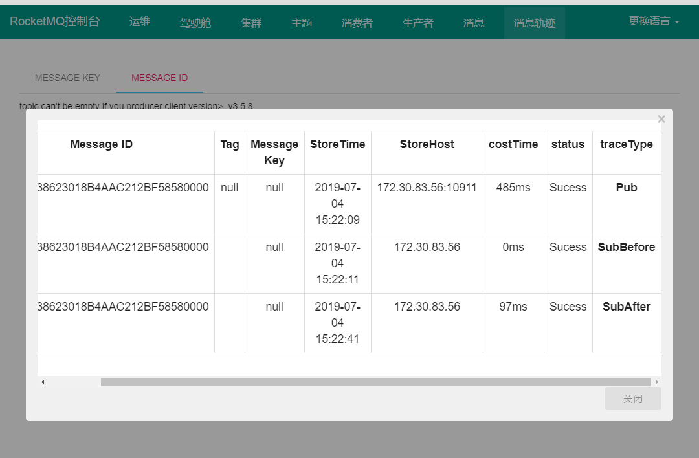

# RocketMQ消息轨迹

## 一. 前言

消息轨迹在不少情况是很重要的，主要指的是一条消息从生产方发出到消费方消费处理，整个过程中的各个相关节点的时间地点等数据汇聚而成的完整链路信息。比如消息到底有没有发送出去，消息存储在哪个Broker，消息被哪些消费者消费、消费时间、消费耗时等等。

RocketMQ中的一条消息的完整链路包含消息生产方、Broker服务方、消息消费方三个角色，这其中每个部分处理消息的过程中都会在轨迹链路中增加相关的信息，将这些信息汇聚即可获取任意消息的当前状态，从而为生产环境中的问题排查提供强有力的数据支持。

RocketMQ 4.4.0版本开始支持消息轨迹。下图是使用RocketMQ-console查看消息轨迹的数据：



## 二. 设计原理

RocketMQ消息轨迹，主要跟踪消息发送、消息消费的轨迹，即详细记录消息各个处理环节的日志，从设计上至少需要解决如下三个核心问题：

- 消息轨迹数据格式
- 消息轨迹记录时机
- 消息轨迹数据如何存储

### 2.1 消息轨迹数据格式

```java
// org.apache.rocketmq.client.trace.TraceContext
public class TraceContext implements Comparable<TraceContext> {

    /**
     * 跟踪类型
     */
    private TraceType traceType;
    private long timeStamp = System.currentTimeMillis();
    /**
     * broker所在的区域ID，取自BrokerConfig#regionId
     */
    private String regionId = "";
    private String regionName = "";
    private String groupName = "";
    private int costTime = 0;
    private boolean isSuccess = true;
    private String requestId = MessageClientIDSetter.createUniqID();
    private int contextCode = 0;
    /**
     * 消息具体信息
     */
    private List<TraceBean> traceBeans;
}

// org.apache.rocketmq.client.trace.TraceBean
public class TraceBean {
    private static final String LOCAL_ADDRESS = UtilAll.ipToIPv4Str(UtilAll.getIP());
    private String topic = "";
    /**
     * 消息唯一ID
     */
    private String msgId = "";
    /**
     * 消息偏移量ID，该ID中包含了Broker的IP以及偏移量
     */
    private String offsetMsgId = "";
    /**
     * 消息标志
     */
    private String tags = "";
    /**
     * 消息索引key，根据该key可快速检索消息
     */
    private String keys = "";
    /**
     * 跟踪类型为Pub时存储该消息的Broker服务器IP，跟踪类型为subBefore、subAfter时存储消费者IP
     */
    private String storeHost = LOCAL_ADDRESS;
    private String clientHost = LOCAL_ADDRESS;
    private long storeTime;
    private int retryTimes;
    /**
     * 消息体的长度
     */
    private int bodyLength;
    /**
     * 消息的类型，可选值为Normal_Msg（普通消息）、
     * Trans_Msg_Half（预提交消息）、Trans_msg_Commit（提交消息）、
     * Delay_Msg（延迟消息）
     */
    private MessageType msgType;
}
```

### 2.2 消息轨迹记录时机

消息中间件的两大核心主题：消息发送、消息消费，其核心载体就是消息，消息轨迹（消息的流转）主要是记录消息是何时发送到哪台Broker，发送耗时多少时间，在什么是被哪个消费者消费。

记录消息的轨迹主要是集中在消息发送前后、消息消费前后，可以通过RokcetMQ的Hook机制。通过如下两个接口来定义钩子函数。

```java
// 消费发送时的钩子
public interface SendMessageHook {
    public String hookName();

    public void sendMessageBefore(final SendMessageContext context);

    public void sendMessageAfter(final SendMessageContext context);
}

// 消费消息时的钩子
public interface ConsumeMessageHook {
    String hookName();

    void consumeMessageBefore(final ConsumeMessageContext context);

    void consumeMessageAfter(final ConsumeMessageContext context);
}
```

通过实行上述两个接口，可以实现在消息发送、消息消费前后记录消息轨迹，RocketMQ默认提供了两类钩子的实现：

- SendMessageTraceHookImpl：消息发送时用于记录消息轨迹的钩子函数
- ConsumeMessageTraceHookImpl：消息消费时用于记录消息轨迹的钩子函数

为了尽量降低消息发送与消息消费的时延，记录消息轨迹默认使用异步发送实现。

### 2.3 消息轨迹的存储

消息轨迹需要存储什么信息以及在什么时候记录消息轨迹的问题都已经解决，那接下来就得思考将消息轨迹存储在哪里？存储在数据库中或其他媒介中，都会加重消息中间件，使其依赖外部组件，最佳的选择还是存储在Broker服务器中，将消息轨迹数据也当成一条消息存储到Broker服务器。

既然把消息轨迹当成消息存储在Broker服务器，那存储消息轨迹的Topic如何确定呢？RocketMQ提供了两种方法来定义消息轨迹的Topic。

- 系统默认Topic：如果Broker的 `traceTopicEnable` 配置设置为true，表示在该Broker上创建topic名为 `RMQ_SYS_TRACE_TOPIC`，队列个数为1，默认该值为false，表示该Broker不承载系统自定义用于存储消息轨迹的topic。
- 自定义Topic：在创建消息生产者或消息消费者时，可以通过参数自定义用于记录消息轨迹的Topic名称，不过要注意的是，rokcetmq控制台(rocketmq-console)中只支持配置一个消息轨迹Topic，故自定义Topic，在目前这个阶段或许还不是一个最佳实践，建议使用系统默认的Topic即可。

> 注：通常为了避免消息轨迹的数据与正常的业务数据混合在一起，官方建议，在Broker集群中，新增加一台机器，只在这台机器上开启消息轨迹跟踪，这样该集群内的消息轨迹数据只会发送到这一台Broker服务器上，并不会增加集群内原先业务Broker的负载压力。

## 三. 源码分析

### 3.1 Broker服务方

RocketMQ对于消息轨迹特性是支持可配置的，如果我们要开启消息轨迹能力，需要编辑broker的配置文件 `broker.conf`，在其中添加如下配置：

```properties
traceTopicEnable=true
```

我们也能够指定自定义的 `traceTopic` 名称，具体配置项如下：

```properties
msgTraceTopicName=SNOWALKER_TRACE_TOPIC
```

启动broker会调用相关逻辑自动创建轨迹Topic，如果 `msgTraceTopicName` 没有配置则会使用默认值：**RMQ_SYS_TRACE_TOPIC** 

```java
public class TopicConfigManager extends ConfigManager {

	public TopicConfigManager(BrokerController brokerController) {

		{
            if (this.brokerController.getBrokerConfig().isTraceTopicEnable()) {
                String topic = this.brokerController.getBrokerConfig().getMsgTraceTopicName();
                TopicConfig topicConfig = new TopicConfig(topic);
                this.systemTopicList.add(topic);
                topicConfig.setReadQueueNums(1);
                topicConfig.setWriteQueueNums(1);
                this.topicConfigTable.put(topicConfig.getTopicName(), topicConfig);
            }
        }
	}
}
```

### 3.2 消息发送方

```java
public DefaultMQProducer(final String producerGroup, RPCHook rpcHook, boolean enableMsgTrace,
    final String customizedTraceTopic) {
    this.producerGroup = producerGroup;
    defaultMQProducerImpl = new DefaultMQProducerImpl(this, rpcHook);
    //if client open the message trace feature
    if (enableMsgTrace) {
        try {
            AsyncTraceDispatcher dispatcher = new AsyncTraceDispatcher(customizedTraceTopic, rpcHook);
            dispatcher.setHostProducer(this.defaultMQProducerImpl);
            traceDispatcher = dispatcher;
            // 如果开启了消息轨迹记录，则注册消息轨迹钩子
            this.defaultMQProducerImpl.registerSendMessageHook(
                new SendMessageTraceHookImpl(traceDispatcher));
        } catch (Throwable e) {
            log.error("system mqtrace hook init failed ,maybe can't send msg trace data");
        }
    }
}
```

`SendMessageTraceHookImpl` 实现了 `SendMessageHook` 接口，在消息发送前后会被调用：

```java
// org.apache.rocketmq.client.impl.producer.DefaultMQProducerImpl#sendKernelImpl 代码片段
private SendResult sendKernelImpl(final Message msg,
        final MessageQueue mq,
        final CommunicationMode communicationMode,
        final SendCallback sendCallback,
        final TopicPublishInfo topicPublishInfo,
        final long timeout) throws MQClientException, RemotingException, MQBrokerException, InterruptedException {
	
	//省略部分代码。。。	

	if (this.hasSendMessageHook()) {
        context = new SendMessageContext();
        this.executeSendMessageHookBefore(context);
    }

	if (this.hasSendMessageHook()) {
        context.setSendResult(sendResult);
        this.executeSendMessageHookAfter(context);
    }
}
```

`SendMessageTraceHookImpl` 在后置钩子中，会把 `TraceContext` 追加在 `TraceDispatcher` 分发器中：

```java
public class SendMessageTraceHookImpl implements SendMessageHook {

    private TraceDispatcher localDispatcher;

    public SendMessageTraceHookImpl(TraceDispatcher localDispatcher) {
        this.localDispatcher = localDispatcher;
    }

    @Override
    public String hookName() {
        return "SendMessageTraceHook";
    }

    /**
     * sendMessageBefore()方法是在发送消息之前被调用的，在消息发送之前先收集消息的topic、tag、key、存储Broker的IP地址、消息体
     * 的长度等基础信息，并将消息轨迹数据先存储在调用上下文中
     *
     * @param context
     */
    @Override
    public void sendMessageBefore(SendMessageContext context) {
        //if it is message trace data,then it doesn't recorded
        if (context == null || context.getMessage().getTopic().startsWith(((AsyncTraceDispatcher) localDispatcher).getTraceTopicName())) {
            return;
        }
        //build the context content of TuxeTraceContext
        TraceContext tuxeContext = new TraceContext();
        tuxeContext.setTraceBeans(new ArrayList<TraceBean>(1));
        context.setMqTraceContext(tuxeContext);
        tuxeContext.setTraceType(TraceType.Pub);
        tuxeContext.setGroupName(NamespaceUtil.withoutNamespace(context.getProducerGroup()));
        //build the data bean object of message trace
        TraceBean traceBean = new TraceBean();
        traceBean.setTopic(NamespaceUtil.withoutNamespace(context.getMessage().getTopic()));
        traceBean.setTags(context.getMessage().getTags());
        traceBean.setKeys(context.getMessage().getKeys());
        traceBean.setStoreHost(context.getBrokerAddr());
        traceBean.setBodyLength(context.getMessage().getBody().length);
        traceBean.setMsgType(context.getMsgType());
        tuxeContext.getTraceBeans().add(traceBean);
    }

    @Override
    public void sendMessageAfter(SendMessageContext context) {
        //if it is message trace data,then it doesn't recorded
        if (context == null || context.getMessage().getTopic().startsWith(((AsyncTraceDispatcher) localDispatcher).getTraceTopicName())
            || context.getMqTraceContext() == null) {
            return;
        }
        if (context.getSendResult() == null) {
            return;
        }

        // 如果broker服务端未开启消息轨迹跟踪配置，则直接返回，即不记录消息轨迹数据
        if (context.getSendResult().getRegionId() == null
            || !context.getSendResult().isTraceOn()) {
            // if switch is false,skip it
            return;
        }

        TraceContext tuxeContext = (TraceContext) context.getMqTraceContext();
        // 从MqTraceContext中获取跟踪的TraceBean，虽然设计成List结构体，但在消息发送场景，这里的数据永远只有一条，即使是批量发送也不例外
        TraceBean traceBean = tuxeContext.getTraceBeans().get(0);
        // 设置costTime（消息发送耗时）
        int costTime = (int) ((System.currentTimeMillis() - tuxeContext.getTimeStamp()) / tuxeContext.getTraceBeans().size());
        tuxeContext.setCostTime(costTime);
        if (context.getSendResult().getSendStatus().equals(SendStatus.SEND_OK)) {
            tuxeContext.setSuccess(true);
        } else {
            tuxeContext.setSuccess(false);
        }
        tuxeContext.setRegionId(context.getSendResult().getRegionId());
        traceBean.setMsgId(context.getSendResult().getMsgId());
        traceBean.setOffsetMsgId(context.getSendResult().getOffsetMsgId());
        // 注意这个存储时间并没有取消息的实际存储时间，而是取一个估算值，即客户端发送时间一半的耗时来表示消息的存储时间
        traceBean.setStoreTime(tuxeContext.getTimeStamp() + costTime / 2);
        // 使用AsyncTraceDispatcher异步将消息轨迹数据发送到消息服务器（Broker）上
        localDispatcher.append(tuxeContext);
    }
}
```

`TraceDispatcher` 负责将轨迹消息发送至broker，`TraceDispatcher` 是消息轨迹转发处理器接口，RocketMQ提供了默认的异步发送实现：`AsyncTraceDispatcher`

`AsyncTraceDispatcher` 内部结构如下：

```java
public class AsyncTraceDispatcher implements TraceDispatcher {

    private final static InternalLogger log = ClientLogger.getLog();
    /**
     * 异步转发队列长度，默认为2048
     */
    private final int queueSize;
    /**
     * 批量消息条数，消息轨迹一次消息发送请求包含的数据条数，默认为100，当前版本不能修改
     */
    private final int batchSize;
    /**
     * 消息轨迹一次发送的最大消息大小，默认为128KB，当前版本不能修改
     */
    private final int maxMsgSize;
    /**
     * 用来发送消息轨迹的消息发送者
     */
    private final DefaultMQProducer traceProducer;
    /**
     * 线程池，用来异步执行消息发送
     */
    private final ThreadPoolExecutor traceExecutor;
    // The last discard number of log
    /**
     * 整个运行过程中丢弃的消息轨迹数据，这里要说明一点，如果消息TPS发送过大，异步转发线程处理不过来就会主动丢弃消息轨迹数据
     */
    private AtomicLong discardCount;
    /**
     * 工作线程，主要负责从追加队列中获取一批待发送的消息轨迹数据，将其提交到线程池中执行
     */
    private Thread worker;
    /**
     * 消息轨迹TraceContext队列，用来存放 待发送 到服务端的Trace消息
     */
    private ArrayBlockingQueue<TraceContext> traceContextQueue;
    /**
     * 线程池内部队列，默认长度为1024
     */
    private ArrayBlockingQueue<Runnable> appenderQueue;
    private volatile Thread shutDownHook;
    private volatile boolean stopped = false;
    private DefaultMQProducerImpl hostProducer;
    /**
     * 消费者信息，记录消息消费时的轨迹信息
     */
    private DefaultMQPushConsumerImpl hostConsumer;
    private volatile ThreadLocalIndex sendWhichQueue = new ThreadLocalIndex();
    private String dispatcherId = UUID.randomUUID().toString();
    /**
     * 用于跟踪消息轨迹的topic名称
     */
    private String traceTopicName;
    private AtomicBoolean isStarted = new AtomicBoolean(false);
    private AccessChannel accessChannel = AccessChannel.LOCAL;
}
```

`SendMessageTraceHookImpl` 将轨迹消息放入 `AsyncTraceDispatcher.traceContextQueue` 阻塞队列后，阻塞队列中的元素会被 `AsyncRunnable` 线程取出然后发送至broker：

```java
// org.apache.rocketmq.client.trace.AsyncTraceDispatcher.AsyncRunnable
class AsyncRunnable implements Runnable {
    private boolean stopped;

    @Override
    public void run() {
        while (!stopped) {
            List<TraceContext> contexts = new ArrayList<TraceContext>(batchSize);
            /**
             * AsyncRunnable为了提高消息的发送效率引入批量机制，即一次从
             * 队列中获取一批消息，然后封装成AsyncAppenderRequest任务并提交
             * 到线程池中异步执行，即真正的发送消息轨迹数据的逻辑被封装在
             * AsyncAppenderRequest的run()方法中
             */
            for (int i = 0; i < batchSize; i++) {
                TraceContext context = null;
                try {
                    //get trace data element from blocking Queue — traceContextQueue
                    context = traceContextQueue.poll(5, TimeUnit.MILLISECONDS);
                } catch (InterruptedException e) {
                }
                if (context != null) {
                    contexts.add(context);
                } else {
                    break;
                }
            }
            if (contexts.size() > 0) {
                AsyncAppenderRequest request = new AsyncAppenderRequest(contexts);
                traceExecutor.submit(request);
            } else if (AsyncTraceDispatcher.this.stopped) {
                this.stopped = true;
            }
        }

    }
}
```

在这个线程中一次从队列中获取一批消息，然后封装成 `AsyncAppenderRequest` 任务并提交到线程池中异步执行：

```java
class AsyncAppenderRequest implements Runnable {
    List<TraceContext> contextList;

    @Override
    public void run() {
        sendTraceData(contextList);
    }

    public void sendTraceData(List<TraceContext> contextList) {
        Map<String, List<TraceTransferBean>> transBeanMap = new HashMap<String, List<TraceTransferBean>>();
        for (TraceContext context : contextList) {
            if (context.getTraceBeans().isEmpty()) {
                continue;
            }
            // Topic value corresponding to original message entity content
            String topic = context.getTraceBeans().get(0).getTopic();
            String regionId = context.getRegionId();
            // Use  original message entity's topic as key
            String key = topic;
            if (!StringUtils.isBlank(regionId)) {
                key = key + TraceConstants.CONTENT_SPLITOR + regionId;
            }
            // 按照topic将消息轨迹进行分组
            List<TraceTransferBean> transBeanList = transBeanMap.get(key);
            if (transBeanList == null) {
                transBeanList = new ArrayList<TraceTransferBean>();
                transBeanMap.put(key, transBeanList);
            }
            // 对消息进行编码
            TraceTransferBean traceData = TraceDataEncoder.encoderFromContextBean(context);
            transBeanList.add(traceData);
        }
        for (Map.Entry<String, List<TraceTransferBean>> entry : transBeanMap.entrySet()) {
            String[] key = entry.getKey().split(String.valueOf(TraceConstants.CONTENT_SPLITOR));
            String dataTopic = entry.getKey();
            String regionId = null;
            if (key.length > 1) {
                dataTopic = key[0];
                regionId = key[1];
            }
            // 批量发送消息
            flushData(entry.getValue(), dataTopic, regionId);
        }
    }
}
```

### 3.3 消息消费方

消息消费方原理和消息发送方类似，也是在创建Consumer时指定开启消息轨迹跟踪：

```java
public DefaultMQPushConsumer(final String consumerGroup, boolean enableMsgTrace) {
    this(null, consumerGroup, null, new AllocateMessageQueueAveragely(), enableMsgTrace, null);
}
```

如果开启了消息轨迹跟踪，`DefaultMQPushConsumer` 就会注册消息轨迹记录的钩子：

```java
    public DefaultMQPushConsumer(final String namespace, final String consumerGroup, RPCHook rpcHook,
        AllocateMessageQueueStrategy allocateMessageQueueStrategy, boolean enableMsgTrace, final String customizedTraceTopic) {
        this.consumerGroup = consumerGroup;
        this.namespace = namespace;
        this.allocateMessageQueueStrategy = allocateMessageQueueStrategy;
        defaultMQPushConsumerImpl = new DefaultMQPushConsumerImpl(this, rpcHook);
        // 如果开启了消息轨迹跟踪，则注册消息轨迹记录钩子
        if (enableMsgTrace) {
            try {
                AsyncTraceDispatcher dispatcher = new AsyncTraceDispatcher(customizedTraceTopic, rpcHook);
                dispatcher.setHostConsumer(this.getDefaultMQPushConsumerImpl());
                traceDispatcher = dispatcher;
                this.getDefaultMQPushConsumerImpl().registerConsumeMessageHook(
                    new ConsumeMessageTraceHookImpl(traceDispatcher));
            } catch (Throwable e) {
                log.error("system mqtrace hook init failed ,maybe can't send msg trace data");
            }
        }
    }
```

在 `ConsumeMessageTraceHookImpl` 中消费前置钩子和后置钩子都会往broker中发送消息消费轨迹，分别是 `SubBefore` 和 `SubAfter`：

```java
public class ConsumeMessageTraceHookImpl implements ConsumeMessageHook {

    private TraceDispatcher localDispatcher;

    public ConsumeMessageTraceHookImpl(TraceDispatcher localDispatcher) {
        this.localDispatcher = localDispatcher;
    }

    @Override
    public String hookName() {
        return "ConsumeMessageTraceHook";
    }

    @Override
    public void consumeMessageBefore(ConsumeMessageContext context) {
        if (context == null || context.getMsgList() == null || context.getMsgList().isEmpty()) {
            return;
        }
        TraceContext traceContext = new TraceContext();
        context.setMqTraceContext(traceContext);
        traceContext.setTraceType(TraceType.SubBefore);//
        traceContext.setGroupName(NamespaceUtil.withoutNamespace(context.getConsumerGroup()));//
        List<TraceBean> beans = new ArrayList<TraceBean>();
        for (MessageExt msg : context.getMsgList()) {
            if (msg == null) {
                continue;
            }
            String regionId = msg.getProperty(MessageConst.PROPERTY_MSG_REGION);
            String traceOn = msg.getProperty(MessageConst.PROPERTY_TRACE_SWITCH);

            if (traceOn != null && traceOn.equals("false")) {
                // 如果未开启消息轨迹跟踪，则退出
                continue;
            }
            TraceBean traceBean = new TraceBean();
            traceBean.setTopic(NamespaceUtil.withoutNamespace(msg.getTopic()));//
            traceBean.setMsgId(msg.getMsgId());//
            traceBean.setTags(msg.getTags());//
            traceBean.setKeys(msg.getKeys());//
            traceBean.setStoreTime(msg.getStoreTimestamp());//
            traceBean.setBodyLength(msg.getStoreSize());//
            traceBean.setRetryTimes(msg.getReconsumeTimes());//
            traceContext.setRegionId(regionId);//
            beans.add(traceBean);
        }
        if (beans.size() > 0) {
            traceContext.setTraceBeans(beans);
            traceContext.setTimeStamp(System.currentTimeMillis());
            // 异步发送消息轨迹信息至broker
            localDispatcher.append(traceContext);
        }
    }

    @Override
    public void consumeMessageAfter(ConsumeMessageContext context) {
        if (context == null || context.getMsgList() == null || context.getMsgList().isEmpty()) {
            return;
        }
        TraceContext subBeforeContext = (TraceContext) context.getMqTraceContext();

        if (subBeforeContext.getTraceBeans() == null || subBeforeContext.getTraceBeans().size() < 1) {
            // If subbefore bean is null ,skip it
            return;
        }
        TraceContext subAfterContext = new TraceContext();
        subAfterContext.setTraceType(TraceType.SubAfter);//
        subAfterContext.setRegionId(subBeforeContext.getRegionId());//
        subAfterContext.setGroupName(NamespaceUtil.withoutNamespace(subBeforeContext.getGroupName()));//
        subAfterContext.setRequestId(subBeforeContext.getRequestId());//
        subAfterContext.setSuccess(context.isSuccess());//

        // Caculate the cost time for processing messages
        int costTime = (int) ((System.currentTimeMillis() - subBeforeContext.getTimeStamp()) / context.getMsgList().size());
        subAfterContext.setCostTime(costTime);//
        subAfterContext.setTraceBeans(subBeforeContext.getTraceBeans());
        String contextType = context.getProps().get(MixAll.CONSUME_CONTEXT_TYPE);
        if (contextType != null) {
            subAfterContext.setContextCode(ConsumeReturnType.valueOf(contextType).ordinal());
        }
        localDispatcher.append(subAfterContext);
    }
}
```

## 四. 总结

- Broker 开启消息轨迹记录，创建消息轨迹 Topic。
- Producer 开启消息轨迹，注册消息发送钩子，在消息发送后，把 TraceContext 追加在 TraceDispatcher 分发器中，由其发送到 Broker，在指定的消息轨迹topic中存储。
- Consumer 开启消息轨迹，注册消息消费钩子，在消息消费后，把 TraceContext 追加在 TraceDispatcher 分发器中，由其发送到 Broker，在指定的消息轨迹topic中存储。